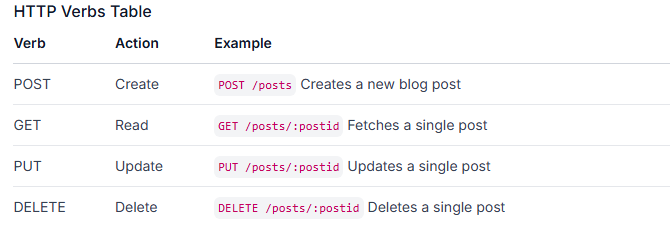

# REST (Representational State Transfer)

## What is it?
- A popular and common organizational method for your APIs which corresponds with CRUD (Create, Read, Update, and Delete) actions.
- [Here is the actual technical definition of REST.](https://en.wikipedia.org/wiki/Representational_state_transfer)

## Guidelines

### Accept and respond with JSON

## Why do we need it?
- Following established patterns such as REST make your API more maintainable and make it easier for other developers to integrate with your API. Software development is often about clear communication which is aided by following expectations.

## Organizing our endpoint URIs.
- REST APIs are resource based, which basically means that instead of having names like `/getPostComments` or `/savePostInDatabase` we refer directly to the resource (e.g. a blog post) and use HTTP verbs such as GET, POST, PUT, and DELETE to determine the action. Typically this takes the form of 2 URI’s per resource, one for the whole collection and one for a single object in that collection, for example, you might get a list of blog-posts from `/posts` and then get a specific post from `/posts/:postid`. You can also nest collections in this way. To get the list of comments on a single post you would access `/posts/:postid/comments` and then to get a single comment: `/posts/:postid/comments/:commentid`. Below are some other basic examples of endpoints you could have.
    
    

    Each part of an API URI specifies the resource. For example, `GET /posts` would return the entire list of blog posts while `GET /posts/:postid` specifies the exact blog post we want. We could nest further with `GET /posts/:postid/comments` to return a list of comments for that blog post or even `GET /posts/:postid/comments/:commentid` for a very specific blog post comment.

## CORS (Cross-Origin Resource Sharing)
- The [Same Origin Policy](https://developer.mozilla.org/en-US/docs/Web/Security/Same-origin_policy) is an important security measure that basically says “Only requests from the same origin (the same IP address or URL) should be allowed to access this API”. (Look at the link above for a couple of examples of what counts as the ‘same origin’.) This is a big problem for us because we are specifically trying to set up our API so that we can access it from different origins, so to enable that we need to set up Cross-origin resource sharing, or CORS.

    [Setting up CORS in Express](https://expressjs.com/en/resources/middleware/cors.html#enabling-cors-pre-flight) is very easy, there’s a middleware that does the work for us.

    For now, it is acceptable to just allow access from any origin. This makes development quite a bit easier but for any real project, once you deploy to a production environment you will probably want to specifically block access from any origin except your frontend website. The documentation above explains how to do this.

## Links
- [RESTful API Design](https://stackoverflow.blog/2020/03/02/best-practices-for-rest-api-design)
    - If you want to code along with the first article, please note this includes the body-parser middleware to parse JSON data on the request body, however since Express 4.16.0 this parsing functionality has been incorporated directly into the Express package itself.
- [Setting up a REST API in Express](https://www.robinwieruch.de/node-express-server-rest-api/)
    - One of the best Express tutorials. It also talks about modular code organization, writing middleware, and links to some great extra info at the end.
    - [REST & cURL Intro Project](https://github.com/KennethFam/REST-cURL-Intro-Project)