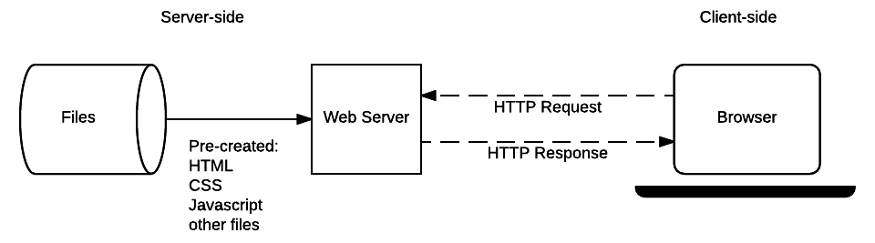
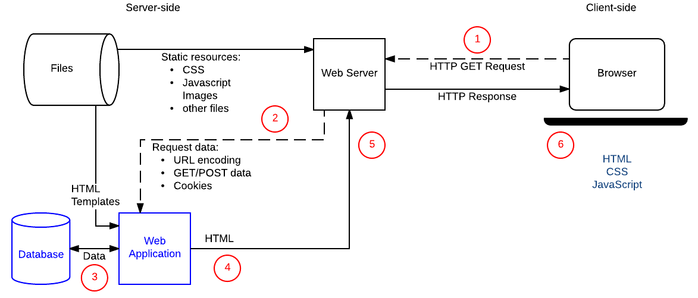

# Backend Development

## What is the backend?
- The back-end is all of the technology required to process the incoming request and generate and send the response to the client

## Parts of the backend
- The server. This is the computer that receives requests.
- The app. This is the application running on the server that listens for requests, retrieves information from the database, and sends a response.
- The database. Databases are used to organize and persist data.

## Middleware
- Middleware is any code that executes between the server receiving a request and sending a response.

## Static Sites
- A static site is one that returns the same hard-coded content from the server whenever a particular resource is requested.
- Requests for static resources are handled in the same way as for static sites (static resources are any files that don't change — typically: CSS, JavaScript, Images, pre-created PDF files, etc.).
- 

## Dynamic Sites
- A dynamic website is one where some of the response content is generated dynamically, only when needed. On a dynamic website, HTML pages are normally created by inserting data from a database into placeholders in HTML templates (this is a much more efficient way of storing large amounts of content than using static websites).
- A dynamic site can return different data for a URL based on information provided by the user or stored preferences and can perform other operations as part of returning a response (e.g., sending notifications).
- Most of the code to support a dynamic website must run on the server. Creating this code is known as "server-side programming" (or sometimes "back-end scripting").
- 

## Web Servers and HTTP
- Web browsers communicate with web servers using the HyperText Transfer Protocol (HTTP). When you click a link on a web page, submit a form, or run a search, the browser sends an HTTP Request to the server.
    - This request Includes:
        - A URL identifying the target server and resource (e.g., an HTML file, a particular data point on the server, or a tool to run).
        - A method that defines the required action (for example, to get a file or to save or update some data). The different methods/verbs and their associated actions are listed below:
            - `GET`: Get a specific resource (e.g., an HTML file containing information about a product, or a list of products).
            - `POST`: Create a new resource (e.g., add a new article to a wiki, add a new contact to a database).
            - `HEAD`: Get the metadata information about a specific resource without getting the body like `GET` would. You might for example use a `HEAD` request to find out the last time a resource was updated, and then only use the (more "expensive") `GET` request to download the resource if it has changed.
            - `PUT`: Update an existing resource (or create a new one if it doesn't exist).
            - `DELETE`: Delete the specified resource.
            - `TRACE`, `OPTIONS`, `CONNECT`, `PATCH`: These verbs are for less common/advanced tasks.