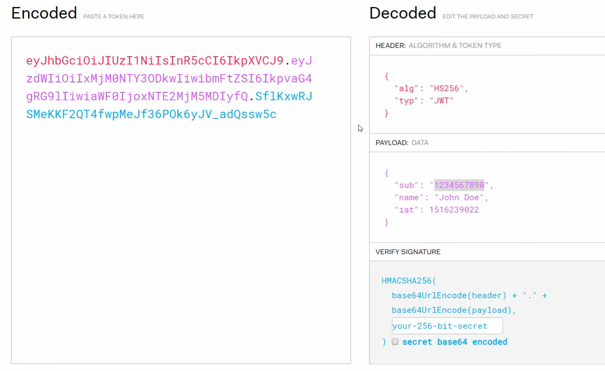

# JWTs (JSON Web Tokens)

## What are they used for?
- These tokens are used to protect routes. You can add authentication to fetch a token and then request with that token to access protected routes.
- JWTs are for authorization (i.e. it makes sure that the request is coming from the same user that logged in, and the user has access to the requested resource).

## Traditional User Login System
- 

## JWT User Login System
- 
    - Nothing is stored on the server. JWT has all the information about the user stored into it.
    - Server does not have to remember anything (e.g. a session). This means that you can use the same JWT across multiple servers.
    - Note that the secret key should be stored securely on your server.

## JWT Format
- header.payload.verfiy_signature
    - 

## Installation
- Run:
    ```
    npm install jsonwebtoken
    ```

## Links
- [Documentation](https://www.npmjs.com/package/jsonwebtoken)
- [Node.js API Authentication With JWT](https://www.youtube.com/watch?v=7nafaH9SddU)
- [What Is JWT and Why Should You Use JWT](https://www.youtube.com/watch?v=7Q17ubqLfaM)
- [The Odin Project's resources on JWTs.](https://www.theodinproject.com/lessons/nodejs-api-security)
- [JWTs Intro Project](https://github.com/KennethFam/JWTs-Intro)
- [Test out how JWT works.](https://jwt.io/)