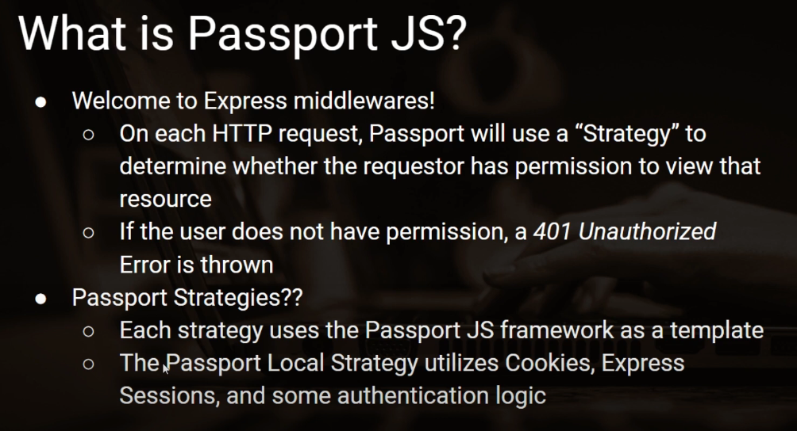

# passport.js

## Description
- An excellent middleware to handle our authentication and sessions for us. Keep in mind that this library should be used with another middleware like bcrypt, which securely stores user passwords.

- 

## Installation
- Run this command to install passport:
    ```shell
    npm install passport
    ```
- Run this command to install passport-local:
    ```shell
    npm install passport-local
    ```
- Run this command to install express-session, which is a dependency used by `passport.js` in the background.
    ```shell
    npm install express-session
    ```

## How it works
- Passport.js uses what they call Strategies to authenticate users. They have over 500 of these strategies. The most basic (and most common) strategy is username-and-password, or what they call the [LocalStrategy](http://www.passportjs.org/docs/username-password/).

## Cookies vs Sessions
- A cookie has its data stored on a browser. The browser will attach that cookie (key-value pair) to every http request that it sends. Cookies should not hold sensitive information because a hacker could get ahold of that information and use it.

- A session is stored on the server side. It stores larger amounts of data than cookies. Sessions need to be authenticated into with a secret key.

## Sessions
- `express-sessions` only stores sessions in memory that is local to your application. This is not a scalable solution, so we want to use a database for sessions.

- To store sessions in `PostgreSQL`, you can use a library called `connect-pg-simple`. [Here is the documentation.](https://www.npmjs.com/package/connect-pg-simple)
    - Example set-up:
        ```js
        app.use(session({ 
            store: new (require(`connect-pg-simple`)(session))({
                conString: process.env.DATABASE_URL, // connection string for the db
                createTableIfMissing: true // create session db if it does not exist
            }),
            secret: process.env.SESSION_SECRET, // set secret
            resave: false, // session is only saved if it was modified, affects existing sessions
            saveUninitialized: false, // only save session if you modify it, affects new sessions
            cookie: { maxAge: 30 * 24 * 60 * 60 * 1000 }, // 30 days, maxAge is in miliseconds
        }));
        ```

- To store sessions in `MongoDB`, you can use a library called `connect-mongo`. [Check out this video here.](https://youtu.be/J1qXK66k1y4?list=PLYQSCk-qyTW2ewJ05f_GKHtTIzjynDgjK)

- On the browser, the session cookie should show up as `connect.sid`. When a request is sent, the server gets this cookie and checks if the session is valid. To view cookies, inspect the page, go to `Application`, and look under `Storage`.

### Secret
- To create a secret to sign a cookie, you can just use the code below to generate a random secret and store that secret as an environment variable
    ```shell
    node -e "console.log(require('crypto').randomBytes(64).toString('hex'))"
    ```

## LocalStrategy Setup
- Let's assume we have installed all the necessary dependencies, created a database, etc. Our app.js should look something like this:
    ```js
    /////// app.js

    const path = require("node:path");
    const { Pool } = require("pg");
    const express = require("express");
    const session = require("express-session");
    const passport = require("passport");
    const LocalStrategy = require('passport-local').Strategy;

    const pool = new Pool({
    // add your configuration
    });

    const app = express();
    app.set("views", path.join(__dirname, "views"));
    app.set("view engine", "ejs");

    app.use(session({ secret: "cats", resave: false, saveUninitialized: false }));
    app.use(passport.session());
    app.use(express.urlencoded({ extended: false }));

    app.get("/", (req, res) => res.render("index"));

    app.listen(3000, () => console.log("app listening on port 3000!"));
    ```

1. We'll have a function to set up local strategy:
    ```js
    passport.use(
        new LocalStrategy(async (username, password, done) => {
            try {
                const { rows } = await pool.query("SELECT * FROM users WHERE username = $1", [username]);
                const user = rows[0];

                if (!user) {
                    return done(null, false, { message: "Incorrect username" });
                }
                if (user.password !== password) {
                    return done(null, false, { message: "Incorrect password" });
                }
                return done(null, user);
            } catch(err) {
                return done(err);
            }
        })
    );
    ```
    - This function is what will be called when we use the `passport.authenticate()` function later. Basically, it takes a username and password, tries to find the user in our DB, and then makes sure that the user’s password matches the given password. If all of that works out (there’s a user in the DB, and the passwords match) then it authenticates our user and moves on! We will not be calling this function directly, so you won’t have to supply the `done` function. This function acts a bit like a middleware and will be called for us when we ask passport to do the authentication later.

2. Sessions and serialization. To make sure our user is logged in, and to allow them to stay logged in as they move around our app, passport internally calls a function from `express-session` that uses some data to create a cookie called `connect.sid` which is stored in the user’s browser. These next two functions define what bit of information passport is looking for when it creates and then decodes the cookie. The reason they require us to define these functions is so that we can make sure that whatever bit of data it’s looking for actually exists in our Database! `passport.serializeUser` takes a callback which contains the information we wish to store in the session data. `passport.deserializeUser` is called when retrieving a session, where it will extract the data we “serialized” in it then ultimately attach something to the `.user` property of the request object (`req.user`) for use in the rest of the request.

    For our purposes, the functions that are listed in the passport docs will work just fine:

    ```js
    passport.serializeUser((user, done) => {
        done(null, user.id);
    });

    passport.deserializeUser(async (id, done) => {
    try {
        const { rows } = await pool.query("SELECT * FROM users WHERE id = $1", [id]);
        const user = rows[0];

        done(null, user);
    } catch(err) {
        done(err);
    }
    });
    ```
    - When a session is created, `passport.serializeUser` will receive the user object found from a successful login and store its id property in the session data. Upon some other request, if it finds a matching session for that request, `passport.deserializeUser` will retrieve the id we stored in the session data. We then use that id to query our database for the specified user, then `done(null, user)` attaches that user object to `req.user`. Now in the rest of the request, we have access to that user object via `req.user`.

        Again, we aren’t going to be calling these functions on our own and we just need to define them, they’re used in the background by passport.

3. Let's say we have a log-in view, whose filename is `log-in`. Here is how we handle a log-in (post request) from the log-in view using `passport.authenticate`.
    ```js
    app.post(
        "/log-in",
        passport.authenticate("local", {
            successRedirect: "/",
            failureRedirect: "/"
        })
    );
    ```
    - As you can see, all we have to do is call `passport.authenticate()`. This middleware performs numerous functions behind the scenes. Among other things, it looks at the request body for parameters named `username` and `password` then runs the `LocalStrategy` function that we defined earlier to see if the username and password are in the database. It then creates a session cookie that gets stored in the user’s browser and used in all future requests to see whether or not that user is logged in. It can also redirect you to different routes based on whether the login is a success or a failure. If we had a separate login page we might want to go back to that if the login failed, or we might want to take the user to their user dashboard if the login is successful. In the example, we're keeping everything in the index, so we want to go back to “/” no matter what.

4. The passport middleware checks to see if there is a user logged in (by checking the cookies that come in with the `req` object) and if there is, it adds that user to the request object for us. So, all we need to do is check for `req.user` to change our view depending on whether or not a user is logged in. Example of using `req.user` in `app.js`:
    ```js
    app.get("/", (req, res) => {
        res.render("index", { user: req.user });
    });
    ```

5. What if the user wants to log out? Conveniently, the passport middleware adds a logout function to the `req` object, so logging out is as easy as this:
    ```js
    app.get("/log-out", (req, res, next) => {
        req.logout((err) => {
            if (err) {
                return next(err);
            }
            res.redirect("/");
        });
    });
    ```

- Note:
    In express, you can set and access various local variables throughout your entire app (even in views) with the `locals` object. We can use this knowledge to write ourselves a custom middleware that will simplify how we access our current user in our views.

    Middleware functions are functions that take the `req` and `res` objects, manipulate them, and pass them on through the rest of the app.

    ```js
    app.use((req, res, next) => {
        res.locals.currentUser = req.user;
        next();
    });
    ```

    If you insert this code somewhere between where you instantiate the passport middleware and before you render your views, you will have access to the `currentUser` variable in all of your views, and you won’t have to manually pass it into all of the controllers in which you need it.

## Links
- [Documentation.](http://www.passportjs.org/docs/username-password/)
- [TOP Authentication Tutorial.](https://www.theodinproject.com/lessons/node-path-nodejs-authentication-basics)
- [Basic Authentication App.](https://github.com/KennethFam/Basic-Authentication-App)