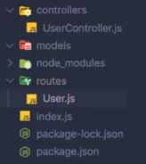
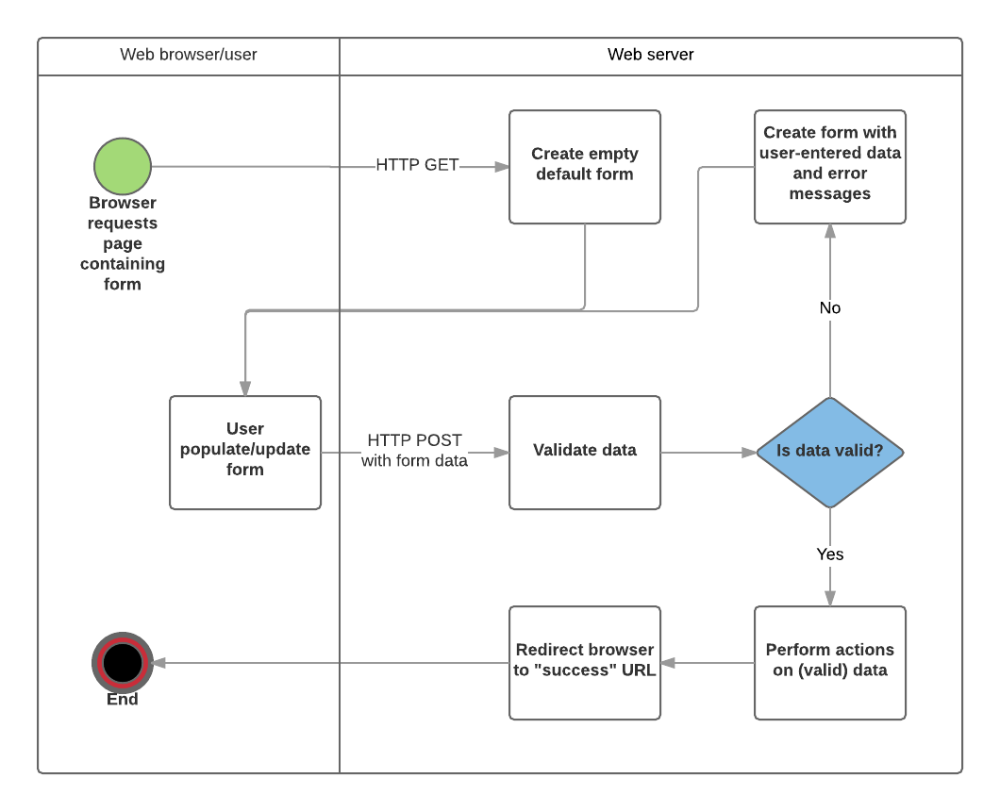

# Express.js

## What is Express.js?
- An intentionally barebones and unopinionated backend framework; it allows us to do many things how we want, and to extend it with only the features we need.

## Links
- [Documentation.](https://expressjs.com/en/api.html).
- [Basic Express Server Example.](https://github.com/KennethFam/Basic-Express-Server)


## Installation
1. Open project directory and run this command to create a package.json:
    ```shell
    npm init -y
    ```

2. Run this command to install express in the project directory.
    ```shell
    npm install express
    ```

- Note: 1 and 2 helps keep track of the version of Express.js used for your project. It is common practice to install a separate package for each project because each project may use a different version of a package.

3. Create your project file. It can be named anything, but the name used in the Express documentaion is `app.js`.

## Basic Server Example:
```js 
const express = require("express");
const app = express();

app.get("/", (req, res) => res.send("Hello, world!"));

const PORT = 3000;
app.listen(PORT, () => {
  console.log(`My first Express app - listening on port ${PORT}!`);
});
```
- Let's break down this code:
    - We import `express` then call it to initialize the `app` variable. This is our server.
    - We then have a `route` - the line beginning with `app.get`.
    - Finally, we tell our server to listen for incoming requests on whatever port we specify, via `localhost` (which is basically just the computer’s local connection). While port 3000 is the default choice, you can use any unused port.
    - For demonstration purposes, we hardcoded a fixed port number above. Usually, the port number would come from an environment variable with a fallback value in case the environment variable does not exist.
        ```js
        const PORT = process.env.PORT || 3000;
        ```
        If the specified port is already in use, we can change the environment variable value without editing the source code. Also, some hosting services configure their own ports which may differ from a fix value hardcoded in.
    
- Go to `http://localhost:3000/` to send a request to the server.
    - Whenever you navigate to any web URL this way, this is essentially what you are doing. Navigating to `https://theodinproject.com/paths` via the address bar is just telling the browser to send a `GET` request to the `/paths` path at `https://theodinproject.com`, then display what it receives in response.
    - Once you navigate to `http://localhost:3000/`, you should see Hello, world! appear in the window.

- When our server receives our `GET` request, Express stores the request in a [request object](https://expressjs.com/en/api.html#req). This request gets passed through a chain of functions we call middleware functions until eventually, a `middleware function` tells Express to respond to the request.
    - In our example, the request comes through as a `GET` request to the `/` path. This matches the route we have in our app.js file.
        ```js
        app.get("/", (req, res) => res.send("Hello, world!"));
        ```
        - To summarize the above line, it tells Express: “if a `GET` request comes through to the `/` path, pass the request through the following chain of middleware functions”. Here, we only have a single function.
        - If we had defined multiple routes, Express would pass the request through the first route that matched the requested HTTP verb (e.g. `GET`) and path (`/`). The order of the routes matters!
        - Express takes the callback function we gave it and passes the request object into the first parameter (conventionally named `req`), and a [response object](https://expressjs.com/en/api.html#res) into the second parameter (`res`). Our callback tells the response object to respond to the request by sending (via `res.send`) the string `"Hello, world!"`.
        - There is no more code to run and the function returns. Since Express has been told to respond to the request, it ends the request-response cycle. Meanwhile, the browser receives our server’s response and displays it on screen, which is our `"Hello, world!"` string. We could send nearly anything in our response. We could even [tell Express to send a file](https://expressjs.com/en/api.html#res.sendFile).

## Auto-Restarting Server Upon File Changes
- When you run your server with `node app.js`, any changes to any JavaScript and JSON files in your project directory won’t be reflected automatically unless you manually interrupt and rerun `node app.js`. To avoid this manual process, you can use [Node’s watch mode](https://nodejs.org/docs/latest-v20.x/api/cli.html#--watch) by adding the `--watch` flag, e.g. `node --watch app.js`. Node will watch `app.js` for changes, as well as any of the files it ultimately depends on. When it detects a change, it will automatically restart the server just like with Webpack and Vite’s dev servers.
- You may also come across [Nodemon](https://www.npmjs.com/package//nodemon), a highly configurable package that can also watch for changes and restart your server for you. Node didn’t always have a stable built-in watch mode, so you’re likely to see Nodemon around the place. Our recommendation would be to stick with Node’s built in watch mode via the `--watch flag`, as this would be by far the simplest method.

## Routes
- Some examples of routes:
    ```js
    app.get("/", (req, res) => res.send("Hello, world!"));
    ```

    - Matches any `GET` requests that go through the app router (which is the whole server) to the `/` path.

    ```js
    app.post("/messages", (req, res) => res.send("This is where you can see any messages."));
    ```

    - Matches any `POST` requests that go through the app router to the `/messages` path. 

- Each [HTTP verb](https://developer.mozilla.org/en-US/docs/Web/HTTP/Reference/Methods) has its own Express method. `app.all()` can be used to make a route to match all verbs.

### Paths
- The first argument we pass a route is the path to match, which can either be a string or a regular expression.
    - For example, `/messages` matchs that exactly, while `/messages/all` only matches `/messages/all` and not `/messages`.

- With string paths, we can also use certain symbols like `?`, `+`, `*` and `()` to provide some pattern-matching functionality, similar to regular expressions. Learn more about path syntax [here](https://expressjs.com/en/guide/migrating-5.html#path-syntax). Examples+-:
    ```js
    // ? makes a character optional
    // The following path matches both /message and /messages
    "/messages?"

    // () groups characters together, allowing symbols to act on the group
    // The following path matches both / and /messages
    "/(messages)?"

    // * is a wildcard matching any number of any characters
    // The following path can match /foo/barbar and even /foo-FOO/bar3sdjsdfbar
    "/foo*/bar*bar"
    ```
- Your routes will be set up in your server in the order they are defined.
    ```js
    app.get("*", (req, res) => {
        res.send("* is a great way to catch all otherwise unmatched paths, e.g. for custom 404 error handling.");
    });
    app.get("/messages", (req, res) => {
        res.send("This route will not be reached because the previous route's path matches first.");
    });
    ```
    - In order for our `GET /messages` request to match the `/messages` route, we will need to reverse the order our routes are defined. Doing so will prevent it from reaching the `*` route, as it will match the `/messages` route first.

### Route Parameters
- Route parameters allow us to extract a value from the path to use.
- Route paramters are denoted as `:` followed by the name of the paramter (which can only consist of case-sensitive alphanumeric characters, or `_`).
- Whatever we name that route parameter, Express will automatically populate the `req.params` object in any of the following middleware functions with whatever value the path passed into the parameter, using the parameter name as its key.
    ```js
    /**
    * GET /odin/messages will have this log
    * { username: 'odin' }
    *
    * GET /theodinproject79687378/messages would instead log
    * { username: 'theodinproject79687378' }
    */
    app.get("/:username/messages", (req, res) => {
        console.log(req.params);
        res.end();
    });

    /**
    * GET /odin/messages/79687378 will have this log
    * { username: "odin", messageId: "79687378" }
    */
    app.get("/:username/messages/:messageId", (req, res) => {
        console.log(req.params);
        res.end();
    });
    ```

### Query Parameters
- Query parameters are a unique and optional part of a URL that appear at the end. A `?` denotes the start of the query parameters, with each query being a key-value pair with the format `key=value`, and each query separated by an `&`. They are special as they are not actually considered part of the path itself, but are essentially more like arguments we can pass in to a given path.
    - For example, `/odin/messages?sort=date&direction=ascending` will still match the route with the `/:username/messages` path, but we can access the `sort=date` and `direction=ascending` key-value pairs inside the middleware chain.
    - Express automatically parses any query parameters in a request and will populate the `req.query` object with any key-value pairs it finds. If any keys are repeated, Express will put all values for that key into an array.
    - Code Example:
        ```js
        /**
        * GET /odin/messages?sort=date&direction=ascending will log
        * Params: { username: "odin" }
        * Query: { sort: "date", direction: "ascending" }
        *
        * GET /odin/messages?sort=date&sort=likes&direction=ascending will log
        * Params: { username: "odin" }
        * Query: { sort: ["date", "likes"], direction: "ascending" }
        */
        app.get("/:username/messages", (req, res) => {
            console.log("Params:", req.params);
            console.log("Query:", req.query);
            res.end();
        });
        ```

### Routers
- So far, we’ve not been using many routes, and all routes we’ve shown have been attached to `app`, our server itself. In a real application with lots of routes, we’d probably want to organize our routes into groups and extract each group out to their own file. We could also then more easily write things that affect only the routes in that file, and not any others.
    - For example, say we were making a library app and we wanted pages that dealt with books and pages that dealt with authors. That’s on top of the homepage and any other miscellaneous pages like “about” or “contact”.

    We might want our server to handle the following routes:

    ```
    GET /
    GET /about
    GET /contact
    POST /contact

    GET /books
    GET /books/:bookId
    GET /books/:bookId/reserve
    POST /books/:bookId/reserve

    GET /authors
    GET /authors/:authorId
    ```

    Let’s add some routers to handle each of our route groups. We’ll need a router first, which we can place in a new `routes` folder. For example, `routes/authorRouter.js`:

    ```js
    // routes/authorRouter.js
    const { Router } = require("express");

    const authorRouter = Router();

    authorRouter.get("/", (req, res) => res.send("All authors"));
    authorRouter.get("/:authorId", (req, res) => {
    const { authorId } = req.params;
        res.send(`Author ID: ${authorId}`);
    });

    module.exports = authorRouter;
    ```

    In the above, we destructure the Express object to get a Router function and use it to create our `authorRouter`. We can use the same `.get` or `.post` methods on this router instead of on the whole server object, meaning we can write routes and middleware scoped to this router. Since we’ll make this router usable only for paths that start with `/authors`, our route paths here don’t need to include it. Instead, they extend the parent path (we wouldn’t want our route to match `/authors/authors/:authorId`).

    After creating the other two routers for the other route groups - `routes/bookRouter.js` and `routes/indexRouter.js`, add them to our server in `app.js`:

    ```js
    // app.js
    const express = require("express");
    const app = express();
    const authorRouter = require("./routes/authorRouter");
    const bookRouter = require("./routes/bookRouter");
    const indexRouter = require("./routes/indexRouter");

    app.use("/authors", authorRouter);
    app.use("/books", bookRouter);
    app.use("/", indexRouter);

    const PORT = 3000;
    app.listen(PORT, () => {
        console.log(`My first Express app - listening on port ${PORT}!`);
    });
    ```

    We specify that any requests with paths starting with `/authors` will be passed through `authorRouter` for route matching. If our request starts with `/books`, it will skip these author routes and then check the routes in `bookRouter` instead. Any other requests that don’t start with either of these will run through `indexRouter`.

    To test these routes, use [Postman](https://www.postman.com/downloads/) which will allow you to send `GET` and `POST` requests without the browser (we can’t send `POST` requests from the browser address bar).

### Express Routing documentation
- Express's primer on Routing can be found [here](https://expressjs.com/en/guide/routing.html).

## Controllers
- The controller’s job is really to act as the ultimate middleman. It knows which questions it wants to ask the model, but lets the model do all the heavy lifting for actually solving those questions. It knows which view it wants to render and send back to the browser, but lets the view itself take care of putting all that HTML together. That’s why it’s a “controller” - it’s smart enough to know what to do, then it delegates all the hard work.

Ultimately, the controller is the brains of the operation ensuring that each component plays its part in delivering the final result and is really just a function with well-defined responsibilities as part of the MVC pattern.

### Handling Responses
- There are several methods that controllers can use to send responses. Some of the common ones are:
    - [res.send](https://expressjs.com/en/api.html#res.send) - A general-purpose method for sending a response, it is flexible with what data we can send since it will automatically set the `Content-Type` header based on what data you pass it. For example, if we pass in an object, it will stringify it as JSON and set the `Content-Type` header to `application/json`.
    - [res.json](https://expressjs.com/en/api.html#res.json) - This is a more explicit way to respond to a request with JSON. This always sets the Content-Type header to application/json and sends the data as JSON.
    - [res.redirect](https://expressjs.com/en/api.html#res.redirect) - When we want to redirect the client to a different URL, this method allows for that capability.
    - [res.render](https://expressjs.com/en/api.html#res.render) - res.render lets you render a view template and send the resulting HTML as the response. 

- Sending a status code:
    - [res.status](https://expressjs.com/en/api.html#res.status) - This sets the response’s status code but does not end the request-response cycle by itself. We can chain other methods through this (e.g. `res.status(404).send(...)` but note that we can’t do `res.send(...).status(404)`). We can omit this if we wish to use the default status code of `200`.

- res.send() vs res.json()
    - If `res.send` automatically sets the `Content-Type` based on the data passed, why would we still use `res.json`? `res.json` enforces JSON and will automatically convert non-object values to JSON, but `res.send` will not. `res.json` is just a convenient method that also internally calls `res.send`. `res.send` will only handle things as JSON when dealing with booleans and objects (which includes arrays).

- We also need to take note that these response methods only end the request-response cycle. They do not end the function execution. For example if we do this:
    ```js
    app.use((req, res) => {
        // This works and this ends the request-response cycle
        res.send("Hello");

        // However, it does not exit the function so this will still run
        console.log('will still run!!');

        // This will then throw an error that we cannot send again after sending to the client already
        res.send("Bye");
    });
    ```

### Middleware
- Middleware functions are a core concept in Express and play a crucial role in handling requests and responses. They operate between the incoming request and the final intended route handler.

- A middleware function typically takes three arguments (however, there is one that we will get into later that has four):
    - `req` - The request object, representing the incoming HTTP request.
    - `res` - The response object, representing the HTTP response that will be sent back to the client.
    - `next` - The function that passes control to the next middleware function in the chain. This is optional.

- Names are just convention, we can name them whatever we want, like `req` -> `request`, `res` -> `response`, etc.

- A middleware function can perform various tasks, such as:
    - Modifying the request or response objects (some packages for example will do this, like adding a new property in the request object, or setting the res.locals that is used in templates rendered with res.render).
    - Executing additional code (validation middleware functions to validate the request before going to our main logic, authentication middleware functions, and so on).
    - Calling the next middleware function in the chain.
    - Ending the request-response cycle (meaning no further middleware functions are called, even if there are more in the chain).

#### Application-Level Middleware
- Application-level middleware are bound to an instance of Express using `app.use` or using `app.METHOD` (e.g. `app.get`, `app.post`) functions. Express executes these middleware functions for every incoming request that matches the specified path. If we don’t specify a path, Express defaults the path to `/`, matching every incoming request. As with any middleware functions, they will not run if the request-response cycle ends before reaching them. Typically, these middleware functions are placed on top of our application code to ensure they always run first.

- Express offers several essential built-in middleware functions that we’ll frequently use in our applications. These include:
    - Body parsers (e.g. `express.json`, `express.urlencoded`) - These allow us to correctly parse the incoming request’s body, so that we can use it through `req.body`.
    - Serving static files (e.g. `app.use(express.static('public'))`) - This middleware function serves static files like HTML, CSS, JavaScript, and images. We can pass an argument to specify which directory to serve the static files.

#### Router-Level Middleware
- Router-level middleware works similarly to an application-level middleware, but it’s bound to an instance of Express router using `router.use` or `router.METHOD` (e.g. router.get) functions. Because of this, Express only executes these middleware when the request matches and goes through that router.

- Here is an example of a basic middleware function:
    ```js
    function myMiddleware(req, res, next) {
        // Perform some operations
        console.log("Middleware function called");

        // Modify the request object
        req.customProperty = "Hello from myMiddleware";

        // Call the next middleware/route handler
        next();
    }

    app.use(myMiddleware);
    ```
    - In this example, the middleware function logs a message, adds a custom property to the request object, and then calls the `next()` function to pass control to the next middleware function or route handler. We also register the middleware function through the usage of `app.use` which makes this an application-level middleware. Middleware functions following `myMiddleware` in this chain can now access `req.customProperty`, which contains the value `"Hello from myMiddleware"`.

- One thing to note is that Express executes middleware functions in the order we define or register them in our application. This means that the sequence in which we define our middleware functions matters, as it determines the order in which they will be invoked during the request-response cycle. So we need to make sure and be aware that our middleware functions are placed in the correct order. As an example, some packages have middleware functions that changes the `Request` object, and as a result, these middleware functions should be placed at the very top of our application in order for us to be able to see their changes in all of your middleware functions below it.

- There is also a special type of middleware function that handles errors.

### Controllers
- Controllers are just functions. They also classify as a middleware (at least in the Express world) that are used by route handlers. However, it’s important to note that controller and middleware are distinct concepts. Controllers are a key component of the MVC (Model-View-Controller) pattern, a design approach for organizing software. Middleware, on the other hand, is a core feature of Express that allows you to run code, modify requests, or end the cycle at specific points in the request-response cycle. So we are using middleware in Express to implement the “Controller” part of the MVC pattern.

- A controller comes into play whenever a request hits the server and a route matches the requested HTTP verb and path. The route determines which controller should handle the request based on the defined middleware chain. The appropriate controller then takes over, performing the necessary actions to fulfill the request. This could involve retrieving data from the model, processing the data, making decisions based on business logic, or updating the model with new data.

- Once the controller completes its tasks, it passes the processed data to the view. The view then renders this data into a format suitable for sending back to the client. Typically, this would be HTML. Later, when we cover building APIs, we can also send JSON responses like with an API like Giphy API.

- The naming conventions for these controllers are usually based on the route they will be attached to e.g. `GET` route -> `getSomething`, `POST` route -> `createSomething`, `DELETE` route -> `deleteSomething`, etc. Nonetheless, there is no fixed rule since Express is not opinionated. It will always be based on you or someone else’s conventions, and the requirements of the function.

- You should already have your application setup in-place from the previous lesson. Previously, we’ve defined a route for `/authors/:authorId`, but this time we will define a controller for that route and hook it up with sample data. But to make the example produce something, let’s first create a mock database with a function that we can use to retrieve an author by their ID.

    Create the following file `db.js` at the root of the project, and add the following code:

    ```js
    // db.js

    const authors = [
        { id: 1, name: "Bryan" },
        { id: 2, name: "Christian" },
        { id: 3, name: "Jason" },
    ];

    async function getAuthorById(authorId) {
        return authors.find(author => author.id === authorId);
    };

    module.exports = { getAuthorById };
    ```

    The file name, content, and location aren’t important here. This is just a quick mock “database” and query function so we can call it in a controller.

    Then for the controller, create the following file `authorController.js` within a `controllers` folder:

    ```js
    // controllers/authorController.js

    const db = require("../db");

    async function getAuthorById(req, res) {
        const { authorId } = req.params;

        const author = await db.getAuthorById(Number(authorId));

        if (!author) {
            res.status(404).send("Author not found");
            return;
        }

        res.send(`Author Name: ${author.name}`);
    };

    module.exports = { getAuthorById };
    ```

    In this example, the `getAuthorById` function is a controller that handles a specific action related to retrieving an author by their ID. We’ll use this controller by importing it into the file where we define our routes, and using it like this:

    ```js
    // routes/authorRouter.js

    const { Router } = require("express");
    const { getAuthorById } = require('../controllers/authorController');

    const authorRouter = Router();

    // ... other route handlers
    authorRouter.get("/:authorId", getAuthorById);
    ```

    Let’s break down what’s happening in this controller:

    1. The route path contains a route parameter (`/authors/:authorId`). The controller extracts the `authorId` from `req.params`.

    2. It then invokes a database query function `getAuthorById` to retrieve the author data based on the `authorId`.

    3. If the controller doesn’t find the author, it sends a response with a 404 status code and the message `"Author not found"`, using `res.status(404).send(...)`. It then returns from the controller function to avoid invoking any other logic in the controller, as sending a response doesn’t automatically stop the function execution.

    4. If the controller finds the author, it sends a response with a 200 status code with the text showing the author name using `res.send(...)`.

### Handling Errors
- When building robust applications, it’s crucial to handle errors gracefully within our application. Implementing proper error handling allows you to provide meaningful error responses to the client and prevent your application from crashing unexpectedly. And as we know, errors may occur during async operations, and we are not exactly handling that in our previous code snippets. Let’s see what we can do to handle these possibilities.

#### try/catch
- Using the same code from earlier, we can quickly handle errors by wrapping our controller logic in a `try/catch` block.
    ```js
    async function getAuthorById(req, res) {
    const { authorId } = req.params;

    try {
        const author = await db.getAuthorById(Number(authorId));

        if (!author) {
            res.status(404).send("Author not found");
            return;
        }

        res.send(`Author Name: ${author.name}`);
    } catch (error) {
        console.error("Error retrieving author:", error);
        res.status(500).send("Internal Server Error");

        // or we can call next(error) instead of sending a response here
        // Using `next(error)` however will only render an error page in the express' default view and respond with the whole html to the client.
        // So we will need to create a special type of middleware function if we want a different response and we will get to that in a bit.
    }
    };
    ```

    However, this is not exactly a clean solution since eventually, we will have to add the same try/catch block to all controllers. We can install a package called [express-async-handler](https://www.npmjs.com/package/express-async-handler) to hide this bit of code.
    ```js
    const asyncHandler = require("express-async-handler");

    // The function will automatically catch any errors thrown and call the next function
    const getAuthorById = asyncHandler(async (req, res) => {
        const { authorId } = req.params;

        const author = await db.getAuthorById(Number(authorId));

        if (!author) {
            res.status(404).send("Author not found");
            return;
        }

        res.send(`Author Name: ${author.name}`);
    });
    ```
    - The asyncHandler function in the express-async-handler library is [just 6 lines of code](https://github.com/Abazhenov/express-async-handler/blob/master/index.js). 

#### With a Middleware
- An error middleware function handles all errors in our application that come down from other middleware functions. We want to place this error middleware function at the very end of the application code to ensure it’s the last middleware function executed and only handles errors bubbling down from preceding middleware functions.
    - Example: 
        ```js
        app.use((err, req, res, next) => {
            console.error(err);
            res.status(500).send(err);
        });
        ```
        - However, take note that this is a middleware function that requires four parameters that we will need to provide even if they are not used. If for example we exclude one of the parameters, it will not be recognized as an error middleware function.
        - This is an odd one where the error object must be the first parameter in the callback.
        - This middleware function handles the errors thrown in other middleware functions or something that is sent by a previous middleware function using the `next` function (e.g. `next(err)`).
        - So the way Express distinguishes this middleware function is again through adding four parameters, not a single one missing. A route middleware function or a middleware function with less than four parameters will always be considered as a request middleware function instead of this error middleware function, even if we place it last.
            ```js
            app.use((req, res, next) => {
                throw new Error("OH NO!");
                // or next(new Error("OH NO!"));
            });

            app.use((err, req, res, next) => {
                console.error(err);
                // You will see an OH NO! in the page, with a status code of 500 that can be seen in the network tab of the dev tools
                res.status(500).send(err.message);
            });
            ```

#### Creating Custom Errors
- With the solutions above, the error middleware function can only really respond with a `500` status code no matter what error it is. But what if we actually want to send a `404`? A common way to do this is to create our own custom error by extending the Error object.
    - Example:
        Create the following file CustomNotFoundError.js within an errors folder:

        ```js
        // errors/CustomNotFoundError.js

        class CustomNotFoundError extends Error {
        constructor(message) {
            super(message);
            this.statusCode = 404;
            // So the error is neat when stringified. NotFoundError: message instead of Error: message
            this.name = "NotFoundError";
        }
        }

        module.exports = CustomNotFoundError;
        ```

        We can then use this custom error class and refactor the earlier version of `getAuthorById` like so:

        ```js
        const CustomNotFoundError = require("../errors/CustomNotFoundError");

        const getAuthorById = asyncHandler(async (req, res) => {
            const { authorId } = req.params;

            const author = await db.getAuthorById(Number(authorId));

            if (!author) {
                throw new CustomNotFoundError("Author not found");
            }

            res.send(`Author Name: ${author.name}`);
        });
        ```

        Since we are using `express-async-handler`, we don’t need to send an error response inside of this function but instead just throw an error. `asyncHandler` automatically catches the thrown error and calls `next()`, passing in the caught error as an argument, which passes control to our custom error handler!

        It will eventually end up in the error middleware function where we can also modify:

        ```js
        app.use((err, req, res, next) => {
            console.error(err);
            // We can now specify the `err.statusCode` that exists in our custom error class and if it does not exist it's probably an internal server error
            res.status(err.statusCode || 500).send(err.message);
        });
        ```

### What is the next function?
- `next` is used to pass control to the next middleware function in the application’s request-response cycle.
    - Example:
        ```js
        function middleware1(req, res, next) {
            console.log("Middleware 1");
            next(); // Pass control to the next middleware
        };

        function middleware2(req, res, next) {
            console.log("Middleware 2");
            res.send("Response from Middleware 2");
            // request-response cycle ends here
        };

        function middleware3(req, res, next) {
            console.log("Middleware 3");
            res.send("Response from Middleware 3");
        };

        app.use(middleware1);
        app.use(middleware2);
        app.use(middleware3);
        // will log `Middleware 1` -> `Middleware 2` and send a response with the text "Response from Middleware 2"
        ```

        Here we have `middleware1`, `middleware2`, and `middleware3`. `middleware1` calls the `next` function, and since we are not yet sending a response, we pass the control to the next middleware function - `middleware2` (as indicated by the order of `app.use` calls). In `middleware2`, we send a response which ends the request-response cycle. Since it has ended, the third middleware function (`middleware3`) does not run. If `next` was not called in `middleware1`, the client would hang unless a response like `res.send()` was sent.

- `next` accepts the following arguments:
    1. No argument `next()` - Will pass control to the next middleware function.

    2. With an error argument `next(new Error(...))` - Will pass control directly to the error middleware function.

    3. With the string `next('route')` - Will pass control to the next route handler with the same matching path (if there is one). This only works for `app.METHOD` or `router.METHOD`. Potentially, it can also be the same as just calling next with no argument.

    4. With the string `next('router')` - Will skip all middleware functions attached to the specific router instance and pass control back out of the router instance. Basically, we exit the router and go back to the parent router, e.g. `app` (yes, the Express app is also just a router under the hood).

## MVC (Model-View-Controller) Pattern
- Example of MVC Project Directory
    - 
        - models directory
            - Contains our database(s).
        - controllers directory
            - Contains controllers that contain our HTTP method handlers.
        - views directory
            - Contains the views (mainly frontend).
        - routes directory
            - Matches routes to their respective controllers.
        - index.js/app.js
            - This contains our application. It is where we create our server (e.g. set up what `port` to listen to, set up `app.use`, etc.)
- Check out this [video](https://www.youtube.com/watch?v=Cgvopu9zg8Y) for more information.

## How Express works
- [Good article](https://medium.com/@viral_shah/express-middlewares-demystified-f0c2c37ea6a1).
- [Source code](https://github.com/expressjs/express).

## Views
- Views are the user-facing part of the application. An example would be an HTML file.
- Plain HTML files are static. 
- We can make views dynamic with respect to data using template engines to create our views. As the name suggests, we write template files in our codebase that get transformed into HTML when we respond to a server request. Any variables defined in our template files are replaced with actual data. Additionally, we can insert conditional and/or loop logic into our template file, e.g. render the user’s username once they have logged in. This would not be possible with plain HTML. 
    - An example of a template engine is [EJS](https://ejs.co/), whose syntax is very similar to that of HTML.

### Serving Views
- For dynamic views, require the node:path package (`const path = require("node:path");`) and set the following application properties:

    ```js
    app.set("views", path.join(__dirname, "views"));
    app.set("view engine", "ejs");
    ```

    For `views`, set the path to your views directory. In this case, our views are in the views directory in the project directory.

    For `view engine`, set it to the view engine that you're using. In this case, we're using `ejs`. After the view engine is set, you don’t have to specify the engine or load the template engine module in your app; Express loads the module internally

- For static views, set the following properties:

    ```js
    const assetsPath = path.join(__dirname, "public");
    app.use(express.static(assetsPath));
    ```

    `assetsPath` contains the path to your static views. In this case, it's the `public` directory in our project directory.

    After getting the path to your static views directory, call `app.use` with `express.static(assetsPath)` as the argument.

### Express Resource on Template Engines
- [Express's own documentation on template engines](https://expressjs.com/en/guide/using-template-engines.html).

## Forms and Data Handling
- Let's take a look at a simple HTML form, with a single text field for collecting a full name, and its associated label element:
    ```html
    <form action="/create" method="POST">
        <label for="fullName">Full Name:</label>
        <input placeholder="John Doe" type="text" name="fullName" id="fullName">
        <button type="submit">Submit</button>
    </form>
    ```
    - We have the HTML form element itself, with an action pointing to some resource on our server, and a method defined. Notice how the method corresponds to an HTTP verb, typically either `GET` or `POST`.
    - The form consists of a text input with an associated label and a submit button.
    - The input’s `name` attribute plays a key role, as it defines how our input will be identified in the form data sent to our server. This is especially important when handling form submissions on the backend.
    - The `type="submit"` button then allows the user to upload the entered data to the server.
    - The `form` attributes define how to communicate with the server:
        - `action`: The resource/URL where data is sent for processing when the form is submitted. If this is not set, or is an empty string, the form will be submitted back to the current page URL
        - `method`: Defines the HTTP method to use (`POST` or `GET`).
    - `POST` is generally more secure because it keeps sensitive information out of the URL, which means they won’t show up in server logs, and is the standard choice for creating or updating data on the server side. `GET` is for forms that don’t modify data, such as search forms, or when you want the form submission to be bookmarkable or shareable via URL. The form data here is sent as a query string as part of the request url.
    - The form's handling process goes like this:
        1. The form’s `action` will point to some endpoint on our server, which will allow our controller to handle the request. The controller then communicates with the database to handle the data.
        2. We then generate a new or updated view with the controller’s response and redirect the client. This is known as the [Post/Redirect/Get (PRG)](https://en.wikipedia.org/wiki/Post/Redirect/Get) design pattern which helps prevent duplicate `POST` requests.

### Validation and Sanitization
- Before the data from a form is sent off to our server, we should consider two important steps:
    - Validation ensures user input meets the specified criteria (e.g. required fields, correct format).
    - Sanitization cleans user input to prevent malicious data from being processed by removing or encoding potentially malicious characters.

- We don’t always have to sanitize data right when we get it - sometimes it makes sense to sanitize just before we use it instead.

- A library that can help us with these two tasks is `express-validator`. While it makes these processes much simpler, it’s important to understand the underlying concepts of these two operations.

### Forms and Express Routes
- Example of handling routes in Express:
    ```js
    exports.userUpdateGet = (req, res, next) => {};
    exports.userUpdatePost = (req, res, next) => {};
    ```

    Inside our router, we can then assign routes which correspond to the controller’s functions:

    ```js
    const { Router } = require("express");
    const usersRouter = Router();
    const usersController = require("../controllers/usersController");

    // User update routes
    usersRouter.get("/:id/update", usersController.userUpdateGet);
    usersRouter.post("/:id/update", usersController.userUpdatePost);

    module.exports = usersRouter;
    ```

    In our form, the action would look something like this if we're using `EJS`:

    ```html
    <!-- Example using EJS with POST to submit an update to our Express server. -->
    <form action="/users/<%= user.userId %>/update" method="POST"></form>
    ```

    `/users/:id/update` is an endpoint we’ve created on our Express server.

### Example of Express Server With Data Handling
- Check out the [Basic-Express-Server-With-Data-Handling project](https://github.com/KennethFam/Basic-Express-Server-With-Data-Handling) for an example of a server that uses data validation and sanitization.
    - Check [here](https://www.theodinproject.com/lessons/nodejs-forms-and-data-handling#putting-it-together) for an explanation of the code.
    - The flow looks like this:
        -