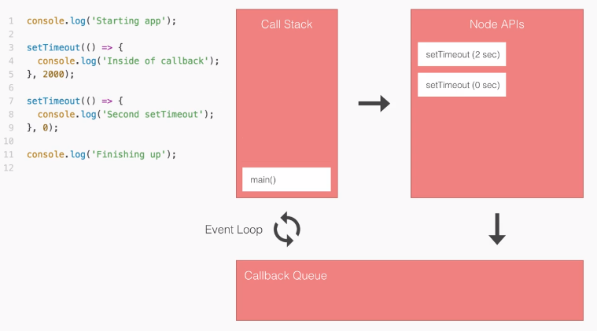

# Node.js

## What is recommended to learn about JavaScript before diving deep with Node.js?
- Lexical Structure
- Expressions
- Data Types
- Classes
- Variables
- Functions
- `this` operator
- Arrow Functions
- Loops
- Scopes
- Arrays
- Template Literals
- Strict Mode
- ECMAScript 2015 (ES6) and beyond
- Asynchronous JavaScript

## Understanding Asynchronous Programming
- Asynchronous programming and callbacks
- Timers
- Promises
- Async and Await
- Closures
- The Event Loop

## What is NodeJS?
- As an asynchronous event driven JavaScript runtime, Node is designed to build scalable network applications.
    - Node is an asynchronous event driven JavaScript runtime. In this context asynchronous means that when you write your code you do not try to predict the exact sequence in which every line will run. Instead you write your code as a collection of smaller functions that get called in response to specific events such as a network request (event driven).
        - Instead of telling your code to do those steps sequentially like so:
            1. Read File
            2. Print File Contents
            3. Query Database
            4. Filter Database Query Results
        - You can break up the task like so:
            1. Read File AND THEN Print File Contents
            2. Query Database AND THEN Filter Database Query Results.
        - 1 could go before 2 or vice-versa. They may even execute at the same time. The "AND THEN" tasks will execute right after the previous task is done.
    - This functionality is facilitated through the use of callbacks.

## Callbacks and Functions
- Callbacks are functions that are passed into another function as an argument.
    - ex:
        ```javascript
        http.createServer(function (req, res) {
            res.writeHead(200, {'Content-Type': 'text/html'});
            res.end('Hello World!');
        }).listen(8080);
        ```
        Basically this code is creating a server and saying, “any time we get a network request, run this callback function”.
- Regular Function Example
    ```javascript
    function funkyFunction(music, isWhiteBoy) {
        if (isWhiteBoy) {
            console.log('Play: ' +  music);
        }
    }
    ```
- Anonymous Function Examples
    - function notation
        ```javascript
        const funkyFunction = function(music, isWhiteBoy) {
            if (isWhiteBoy) {
                console.log('Play: ' +  music);
            }
        }
        ```
    - arrow notation
        ```javascript
        const funkyFunction = (music, isWhiteBoy) => {
            if (isWhiteBoy) {
                console.log('Play: ' +  music);
            }
        }
        ```
        - If there is only one argument, parentheses can be omitted.
            - ex:
                ```javascript
                const playThe = funky => {
                    return funky + " music";
                }
                ```
        - If arrow functions are one line, the brackets {} can be omitted.
            - When omitting the brackets, the arrow function returns the evaluated expression without requiring the return keyword.
            - ex:
                ```javascript
                const playThe = funky => funky + " music";
                ```
        - No parameters ex:
            ```javascript
            const playThat = () => "funky music";
            ```
- Example of where parameter(s) may come from:
    ```javascript
    function myForEach(array, callback) {
        for (let i = 0; i < array.length; i++) {
            callback(array[i]); // This is when the callback function gets called, or executed
        }
    }

    // You would call it like this:
    const myArry = [2, 3, 4, 2];
    myForEach(myArry, (item) => {
        console.log(item + 2); 
    })
    ```
    - Here, item comes from array[i] in callback(array[i])
- Example of using predefine function as a callback:
    ```javascript
    function myEventHandler(event) {
        // do something, probably with 'event'
    }

    const element = document.querySelector("#myId");
    element.addEventListener('click', myEventHandler);
    ```
    - Notice how we didn't 'call' the function called myEventHandler? If we were to call it inside the parameter list, the function we called myEventHandler would run immediately and give the addEventListener the result of calling that function.

## Event Loop
- Visualization of some components during runtime:
    - 
    1. Push `main()` onto the call stack.
    2. Push `console.log()` onto the call stack. This then runs right away and gets popped.
    3. Push `setTimeout(2000)` onto the stack. `setTimeout(2000)` is a Node API. When we call it, we register the event-callback pair. The event will wait 2000 milliseconds, then callback is the function.
    4. After registering it in the APIs, `setTimeout(2000)` gets popped from the call stack.
    5. Now the second `setTimeout(0)` gets registered in the same way. We now have two Node APIs waiting to execute.
    6. After waiting for 0 seconds, `setTimeout(0)` gets moved to the callback queue, and the same thing happens with `setTimeout(2000)`.
    7. In the callback queue, the functions wait for the call stack to be empty, because only one statement can execute a time. This is taken care of by the event loop.
    8. The last `console.log()` runs, and the `main()` gets popped from the call stack.
    9. The event loop sees that the call stack is empty and the callback queue is not empty. So it moves the callbacks (in a first-in-first-out order) to the call stack for execution.
- Summary:
    - JavaScript is a single-threaded language, meaning it can only execute one line of code at a time via the Call Stack. So, how do asynchronous calls work? Well, if an asynchronous function is pushed onto the Call Stack, it gets registered with the browser's Web APIs (e.g. timers, HTTP request handlers). Once the asynchronous function is done, it puts the callback onto the Callback Queue. The Event Loop, symbolized by the two arrows forming a circle, waits for the call stack to become empty and then puts the first callback in the Callback Queue onto the Call Stack. Once the callback on the Call Stack finishes, if the Call Stack is still empty, the next callback gets put on by the Event Loop and so on.

## Introduction
- The most common example Hello World of Node.js is a web server:
    ```javascript
    const { createServer } = require('node:http');

    const hostname = '127.0.0.1';
    const port = 3000;

    const server = createServer((req, res) => {
    res.statusCode = 200;
    res.setHeader('Content-Type', 'text/plain');
    res.end('Hello World');
    });

    server.listen(port, hostname, () => {
    console.log(`Server running at http://${hostname}:${port}/`);
    });
    ```
    To run this snippet, save it as a `server.js` file and run `node server.js` in your terminal. If you use mjs version of the code, you should save it as a `server.mjs` file and run `node server.mjs` in your terminal.

    This code first includes the Node.js `http` module.

    The `createServer()` method of `http` creates a new HTTP server and returns it.

    The server is set to listen on the specified port and host name. When the server is ready, the callback function is called, in this case informing us that the server is running.

    Whenever a new request is received, the `request` event is called, providing two objects: a request (an `http.IncomingMessage` object) and a response (an `http.ServerResponse` object).

    Those 2 objects are essential to handle the HTTP call.

    The first provides the request details. In this simple example, this is not used, but you could access the request headers and request data.

    The second is used to return data to the caller.

    In this case with:
    ```javascript
    res.statusCode = 200;
    ```
    we set the `statusCode property` to `200`, to indicate a successful response.

    We set the `Content-Type header`:
    ```javascript
    res.setHeader('Content-Type', 'text/plain');
    ```

### Modules
- Consider modules to be the same as JavaScript libraries, or a set of functions you want to include in your application.
- To include a module, use the `require()` method with the name of the module. Example of including http module:
    ```js
    var http = require('http');
    ```
- You can create your own module. Example:
    ```js
    exports.myDateTime = function () {
        return Date();
    };
    ```
    - `exports` is used to make properties and method availabled outside the module file.
    - Let's say this is stored in a file named `myModule.js`. We can use this module using the require method like this:
        ```js
        var myMod = require('./myModule')
        ```
        - `./` means that the module is located in the same folder as your main file.

### ECMAScript 2015 (ES6)
- Node.js is built against modern versions of V8. By keeping up-to-date with the latest releases of this engine, we ensure new features from the JavaScript ECMA-262 specification are brought to Node.js developers in a timely manner, as well as continued performance and stability improvements.
- All features are split into three groups for **shipping**, **staged**, and **in progress** features:
    - All **shipping** features, which V8 considers stable, are turned on by default on Node.js and do **NOT** require any kind of runtime flag.
    - **Staged** features, which are almost-completed features that are not considered stable by the V8 team, require a runtime flag: `--harmony`.
    - **In progress** features can be activated individually by their respective harmony flag, although this is highly discouraged unless for testing purposes. Note: these flags are exposed by V8 and will potentially change without any deprecation notice.
- Listing all in-progress features:
    ```shell
    node --v8-options | grep "in progress"
    ```
-- Finding which version ships with a particular version of Node.js:
    ```shell
    node -p process.versions.v8
    ```

### NODE_ENV
- Always run your Node.js with the `NODE_ENV=production` set. A test and thus a functionality of your product could pass when `NODE_ENV` is set to `development` but fail when setting NODE_ENV to `production`. Therefore, setting `NODE_ENV` to anything but `production` is considered an antipattern.

### Security Best Practices 
- Some examples of security risks and mitigations can be read [here](https://nodejs.org/en/learn/getting-started/security-best-practices).

## Running Node.js Scripts from the Command Line
- Let's say our application file is `app.js`. To run the file, you would run this in the terminal:
    ```shell
    node app.js
    ```
    - Above, you are explicitly telling the shell to run your script with node. You can also embed this information into your JavaScript file with a "shebang" line. The "shebang" is the first line in the file, and tells the OS which interpreter to use for running the script. Below is the first line of JavaScript:
        ```javascript
        #!/usr/bin/node
        ```
        - Above, we are explicitly giving the absolute path of interpreter. Not all operating systems have node in the bin folder, but all should have env. You can tell the OS to run env with node as parameter:
            ```javascript
            #!/usr/bin/env node
            // your javascript code
            ```
        - To use a shebang, your file should have executable permission. You can give app.js the executable permission by running:
            ```shell
            chmod u+x app.js
            ```
- Passing a string as an argument to `node` instead of a file path:
    - To execute a string as argument you can use `-e`, `--eval "script"`. Evaluate the following argument as JavaScript. The modules which are predefined in the REPL can also be used in script.

    On Windows, using cmd.exe a single quote will not work correctly because it only recognizes double " for quoting. In Powershell or Git bash, both ' and " are usable.
        ```shell
        node -e "console.log(123)"
        ```
- Restarting the file/application automatically when changes occur (as of Node.js V16):
    ```shell
    node --watch app.js
    ```
- Running a task with Node.js
    - Node.js provides a built-in task runner that allows you to execute specific commands defined in your `package.json` file. This can be particularly useful for automating repetitive tasks such as running tests, building your project, or linting your code.
    - The --run flag:
        - Allows you to run a specified command from the scripts section of your `package.json` file. For example, if you have the following `package.json`:
            ```json
            {
                "type": "module",
                "scripts": {
                    "start": "node app.js",
                    "dev": "node --run -- --watch",
                    "test": "node --test"
                }
            }
            ```
        You can run the test script using the `--run` flag:
            ```shell
            node --run test
            ```
- Passing arguments to the command:
    - Let's explain the `dev` key in the `scripts` object of the package.json file.

    The syntax `-- --another-argument` is used to pass arguments to the command. In this case, the `--watch` argument is passed to the `dev` script.
        ```shell
        node --run dev
        ```
    Take a look at the example `package.json` to see what dev is.
- Environment Variables 
    - The `--run` flag sets specific environment variables that can be useful for your scripts:
        - `NODE_RUN_SCRIPT_NAME`: The name of the script being run.
        - `NODE_RUN_PACKAGE_JSON_PATH`: The path to the `package.json` file being processed.

## The HTTP Module

### Performing a GET Request
- Simplest way is to use the [Axios Library](https://github.com/axios/axios).
    ```javascript
    const axios = require('axios');

    axios
    .get('https://example.com/todos')
    .then(res => {
        console.log(`statusCode: ${res.status}`);
        console.log(res);
    })
    .catch(error => {
        console.error(error);
    });
    ```
- Another way using just the Node.js standard modules:
    ```javascript
    const https = require('https');

    const options = {
    hostname: 'example.com',
    port: 443,
    path: '/todos',
    method: 'GET',
    };

    const req = https.request(options, res => {
    console.log(`statusCode: ${res.statusCode}`);

    res.on('data', d => {
        process.stdout.write(d);
    });
    });

    req.on('error', error => {
    console.error(error);
    });

    req.end();
    ```
### Performing a POST Request
- Using the [Axios Library](https://github.com/axios/axios):
    ```javascript
    const axios = require('axios');

    axios
    .post('https://whatever.com/todos', {
        todo: 'Buy the milk',
    })
    .then(res => {
        console.log(`statusCode: ${res.status}`);
        console.log(res);
    })
    .catch(error => {
        console.error(error);
    });
    ```
- Using just the Node.js standard modules:
    ```javascript
    const https = require('https');

    const data = JSON.stringify({
    todo: 'Buy the milk',
    });

    const options = {
    hostname: 'whatever.com',
    port: 443,
    path: '/todos',
    method: 'POST',
    headers: {
        'Content-Type': 'application/json',
        'Content-Length': data.length,
    },
    };

    const req = https.request(options, res => {
    console.log(`statusCode: ${res.statusCode}`);

    res.on('data', d => {
        process.stdout.write(d);
    });
    });

    req.on('error', error => {
    console.error(error);
    });

    req.write(data);
    req.end();
    ```
### PUT and DELETE
- `PUT` and `DELETE` requests use the same POST request format - you just need to change the `options.method` value to the appropriate method.

### `http.createServer`
- The `createServer` method creates an HTTP server that accepts handlers that will be executed every time we get a request.
- Basic Syntax:
    ```javascript
    http.createServer([options][, requestListener])
    ```
    - Read about all the options [here](https://nodejs.org/api/http.html#httpcreateserveroptions-requestlistener).
    - It's a `requestListener` function.
        - The `requestListener` is a function which is automatically added to the 'request' event.
    - It returns a new instance of `http.Server`.
    - Examples:
        ```javaScript
        const http = require('node:http');

        // Create a local server to receive data from
        const server = http.createServer((req, res) => {
        res.writeHead(200, { 'Content-Type': 'application/json' });
        res.end(JSON.stringify({
            data: 'Hello World!',
        }));
        });

        server.listen(8000);
        ```
        ```javascript
        const http = require('node:http');

        // Create a local server to receive data from
        const server = http.createServer();

        // Listen to the request event
        server.on('request', (request, res) => {
        res.writeHead(200, { 'Content-Type': 'application/json' });
        res.end(JSON.stringify({
            data: 'Hello World!',
        }));
        });

        server.listen(8000);
        ```
### File System (fs module)
- Part of Node.js core. 
- Can be used by requiring it:
    ```javascript
    const fs = require('fs');
    ```
- Methods:
    - `fs.access()`: check if the file exists and Node.js can access it with its permissions
    - `fs.appendFile()`: append data to a file. If the file does not exist, it's created
    `fs.chmod()`: change the permissions of a file specified by the filename passed. Related: `fs.lchmod()`, `fs.fchmod()`
    - `fs.chown()`: change the owner and group of a file specified by the filename passed. Related: `fs.fchown()`, `fs.lchown()`
    - `fs.close()`: close a file descriptor
    - `fs.copyFile()`: copies a file
    - `fs.createReadStream()`: create a readable file stream
    - `fs.createWriteStream()`: create a writable file stream
    - `fs.link()`: create a new hard link to a file
    - `fs.mkdir()`: create a new folder
    - `fs.mkdtemp()`: create a temporary directory
    - `fs.open()`: opens the file and returns a file descriptor to allow file manipulation
    - `fs.readdir()`: read the contents of a directory
    - `fs.readFile()`: read the content of a file. Related: `fs.read()`
    - `fs.readlink()`: read the value of a symbolic link
    - `fs.realpath()`: resolve relative file path pointers (`.`, `..`) to the full path
    - `fs.rename()`: rename a file or folder
    - `fs.rmdir()`: remove a folder
    - `fs.stat()`: returns the status of the file identified by the filename passed. Related: `fs.fstat ()`, `fs.lstat()`
    - `fs.symlink()`: create a new symbolic link to a file
    - `fs.truncate()`: truncate to the specified length the file identified by the filename passed. Related: `fs.ftruncate()`
    - `fs.unlink()`: remove a file or a symbolic link
    - `fs.unwatchFile()`: stop watching for changes on a file
    - `fs.utimes()`: change the timestamp of the file identified by the filename passed. Related: `fs.futimes()`
    - `fs.watchFile()`: start watching for changes on a file. Related: `fs.watch()`
    - `fs.writeFile()`: write data to a file. Related: `fs.write()`
- All methods are async, but they can be made synchronous by appending Sync: e.g. `fs.rename()` to `fs.renameSync()`.
- Use `fs/promises`, a promise-based API, to avoid a bunch of callbacks. For example, change this:
    ```javascript
    // Example: Read a file and change its content and read
    // it again using callback-based API.
    const fs = require('fs');

    const fileName = '/Users/joe/test.txt';
    fs.readFile(fileName, 'utf8', (err, data) => {
    if (err) {
        console.log(err);
        return;
    }
    console.log(data);
    const content = 'Some content!';
    fs.writeFile(fileName, content, err2 => {
        if (err2) {
        console.log(err2);
        return;
        }
        console.log('Wrote some content!');
        fs.readFile(fileName, 'utf8', (err3, data3) => {
        if (err3) {
            console.log(err3);
            return;
        }
        console.log(data3);
        });
    });
    });
    ```

    To This: 

    ```js
    // Example: Read a file and change its content and read
    // it again using promise-based API.
    const fs = require('fs/promises');

    async function example() {
    const fileName = '/Users/joe/test.txt';
    try {
        const data = await fs.readFile(fileName, 'utf8');
        console.log(data);
        const content = 'Some content!';
        await fs.writeFile(fileName, content);
        console.log('Wrote some content!');
        const newData = await fs.readFile(fileName, 'utf8');
        console.log(newData);
    } catch (err) {
        console.log(err);
    }
    }
    example();
    ```

### Writing Files
- Easiest way is to use the `fs.writeFile()` API:
    ```js
    const fs = require('node:fs');
    const content = 'Some content!';
    fs.writeFile('/Users/joe/test.txt', content, err => {
    if (err) {
        console.error(err);
    } else {
        // file written successfully
    }
    });
    ```
- To write to a file synchronously, use `fs.writeFileSync()`:
    ```js
    const fs = require('node:fs');
    const content = 'Some content!';
    try {
    fs.writeFileSync('/Users/joe/test.txt', content);
    // file written successfully
    } catch (err) {
    console.error(err);
    }
    ```
- Promised-based method:
    ```js
    const fs = require('node:fs/promises');
    async function example() {
    try {
        const content = 'Some content!';
        await fs.writeFile('/Users/joe/test.txt', content);
    } catch (err) {
        console.log(err);
    }
    }
    example();
    ```
- By default, all of the previous methods replace the contents of the file if it does already exist. You can modify the default using:
    ```js
    fs.writeFile('/Users/joe/test.txt', content, { flag: 'a+' }, err => {});
    ```
- Common flags:
    | Flag | Description | File gets created if it doesn't exist |
    | ---- | ----------- | ------------------------------------- |
    | `r+` | This flag opens the file for reading and writing | no |
    | `w+` | This flag opens the file for reading and writing and it also positions the stream at the beginning of the file | yes |
    | `a` | This flag opens the file for writing and it also positions the stream at the end of the file | yes |
    | `a+` | This flag opens the file for reading and writing and it also positions the stream at the end of the file | yes | 
    - [more flags](https://nodejs.org/api/fs.html#file-system-flags)

- Appending content to the end of a file: 
    ```js
    // using just fs
    const fs = require('node:fs');
    const content = 'Some content!';
    fs.appendFile('file.log', content, err => {
    if (err) {
        console.error(err);
    } else {
        // done!
    }
    });
    ```
    ```js
    // using promises
    const fs = require('node:fs/promises');
    async function example() {
    try {
        const content = 'Some content!';
        await fs.appendFile('/Users/joe/test.txt', content);
    } catch (err) {
        console.log(err);
    }
    }
    example();
    ```

    ### Reading Files
    - Simpliest way is to use the `fs.readFile()` method, passing it the file path, encoding, and a callback function that will be called with the file data (and the error):
        ```js
        const fs = require('node:fs');
        fs.readFile('/Users/joe/test.txt', 'utf8', (err, data) => {
        if (err) {
            console.error(err);
            return;
        }
        console.log(data);
        });
        ```
    - Synchronous way:
        ```js 
        const fs = require('node:fs');
        try {
            const data = fs.readFileSync('/Users/joe/test.txt', 'utf8');
            console.log(data);
        } catch (err) {
            console.error(err);
        }
        ```
    - Using the Promise API:
        ```js
        const fs = require('node:fs/promises');
        async function example() {
        try {
            const data = await fs.readFile('/Users/joe/test.txt', { encoding: 'utf8' });
            console.log(data);
        } catch (err) {
            console.error(err);
        }
        }
        example();
        ```
    - All the methods above read the full content of the file into memory before returning the data.
        - This means that big files are going to have a major impact on your memory consumption and speed of execution of the program.
    - For large files, a better option is to read the file content using streams:
        ```js
        import fs from 'fs';
        import path from 'path';
        import { pipeline } from 'node:stream/promises';
        const fileUrl = 'https://www.gutenberg.org/files/2701/2701-0.txt';
        const outputFilePath = path.join(process.cwd(), 'moby.md');
        async function downloadFile(url, outputPath) {
        const response = await fetch(url);
        if (!response.ok || !response.body) {
            throw new Error(`Failed to fetch ${url}. Status: ${response.status}`);
        }
        const fileStream = fs.createWriteStream(outputPath);
        console.log(`Downloading file from ${url} to ${outputPath}`);
        await pipeline(response.body, fileStream);
        console.log('File downloaded successfully');
        }
        async function readFile(filePath) {
        const readStream = fs.createReadStream(filePath, { encoding: 'utf8' });
        try {
            for await (const chunk of readStream) {
                console.log('--- File chunk start ---');
                console.log(chunk);
                console.log('--- File chunk end ---');
            }
            console.log('Finished reading the file.');
        } catch (error) {
            console.error(`Error reading file: ${error.message}`);
        }
        }
        try {
            await downloadFile(fileUrl, outputFilePath);
            await readFile(outputFilePath);
        } catch (error) {
            console.error(`Error: ${error.message}`);
        }
        ```
## The URL Class
- Browser-compatible `URL` class, implemented by following the WHATWG URL Standard.
- In accordance with browser conventions, all properties of `URL` objects are implemented as getters and setters on the class prototype, rather than as data properties on the object itself. Thus, unlike legacy `urlObjects`, using the `delete` keyword on any properties of `URL` objects (e.g. `delete myURL.protocol`, `delete myURL.pathname`, etc) has no effect but will still return `true`.
- How to use:
    ```js
    usl = require('node:url')
    ```
- Check out the class [here](https://nodejs.org/api/url.html#url_the_whatwg_url_api).

## Events
- Node.js equivalent of events on the front end.
- Requiring the events module:
    ```js
    const EventEmitter = require('node:events');
    const eventEmitter = new EventEmitter();
    ```
- Exposes the `on` and `emit` methods.
    - `emit` is used to trigger an event.
    - `on` is used to add a callback function that's going to be executed when the event is triggered.
    - For example, let's create a `start` event, and as a matter of providing a sample, we react to that by just logging to the console:
        ```js
        eventEmitter.on('start', () => {
            console.log('started');
        });
        ```
        When we run

        ```js
        eventEmitter.emit('start');
        ```

        the event handler function is triggered, and we get the console log.
    - You can pass arguments to the event handler by passing them as additional arguments to `emit():`
        ```js
        eventEmitter.on('start', number => {
            console.log(`started ${number}`);
        });
        eventEmitter.emit('start', 23);
        ```

        Multiple Arguments:
        ```js
        eventEmitter.on('start', (start, end) => {
            console.log(`started from ${start} to ${end}`);
        });
        eventEmitter.emit('start', 1, 100);
        ```
    - Other methods:
        - `once()`: add a one-time listener
        - `removeListener()` / `off()`: remove an event listener from an event
        - `removeAllListeners()`: remove all listeners for an event
    - For more methods, check [here](https://github.com/nodejs/nodejs.dev/blob/aa4239e87a5adc992fdb709c20aebb5f6da77f86/content/learn/node-js-modules/node-module-events.en.md).

## Query Strings
```js
var http = require('http');
var url = require('url');

http.createServer(function (req, res) {
    res.writeHead(200, {'Content-Type': 'text/html'});
    var q = url.parse(req.url, true).query;
    var txt = q.year + " " + q.month;
    res.end(txt);
}).listen(8080);
```
- Going to `http://localhost:8080/?year=2017&month=July` will display 2017 July.

## Debugging
- Using
    - VS Code
        - [Video](https://www.youtube.com/watch?v=2oFKNL7vYV8)
        - [Documentation](https://code.visualstudio.com/docs/nodejs/nodejs-debugging)
    - Chrome Dev Tools
        - [Article](https://web.archive.org/web/20230923074524/https://www.section.io/engineering-education/debug-node-devtools/)

## Environment Variables
- Environment variables are just variables that have environment-specific values. For example, since they are specific to individual environments, we can use them to:
    - Provide different values for different environments, such as your machine during development and a website host when deployed, without having to modify the source code.
    - Store secrets, such as database URLs and credentials, or API keys.
- `NODE_ENV`: A common name given to an environment variable that indicates to the source code whether it's running in "dev" or "prod" mode and do different things based on that.

### Loading Environment Variables
- Defining environment variables and their values directly in the command to run code:
    ```shell
    NODE_ENV=prod VIDEO_URL="https://www.youtube.com/watch?v=X2CYWg9-2N0" node index.js
    ```
    - Quotes are optional for values that don't contain special characters like `=`.
    - In the above, we define environment variables called `NODE_ENV` and `VIDEO_URL`, and assign them their respective values. Now any part of our code that uses those variables will have those values, just like function parameters! The convention for naming environment variables is to use `UPPER_SNAKE_CASE` (sometimes endearingly referred to as `SCREAMING_SNAKE_CASE` or `SHOUTY_CASE`).
    - You might see that this could quickly get quite cumbersome though, especially if you had lots of environment variables. If you had sensitive data like database credentials, that’s even worse since you wouldn’t want to push your package.json if it contained those values in an npm script!
- Defining environment variables using shell command `export`:
    ```shell
    export NODE_ENV=prod VIDEO_URL="https://www.youtube.com/watch?v=X2CYWg9-2N0"
    ```
    - The above command will set the two environment variables in the current shell environment only, meaning if you were to open a new shell, it would not have access to those environment variables since it’s a new environment. If we ran `node index.js` in the first shell (the one with the environment variables set), anything that used the `NODE_ENV` environment variable would have the value `"prod"`. If we instead ran node `index.js` in the second shell, it would have the value `undefined` instead since nothing was set in its environment
    - To overwrite any variables, just rerun `export` with the new values for those variables like above.
- To view all environment variables in the current shell, you can run `printenv`
    - It will show a lot of environment variables we never set because the shell itself has a lot of environment variables already set and loaded when it first loads.

### dotenv
- One of the most common ways to load environment variables.
- Install it using npm:
    ```shell
    npm install dotenv --save
    ```
- After installing the npm package, you can create a file called `.env` in the root of your project that will contain all of your environment variables in the format `NAME="VALUE"`. For example:
    ```env
    NODE_ENV=prod
    VIDEO_URL="https://www.youtube.com/watch?v=X2CYWg9-2N0"
    ```
    - File should be in `.gitignore` to keep secrets safe from being published!
    - To use the file, import it into your app by doing:
        ```js
        require("dotenv").config();
        ```
        - You can now just run your code with `node index.js` and dotenv will handle all the loading for you. 

#### Accessing Environment Variables
- Environment variables are accessed via Node’s built-in `process` object, more specifically its `env` property. Node will load each environment variable to the `process.env` object, using its name as the property. You can then access them like any normal object property.
    ```js
    if (process.env.NODE_ENV === "prod") {
        // do production-specific stuff
    }

    // don't want to ruin the surprise by hardcoding the URL!
    // it might even change every few days!
    redirectUserToSuperSecretVideo(process.env.VIDEO_URL);
    ```
- No hardcoding of those values into the source code! If you want to change the value of an environment variable, you can just change it in your `.env` file then rerun the program. Do also note that environment variables will always be strings, so you must convert if you want to use any as a number or boolean, for example.

#### Documentation
- Check out [dotenv's documentation](https://www.npmjs.com/package/dotenv#-documentation).

## Port Number
- Let's say you have an application listening to a specific port on the same machine. To send a request to the port, you simple go to http://localhost:PortNumber/ in your browser. Replace "PortNumber" with the actual port number. You can omit the `/` at the end; the browser will add it for you.
    - This action tells the browser to send a GET request to the / path of whatever server is listening at PortNumber on our localhost and display in the window whatever it receives in response.
