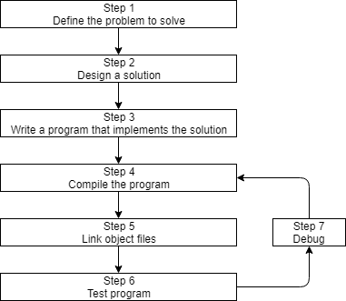

# C++

## Information
- My notes will be taken from [learncpp](https://www.learncpp.com/).

## Background
- C++ utilizes a compiler to compile C++ code into machine language.
- Although C++ is technically considered a high-level language, newer programming languages (e.g. scripting languages) provide an even higher level of abstraction. Today, C++ would probably be more accurately described as a mid-level language. However, this also highlights one of C++’s key strengths: it often provides the ability to work at different levels of abstraction. You can choose to operate at a lower level for better performance and precision, or at a higher level for greater convenience and simplicity.
- The underlying design philosophy of C and C++ can be summed up as “trust the programmer” -- which is both wonderful and dangerous. C++ is designed to allow the programmer a high degree of freedom to do what they want. However, this also means the language often won’t stop you from doing things that don’t make sense, because it will assume you’re doing so for some reason it doesn’t understand. There are quite a few pitfalls that new programmers are likely to fall into if caught unaware. This is one of the primary reasons why knowing what you shouldn’t do in C/C++ is almost as important as knowing what you should do.

## What is C++ good at?
- C++ excels in situations where high performance and precise control over memory and other resources is needed. Here are a few types of applications that C++ would excel in:
    - Video games
    - Real-time systems (e.g. for transportation, manufacturing, etc…)
    - High-performance financial applications (e.g. high frequency trading)
    - Graphical applications and simulations
    - Productivity / office applications
    - Embedded software
    - Audio and video processing
    - Artificial intelligence and neural networks
- C++ also has a large number of high-quality 3rd party libraries available, which can shorten development times significantly.

## Do I need to know C before I do these tutorials?
- Nope! It’s perfectly fine to start with C++, and we’ll teach you everything you need to know (including pitfalls to avoid) along the way.
- Once you know C++, it should be pretty easy to learn standard C if you ever have the need. These days, C is mostly used for niche use cases: code that runs on embedded devices, when you need to interact with other languages that can only interface with C, etc… For most other cases, C++ is recommended.

## Simplistic approach to how C++ programs are developed.
- 
    - Read about steps 1-3 [here](https://www.learncpp.com/cpp-tutorial/introduction-to-cpp-development/) and steps 4-7 [here](https://www.learncpp.com/cpp-tutorial/introduction-to-the-compiler-linker-and-libraries/).

## IDEs (Integrated Development Environments) for C++
- [VS Code](https://code.visualstudio.com/docs/cpp/config-linux)
    - You can follow the steps to compile your program from here or you can use the terminal and do this:
        ```shell
        g++ filename.ext
        ```
        then 
        ```shell
        ./a.out
        ```
        - You can also change the name of the output file by doing:
            ```shell
            g++ -o new_name filename.ext
            ```
            then 
            ```shell
            ./new_name
            ```
            - Putting filename after g++ would work too.

- [Other Options](https://www.learncpp.com/cpp-tutorial/installing-an-integrated-development-environment-ide/)

- Find out how to start a C++ in one of the IDEs listed [here](https://www.learncpp.com/cpp-tutorial/compiling-your-first-program/).

## Common C++ Problems/Errors
- Common problems/errors and their solutions can be found [here](https://www.learncpp.com/cpp-tutorial/a-few-common-cpp-problems/).

## Compiler Configuration
- Use the `debug` build configuration when developing your programs. When you’re ready to release your executable to others, or want to test performance, use the `release` build configuration.

- More on setting compiler configurations [here](https://www.learncpp.com/cpp-tutorial/configuring-your-compiler-build-configurations/).

- Whenever you update your project settings, make the change for all build configurations (unless it’s not appropriate for some reason).

## Configuring Your Compiler 

### Extensions
- The C++ standard defines rules about how programs should behave in specific circumstances. And in most cases, compilers will follow these rules. However, many compilers implement their own changes to the language, often to enhance compatibility with other versions of the language (e.g. C99), or for historical reasons. These compiler-specific behaviors are called **compiler extensions**.

- Best practice: Disable compiler extensions to ensure your programs (and coding practices) remain compliant with C++ standards and will work on any system.

- Figure out how to configure your compiler extensions for your specific environment [here](https://www.learncpp.com/cpp-tutorial/configuring-your-compiler-compiler-extensions/).

### Warning and error levels
- In most cases, when the compiler encounters some kind of issue, it will emit diagnostic message (often called a diagnostic for short). The C++ standard does not define how diagnostic messages should be categorized, worded, or how those issues should affect the compilation of the program. However, modern compilers have conventionally adopted the following:
    - A diagnostic error (error for short) means the compiler has decided to halt compilation, because it either cannot proceed or deems the error serious enough to stop. Diagnostic errors generated by the compiler are often called compilation errors, compiler errors, or compile errors.
    - A diagnostic warning (warning for short) means the compiler has decided not to halt compilation. In such cases, the issue is simply ignored, and compilation proceeds.

- Key insight: Compilers determine whether a non-blocking issue is a warning or an error. While they usually align in their categorization, in some cases, compilers may not agree -- with one compiler emitting an error and another compiler emitting a warning for the same issue.

- By default, most compilers will only generate warnings about the most obvious issues. However, you can request your compiler be more assertive about providing warnings, and it is generally a good idea to do so.

- It is also possible to tell your compiler to treat all warnings as if they were errors (in which case, the compiler will halt compilation if it finds any warnings). This is a good way to enforce the recommendation that you should fix all warnings (if you lack self-discipline, which most of us do).

- Best practices:
    - Don’t let warnings pile up. Resolve them as you encounter them (as if they were errors). Otherwise a warning about a serious issue may be lost amongst warnings about non-serious issues.
    - Turn your warning levels up, especially while you are learning. The additional diagnostic information may help in identifying programming mistakes that can cause your program to malfunction.
    - Enable “Treat warnings as errors”. This will force you to resolve all issues causing warnings.

- Learn how to configure compiler errors for your specific environment [here](https://www.learncpp.com/cpp-tutorial/configuring-your-compiler-choosing-a-language-standard/).

### Choosing a language standard
- With many different versions of C++ available (C++98, C++03, C++11, C++14, C++17, C++20, C++23, etc…) how does your compiler know which one to use? Generally, a compiler will pick a standard to default to. Typically the default is not the most recent language standard -- many default to C++14, which is missing many of the latest and greatest features.

- The conventional names for language standards (e.g. C++20) are based on the year the language standard was published (or expected to be published). Because the year of publication is not actually known until it is close, language standards that are early in development sometimes use a development name instead. For example, C++20 is also known as C++2a.

- In professional environments, it’s common to choose a language standard that is one or two versions back from the latest finalized standard (e.g. if C++20 were the latest finalized version, that means C++14 or C++17). This is typically done to ensure the compiler makers have had a chance to resolve defects, and so that best practices for new features are well understood. Where relevant, this also helps ensure better cross-platform compatibility, as compilers on some platforms may not provide full support for newer language standards immediately.

- When changing your language standard (or any other project setting), make the change to all build configurations.

- Find out how to configure your C++ standard on your specific environment [here](https://www.learncpp.com/cpp-tutorial/configuring-your-compiler-choosing-a-language-standard/).

- [Code to check the language standard your compiler is running.](https://www.learncpp.com/cpp-tutorial/what-language-standard-is-my-compiler-using/)

<details>
<summary><strong>VS Code Configurations</strong></summary>

- `tasks.json` (debug build configuration)
    ```json
    {
        "tasks": [
            {
                "type": "cppbuild",
                "label": "C/C++: g++ build active file",
                "command": "/usr/bin/g++",
                "args": [
                    "-fdiagnostics-color=always",
                    "-g",
                    "-ggdb",                                    // extra debugging information for use by GDB
                    "-pedantic-errors",                         // treat non-standard code as errors
                    "-Wall",                                    //-Wall to -Wsign-conversion: makes compiler more assertive about warnings
                    "-Weffc++",
                    "-Wextra",
                    "-Wconversion",
                    "-Wsign-conversion",
                    "-Werror",                                  // treat warnings as errors
                    "-std=c++20",                               // use C++20 standard
                    "${file}",
                    "-o",
                    "${fileDirname}/${fileBasenameNoExtension}"
                ],
                "options": {
                    "cwd": "${fileDirname}"
                },
                "problemMatcher": [
                    "$gcc"
                ],
                "group": {
                    "kind": "build",
                    "isDefault": true
                },
                "detail": "Task generated by Debugger."
            }
        ],
        "version": "2.0.0"
    }
    ```

- `tasks.json` (release build configuration)
    ```json
    {
        "tasks": [
            {
                "type": "cppbuild",
                "label": "C/C++: g++ build active file",
                "command": "/usr/bin/g++",
                "args": [
                    "-fdiagnostics-color=always",
                    "-g",
                    "-O2",                                      // recommended optimization level for release builds
                    "-DNDEBUG",                                 // disables asserts during runtime for performance                              
                    "-pedantic-errors",                         // treat non-standard code as errors
                    "-Wall",                                    //-Wall to -Wsign-conversion: makes compiler more assertive about warnings
                    "-Weffc++",
                    "-Wextra",
                    "-Wconversion",
                    "-Wsign-conversion",
                    "-Werror",                                  // treat warnings as errors
                    "-std=c++20",                               // use C++20 standard
                    "${file}",
                    "-o",
                    "${fileDirname}/${fileBasenameNoExtension}"
                ],
                "options": {
                    "cwd": "${fileDirname}"
                },
                "problemMatcher": [
                    "$gcc"
                ],
                "group": {
                    "kind": "build",
                    "isDefault": true
                },
                "detail": "Task generated by Debugger."
            }
        ],
        "version": "2.0.0"
    }
    ```

- `settings.json`
    ```json
    {
        "files.insertFinalNewline": true,
        "notebook.insertFinalNewline": true,
        "C_Cpp.default.cppStandard": "c++20"    // configure Intellisense to use the same language standard
    }
    ```
</details>

## Vocabulary
- statement: an instruction in a computer program that tells the computer to perform an action. Most (but not all) statements in C++ end in a semicolon. If you see a line that ends in a semicolon, it’s probably a statement.

- function: collection of statements that executes sequentially
    - When discussing functions, it’s fairly common shorthand to append a pair of parenthesis to the end of the function’s name. For example, if you see the term `main()` or `doSomething()`, this is shorthand for functions named `main` or `doSomething` respectively. This helps differentiate functions from other things with names (such as variables) without having to write the word “function” each time.

- identifier: name of a function (or object, type, template, etc…)

- character: a written symbol or mark, such as a letter, digit, punctuation mark, or mathematical symbol

- string/text: a sequence of characters
    - Conventionally, the term “text” is also used to mean plain text, which is text that contains only characters that appear on a standard keyboard, with no special formatting or styling. For example, plain text cannot represent bold words, as that requires styling.

- control character: characters that have special meaning to the computer system, but either aren’t intended to be displayed, or display as something other than a single visible symbol. Examples of well-known control characters include “escape” (which doesn’t display anything), “tab” (which displays as some number of spaces), and “backspace” (which erases the previous character).

- syntax error: error that occurs when your program violates the grammar rules of the C++ language

## Syntax

### The `main` function
- Every C++ program must have a special function named `main` (all lower case letters).

- When the program is run, the statements inside of `main` are executed in sequential order.

- Programs typically terminate (finish running) after the last statement inside function main has been executed (though programs may abort early in some circumstances, or do some cleanup afterwards).

### Comments
- A comment is a programmer-readable note that is inserted directly into the source code of the program. Comments are ignored by the compiler and are for the programmer’s use only.

- In C++ there are two different styles of comments, both of which serve the same purpose: to help programmers document the code in some way.

#### Single-line comments
- The `//` symbol begins a C++ single-line comment, which tells the compiler to ignore everything from the `//` symbol to the end of the line. For example:
    ```cpp
    std::cout << "Hello world!"; // Everything from here to the end of the line is ignored
    ```

- Typically, the single-line comment is used to make a quick comment about a single line of code like so:
    ```cpp
    std::cout << "Hello world!\n"; // std::cout lives in the iostream library
    std::cout << "It is very nice to meet you!\n"; // these comments make the code hard to read
    std::cout << "Yeah!\n"; // especially when lines are different lengths
    ```

- Having comments to the right of a line can make both the code and the comment hard to read, particularly if the line is long. If the lines are fairly short, the comments can simply be aligned (usually to a tab stop), like so:
    ```cpp
    std::cout << "Hello world!\n";                 // std::cout lives in the iostream library
    std::cout << "It is very nice to meet you!\n"; // this is much easier to read
    std::cout << "Yeah!\n";                        // don't you think so?
    ```

- However, if the lines are long, placing comments to the right can make your lines really long. In that case, single-line comments are often placed above the line it is commenting:
    ```cpp
    // std::cout lives in the iostream library
    std::cout << "Hello world!\n";

    // this is much easier to read
    std::cout << "It is very nice to meet you!\n";

    // don't you think so?
    std::cout << "Yeah!\n";
    ```

#### Multi-line Comments
- The `/*` and `*/` pair of symbols denotes a C-style multi-line comment. Everything in between the symbols is ignored.
    ```cpp
    /* This is a multi-line comment.
       This line will be ignored.
       So will this one. */
   ```

- Since everything between the symbols is ignored, you will sometimes see programmers “beautify” their multi-line comments:
    ```cpp
    /* This is a multi-line comment.
     * the matching asterisks to the left
     * can make this easier to read
     */
    ```

- Multi-line style comments can not be nested. Consequently, the following will have unexpected results:
    ```cpp
    /* This is a multi-line /* comment */ this is not inside the comment */
    // The above comment ends at the first */, not the second */
    ```
    - When the compiler tries to compile this, it will ignore everything from the first `/*` to the first `*/`. Since this is not inside the comment `*/` is not considered part of the comment, the compiler will try to compile it. That will inevitably result in a compile error.
    - Don’t use multi-line comments inside other multi-line comments. Wrapping single-line comments inside a multi-line comment is okay.

#### Proper use of comments
- Typically, comments should be used for three things. First, for a given library, program, or function, comments are best used to describe what the library, program, or function, does. These are typically placed at the top of the file or library, or immediately preceding the function. For example:
    ```cpp
    // This program calculates the student's final grade based on their test and homework scores.
    ```
    ```cpp
    // This function uses Newton's method to approximate the root of a given equation.
    ```
    ```cpp
    // The following lines generate a random item based on rarity, level, and a weight factor.
    ```
    All of these comments give the reader a good idea of what the library, program, or function is trying to accomplish without having to look at the actual code. The user (possibly someone else, or you if you’re trying to reuse code you’ve previously written) can tell at a glance whether the code is relevant to what he or she is trying to accomplish. This is particularly important when working as part of a team, where not everybody will be familiar with all of the code.

- Second, within a library, program, or function described above, comments can be used to describe how the code is going to accomplish its goal.
    ```cpp
    /* To calculate the final grade, we sum all the weighted midterm and homework scores
       and then divide by the number of scores to assign a percentage, which is
       used to calculate a letter grade. */
    ```
    ```cpp
    // To generate a random item, we're going to do the following:
    // 1) Put all of the items of the desired rarity on a list
    // 2) Calculate a probability for each item based on level and weight factor
    // 3) Choose a random number
    // 4) Figure out which item that random number corresponds to
    // 5) Return the appropriate item
    ```
    These comments give the user an idea of how the code is going to accomplish its goal without having to understand what each individual line of code does.

- Third, at the statement level, comments should be used to describe why the code is doing something. A bad statement comment explains what the code is doing. If you ever write code that is so complex that needs a comment to explain what a statement is doing, you probably need to rewrite your statement, not comment it. Here are some examples of bad line comments and good statement comments.
    - Bad comment:
        ```cpp
        // Set sight range to 0
        sight = 0;
        ```
        Reason: We already can see that sight is being set to 0 by looking at the statement
    - Good comment:
        ```cpp
        // The player just drank a potion of blindness and can not see anything
        sight = 0;
        ```
        Reason: Now we know why the player’s sight is being set to 0
    - Bad comment:
        ```cpp
        // Calculate the cost of the items
        cost = quantity * 2 * storePrice;
        ```
        Reason: We can see that this is a cost calculation, but why is quantity multiplied by 2?
    - Good Comment:
        ```cpp
        // We need to multiply quantity by 2 here because they are bought in pairs
        cost = quantity * 2 * storePrice;
        ```
        Reason: Now we know why this formula makes sense.

- Programmers often have to make a tough decision between solving a problem one way, or solving it another way. Comments are a great way to remind yourself (or tell somebody else) the reason you made one decision instead of another. Good comments:
    ```cpp
    // We decided to use a linked list instead of an array because
    // arrays do insertion too slowly.
    ```
    ```cpp
    // We're going to use Newton's method to find the root of a number because
    // there is no deterministic way to solve these equations.
    ```

- Finally, comments should be written in a way that makes sense to someone who has no idea what the code does. It is often the case that a programmer will say “It’s obvious what this does! There’s no way I’ll forget about this”. Guess what? It’s not obvious, and you will be amazed how quickly you forget. :) You (or someone else) will thank you later for writing down the what, how, and why of your code in human language. Reading individual lines of code is easy. Understanding what goal they are meant to accomplish is not.

- Best Practice: Comment your code liberally, and write your comments as if speaking to someone who has no idea what the code does. Don’t assume you’ll remember why you made specific choices.

#### Commenting out code
- Converting one or more lines of code into a comment is called **commenting out your code**. This provides a convenient way to (temporarily) exclude parts of your code from being included in your compiled program

- A quick way to comment out code is to highlight the line(s) you want to comment out and press `ctrl` + `/` (`cmd` instead of `ctrl` for Mac) (shortcut may vary per ide). You should also just use `//` for a single line or `/* *\` for multiple lines. 

- There are quite a few reasons you might want to do this:
    1. You’re working on a new piece of code that won’t compile yet, and you need to run the program. The compiler won’t let you compile the code if there are compiler errors. Commenting out the code that won’t compile will allow the program to compile so you can run it. When you’re ready, you can uncomment the code, and continue working on it.
    2. You’ve written new code that compiles but doesn’t work correctly, and you don’t have time to fix it until later. Commenting out the broken code will ensure the broken code doesn’t execute and cause problems until you can fix it.
    3. To find the source of an error. If a program isn’t producing the desired results (or is crashing), it can sometimes be useful to disable parts of your code to see if you can isolate what’s causing it to not work correctly. If you comment out one or more lines of code, and your program starts working as expected (or stops crashing), odds are whatever you last commented out was part of the problem. You can then investigate why those lines of code are causing the problem.
    4. You want to replace one piece of code with another piece of code. Instead of just deleting the original code, you can comment it out and leave it there for reference until you’re sure your new code works properly. Once you are sure your new code is working, you can remove the old commented out code. If you can’t get your new code to work, you can always delete the new code and uncomment the old code to revert to what you had before.

#### Summary
- At the library, program, or function level, use comments to describe what.
- Inside the library, program, or function, use comments to describe how.
- At the statement level, use comments to describe why.
