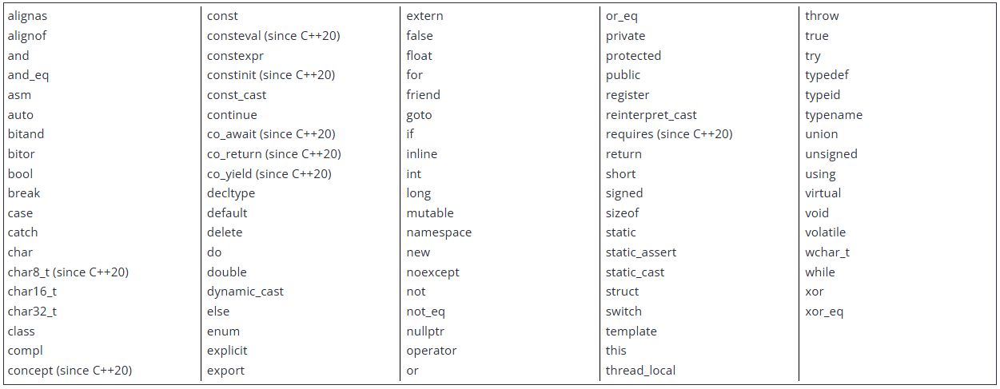
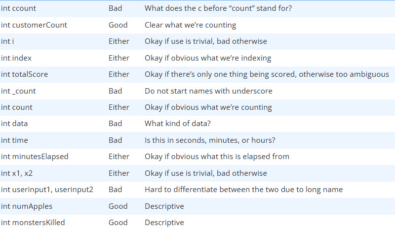

# C++

## Something to note
- C++ was actually the language that my major (Computer Engineering) was taught in. I already know the basic syntax all the way up to OOP. These notes do not yet represent my full knowledge. I am simply revisiting/learning new topics to get a better understanding of the language and its best practices.

## Source
- My notes will be taken from [learncpp](https://www.learncpp.com/).

## Background
- C++ utilizes a compiler to compile C++ code into machine language.
- Although C++ is technically considered a high-level language, newer programming languages (e.g. scripting languages) provide an even higher level of abstraction. Today, C++ would probably be more accurately described as a mid-level language. However, this also highlights one of C++’s key strengths: it often provides the ability to work at different levels of abstraction. You can choose to operate at a lower level for better performance and precision, or at a higher level for greater convenience and simplicity.
- The underlying design philosophy of C and C++ can be summed up as “trust the programmer” -- which is both wonderful and dangerous. C++ is designed to allow the programmer a high degree of freedom to do what they want. However, this also means the language often won’t stop you from doing things that don’t make sense, because it will assume you’re doing so for some reason it doesn’t understand. There are quite a few pitfalls that new programmers are likely to fall into if caught unaware. This is one of the primary reasons why knowing what you shouldn’t do in C/C++ is almost as important as knowing what you should do.

## What is C++ good at?
- C++ excels in situations where high performance and precise control over memory and other resources is needed. Here are a few types of applications that C++ would excel in:
    - Video games
    - Real-time systems (e.g. for transportation, manufacturing, etc…)
    - High-performance financial applications (e.g. high frequency trading)
    - Graphical applications and simulations
    - Productivity / office applications
    - Embedded software
    - Audio and video processing
    - Artificial intelligence and neural networks
- C++ also has a large number of high-quality 3rd party libraries available, which can shorten development times significantly.

## Do I need to know C before I do these tutorials?
- Nope! It’s perfectly fine to start with C++, and we’ll teach you everything you need to know (including pitfalls to avoid) along the way.
- Once you know C++, it should be pretty easy to learn standard C if you ever have the need. These days, C is mostly used for niche use cases: code that runs on embedded devices, when you need to interact with other languages that can only interface with C, etc… For most other cases, C++ is recommended.

## Simplistic approach to how C++ programs are developed.
- 
    - Read about steps 1-3 [here](https://www.learncpp.com/cpp-tutorial/introduction-to-cpp-development/) and steps 4-7 [here](https://www.learncpp.com/cpp-tutorial/introduction-to-the-compiler-linker-and-libraries/).

## IDEs (Integrated Development Environments) for C++
- [VS Code](https://code.visualstudio.com/docs/cpp/config-linux)
    - You can follow the steps to compile your program from here or you can use the terminal and do this:
        ```shell
        g++ filename.ext
        ```
        then 
        ```shell
        ./a.out
        ```
        - You can also change the name of the output file by doing:
            ```shell
            g++ -o new_name filename.ext
            ```
            then 
            ```shell
            ./new_name
            ```
            - Putting filename after g++ would work too.

- [Other Options](https://www.learncpp.com/cpp-tutorial/installing-an-integrated-development-environment-ide/)

- Find out how to start a C++ in one of the IDEs listed [here](https://www.learncpp.com/cpp-tutorial/compiling-your-first-program/).

## Common C++ Problems/Errors
- Common problems/errors and their solutions can be found [here](https://www.learncpp.com/cpp-tutorial/a-few-common-cpp-problems/).

## Compiler Configuration
- Use the `debug` build configuration when developing your programs. When you’re ready to release your executable to others, or want to test performance, use the `release` build configuration.

- More on setting compiler configurations [here](https://www.learncpp.com/cpp-tutorial/configuring-your-compiler-build-configurations/).

- Whenever you update your project settings, make the change for all build configurations (unless it’s not appropriate for some reason).

## Configuring Your Compiler 

### Extensions
- The C++ standard defines rules about how programs should behave in specific circumstances. And in most cases, compilers will follow these rules. However, many compilers implement their own changes to the language, often to enhance compatibility with other versions of the language (e.g. C99), or for historical reasons. These compiler-specific behaviors are called **compiler extensions**.

- Best practice: Disable compiler extensions to ensure your programs (and coding practices) remain compliant with C++ standards and will work on any system.

- Figure out how to configure your compiler extensions for your specific environment [here](https://www.learncpp.com/cpp-tutorial/configuring-your-compiler-compiler-extensions/).

### Warning and error levels
- In most cases, when the compiler encounters some kind of issue, it will emit diagnostic message (often called a diagnostic for short). The C++ standard does not define how diagnostic messages should be categorized, worded, or how those issues should affect the compilation of the program. However, modern compilers have conventionally adopted the following:
    - A diagnostic error (error for short) means the compiler has decided to halt compilation, because it either cannot proceed or deems the error serious enough to stop. Diagnostic errors generated by the compiler are often called compilation errors, compiler errors, or compile errors.
    - A diagnostic warning (warning for short) means the compiler has decided not to halt compilation. In such cases, the issue is simply ignored, and compilation proceeds.

- Key insight: Compilers determine whether a non-blocking issue is a warning or an error. While they usually align in their categorization, in some cases, compilers may not agree -- with one compiler emitting an error and another compiler emitting a warning for the same issue.

- By default, most compilers will only generate warnings about the most obvious issues. However, you can request your compiler be more assertive about providing warnings, and it is generally a good idea to do so.

- It is also possible to tell your compiler to treat all warnings as if they were errors (in which case, the compiler will halt compilation if it finds any warnings). This is a good way to enforce the recommendation that you should fix all warnings (if you lack self-discipline, which most of us do).

- Best practices:
    - Don’t let warnings pile up. Resolve them as you encounter them (as if they were errors). Otherwise a warning about a serious issue may be lost amongst warnings about non-serious issues.
    - Turn your warning levels up, especially while you are learning. The additional diagnostic information may help in identifying programming mistakes that can cause your program to malfunction.
    - Enable “Treat warnings as errors”. This will force you to resolve all issues causing warnings.

- Learn how to configure compiler errors for your specific environment [here](https://www.learncpp.com/cpp-tutorial/configuring-your-compiler-choosing-a-language-standard/).

### Choosing a language standard
- With many different versions of C++ available (C++98, C++03, C++11, C++14, C++17, C++20, C++23, etc…) how does your compiler know which one to use? Generally, a compiler will pick a standard to default to. Typically the default is not the most recent language standard -- many default to C++14, which is missing many of the latest and greatest features.

- The conventional names for language standards (e.g. C++20) are based on the year the language standard was published (or expected to be published). Because the year of publication is not actually known until it is close, language standards that are early in development sometimes use a development name instead. For example, C++20 is also known as C++2a.

- In professional environments, it’s common to choose a language standard that is one or two versions back from the latest finalized standard (e.g. if C++20 were the latest finalized version, that means C++14 or C++17). This is typically done to ensure the compiler makers have had a chance to resolve defects, and so that best practices for new features are well understood. Where relevant, this also helps ensure better cross-platform compatibility, as compilers on some platforms may not provide full support for newer language standards immediately.

- When changing your language standard (or any other project setting), make the change to all build configurations.

- Find out how to configure your C++ standard on your specific environment [here](https://www.learncpp.com/cpp-tutorial/configuring-your-compiler-choosing-a-language-standard/).

- [Code to check the language standard your compiler is running.](https://www.learncpp.com/cpp-tutorial/what-language-standard-is-my-compiler-using/)

<details>
<summary><strong>VS Code Configurations</strong></summary>

- `tasks.json` (debug build configuration)
    ```json
    {
        "tasks": [
            {
                "type": "cppbuild",
                "label": "C/C++: g++ build active file",
                "command": "/usr/bin/g++",
                "args": [
                    "-fdiagnostics-color=always",
                    "-g",
                    "-ggdb",                                    // extra debugging information for use by GDB
                    "-pedantic-errors",                         // treat non-standard code as errors
                    "-Wall",                                    //-Wall to -Wsign-conversion: makes compiler more assertive about warnings
                    "-Weffc++",
                    "-Wextra",
                    "-Wconversion",
                    "-Wsign-conversion",
                    "-Werror",                                  // treat warnings as errors
                    "-std=c++20",                               // use C++20 standard
                    "${file}",
                    "-o",
                    "${fileDirname}/${fileBasenameNoExtension}"
                ],
                "options": {
                    "cwd": "${fileDirname}"
                },
                "problemMatcher": [
                    "$gcc"
                ],
                "group": {
                    "kind": "build",
                    "isDefault": true
                },
                "detail": "Task generated by Debugger."
            }
        ],
        "version": "2.0.0"
    }
    ```

- `tasks.json` (release build configuration)
    ```json
    {
        "tasks": [
            {
                "type": "cppbuild",
                "label": "C/C++: g++ build active file",
                "command": "/usr/bin/g++",
                "args": [
                    "-fdiagnostics-color=always",
                    "-g",
                    "-O2",                                      // recommended optimization level for release builds
                    "-DNDEBUG",                                 // disables asserts during runtime for performance                              
                    "-pedantic-errors",                         // treat non-standard code as errors
                    "-Wall",                                    //-Wall to -Wsign-conversion: makes compiler more assertive about warnings
                    "-Weffc++",
                    "-Wextra",
                    "-Wconversion",
                    "-Wsign-conversion",
                    "-Werror",                                  // treat warnings as errors
                    "-std=c++20",                               // use C++20 standard
                    "${file}",
                    "-o",
                    "${fileDirname}/${fileBasenameNoExtension}"
                ],
                "options": {
                    "cwd": "${fileDirname}"
                },
                "problemMatcher": [
                    "$gcc"
                ],
                "group": {
                    "kind": "build",
                    "isDefault": true
                },
                "detail": "Task generated by Debugger."
            }
        ],
        "version": "2.0.0"
    }
    ```

- `settings.json`
    ```json
    {
        "files.insertFinalNewline": true,
        "notebook.insertFinalNewline": true,
        "C_Cpp.default.cppStandard": "c++20"    // configure Intellisense to use the same language standard
    }
    ```
</details>

## Syntax

### The `main` function
- Every C++ program must have a special function named `main` (all lower case letters).

- When the program is run, the statements inside of `main` are executed in sequential order.

- Programs typically terminate (finish running) after the last statement inside function main has been executed (though programs may abort early in some circumstances, or do some cleanup afterwards).

### Comments
- A comment is a programmer-readable note that is inserted directly into the source code of the program. Comments are ignored by the compiler and are for the programmer’s use only.

- In C++ there are two different styles of comments, both of which serve the same purpose: to help programmers document the code in some way.

#### Single-line comments
- The `//` symbol begins a C++ single-line comment, which tells the compiler to ignore everything from the `//` symbol to the end of the line. For example:
    ```cpp
    std::cout << "Hello world!"; // Everything from here to the end of the line is ignored
    ```

- Typically, the single-line comment is used to make a quick comment about a single line of code like so:
    ```cpp
    std::cout << "Hello world!\n"; // std::cout lives in the iostream library
    std::cout << "It is very nice to meet you!\n"; // these comments make the code hard to read
    std::cout << "Yeah!\n"; // especially when lines are different lengths
    ```

- Having comments to the right of a line can make both the code and the comment hard to read, particularly if the line is long. If the lines are fairly short, the comments can simply be aligned (usually to a tab stop), like so:
    ```cpp
    std::cout << "Hello world!\n";                 // std::cout lives in the iostream library
    std::cout << "It is very nice to meet you!\n"; // this is much easier to read
    std::cout << "Yeah!\n";                        // don't you think so?
    ```

- However, if the lines are long, placing comments to the right can make your lines really long. In that case, single-line comments are often placed above the line it is commenting:
    ```cpp
    // std::cout lives in the iostream library
    std::cout << "Hello world!\n";

    // this is much easier to read
    std::cout << "It is very nice to meet you!\n";

    // don't you think so?
    std::cout << "Yeah!\n";
    ```

#### Multi-line Comments
- The `/*` and `*/` pair of symbols denotes a C-style multi-line comment. Everything in between the symbols is ignored.
    ```cpp
    /* This is a multi-line comment.
       This line will be ignored.
       So will this one. */
   ```

- Since everything between the symbols is ignored, you will sometimes see programmers “beautify” their multi-line comments:
    ```cpp
    /* This is a multi-line comment.
     * the matching asterisks to the left
     * can make this easier to read
     */
    ```

- Multi-line style comments can not be nested. Consequently, the following will have unexpected results:
    ```cpp
    /* This is a multi-line /* comment */ this is not inside the comment */
    // The above comment ends at the first */, not the second */
    ```
    - When the compiler tries to compile this, it will ignore everything from the first `/*` to the first `*/`. Since this is not inside the comment `*/` is not considered part of the comment, the compiler will try to compile it. That will inevitably result in a compile error.
    - Don’t use multi-line comments inside other multi-line comments. Wrapping single-line comments inside a multi-line comment is okay.

#### Proper use of comments
- Typically, comments should be used for three things. First, for a given library, program, or function, comments are best used to describe what the library, program, or function, does. These are typically placed at the top of the file or library, or immediately preceding the function. For example:
    ```cpp
    // This program calculates the student's final grade based on their test and homework scores.
    ```
    ```cpp
    // This function uses Newton's method to approximate the root of a given equation.
    ```
    ```cpp
    // The following lines generate a random item based on rarity, level, and a weight factor.
    ```
    All of these comments give the reader a good idea of what the library, program, or function is trying to accomplish without having to look at the actual code. The user (possibly someone else, or you if you’re trying to reuse code you’ve previously written) can tell at a glance whether the code is relevant to what he or she is trying to accomplish. This is particularly important when working as part of a team, where not everybody will be familiar with all of the code.

- Second, within a library, program, or function described above, comments can be used to describe how the code is going to accomplish its goal.
    ```cpp
    /* To calculate the final grade, we sum all the weighted midterm and homework scores
       and then divide by the number of scores to assign a percentage, which is
       used to calculate a letter grade. */
    ```
    ```cpp
    // To generate a random item, we're going to do the following:
    // 1) Put all of the items of the desired rarity on a list
    // 2) Calculate a probability for each item based on level and weight factor
    // 3) Choose a random number
    // 4) Figure out which item that random number corresponds to
    // 5) Return the appropriate item
    ```
    These comments give the user an idea of how the code is going to accomplish its goal without having to understand what each individual line of code does.

- Third, at the statement level, comments should be used to describe why the code is doing something. A bad statement comment explains what the code is doing. If you ever write code that is so complex that needs a comment to explain what a statement is doing, you probably need to rewrite your statement, not comment it. Here are some examples of bad line comments and good statement comments.
    - Bad comment:
        ```cpp
        // Set sight range to 0
        sight = 0;
        ```
        Reason: We already can see that sight is being set to 0 by looking at the statement
    - Good comment:
        ```cpp
        // The player just drank a potion of blindness and can not see anything
        sight = 0;
        ```
        Reason: Now we know why the player’s sight is being set to 0
    - Bad comment:
        ```cpp
        // Calculate the cost of the items
        cost = quantity * 2 * storePrice;
        ```
        Reason: We can see that this is a cost calculation, but why is quantity multiplied by 2?
    - Good Comment:
        ```cpp
        // We need to multiply quantity by 2 here because they are bought in pairs
        cost = quantity * 2 * storePrice;
        ```
        Reason: Now we know why this formula makes sense.

- Programmers often have to make a tough decision between solving a problem one way, or solving it another way. Comments are a great way to remind yourself (or tell somebody else) the reason you made one decision instead of another. Good comments:
    ```cpp
    // We decided to use a linked list instead of an array because
    // arrays do insertion too slowly.
    ```
    ```cpp
    // We're going to use Newton's method to find the root of a number because
    // there is no deterministic way to solve these equations.
    ```

- Finally, comments should be written in a way that makes sense to someone who has no idea what the code does. It is often the case that a programmer will say “It’s obvious what this does! There’s no way I’ll forget about this”. Guess what? It’s not obvious, and you will be amazed how quickly you forget. :) You (or someone else) will thank you later for writing down the what, how, and why of your code in human language. Reading individual lines of code is easy. Understanding what goal they are meant to accomplish is not.

- Best Practice: Comment your code liberally, and write your comments as if speaking to someone who has no idea what the code does. Don’t assume you’ll remember why you made specific choices.

#### Commenting out code
- Converting one or more lines of code into a comment is called **commenting out your code**. This provides a convenient way to (temporarily) exclude parts of your code from being included in your compiled program

- A quick way to comment out code is to highlight the line(s) you want to comment out and press `ctrl` + `/` (`cmd` instead of `ctrl` for Mac) (shortcut may vary per ide). You should also just use `//` for a single line or `/* *\` for multiple lines. 

- There are quite a few reasons you might want to do this:
    1. You’re working on a new piece of code that won’t compile yet, and you need to run the program. The compiler won’t let you compile the code if there are compiler errors. Commenting out the code that won’t compile will allow the program to compile so you can run it. When you’re ready, you can uncomment the code, and continue working on it.
    2. You’ve written new code that compiles but doesn’t work correctly, and you don’t have time to fix it until later. Commenting out the broken code will ensure the broken code doesn’t execute and cause problems until you can fix it.
    3. To find the source of an error. If a program isn’t producing the desired results (or is crashing), it can sometimes be useful to disable parts of your code to see if you can isolate what’s causing it to not work correctly. If you comment out one or more lines of code, and your program starts working as expected (or stops crashing), odds are whatever you last commented out was part of the problem. You can then investigate why those lines of code are causing the problem.
    4. You want to replace one piece of code with another piece of code. Instead of just deleting the original code, you can comment it out and leave it there for reference until you’re sure your new code works properly. Once you are sure your new code is working, you can remove the old commented out code. If you can’t get your new code to work, you can always delete the new code and uncomment the old code to revert to what you had before.

#### Summary
- At the library, program, or function level, use comments to describe what.
- Inside the library, program, or function, use comments to describe how.
- At the statement level, use comments to describe why.

### Data and values
- Programs are collections of instructions that manipulate data to produce a desired result. In computing, data is any information that can be moved, processed, or stored by a computer.

- In programming, a single piece of data is called a value (sometimes called a data value). Common examples of values include:
    - Numbers (e.g. `5` or `-6.7`).
    - Characters, which are placed between single-quotes (e.g. `'H'` or `'$'`). Only a single symbol may be used.
    - Text, which must be placed between double-quotes (e.g. `"Hello"` or `"H"`). Text can contain 0 or more characters.
    - In general, values placed in single-quotes are interpreted by the compiler as character values, values placed in double-quotes are interpreted by the compiler as text values, and numeric values are not quoted.

- Values that are placed directly into the source code are called literals.

- If a character value or text value is not properly quoted, the compiler will try to interpret that value as if it were C++ code. That will almost always result in a compilation error.

- Literals are the easiest way to provide values for your program, but they have some shortcomings. Literals are read-only values, so their values can’t be modified. Thus, if we want to store data in memory, we need some other way to do this.

#### Random Access Memory (RAM)
- The main memory in a computer is called **Random Access Memory** (often called **RAM** for short). When we run a program, the operating system loads the program into RAM. Any data that is hardcoded into the program itself (e.g. text such as “Hello, world!”) is loaded at this point.

- The operating system also reserves some additional RAM for the program to use while it is running. Common uses for this memory are to store values entered by the user, to store data read in from a file or network, or to store values calculated while the program is running (e.g. the sum of two values) so they can be used again later.

- You can think of RAM as a series of numbered boxes that can be used to store data while the program is running.

#### Objects and variables
- An object is used to store a value in memory. It represents a region of storage that can hold a value. Although objects in C++ can be unnamed (anonymous), more often we name our objects using an identifier. A variable is an object that has a name (identifier).

- In general programming, the term object typically refers to an unnamed object in memory, a variable, or a function. In C++, the term object has a narrower definition that excludes functions. When we use the term object in this tutorial series, this narrower C++ definition is the one we mean.

#### Variable definition
- In order to use a variable in our program, we need to tell the compiler that we want one. The most common way to do this is by use of a special kind of declaration statement called a definition. Here’s an example of defining a variable named `x`:
    ```cpp
    int x; // define a variable named x (of type int)
    ```
    - At **compile-time** (when the program is being compiled), when encountering this statement, the compiler makes a note to itself that we want a variable with the name `x`, and that the variable has the data type int. From that point forward (with some limitations based on scope), whenever we use the identifier x in our code, the compiler will know that we are referring to this variable. The compiler handles all of the other details about this variable for us, including determining how much memory the object will need, in what kind of storage the object will be placed (e.g. in RAM or a CPU register), where it will be placed relative to other objects, when it will be created and destroyed, etc.

- A variable created via a definition statement is said to be defined at the point where the definition statement is placed.

#### Variable Creation
- At **runtime** (when the program is loaded into memory and run), each object is given an actual storage location (such as RAM, or a CPU register) that it can use to store values. The process of reserving storage for an object’s use is called **allocation**. Once allocation has occurred, the object has been created and can be used. For example, let’s say that variable `x` is instantiated at memory location 140. Whenever the program uses variable `x`, it will access the value in memory location 140.

#### Data types
- A **data type** (more commonly just called a **type**) determines what kind of value (e.g. a number, a letter, text, etc…) the object will store.

- `int` is short for integer and is a data type in C++. An integer is a number that can be written without a fractional component, such as `4`, `27`, `0`, `-2`, or `-12`. Defining an integer named `x` would look like this:
    ```cpp
    int x
    ```

- The data type of an object must be known at compile-time (so the compiler knows how much memory that object requires). In C++, that type can not be changed without recompiling the program. This means an integer variable can only hold integer values. If you want to store some other kind of value, you’ll need to use a different type.

- `double` is a data type in C++ that can store numbers with fractional components. Defining an double named `x` would look like this:
    ```cpp
    double x
    ```

#### Defining multiple variables
- It is possible to define multiple variables of the same type in a single statement by separating the names with a comma. The following code snippet:
    ```cpp
    int a;
    int b;
    ```
    is effectively the same as this one:
    ```cpp
    int a, b;
    ```

- When defining multiple variables this way, there are three common mistakes that new programmers tend to make (neither serious, since the compiler will catch these and ask you to fix them):
    1. Giving each variable a type when defining variables in sequence
        ```cpp
        int a, int b; // wrong (compiler error)

        int a, b; // correct
        ```
    2. Trying to define variables of different types in the same statement, which is not allowed. Variables of different types must be defined in separate statements.
        ```cpp
        int a, double b; // wrong (compiler error)

        int a; double b; // correct (but not recommended)

        // correct and recommended (easier to read)
        int a;
        double b;
        ```
    - We’ll discuss the third issue next lesson, when we cover initialization of variables.

- Best practice: Although the language allows you to do so, avoid defining multiple variables of the same type in a single statement. Instead, define each variable in a separate statement on its own line (and then use a single-line comment to document what it is used for).

#### Summary 
- In C++, we use objects to access memory. A named object is called a variable. Each variable has an identifier, a type, and a value (and some other attributes that aren’t relevant here). A variable’s type is used to determine how the value in memory should be interpreted.

- Variables are actually created at runtime, when memory is allocated for their use.

### Variable assignment and initialization

#### Variable assignment
- After a variable has been defined, you can give it a value (in a separate statement) using the `=` operator. This process is called **assignment**, and the `=` operator is called the **assignment operator**.
    ```cpp
    int width; // define an integer variable named width
    width = 5; // assignment of value 5 into variable width

    // variable width now has value 5
    ```

- By default, assignment copies the value on the right-hand side of the `=` operator to the variable on the left-hand side of the operator. This is called **copy-assignment**.

- Once a variable has been given a value, the value of that variable can be printed via `std::cout` and the `<<` operator.

- Assignment can be used whenever we want to change the value held by a variable. Here’s an example where we use assignment twice:
    ```cpp
    #include <iostream>

    int main()
    {
        int width; // define a variable named width
        width = 5; // copy assignment of value 5 into variable width

        std::cout << width; // prints 5

        width = 7; // change value stored in variable width to 7

        std::cout << width; // prints 7

        return 0;
    }
    ```
    Output: 
    ```
    57
    ```
    - When this program is run, execution begins at the top of the `main` function and proceeds sequentially. First, memory for variable `width` is allocated. We then assign `width` the value `5`. When we output the value of `width`, it prints `5` to the console. When we then assign value `7` to `width`, any prior value (in this case `5`) is overwritten. Thus when we output `width` again, this time it prints `7`.

- Normal variables can only hold one value at a time.

#### Variable initialization
- One downside of assignment is that assigning a value to a just-defined object requires two statements: one to define the variable, and another to assign the value. These two steps can be combined. When an object is defined, you can optionally provide an initial value for the object. The process of specifying an initial value for an object is called **initialization**, and the syntax used to initialize an object is called an **initializer**. Informally, the initial value is often called an “initializer” as well. For example, the following statement both defines a variable named `width` (of type `int`) and initializes it with the value `5`:
    ```cpp
    #include <iostream>

    int main()
    {
        int width { 5 };    // define variable width and initialize with initial value 5
        std::cout << width; // prints 5

        return 0;
    }
    ```
    - In the above initialization of variable `width`, `{ 5 }` is the initializer, and `5` is the initial value.

#### Different forms of initialization
- There are 5 common forms of initialization in C++:
    ```cpp
    int a;         // default-initialization (no initializer)

    // Traditional initialization forms:
    int b = 5;     // copy-initialization (initial value after equals sign)
    int c ( 6 );   // direct-initialization (initial value in parenthesis)

    // Modern initialization forms (preferred):
    int d { 7 };   // direct-list-initialization (initial value in braces)
    int e {};      // value-initialization (empty braces)
    ```
    - You may see the above forms written with different spacing (e.g. `int b=5;`, `int c(6);`, `int d{7};`, `int e{};`). Whether you use extra spaces for readability or not is a matter of personal preference.

#### Default-initialization
- When no initializer is provided, this is called **default-initialization**. In many cases, default-initialization performs no initialization, and leaves the variable with an indeterminate value (a value that is not predictable, sometimes called a “garbage value”).

#### Copy-initialization
- When an initial value is provided after an equals sign, this is called **copy-initialization**. This form of initialization was inherited from the C language.
    ```cpp
    int width = 5; // copy-initialization of value 5 into variable width
    ```
    - Much like copy-assignment, this copies the value on the right-hand side of the equals into the variable being created on the left-hand side. In the above snippet, variable `width` will be initialized with value `5`.

- Copy-initialization had fallen out of favor in modern C++ due to being less efficient than other forms of initialization for some complex types. However, C++17 remedied the bulk of these issues, and copy-initialization is now finding new advocates. You will also find it used in older code (especially code ported from C), or by developers who simply think it looks more natural and is easier to read.

- Copy-initialization is also used whenever values are implicitly copied, such as when passing arguments to a function by value, returning from a function by value, or catching exceptions by value.

#### Direct-initialization
- When an initial value is provided inside parenthesis, this is called **direct-initialization**.
    ```cpp
    int width ( 5 ); // direct initialization of value 5 into variable width
    ```

- Direct-initialization was initially introduced to allow for more efficient initialization of complex objects (those with class types). Just like copy-initialization, direct-initialization had fallen out of favor in modern C++, largely due to being superseded by direct-list-initialization. However, direct-list-initialization has a few quirks of its own, and so direct-initialization is once again finding use in certain cases.

- Direct-initialization is also used when values are explicitly cast to another type (e.g. via `static_cast`).

#### List-initialization
- The modern way to initialize objects in C++ is to use a form of initialization that makes use of curly braces. This is called `list-initialization` (or `uniform initialization` or `brace initialization`).

- List-initialization comes in two forms:
    ```cpp
    int width { 5 };    // direct-list-initialization of initial value 5 into variable width (preferred)
    int height = { 6 }; // copy-list-initialization of initial value 6 into variable height (rarely used)
    ```

- Prior to C++11, some types of initialization required using copy-initialization, and other types of initialization required using direct-initialization. Copy-initialization can be hard to differentiate from copy-assignment (because both use an =). And direct-initialization can be difficult to differentiate from function-related operations (because both use parentheses).

- List-initialization was introduced to provide a initialization syntax that works in almost all cases, behaves consistently, and has an unambiguous syntax that makes it easy to tell where we’re initializing an object.

#### List-initialization disallows narrowing conversions
- One of the primary benefits of list-initialization for new C++ programmers is that “narrowing conversions” are disallowed. This means that if you try to list-initialize a variable using a value that the variable can not safely hold, the compiler is required to produce a diagnostic (compilation error or warning) to notify you. For example:
    ```cpp
    int main()
    {
        // An integer can only hold non-fractional values.
        // Initializing an int with fractional value 4.5 requires the compiler to convert 4.5 to a value an int can hold.
        // Such a conversion is a narrowing conversion, since the fractional part of the value will be lost.

        int w1 { 4.5 }; // compile error: list-init does not allow narrowing conversion

        int w2 = 4.5;   // compiles: w2 copy-initialized to value 4
        int w3 (4.5);   // compiles: w3 direct-initialized to value 4

        return 0;
    }
    ```
    - On line 7 of the above program, we’re using a value (`4.5`) with a fractional component (`.5`) to list-initialize an integer variable (which can only hold non-fractional values). Because this is a narrowing conversion, the compiler is required to generate a diagnostic in such cases.
    - Copy-initialization and direct-initialization both silently drop the .5 and initialize the variable with the value 4 (which probably isn’t what we want). Your compiler may warn you about this (since losing data is rarely desired), but it also may not.

- Note that this restriction on narrowing conversions only applies to the list-initialization, not to any subsequent assignments to the variable:
    ```cpp
    int main()
    {
        int w1 { 4.5 }; // compile error: list-init does not allow narrowing conversion of 4.5 to 4

        w1 = 4.5;       // okay: copy-assignment allows narrowing conversion of 4.5 to 4

        return 0;
    }
    ```

#### Value-initialization and zero-initialization
- When a variable is initialized using an empty set of braces, a special form of list-initialization called **value-initialization** takes place. In most cases, value-initialization will implicitly initialize the variable to zero (or whatever value is closest to zero for a given type). In cases where zeroing occurs, this is called **zero-initialization**. 
    ```cpp
    int width {}; // value-initialization / zero-initialization to value 0
    ```

- For class types, value-initialization (and default-initialization) may instead initialize the object to predefined default values, which may be non-zero.

#### List-initialization is the preferred form of initialization in modern C++
- List-initialization (including value-initialization) is generally preferred over the other initialization forms because it works in most cases (and is therefore most consistent), it disallows narrowing conversions (which we normally don’t want), and it supports initialization with a list of values.

- When should I initialize with { 0 } vs {}?
    - Use direct-list-initialization when you’re actually using the initial value:
        ```cpp
        int x { 0 };    // direct-list-initialization with initial value 0
        std::cout << x; // we're using that 0 value here
        ```
    - Use value-initialization when the object’s value is temporary and will be replaced:
        ```cpp
        int x {};      // value initialization
        std::cin >> x; // we're immediately replacing that value so an explicit 0 would be meaningless
        ```

#### Initialize your variables
- Initialize your variables upon creation. You may eventually find cases where you want to ignore this advice for a specific reason (e.g. a performance critical section of code that uses a lot of variables), and that’s okay, as long as the choice is made deliberately.

#### Instantiation
- The term **instantiation** is a fancy word that means a variable has been created (allocated) and initialized (this includes default initialization). An instantiated object is sometimes called an **instance**. Most often, this term is applied to class type objects, but it is occasionally applied to objects of other types as well.

#### Initializing multiple variables
- We noted that best practice is to avoid multiple variable declaration syntax altogether. However, since you may encounter other code that uses this style, it’s still useful to talk a little bit more about it, if for no other reason than to reinforce some of the reasons you should be avoiding it. 

- You can initialize multiple variables defined on the same line:
    ```cpp
    int a = 5, b = 6;          // copy-initialization
    int c ( 7 ), d ( 8 );      // direct-initialization
    int e { 9 }, f { 10 };     // direct-list-initialization
    int i {}, j {};            // value-initialization
    ```

- Unfortunately, there’s a common pitfall here that can occur when the programmer mistakenly tries to initialize both variables by using one initialization statement:
    ```cpp
    int a, b = 5;     // wrong: a is not initialized to 5!
    int a = 5, b = 5; // correct: a and b are initialized to 5
    ```
    - In the top statement, variable `a` will be left uninitialized, and the compiler may or may not complain. If it doesn’t, this is a great way to have your program intermittently crash or produce sporadic results.

- The best way to remember that this is wrong is to note that each variable can only be initialized by its own initializer:
    ```cpp
    int a = 4, b = 5; // correct: a and b both have initializers
    int a, b = 5;     // wrong: a doesn't have its own initializer
    ``

#### Unused initialized variables warnings
- Modern compilers will typically generate warnings if a variable is initialized but not used (since this is rarely desirable). And if “treat warnings as errors” is enabled, these warnings will be promoted to errors and cause the compilation to fail.

- There are a few easy ways to fix this.
    1. If the variable really is unused and you don’t need it, then the easiest option is to remove the definition of x (or comment it out). After all, if it’s not used, then removing it won’t affect anything.
    2. Another option is to simply use the variable somewhere, but this requires some effort to write code that uses it, and has the downside of potentially changing your program’s behavior.

##### The `[[maybe_unused]]` attribute `C++17`
- In some cases, neither of the above options are desirable. Consider the case where we have a set of math/physics values that we use in many different programs:
    ```cpp
    #include <iostream>

    int main()
    {
        // Here's some math/physics values that we copy-pasted from elsewhere
        double pi { 3.14159 };
        double gravity { 9.8 };
        double phi { 1.61803 };

        std::cout << pi << '\n';  // pi is used
        std::cout << phi << '\n'; // phi is used

        // The compiler will likely complain about gravity being defined but unused

        return 0;
    }
    ```
    - If we use these values a lot, we probably have these saved somewhere and copy/paste/import them all together. However, in any program where we don’t use all of these values, the compiler will likely complain about each variable that isn’t actually used. In the above example, we could easily just remove the definition of gravity. But what if there were 20 or 30 variables instead of 3? And what if we use them in multiple places? Going through the list of variables to remove/comment out the unused ones takes time and energy. And later if we need one that we’ve previously removed, we’ll have to spend more time and energy to go back and re-add/uncomment it. To address such cases, C++17 introduced the `[[maybe_unused]]` attribute, which allows us to tell the compiler that we’re okay with a variable being unused. The compiler will not generate unused variable warnings for such variables. The following program should generate no warnings/errors:
        ```cpp
        #include <iostream>

        int main()
        {
            [[maybe_unused]] double pi { 3.14159 };  // Don't complain if pi is unused
            [[maybe_unused]] double gravity { 9.8 }; // Don't complain if gravity is unused
            [[maybe_unused]] double phi { 1.61803 }; // Don't complain if phi is unused

            std::cout << pi << '\n';
            std::cout << phi << '\n';

            // The compiler will no longer warn about gravity not being used

            return 0;
        }
        ```
        - Additionally, the compiler will likely optimize these variables out of the program, so they have no performance impact.

- The `[[maybe_unused]]` attribute should only be applied selectively to variables that have a specific and legitimate reason for being unused (e.g. because you need a list of named values, but which specific values are actually used in a given program may vary). Otherwise, unused variables should be removed from the program.

### Introduction to iostream: cout, cin, and endl

#### The input/output library
- The input/output library (io library) is part of the C++ standard library that deals with basic input and output. We’ll use the functionality in this library to get input from the keyboard and output data to the console. The io part of iostream stands for input/output.

- To use the functionality defined within the iostream library, we need to include the iostream header at the top of any code file that uses the content defined in iostream, like so:
    ```cpp
    #include <iostream>

    // rest of code that uses iostream functionality here
    ```

#### `std::cout`
- The iostream library contains a few predefined variables for us to use. One of the most useful is `std::cout`, which allows us to send data to the console to be printed as text. `cout` stands for “character output”. As a reminder, here’s our Hello world program:
    ```cpp
    #include <iostream> // for std::cout

    int main()
    {
        std::cout << "Hello world!"; // print Hello world! to console

        return 0;
    }
    ```
    - In this program, we have included iostream so that we have access to `std::cout`. Inside our main function, we use `std::cout`, along with the insertion operator (`<<`), to send the text `Hello world!` to the console to be printed.

- `std::cout` can not only print text, it can also print numbers:
    ```cpp
    #include <iostream> // for std::cout

    int main()
    {
        std::cout << 4; // print 4 to console

        return 0;
    }
    ```
    Output:
    ```
    4
    ```

- It can also be used to print the value of variables:
    ```cpp
    #include <iostream> // for std::cout

    int main()
    {
        int x{ 5 }; // define integer variable x, initialized with value 5
        std::cout << x; // print value of x (5) to console
        return 0;
    }
    ```
    Output:
    ```
    5
    ```

- To print more than one thing on the same line, the insertion operator (`<<`) can be used multiple times in a single statement to concatenate (link together) multiple pieces of output. For example:
    ```cpp
    #include <iostream> // for std::cout

    int main()
    {
        std::cout << "Hello" << " world!";
        return 0;
    }
    ```
    Output:
    ```
    Hello world!
    ```
    - This uses the << operator twice, first to output `Hello` and then to output `world!`.

- Tip: It might be helpful to imagine the `<<` operator (and `>>` operator) as a conveyor belt that moves data in the direction indicated. In this case, when the content is conveyed to `std::cout`, it gets output.

- Here’s another example where we print both text and the value of a variable in the same statement:
    ```cpp
    #include <iostream> // for std::cout

    int main()
    {
        int x{ 5 };
        std::cout << "x is equal to: " << x;
        return 0;
    }
    ```
    Output:
    ```
    x is equal to: 5
    ```

#### Using `std::endl` to output a newline
- What would you expect this program to print?
    ```cpp
    #include <iostream> // for std::cout

    int main()
    {
        std::cout << "Hi!";
        std::cout << "My name is Alex.";
        return 0;
    }
    ```
    Output:
    ```
    Hi!My name is Alex.
    ```
    - Separate output statements don’t result in separate lines of output on the console. If we want to print separate lines of output to the console, we need to tell the console to move the cursor to the next line. We can do that by outputting a newline. A **newline** is an OS-specific character or sequence of characters that moves the cursor to the start of the next line.

- One way to output a newline is to output `std::endl` (which stands for “end line”):
    ```cpp
    #include <iostream> // for std::cout and std::endl

    int main()
    {
        std::cout << "Hi!" << std::endl; // std::endl will cause the cursor to move to the next line
        std::cout << "My name is Alex." << std::endl;

        return 0;
    }
    ```
    Output:
    ```
    Hi!
    My name is Alex.
    ```
    - Tip: In the above program, the second `std::endl` isn’t technically necessary, since the program ends immediately afterward. However, it serves a few useful purposes.
        1. It helps indicate that the line of output is a “complete thought” (as opposed to partial output that is completed somewhere later in the code). In this sense, it functions similarly to using a period in standard English.
        2. It positions the cursor on the next line, so that if we later add additional lines of output (e.g. have the program say “bye!”), those lines will appear where we expect (rather than appended to the prior line of output).
        3. After running an executable from the command line, some operating systems do not output a new line before showing the command prompt again. If our program does not end with the cursor on a new line, the command prompt may appear appended to the prior line of output, rather than at the start of a new line as the user would expect.

- Best practice: Output a newline whenever a line of output is complete.

#### `std::cout` is buffered
- Consider a rollercoaster ride at your favorite amusement park. Passengers show up (at some variable rate) and get in line. Periodically, a train arrives and boards passengers (up to the maximum capacity of the train). When the train is full, or when enough time has passed, the train departs with a batch of passengers, and the ride commences. Any passengers unable to board the current train wait for the next one.
    - This analogy is similar to how output sent to `std::cout` is typically processed in C++. Statements in our program request that output be sent to the console. However, that output is typically not sent to the console immediately. Instead, the requested output “gets in line”, and is stored in a region of memory set aside to collect such requests (called a **buffer**). Periodically, the buffer is flushed, meaning all of the data collected in the **buffer** is transferred to its destination (in this case, the console). This also means that if your program crashes, aborts, or is paused (e.g. for debugging purposes) before the buffer is flushed, any output still waiting in the buffer will not be displayed.

- Key insight: The opposite of buffered output is unbuffered output. With unbuffered output, each individual output request is sent directly to the output device. Writing data to a buffer is typically fast, whereas transferring a batch of data to an output device is comparatively slow. Buffering can significantly increase performance by batching multiple output requests together to minimize the number of times output has to be sent to the output device.

#### `std::endl` vs `\n`
- Using `std::endl` is often inefficient, as it actually does two jobs: it outputs a newline (moving the cursor to the next line of the console), and it flushes the buffer (which is slow). If we output multiple lines of text ending with `std::endl`, we will get multiple flushes, which is slow and probably unnecessary.

- When outputting text to the console, we typically don’t need to explicitly flush the buffer ourselves. C++’s output system is designed to self-flush periodically, and it’s both simpler and more efficient to let it flush itself.

- To output a newline without flushing the output buffer, we use `\n` (inside either single or double quotes), which is a special symbol that the compiler interprets as a newline character. `\n` moves the cursor to the next line of the console without causing a flush, so it will typically perform better. `\n` is also more concise to type and can be embedded into existing double-quoted text.

- Here’s an example that uses `\n` in a few different ways:
    ```cpp
    #include <iostream> // for std::cout

    int main()
    {
        int x{ 5 };
        std::cout << "x is equal to: " << x << '\n'; // single quoted (by itself) (conventional)
        std::cout << "Yep." << "\n";                 // double quoted (by itself) (unconventional but okay)
        std::cout << "And that's all, folks!\n";     // between double quotes in existing text (conventional)
        return 0;
    }
    ```
    Output:
    ```
    x is equal to: 5
    Yep.
    And that's all, folks!
    ```
    - When `\n` is not being embedded into an existing line of double-quoted text (e.g. "hello\n"), it is conventionally single quoted (`'\n'`).

- Convention: In C++, we use single quotes to represent single characters (such as `'a'` or `'$'`), and double-quotes to represent text (zero or more characters). Even though `'\n'` is represented in source code as two symbols, it is treated by the compiler as a single linefeed (LF) character (with ASCII value 10), and thus is conventionally single quoted (unless embedded into existing double-quoted text). When `'\n'` is output, the library doing the outputting is responsible for translating this single LF character into the appropriate newline sequence for the given OS.

- Best practice: Prefer `\n` over `std::endl` when outputting text to the console.

#### `std::cin`
- `std::cin` is another predefined variable in the iostream library. Whereas std::cout prints data to the console (using the insertion operator `<<` to provide the data), `std::cin` (which stands for “character input”) reads input from keyboard. We typically use the extraction operator `>>` to put the input data in a variable (which can then be used in subsequent statements).
    ```cpp
    #include <iostream>  // for std::cout and std::cin

    int main()
    {
        std::cout << "Enter a number: "; // ask user for a number

        int x{};       // define variable x to hold user input (and value-initialize it)
        std::cin >> x; // get number from keyboard and store it in variable x

        std::cout << "You entered " << x << '\n';
        return 0;
    }
    ```
    Example output (entering the value `4` as input):
    ```
    Enter a number: 4
    You entered 4
    ```
    - When you run the program, line 5 will print “Enter a number: “. When the code gets to line 8, your program will wait for you to enter input. Once you enter a number (and press `enter`), the number you enter will be assigned to variable `x`. Finally, on line 10, the program will print “You entered ” followed by the number you just entered.
    - This is an easy way to get keyboard input from the user.
    - Note that you don’t need to output `'\n'` when accepting a line of input, as the user will need to press the enter key to have their input accepted, and this will move the cursor to the next line of the console.

- Just like it is possible to output more than one bit of text in a single line, it is also possible to input more than one value on a single line:
    ```cpp
    #include <iostream>  // for std::cout and std::cin

    int main()
    {
        std::cout << "Enter two numbers separated by a space: ";

        int x{}; // define variable x to hold user input (and value-initialize it)
        int y{}; // define variable y to hold user input (and value-initialize it)
        std::cin >> x >> y; // get two numbers and store in variable x and y respectively

        std::cout << "You entered " << x << " and " << y << '\n';

        return 0;
    }
    ```
    Example output (entering the value `5 6` as input):
    ```
    Enter two numbers separated by a space: 5 6
    You entered 5 and 6
    ```
    - Values entered should be separated by whitespace (spaces, tabs, or newlines).
    - There’s some debate over whether it’s necessary to initialize a variable immediately before you give it a user provided value via another source (e.g. std::cin), since the user-provided value will just overwrite the initialization value. In line with our previous recommendation that variables should always be initialized, best practice is to initialize the variable first.

#### `std::cin` is buffered
- In a prior section, we noted that outputting data is actually a two stage process:
    - The data from each output request is added (to the end) of an output buffer.
    - Later, data from (the front of) the output buffer is flushed to the output device (the console).

- Adding data to the end of a buffer and removing it from the front of a buffer ensures data is processed in the same order in which it was added. This is sometimes called FIFO (first in, first out).

- Similarly, inputting data is also a two stage process:
    - The individual characters you enter as input are added to the end of an input buffer (inside `std::cin`). The `enter` key (pressed to submit the data) is also stored as a `'\n'` character.
    - The extraction operator `>>` removes characters from the front of the input buffer and converts them into a value that is assigned (via copy-assignment) to the associated variable. This variable can then be used in subsequent statements.

- Each line of input data in the input buffer is terminated by a `'\n'` character.

- Example of `cin`'s buffer:
    ```cpp
    #include <iostream>  // for std::cout and std::cin

    int main()
    {
        std::cout << "Enter two numbers: ";

        int x{};
        std::cin >> x;

        int y{};
        std::cin >> y;

        std::cout << "You entered " << x << " and " << y << '\n';

        return 0;
    }
    ```
    - This program inputs to two variables (this time as separate statements). We’ll run this program twice.
    - Run #1: 
        - When `std::cin >> x;` is encountered, the program will wait for input. Enter the value `4`. The input `4\n` goes into the input buffer, and the value `4` is extracted to variable `x`.
        - When `std::cin >> y;` is encountered, the program will again wait for input. Enter the value `5`. The input `5\n` goes into the input buffer, and the value `5` is extracted to variable `y`. Finally, the program will print `You entered 4 and 5`.
    - Run #2:
        - When `std::cin >> x;` is encountered, the program will wait for input. Enter `4 5`. The input `4 5\n` goes into the input buffer, but only the `4` is extracted to variable `x` (extraction stops at the space).
        - When `std::cin >> y;` is encountered, the program will not wait for input. Instead, the `5` that is still in the input buffer is extracted to variable `y`. The program then prints `You entered 4 and 5`.
    - Note that in run 2, the program didn’t wait for the user to enter additional input when extracting to variable `y` because there was already prior input in the input buffer that could be used.
    - `std::cin` is buffered because it allows us to separate the entering of input from the extract of input. We can enter input once and then perform multiple extraction requests on it.

#### The basic extraction process
- Here’s a simplified view of how operator `>>` works for input.
    1. If `std::cin` is not in a good state (e.g. the prior extraction failed and `std::cin` has not yet been cleared), no extraction is attempted, and the extraction process aborts immediately.
    2. Leading whitespace characters (spaces, tabs, and newlines at the front of the buffer) are discarded from the input buffer. This will discard an unextracted newline character remaining from a prior line of input.
    3. If the input buffer is now empty, operator `>>` will wait for the user to enter more data. Any leading whitespace is discarded from the entered data.
    4. operator `>>` then extracts as many consecutive characters as it can, until it encounters either a newline character (representing the end of the line of input) or a character that is not valid for the variable being extracted to.

- The result of the extraction process is as follows:
    - If the extraction aborted in step 1, then no extraction attempt occurred. Nothing else happens.
    - If any characters were extracted in step 4 above, extraction is a success. The extracted characters are converted into a value that is then copy-assigned to the variable.
    - If no characters could be extracted in step 4 above, extraction has failed. The object being extracted to is copy-assigned the value 0 (as of C++11), and any future extractions will immediately fail (until `std::cin` is cleared).

- Any non-extracted characters (including newlines) remain available for the next extraction attempt.

- For example, given the following snippet:
    ```cpp
    int x{};
    std::cin >> x;
    ```
    - Here’s what happens in a three different input cases:
        - If the user types `5a` and enter, `5a\n` will be added to the buffer. `5` will be extracted, converted to an integer, and assigned to variable `x`. `a\n` will be left in the input buffer for the next extraction.
        - If the user types `b` and enter, `b\n` would be added to the buffer. Because `b` is not a valid integer, no characters can be extracted, so this is an extraction failure. Variable `x` would be set to `0`, and future extractions will fail until the input stream is cleared.
        - If `std::cin` is not in a good state due to a prior failed extraction, nothing happens here. The value of variable `x` is not altered.

#### `operator<<` vs `operator>>`
- New programmers often mix up `std::cin`, `std::cout`, the insertion operator (`<<`) and the extraction operator (`>>`). Here’s an easy way to remember:
    - `std::cin` and `std::cout` always go on the left-hand side of the operator.
    - `std::cout` is used to output a value (cout = character output).
    - `std::cin` is used to get an input value (cin = character input).
    - `<<` is used with `std::cout`, and shows the direction that data is moving. `std::cout << 4` moves the value `4` to the console.
    - `>>` is used with `std::cin`, and shows the direction that data is moving. `std::cin >> x` moves the value the user entered from the keyboard into variable `x`.

#### Quiz
<details>
<summary><strong> Question </strong></summary>

- Consider the following program that we used above. The program expects you to enter an integer value, as the variable `x` that the user input will be put into is an integer variable. 
    ```cpp
    #include <iostream>  // for std::cout and std::cin

    int main()
    {
        std::cout << "Enter a number: "; // ask user for a number
        int x{}; // define variable x to hold user input
        std::cin >> x; // get number from keyboard and store it in variable x
        std::cout << "You entered " << x << '\n';

        return 0;
    }
    ```
    - Run this program multiple times and describe the output that results when you enter the following types of input:
        - A letter, such as `h`.
            - Result: `0` is always printed. 
            - What’s happening: An integer can’t hold a letter, so extraction completely fails. `x` is assigned the value `0`.
        - A number with a fractional part (e.g. `3.2`). Try numbers with fractional parts less than `0.5` and greater than `0.5` (e.g. `3.2` and `3.7`).
            - Result: The fractional part is dropped (not rounded). 
            - What’s happening: Given the number `3.2`, the `3` gets extracted, but `.` is an invalid character, so extraction stops here. The `.2` remains for a future extraction attempt. 
            - If you are wondering why this isn’t a disallowed narrowing conversion, narrowing conversions are only disallowed during list-initialization (which happens on line 6). The extraction happens on line 7.
        - A small negative integer, such as `-3`.
            - Result: The entered number is output.
            - What’s happening: A minus sign at the beginning of a number is acceptable, so it is extracted. The remaining numbers are extracted as well.
        - A word, such as `Hello`.
            - Result: `0` is always printed.
            - What’s happening: An integer can’t hold a letter, so extraction completely fails. x` is assigned the value `0`.
        - A really big number (at least 3 billion).
            - Result: You are most likely to get the number `2147483647`.
            - What’s happening: `x` can only hold numbers up to a certain size. If you enter a value larger than the largest number `x` can hold, it will be set to the largest number that `x` can hold (which is probably `2147483647`, but might be different on your system). We discuss this further in lesson [4.4 -- Signed integers](https://www.learncpp.com/cpp-tutorial/signed-integers/).
        - A small number followed by some letters, such as `123abc`.
            - Result: The numeric values are printed (e.g. `123`).
            - What’s happening: `123` is extracted, the remaining characters (e.g. `abc`) are left for a later extraction.
        - A few letters followed by a small number, such as `abc123`.
            - Result: `0` is always printed.
            - What’s happening: An integer can’t hold a letter, so extraction completely fails. `x` is assigned the value `0`.
        - `   +5` (three spaces, followed by a plus symbol, and a 5).
            - Result: `5` is printed.
            - What’s happening: The leading whitespace is skipped. Plus is a valid symbol at the start of a number (just as a minus sign would be), so it is extracted. The `5` is also extracted.
        - `5b6`.
            - Result: `5` is printed.
            - What’s happening: `5` is extracted. `b` is invalid, so extraction stops here. The `b6` remains for a future extraction attempt.

</details>

### Uninitialized variables and undefined behavior

#### Uninitialized variables
- Unlike some programming languages, C/C++ does not automatically initialize most variables to a given value (such as zero). When a variable that is not initialized is given a memory address to use to store data, the default value of that variable is whatever (garbage) value happens to already be in that memory address! A variable that has not been given a known value (through initialization or assignment) is called an **uninitialized variable**.
    - Initialized = The object is given a known value at the point of definition.
    - Assignment = The object is given a known value beyond the point of definition.
    - Uninitialized = The object has not been given a known value yet.

- Using the values of uninitialized variables can lead to unexpected results. Consider the following short program:
    ```cpp
    #include <iostream>

    int main()
    {
        // define an integer variable named x
        int x; // this variable is uninitialized because we haven't given it a value

        // print the value of x to the screen
        std::cout << x << '\n'; // who knows what we'll get, because x is uninitialized

        return 0;
    }
    ```
    - In this case, the computer will assign some unused memory to `x`. It will then send the value residing in that memory location to std::cout, which will print the value (interpreted as an integer). But what value will it print? The answer is “who knows!”, and the answer may (or may not) change every time you run the program. When the author ran this program in Visual Studio, std::cout printed the value `7177728` one time, and `5277592` the next. Feel free to compile and run the program yourself. 
    - Most modern compilers will attempt to detect if a variable is being used without being given a value. If they are able to detect this, they will generally issue a compile-time warning or error. For example, compiling the above program on Visual Studio produced the following warning:
        ```
        c:\VCprojects\test\test.cpp(11) : warning C4700: uninitialized local variable 'x' used
        ```
    - If your compiler won’t let you compile and run the above program (e.g. because it treats the issue as an error), here is a possible solution to get around this issue:
        ```cpp
        #include <iostream>

        void doNothing(int&) // Don't worry about what & is for now, we're just using it to trick the compiler into thinking variable x is used
        {
        }

        int main()
        {
            // define an integer variable named x
            int x; // this variable is uninitialized

            doNothing(x); // make the compiler think we're assigning a value to this variable

            // print the value of x to the screen (who knows what we'll get, because x is uninitialized)
            std::cout << x << '\n';

            return 0;
        }
        ```

- Using uninitialized variables is one of the most common mistakes that novice programmers make, and unfortunately, it can also be one of the most challenging to debug (because the program may run fine anyway if the uninitialized variable happened to get assigned to a spot of memory that had a reasonable value in it, like 0). This is the primary reason for the “always initialize your variables” best practice.

#### Undefined behavior
- Using the value from an uninitialized variable is our first example of undefined behavior. **Undefined behavior** (often abbreviated **UB**) is the result of executing code whose behavior is not well-defined by the C++ language. In this case, the C++ language doesn’t have any rules determining what happens if you use the value of a variable that has not been given a known value. Consequently, if you actually do this, undefined behavior will result.

- Code implementing undefined behavior may exhibit any of the following symptoms:
    - Your program produces different results every time it is run.
    - Your program consistently produces the same incorrect result.
    - Your program behaves inconsistently (sometimes produces the correct result, sometimes not).
    - Your program seems like it’s working but produces incorrect results later in the program.
    - Your program crashes, either immediately or later.
    - Your program works on some compilers but not others.
    - Your program works until you change some other seemingly unrelated code.
    
    Or, your code may actually produce the correct behavior anyway.

- C++ contains many cases that can result in undefined behavior if you’re not careful.

- Rule: Take care to avoid all situations that result in undefined behavior, such as using uninitialized variables.

#### Implementation-defined behavior and unspecified behavior
- A specific compiler and the associated standard library it comes with are called an **implementation** (as these are what actually implements the C++ language). In some cases, the C++ language standard allows the implementation to determine how some aspect of the language will behave, so that the compiler can choose a behavior that is efficient for a given platform. Behavior that is defined by the implementation is called **implementation-defined behavior**. Implementation-defined behavior must be documented and consistent for a given implementation.

- Let’s look at a simple example of implementation-defined behavior:
    ```cpp
    #include <iostream>

    int main()
    {
        std::cout << sizeof(int) << '\n'; // print how many bytes of memory an int value takes

        return 0;
    }
    ```
    - On most platforms, this will produce `4`, but on others it may produce `2`.

- **Unspecified behavior** is almost identical to implementation-defined behavior in that the behavior is left up to the implementation to define, but the implementation is not required to document the behavior.

- Best practice: Avoid implementation-defined and unspecified behavior whenever possible, as they may cause your program to malfunction on other implementations.

### Keywords and naming identifiers

### Keywords
- C++ reserves a set of 92 words (as of C++23) for its own use. These words are called **keywords** (or reserved words), and each of these keywords has a special meaning within the C++ language.

- Here is a list of all the C++ keywords (through C++23):

    

    - The keywords marked (C++20) were added in C++20. If your compiler is not C++20 compliant (or does have C++20 functionality, but it’s turned off by default), these keywords may not be functional.

- C++ also defines special identifiers: *override*, *final*, *import*, and *module*. These have a specific meaning when used in certain contexts but are not reserved otherwise.

- You have already run across some of these keywords, including *int* and *return*. Along with a set of operators, these keywords and special identifiers define the entire language of C++ (preprocessor commands excluded). Because keywords and special identifiers have special meaning, your IDEs will likely change the text color of these words to make them stand out from other identifiers.

### Identifier naming rules
- As a reminder, the name of a variable (or function, type, or other kind of item) is called an identifier. C++ gives you a lot of flexibility to name identifiers as you wish. However, there are a few rules that must be followed when naming identifiers:
    - The identifier can not be a keyword. Keywords are reserved.
    - The identifier can only be composed of letters (lower or upper case), numbers, and the underscore character. That means the name can not contain symbols (except the underscore) nor whitespace (spaces or tabs).
    - The identifier must begin with a letter (lower or upper case) or an underscore. It can not start with a number.
    - C++ is case sensitive, and thus distinguishes between lower and upper case letters. `nvalue` is different than `nValue` is different than `NVALUE`.

### Identifier naming best practices
- Now that you know how you can name a variable, let’s talk about how you should name a variable (or function).
    1. It is conventional in C++ that variable names should begin with a lowercase letter. If the variable name is a single word or acronym, the whole thing should be written in lowercase letters.

        ```cpp
        int value; // conventional

        int Value; // unconventional (should start with lower case letter)
        int VALUE; // unconventional (should start with lower case letter and be in all lower case)
        int VaLuE; // unconventional (see your psychiatrist) ;)
        ```

        Most often, function names are also started with a lowercase letter (though there’s some disagreement on this point). We’ll follow this convention, since function main (which all programs must have) starts with a lowercase letter, as do all of the functions in the C++ standard library.

        Identifier names that start with a capital letter are typically used for user-defined types (such as structs, classes, and enumerations, all of which we will cover later).

        If the variable or function name is multi-word, there are two common conventions: words separated by underscores (sometimes called snake_case), or intercapped (sometimes called camelCase, since the capital letters stick up like the humps on a camel).

        ```cpp
        int my_variable_name;   // conventional (separated by underscores/snake_case)
        int my_function_name(); // conventional (separated by underscores/snake_case)

        int myVariableName;     // conventional (intercapped/camelCase)
        int myFunctionName();   // conventional (intercapped/camelCase)

        int my variable name;   // invalid (whitespace not allowed)
        int my function name(); // invalid (whitespace not allowed)

        int MyVariableName;     // unconventional (should start with lower case letter)
        int MyFunctionName();   // unconventional (should start with lower case letter)
        ```

        In this tutorial, we will typically use the intercapped approach because it’s easier to read (it’s easy to mistake an underscore for a space in dense blocks of code). But it’s common to see either -- the C++ standard library uses the underscore method for both variables and functions. Sometimes you’ll see a mix of the two: underscores used for variables and intercaps used for functions.

        It’s worth noting that if you’re working in someone else’s code, it’s generally considered better to match the style of the code you are working in than to rigidly follow the naming conventions laid out above.
        
        Best practice: When working in an existing program, use the conventions of that program (even if they don’t conform to modern best practices). Use modern best practices when you’re writing new programs.
    
    2. Avoid naming your identifiers starting with an underscore. Although syntactically legal, these names are typically reserved for OS, library, and/or compiler use.

    3. The name of your identifiers should make clear what the value they are holding means (particularly if the units aren’t obvious). Identifiers should be named in a way that would help someone who has no idea what your code does be able to figure it out as quickly as possible. In 3 months, when you look at your program again, you’ll have forgotten how it works, and you’ll thank yourself for picking variable names that make sense.

        However, giving a trivial identifier an overly-complex name impedes overall understanding of what the program is doing almost as much as giving a non-trivial identifier an inadequate name. A good rule of thumb is to make the length of an identifier proportional to how specific and accessible the identifier is. This means:
        - An identifier that exists for only a few statements (e.g. in the body of a short function) can have a shorter name.
        - An identifier that is accessible from anywhere might benefit from a longer name.
        - An identifier that represents a non-specific number (e.g. anything the user provides) can have a shorter name.
        - An identifier that represents a specific value (e.g. the length of an inseam in millimeters) should have a longer name.

        

    4. Avoid abbreviations, except when they are common and unambiguous (e.g. `num`, `cm`, `idx`).
        - Key insight: Code is read more often than it is written, so any time saved while writing the code is time that every reader, including future you, will waste while reading it. If you’re looking to write code faster, use your editor’s auto-complete feature.
    
    5. For variable declarations, it can be useful to use a comment to describe what a variable is going to be used for, or to explain anything else that might not be obvious. For example, say we’ve declared a variable that is supposed to store the number of characters in a piece of text. Does the text “Hello World!” have 10, 11, 12 characters? It depends on whether we’re including whitespace or punctuation. Rather than naming the variable `numCharsIncludingWhitespaceAndPunctuation`, which is rather lengthy, a well placed comment on or above the declaration line should help the user figure it out:
        ```cpp
        // a count of the number of chars in a piece of text, including whitespace and punctuation
        int numChars {};
        ```

#### Quiz
<details>
<summary><strong> Question </strong></summary>

- Based on how you should name a variable, indicate whether each variable name is conventional (follows best practices), unconventional (compiler will accept but does not follow best practices), or invalid (will not compile), and why.
    ```cpp
    int sum {}; // Assume it’s obvious what we’re summing
    ```
    - conventional

    ```cpp
    int _apples {};
    ```
    - Unconventional -- variable names should not start with an underscore.

    ```cpp
    int VALUE {};
    ```
    - Unconventional -- single word names should be in all lower case.

    ```cpp
    int my variable name {};
    ```
    - Invalid -- variable names can not contain spaces.

    ```cpp
    int TotalCustomers {};
    ```
    - Unconventional -- variable names should start with a lower case letter.

    ```cpp
    int void {};
    ```
    - Invalid -- void is a keyword.

    ```cpp
    int numFruit {};
    ```
    - Conventional.

    ```cpp
    int 3some {};
    ```
    - Invalid -- variable names can not start with a number.

    ```cpp
    int meters_of_pipe {};
    ```
    - Conventional.

</details>

### Whitespace and basic formatting
- **Whitespace** is a term that refers to characters that are used for formatting purposes. In C++, this refers primarily to spaces, tabs, and newlines. Whitespace in C++ is generally used for 3 things: separating certain language elements, inside text, and for formatting code.

#### Some language elements must be whitespace-separated
- The syntax of the language requires that some elements are separated by whitespace. This mostly occurs when two keywords or identifiers must be placed consecutively, so the compiler can tell them apart. 
    - For example, a variable declaration must be whitespace separated:
        ```cpp
        int x; // int and x must be whitespace separated
        ```
        - If we typed `intx` instead, the compiler would interpret this as an identifier, and then complain it doesn’t know what identifier `intx` is.
    - As another example, a function’s return type and name must be whitespace separated:
        ```cpp
        int main(); // int and main must be whitespace separated
        ```

- When whitespace is required as a separator, the compiler doesn’t care how much whitespace is used, as long as some exists. The following variable definitions are all valid:
    ```cpp
    int x;
    int                y;
                int
    z;
    ```
    - In certain cases, newlines are used as a separator. Single-line comments are terminated by a newline. As an example, doing something like this will get you in trouble:
        ```cpp
        std::cout << "Hello world!"; // This is part of the comment and
        this is not part of the comment
        ```

- Preprocessor directives (e.g. `#include <iostream>`) must be placed on separate lines:
    ```cpp
    #include <iostream>
    #include <string>
    ```

#### Quoted text takes the amount of whitespace literally
- Inside quoted text, the amount of whitespace is taken literally.

    ```cpp
    std::cout << "Hello world!";
    ```

    is different than:

    ```cpp
    std::cout << "Hello          world!";
    ```

- Newlines are not allowed in quoted text:
    ```cpp
    std::cout << "Hello
        world!"; // Not allowed!
    ```

- Quoted text separated by nothing but whitespace (spaces, tabs, or newlines) will be concatenated:
    ```cpp
    std::cout << "Hello "
        "world!"; // prints "Hello world!"
    ```

#### Using whitespace to format code
- Whitespace is otherwise generally ignored. This means we can use whitespace wherever we like to format our code in order to make it easier to read. For example, the following is pretty hard to read:

    ```cpp
    #include <iostream>
    int main(){std::cout<<"Hello world";return 0;}
    ```
    
    The following is better (but still pretty dense):

    ```cpp
    #include <iostream>
    int main() {
    std::cout << "Hello world";
    return 0;
    }
    ```

    And the following is even better:

    ```cpp
    #include <iostream>

    int main()
    {
        std::cout << "Hello world";

        return 0;
    }
    ```

    Statements may be split over multiple lines if desired:

    ```cpp
    #include <iostream>

    int main()
    {
        std::cout
            << "Hello world"; // works fine
        return 0;
    }
    ```
    - This can be useful for particularly long statements.

#### Basic formatting
- Unlike some other languages, C++ does not enforce any kind of formatting restrictions on the programmer. For this reason, we say that C++ is a *whitespace-independent language*. This is a mixed blessing. On one hand, it’s nice to have the freedom to do whatever you like. On the other hand, many different methods of formatting C++ programs have been developed throughout the years, and you will find (sometimes significant and distracting) disagreement on which ones are best. Our basic rule of thumb is that the best styles are the ones that produce the most readable code, and provide the most consistency. Here are our recommendations for basic formatting:

    1. It’s fine to use either tabs or spaces for indentation (most IDEs have a setting where you can convert a tab press into the appropriate number of spaces). Developers who prefer spaces tend to do so because it ensures that code is precisely aligned as intended regardless of which editor or settings are used. Proponents of using tabs wonder why you wouldn’t use the character designed to do indentation for indentation, especially as you can set the width to whatever your personal preference is. There’s no right answer here -- and debating it is like arguing whether cake or pie is better. It ultimately comes down to personal preference. Either way, we recommend you set your tabs to 4 spaces worth of indentation. Some IDEs default to 3 spaces of indentation, which is fine too.

    2. There are two conventional styles for function braces. Many developers prefer putting the opening curly brace on the same line as the statement:

        ```cpp
        int main() {
            // statements here
        }
        ```
        - The justification for this is that it reduces the amount of vertical whitespace (as you aren’t devoting an entire line to an opening curly brace), so you can fit more code on a screen. This enhances code comprehension, as you don’t need to scroll as much to understand what the code is doing.

        However, in this tutorial series, we’ll use the common alternative, where the opening brace appears on its own line:

        ```cpp
        int main()
        {
            // statements here
        }
        ```
        - This enhances readability, and is less error prone since your brace pairs should always be indented at the same level. If you get a compiler error due to a brace mismatch, it’s very easy to see where.
    
    3. Each statement within curly braces should start one tab in from the opening brace of the function it belongs to. For example:
        ```cpp
        int main()
        {
            std::cout << "Hello world!\n"; // tabbed in one tab (4 spaces)
            std::cout << "Nice to meet you.\n"; // tabbed in one tab (4 spaces)
        }
        ```
    
    4. Lines should not be too long. Typically, 80 characters has been the de facto standard for the maximum length a line should be. If a line is going to be longer, it should be split (at a reasonable spot) into multiple lines. This can be done by indenting each subsequent line with an extra tab, or if the lines are similar, by aligning it with the line above (whichever is easier to read).
        ```cpp
        int main()
        {
            std::cout << "This is a really, really, really, really, really, really, really, "
                "really long line\n"; // one extra indentation for continuation line

            std::cout << "This is another really, really, really, really, really, really, really, "
                        "really long line\n"; // text aligned with the previous line for continuation line

            std::cout << "This one is short\n";
        }
        ```
        - This makes your lines easier to read. On modern wide-screen monitors, it also allows you to place two windows with similar code side by side and compare them more easily.
        - Best practice: Consider keeping your lines to 80 chars or less in length.
        - Tip: Many editors have a built-in feature (or plugin/extension) that will show a line (called a “column guide”) at a given column (e.g. at 80 characters), so you can easily see when your lines are getting too long. To see if your editor supports this, do a search on your editor’s name + “Column guide”.
    
    5. If a long line is split with an operator (eg. << or +), the operator should be placed at the beginning of the next line, not the end of the current line
        ```cpp
        std::cout << 3 + 4
            + 5 + 6
            * 7 * 8;
        ```
        - This helps make it clearer that subsequent lines are continuations of the previous lines, and allows you to align the operators on the left, which makes for easier reading.
    
    6. Use whitespace to make your code easier to read by aligning values or comments or adding spacing between blocks of code.

        Harder to read:
        ```cpp
        cost = 57;
        pricePerItem = 24;
        value = 5;
        numberOfItems = 17;
        ```

        Easier to read:
        ```cpp
        cost          = 57;
        pricePerItem  = 24;
        value         = 5;
        numberOfItems = 17;
        ```

        Harder to read:
        ```cpp
        std::cout << "Hello world!\n"; // cout lives in the iostream library
        std::cout << "It is very nice to meet you!\n"; // these comments make the code hard to read
        std::cout << "Yeah!\n"; // especially when lines are different lengths
        ```

        Easier to read:
        ```cpp
        std::cout << "Hello world!\n";                  // cout lives in the iostream library
        std::cout << "It is very nice to meet you!\n";  // these comments are easier to read
        std::cout << "Yeah!\n";                         // especially when all lined up
        ```

        Harder to read:
        ```cpp
        // cout lives in the iostream library
        std::cout << "Hello world!\n";
        // these comments make the code hard to read
        std::cout << "It is very nice to meet you!\n";
        // especially when all bunched together
        std::cout << "Yeah!\n";
        ```

        Easier to read:
        ```cpp
        // cout lives in the iostream library
        std::cout << "Hello world!\n";

        // these comments are easier to read
        std::cout << "It is very nice to meet you!\n";

        // when separated by whitespace
        std::cout << "Yeah!\n";
        ```

- We will follow these conventions throughout this tutorial, and they will become second nature to you. As we introduce new topics to you, we will introduce new style recommendations to go with those features.

- Ultimately, C++ gives you the power to choose whichever style you are most comfortable with, or think is best. However, we highly recommend you utilize the same style that we use for our examples. It has been battle tested by thousands of programmers over billions of lines of code, and is optimized for success.

- One exception: If you are working in someone else’s code base, adopt their styles. It’s better to favor consistency than your preferences.

- Best practice: When working in an existing project, be consistent with whatever style has already been adopted.

#### Automatic formatting
- Most modern IDEs will help you format your code as you type it in (e.g. when you create a function, the IDE will automatically indent the statements inside the function body).

- However, as you add or remove code, or change the IDE’s default formatting, or paste in a block of code that has different formatting, the formatting can get messed up. Fixing the formatting for part or all of a file can be a headache. Fortunately, modern IDEs typically contain an automatic formatting feature that will reformat either a selection (highlighted with your mouse) or an entire file.

- For easier access, we recommend adding a keyboard shortcut to auto-format the active file.

- There are also external tools that can be used to automatically format code. [clang-format](https://clang.llvm.org/docs/ClangFormat.html) is a popular one.

Best practice: Using the automatic formatting feature is highly recommended to keep your code’s formatting style consistent.

#### Style guides
- A **style guide** is a concise, opinionated document containing (sometimes arbitrary) programming conventions, formatting guidelines, and best practices. The goal of a style guide is to ensure that all developers on a project are programming in a consistent manner.

- Some commonly referenced C++ style guides include:
    - [C++ Core Guidelines](http://isocpp.github.io/CppCoreGuidelines/CppCoreGuidelines), maintained by Bjarne Stroustrup and Herb Sutter.
    - [Google](https://google.github.io/styleguide/cppguide.html).
    - [LLVM](https://llvm.org/docs/CodingStandards.html)
    - [GCC/GNU](https://gcc.gnu.org/codingconventions.html)

    We generally favor the C++ Core Guidelines, as they are up to date and widely applicable.

### Introduction to literals and operators

#### Literals
- Consider the following two statements:
    ```cpp
    std::cout << "Hello world!";
    int x { 5 };
    ```
    - What are `”Hello world!”` and `5`? They are literals. A **literal** (also known as a **literal constant**) is a fixed value that has been inserted directly into the source code. Literals and variables both have a value (and a type). Unlike a variable (whose value can be set and changed through initialization and assignment respectively), the value of a literal is fixed and cannot be changed. The literal `5` always has value `5. This is why literals are called constants.

- To further highlight the difference between literals and variables, let’s examine this short program:
    ```cpp
    #include <iostream>

    int main()
    {
        std::cout << 5 << '\n'; // line 5, print the value of a literal

        int x { 5 };            // line 7            
        std::cout << x << '\n'; // line 8, print the value of a variable
        return 0;
    }
    ```
    - On line 5, we’re printing the value 5 to the console. When the compiler compiles this, it will generate code that causes `std::cout` to print the value 5. This value 5 is compiled into the executable and can be used directly.
    - On line 7, we’re creating a variable named `x`, and initializing it with value `5`. The compiler will generate code that copies the literal value `5` into whatever memory location is given to `x`. On line 8, when we print `x`, the compiler will generate code that causes `std::cout` to print the value at the memory location of x (which has value 5).
    - Thus, both output statements do the same thing (print the value 5). But in the case of the literal, the value `5` can be printed directly. In the case of the variable, the value `5` must be fetched from the memory the variable represents. This also explains why a literal is constant while a variable can be changed. A literal’s value is placed directly in the executable, and the executable itself can’t be changed after it is created. A variable’s value is placed in memory, and the value of memory can be changed while the executable is running.

- Key insight: Literals are values that are inserted directly into the source code. These values usually appear directly in the executable code (unless they are optimized out). Objects and variables represent memory locations that hold values. These values can be fetched on demand.

#### Operators
- In mathematics, an **operation** is a process involving zero or more input values (called **operands**) that produces a new value (called an output value). The specific operation to be performed is denoted by a symbol called an **operator**. For example, as children we all learn that 2 + 3 equals 5. In this case, the literals 2 and 3 are the operands, and the symbol + is the operator that tells us to apply mathematical addition on the operands to produce the new value 5.

- In C++, operations work as you’d expect. For example:
    ```cpp
    #include <iostream>

    int main()
    {
        std::cout << 1 + 2 << '\n';

        return 0;
    }
    ```
    - In this program, the literals `1` and `2` are operands to the plus (`+`) operator, which produces the output value `3`. This output value is then printed to the console. In C++, the output value of an operation is often called a **return value**.

- You are likely already quite familiar with standard arithmetic operators from common usage in mathematics, including addition (`+`), subtraction (`-`), multiplication (`*`), and division (`/`). In C++, assignment (`=`) is an operator as well, as are insertion (`<<`), extraction (`>>`), and equality (`==`). While most operators have symbols for names (e.g. `+`, or `==`), there are also a number of operators that are keywords (e.g. `new`, `delete`, and `throw`).

- Note: For reasons that will become clear when we discuss operators in more detail, for operators that are symbols, it is common to append the operator’s symbol to the word `operator`. For example, the plus operator would be written `operator+`, and the extraction operator would be written `operator>>`.

- The number of operands that an operator takes as input is called the operator’s **arity**. Operators in C++ come in four different arities:
    - **Unary** operators act on one operand. An example of a unary operator is the `-` operator. For example, given `-5`, `operator-` takes literal operand `5` and flips its sign to produce new output value `-5`.
    - **Binary** operators act on two operands (often called left and right, as the left operand appears on the left side of the operator, and the right operand appears on the right side of the operator). An example of a binary operator is the `+` operator. For example, given `3 + 4`, `operator+` takes the left operand `3` and the right operand `4` and applies mathematical addition to produce new output value `7`. The insertion (`<<`) and extraction (`>>`) operators are binary operators, taking `std::cout` or `std::cin` on the left side, and the value to output or variable to input to on the right side.
    - **Ternary** operators act on three operands. There is only one of these in C++ (the conditional operator), which we’ll cover later.
    - **Nullary** operators act on zero operands. There is also only one of these in C++ (the `throw` operator), which we’ll also cover later.

##### Chaining operators
- Operators can be chained together such that the output of one operator can be used as the input for another operator. For example, given the following: `2 * 3 + 4`, the multiplication operator goes first, and converts left operand `2` and right operand `3` into return value `6` (which becomes the left operand for the plus operator). Next, the plus operator executes, and converts left operand `6` and right operand `4` into new value `10`.
    - We’ll talk more about the order in which operators execute when we do a deep dive into the topic of operators. For now, it’s enough to know that the arithmetic operators execute in the same order as they do in standard mathematics: Parenthesis first, then Exponents, then Multiplication & Division, then Addition & Subtraction. This ordering is sometimes abbreviated PEMDAS, or expanded to the mnemonic “Please Excuse My Dear Aunt Sally”.

#### Return values and side effects
- Most operators in C++ just use their operands to calculate a return value. For example, `-5` produces return value `-5` and `2 + 3` produces return value `5`. There are a few operators that do not produce return values (such as `delete` and `throw`).

- Some operators have additional behaviors. An operator (or function) that has some observable effect beyond producing a return value is said to have a **side effect**. For example, `x = 5` has the side effect of assigning value `5` to variable `x`. The changed value of `x` is observable (e.g. by printing the value of `x`) even after the operator has finished executing. `std::cout << 5` has the side effect of printing `5` to the console. We can observe the fact that `5` has been printed to the console even after `std::cout << 5` has finished executing. 
    - In C++, a side effect is an observable effect of an operator or function beyond producing a return value. Since assignment has the observable effect of changing the value of an object, this is considered a side effect. We use certain operators (e.g. the assignment operator) primarily for their side effects (rather than the return value those operators produce). In such cases, the side effect is both beneficial and predictable (and it is the return value that is often incidental).

- For the operators that we call primarily for their return values (e.g. `operator+` or `operator*`), it’s usually obvious what their return values will be (e.g. the sum or product of the operands). For the operators we call primarily for their side effects (e.g. `operator=` or `operator<<`), it’s not always obvious what return values they produce (if any). For example, what return value would you expect `x = 5` to have? 
    - Both `operator=` and `operator<<` (when used to output values to the console) return their left operand. Thus, `x = 5` returns `x`, and `std::cout << 5` returns `std::cout`. This is done so that these operators can be chained.
        - For example, `x = y = 5` evaluates as `x = (y = 5)`. First `y = 5` assigns `5` to `y`. This operation then returns `y`, which can then be assigned to `x`.
        - `std::cout << "Hello " << "world!"` evaluates as `(std::cout << "Hello ") << "world!"`. This first prints `"Hello "` to the console. This operation returns `std::cout`, which can then be used to print `"world!"` to the console as well.

#### Quiz
<details>
<summary><strong>Question</strong></summary>

- For each of the following, indicate what output they produce:
    - ```cpp
      std::cout << 3 + 4 << '\n';
      ```
        - 7
    - ```cpp
      std::cout << 3 + 4 - 5 << '\n';
      ```
        - 2
    - ```cpp
      std::cout << 2 + 3 * 4 << '\n';
      ```
        - Multiplication goes before addition, so `3 * 4` goes first, producing the result 12. 2 + 12 is 14.
    - 
        ```cpp
        int x { 2 };
        std::cout << (x = 5) << '\n';
        ```
        - `x = 5` assigns the value `5` to `x`, and then returns `x`. The value of `x` (now `5`) is then printed to the console.

</details>

### Introduction to expressions

#### Expressions
- Consider the following series of statements, each of which defines a variable and initializes it:
    ```cpp
    // five() is a function that returns the value 5
    int five()
    {
        return 5;
    }

    int main()
    {
        int a{ 2 };             // initialize variable a with literal value 2
        int b{ 2 + 3 };         // initialize variable b with computed value 5
        int c{ (2 * 3) + 4 };   // initialize variable c with computed value 10
        int d{ b };             // initialize variable d with variable value 5
        int e{ five() };        // initialize variable e with function return value 5

        return 0;
    }
    ```
    - Note that the initializers above make use of a variety of different entities: literals, variables, operators, and function calls. Somehow, C++ is converting all of these different things into a single value that can then be used as the initial value for the variable.
    - What do all of these initializers have in common? They make use of an expression. In general programming, an **expression** is a non-empty sequence of literals, variables, operators, and function calls that calculates a value. The process of executing an expression is called **evaluation**, and the resulting value produced is called the **result** of the expression (also sometimes called the return value).

- In C++, the result of an expression is one of the following:
    - A value (most commonly)
    - An object or a function.
    - Nothing. These are the result of non-value returning function calls that are called only for their side effects.

- When an expression is evaluated, each of the terms inside the expression are evaluated, until a single value remains. Here are some examples of different kinds of expressions, with comments indicating how they evaluate:
    ```cpp
    2               // 2 is a literal that evaluates to value 2
    "Hello world!"  // "Hello world!" is a literal that evaluates to text "Hello world!"
    x               // x is a variable that evaluates to the value held by variable x
    2 + 3           // operator+ uses operands 2 and 3 to evaluate to value 5
    five()          // evaluates to the return value of function five()
    ```

- Expressions involving operators with side effects are a little more tricky:
    ```cpp
    x = 5           // x = 5 has side effect of assigning 5 to x, evaluates to x
    x = 2 + 3       // has side effect of assigning 5 to x, evaluates to x
    std::cout << x  // has side effect of printing value of x to console, evaluates to std::cout
    ```

- Key insight: Wherever a single value is expected in C++, you can use an value-producing expression instead, and the expression will be evaluated to produce a single value.

- Expressions do not end in a semicolon, and cannot be compiled by themselves. For example, if you were to try compiling the expression `x = 5`, your compiler would complain (probably about a missing semicolon). Rather, expressions are always evaluated as part of statements. For example, take this statement:
    ```cpp
    int x{ 2 + 3 }; // 2 + 3 is an expression that has no semicolon -- the semicolon is at the end of the statement containing the expression
    ```
    - If you were to break this statement down into its syntax, it would look like this:

        ```
        type identifier { expression };
        ```

        *type* could be any valid type (we chose `int`). *identifier* could be any valid name (we chose `x`). And *expression* could be any valid expression (we chose `2 + 3`, which uses two literals and an operator).

#### Expression statements
- Certain expressions (such as `x = 5`) are used primarily for their side effects (in this case, to assign the value `5` to the variable `x`) rather than the value they produce. However, we mentioned above that expressions cannot be executed by themselves -- they must exist as part of a statement. Fortunately, it’s trivial to convert any expression into an equivalent statement. An **expression statement** is a statement that consists of an expression followed by a semicolon. When the expression statement is executed, the expression will be evaluated.
    - Thus, we can take any expression (such as `x = 5`), and turn it into an expression statement (`x = 5;`) that will compile.
    - When an expression is used in an expression statement, any result generated by the expression is discarded (because it is not used). For example, when the expression `x = 5` evaluates, the return value of operator= is discarded. And that’s fine, because we just wanted to assign `5` to `x` anyway.

##### Useless expression statements
- We can also make expression statements that compile but have no effect. For example, the expression statement (`2 * 3;`) is an expression statement whose expression evaluates to the result value of 6, which is then discarded. While syntactically valid, such expression statements are useless. Some compilers (such as gcc and Clang) will produce warnings if they can detect that an expression statement is useless.

#### Subexpressions, full expressions, and compound expressions
- We occasionally need to talk about specific kinds of expressions. For this purpose, we will define some related terms. Consider the following expressions:
    ```cpp
    2               // 2 is a literal that evaluates to value 2
    2 + 3           // 2 + 3 uses operator+ to evaluate to value 5
    x = 4 + 5       // 4 + 5 evaluates to value 9, which is then assigned to variable x
    ```
    - Simplifying a bit, a **subexpression** is an expression used as an operand. For example, the subexpressions of `x = 4 + 5` are `x` and `4 + 5`. The subexpressions of `4 + 5` are `4` and `5`.
    - A **full expression** is an expression that is not a subexpression. All three expressions above (`2`, `2 + 3`, and `x = 4 + 5`) are full expressions.
    - In casual language, a **compound expression** is an expression that contains two or more uses of operators. `x = 4 + 5` is a compound expression because it contains two uses of operators (operator= and operator+). `2` and `2 + 3` are not compound expressions.

#### Quiz
<details>
<summary><strong> Question(s) </strong></summary>

1. What is the difference between a statement and an expression? 
    - Statements are used when we want the program to perform an action. Expressions are used when we want the program to calculate a value.

2. Indicate whether each of the following lines are *statements that do not contain expressions*, *statements that contain expressions*, or are *expression statements*.
    - ```cpp
      int x;
      ```
        - Statement does not contain an expression. This is a variable definition statement. `x` is not an expression in this context because it is being defined, not evaluated.
    - ```cpp
      int x = 5;
      ```
        - Statement contains an expression. `int x` is a variable definition. The `=` is part of the syntax for copy initialization. The initializer to the right of the equals sign is an expression.
    - ```cpp
      x = 5;
      ```
        - Expression statement. `x = 5` is a call to operator= with two operands: `x` and `5`. The semicolon makes it an expression statement.
    - ```cpp
      foo(); // foo is a function
      ```
        - Function calls are part of an expression, so this is an expression statement.
    - ```cpp
      std::cout << x; // Hint: operator<< is a binary operator. 
      ```
        - `operator<<` is a binary operator, so `std::cout` must be the left-hand operand, and `x` must be the right-hand operand. Since that’s the entire statement, this must be an expression statement.

3. Determine what values the following program outputs. Do not compile this program. Just work through it line by line in your head.
    ```cpp
    #include <iostream>

    int main()
    {
        std::cout << 2 + 3 << '\n';

        int x{ 6 };
        int y{ x - 2 };
        std::cout << y << '\n';

        int z{};
        z = x;
        std::cout << z * x << '\n';

        return 0;
    }
    ```
    - ```
      5
      4
      36
      ```

</details>

### Developing your first program
- The preceding lessons have introduced a lot of terminology and concepts that we’ll use in just about every program we create. In this lesson, we’ll walk through the process of integrating this knowledge into our first simple program.

#### Multiply by 2
- First, let’s create a program that asks the user to enter an integer, waits for them to input an integer, then tells them what 2 times that number is. The program should produce the following output (assume I entered 4 as input):

    ```
    Enter an integer: 4
    Double that number is: 8
    ```

    How do we tackle this? In steps.
    - Best practice: New programmers often try to write an entire program all at once, and then get overwhelmed when it produces a lot of errors. A better strategy is to add one piece at a time, make sure it compiles, and test it. Then when you’re sure it’s working, move on to the next piece.

    - First, create a new console project.

        Now let’s start with some basic scaffolding. We know we’re going to need a `main()` function (since all C++ programs must have one), so if your IDE didn’t create a blank one when you created a new project, let’s create one:

        ```cpp
        int main()
        {
            return 0;
        }
        ```

        We know we’re going to need to output text to the console, and get text from the user’s keyboard, so we need to include iostream for access to `std::cout` and `std::cin`.

        ```cpp
        #include <iostream>

        int main()
        {
            return 0;
        }
        ```

        Now let’s tell the user that we need them to enter an integer:

        ```cpp
        #include <iostream>

        int main()
        {
            std::cout << "Enter an integer: ";

            return 0;
        }
        ```

        At this point, your program should produce this result:

        ```
        Enter an integer:
        ```

        and then terminate.

        Next, we’re going to get the user’s input. We’ll use `std::cin` and `operator>>` to get the user’s input. But we also need to define a variable to store that input for use later.

        ```cpp
        #include <iostream>

        int main() // note: this program has an error somewhere
        {
            std::cout << "Enter an integer: ";

            int num{ }; // define variable num as an integer variable
            std::cin << num; // get integer value from user's keyboard

            return 0;
        }
        ```

        Time to compile our changes… and…

        Uh oh! Here’s what the author got on Visual Studio 2017:

        ```
        1>------ Build started: Project: Double, Configuration: Release Win32 ------
        1>Double.cpp
        1>c:\vcprojects\double\double.cpp(8): error C2678: binary '<<': no operator found which takes a left-hand operand of type 'std::istream' (or there is no acceptable conversion)
        1>c:\vcprojects\double\double.cpp: note: could be 'built-in C++ operator<<(bool, int)'
        1>c:\vcprojects\double\double.cpp: note: while trying to match the argument list '(std::istream, int)'
        1>Done building project "Double.vcxproj" -- FAILED.
        ========== Build: 0 succeeded, 1 failed, 0 up-to-date, 0 skipped ==========
        ```

        We ran into a compile error!

        First, since the program compiled before we made this latest update, and doesn’t compile now, the error must be in the code we just added (lines 7 and 8). That significantly reduces the amount of code we have to scan to find the error. Line 7 is pretty straightforward (just a variable definition), so the error probably isn’t there. That leaves line 8 as the likely culprit.

        Second, this error message isn’t very easy to read. But let’s pick apart some key elements: The compiler is telling us it ran into the error on line 8. That means the actual error is probably on line 8, or possibly the preceding line, which reinforces our previous assessment. Next, the compiler is telling you that it couldn’t find a ‘<<‘ operator that has a left-hand operand of type `std::istream` (which is the type of `std::cin`). Put another way, `operator<<` doesn’t know what to do with `std::cin`, so the error must be either with our use of `std::cin` or our use of `operator<<`.

        Here’s the program that contains the corrected code:

        ```cpp
        #include <iostream>

        int main()
        {
            std::cout << "Enter an integer: ";

            int num{ };
            std::cin >> num; // std::cin uses operator >>, not operator <<!

            return 0;
        }
        ```

        Now the program will compile, and we can test it. The program will wait for you to enter a number, so let’s enter 4. The output should look like this:

        ```
        Enter an integer: 4
        ```

        Almost there! Last step is to double the number.

        Once we finish this last step, our program will compile and run successfully, producing the desired output.

        There are (at least) 3 ways we can go about this. Let’s go from worst to best.

##### The not-good solution
```cpp
#include <iostream>

// worst version
int main()
{
    std::cout << "Enter an integer: ";

    int num{ };
    std::cin >> num;

    num = num * 2; // double num's value, then assign that value back to num

    std::cout << "Double that number is: " << num << '\n';

    return 0;
}
```
- In this solution, we use an expression to multiply num by 2, and then assign that value back to num. From that point forward, num will contain our doubled number.

- Why this is a bad solution:
    - Before the assignment statement, num contains the user’s input. After the assignment, it contains a different value. That’s confusing.
    - We overwrote the user’s input by assigning a new value to the input variable, so if we wanted to extend our program to do something else with that input value later (e.g. triple the user’s input), it’s already been lost.

##### The mostly-good solution
```cpp
#include <iostream>

// less-bad version
int main()
{
	std::cout << "Enter an integer: ";

	int num{ };
	std::cin >> num;

	int doublenum{ num * 2 }; // define a new variable and initialize it with num * 2
	std::cout << "Double that number is: " << doublenum << '\n'; // then print the value of that variable here

	return 0;
}
```
- This solution is pretty straightforward to read and understand, and resolves both of the problems encountered in the worst solution.

- The primary downside here is that we’re defining a new variable (which adds complexity) to store a value we only use once. We can do better.

##### The preferred solution
```cpp
#include <iostream>

// preferred version
int main()
{
	std::cout << "Enter an integer: ";

	int num{ };
	std::cin >> num;

	std::cout << "Double that number is: " <<  num * 2 << '\n'; // use an expression to multiply num * 2 at the point where we are going to print it

	return 0;
}
```
- This is the preferred solution of the bunch. When `std::cout` executes, the expression `num * 2` will get evaluated, and the result will be double `num`‘s value. That value will get printed. The value in `num` itself will not be altered, so we can use it again later if we wish.

- This version is our reference solution.

#### Author's Note About Writing a Program
- The first and primary goal of programming is to make your program work. A program that doesn’t work isn’t useful regardless of how well it’s written.

- However, there’s a saying I’m fond of: “You have to write a program once to know how you should have written it the first time.” This speaks to the fact that the best solution often isn’t obvious, and that our first solutions to problems are usually not as good as they could be.

- When we’re focused on figuring out how to make our programs work, it doesn’t make a lot of sense to invest a lot of time into code we don’t even know if we’ll keep. So we take shortcuts. We skip things like error handling and comments. We sprinkle debugging code throughout our solution to help us diagnose issues and find errors. We learn as we go -- things we thought might work don’t work after all, and we have to backtrack and try another approach.

- The end result is that our initial solutions often aren’t well structured, robust (error-proof), readable, or concise. So once your program is working, your job really isn’t done (unless the program is a one-off/throwaway). The next step is to cleanup your code. This involves things like: removing (or commenting out) temporary/debugging code, adding comments, handling error cases, formatting your code, and ensuring best practices are followed. And even then, your program may not be as simple as it could be -- perhaps there is redundant logic that can be consolidated, or multiple statements that can be combined, or variables that aren’t needed, or a thousand other little things that could be simplified. Too often new programmers focus on optimizing for performance when they should be optimizing for maintainability.

- All of this is really to say: don’t be frustrated if/when your solutions don’t come out wonderfully optimized right out of your brain. That’s normal. Perfection in programming is an iterative process (one requiring repeated passes).

#### Author's Note About Learning C++
- One more thing: You may be thinking, “C++ has so many rules and concepts. How do I remember all of this stuff?”.
    - Short answer: You don’t. C++ is one part using what you know, and two parts looking up how to do the rest. As you read through this site for the first time, focus less on memorizing specifics, and more on understanding what’s possible. Then, when you have a need to implement something in a program you’re writing, you can come back [here](https://learncpp.com) (or to a reference site) and refresh yourself on how to do so.

#### Quiz
<details>
<summary><strong> Question(s) </strong></summary>

- Modify the solution to the “best solution” program above so that it outputs like this (assuming user input 4):
    ```
    Enter an integer: 4
    Double 4 is: 8
    Triple 4 is: 12
    ```
    - Solution:
        ```cpp
        #include <iostream>

        int main()
        {
            std::cout << "Enter an integer: ";

            int num{ };
            std::cin >> num;

            std::cout << "Double " << num << " is: " << num * 2 << '\n';
            std::cout << "Triple " << num << " is: " << num * 3 << '\n';

            return 0;
        }
        ```

</details>

## Vocabulary
- statement: an instruction in a computer program that tells the computer to perform an action. Most (but not all) statements in C++ end in a semicolon. If you see a line that ends in a semicolon, it’s probably a statement.

- function: collection of statements that executes sequentially
    - When discussing functions, it’s fairly common shorthand to append a pair of parenthesis to the end of the function’s name. For example, if you see the term `main()` or `doSomething()`, this is shorthand for functions named `main` or `doSomething` respectively. This helps differentiate functions from other things with names (such as variables) without having to write the word “function” each time.

- identifier: name of a function (or object, type, template, etc…)

- character: a written symbol or mark, such as a letter, digit, punctuation mark, or mathematical symbol

- string/text: a sequence of characters
    - Conventionally, the term “text” is also used to mean plain text, which is text that contains only characters that appear on a standard keyboard, with no special formatting or styling. For example, plain text cannot represent bold words, as that requires styling.

- control character: characters that have special meaning to the computer system, but either aren’t intended to be displayed, or display as something other than a single visible symbol. Examples of well-known control characters include “escape” (which doesn’t display anything), “tab” (which displays as some number of spaces), and “backspace” (which erases the previous character).

- syntax error: error that occurs when your program violates the grammar rules of the C++ language

- data: any information that can be moved, processed, or stored by a computer

- program: collections of instructions that manipulate data to produce a desired result

- value (sometimes called a data value): a single piece of data

- literals: values that are placed directly into the source code

- RAM (Random Access Memory): main memory in a computer. When we run a program, the operating system loads the program into RAM. Any data that is hardcoded into the program itself (e.g. text such as “Hello, world!”) is loaded at this point.

- object: used to store a value in memory. It represents a region of storage that can hold a value.

- variable: object that has a name (identifier). Each variable has an identifier, a type, and a value (and some other attributes that aren’t relevant here). A variable’s type is used to determine how the value in memory should be interpreted. Variables are actually created at runtime, when memory is allocated for their use.

- definition statement: used to tell the compiler that we want to use a variable in our program

- compile time: when the program is being compiled

- runtime: when the program is loaded into memory and run

- allocation: process of reserving storage for an object’s use

- data type (more commonly just called a type): determines what kind of value (e.g. a number, a letter, text, etc…) the object will store

- integer: a number that can be written without a fractional component, such as `4`, `27`, `0`, `-2`, or `-12`

- initialization: process of specifying an initial value for an object

- initializer: syntax used to initialize an object

- instantiation: a variable has been created (allocated) and initialized (this includes default initialization)

- instance: instantiated object. Most often, this term is applied to class type objects, but it is occasionally applied to objects of other types as well.

- uninitialized variable: a variable that has not been given a known value (through initialization or assignment)

- undefined behavior (ub): the result of executing code whose behavior is not well-defined by the C++ language

- implementation: a specific compiler and the associated standard library it comes with
    - implementation-defined behavior: behavior that is defined by the implementation

- unspecified behavior: almost identical to implementation-defined behavior in that the behavior is left up to the implementation to define, but the implementation is not required to document the behavior

- keywords: words that C++ reserves for its own use (92 exist as of C++23)

- whitespace: term that refers to characters that are used for formatting purposes. In C++, this refers primarily to spaces, tabs, and newlines. Whitespace in C++ is generally used for 3 things: separating certain language elements, inside text, and for formatting code.

- style guide: a concise, opinionated document containing (sometimes arbitrary) programming conventions, formatting guidelines, and best practices. The goal of a style guide is to ensure that all developers on a project are programming in a consistent manner.

- literal (constant): a fixed value that has been inserted directly into the source code.

- operation: a process involving zero or more input values (called operands) that produces a new value (called an output value)
    - operand: input value

- operator: denotes specific operation to be performed

- arity: number of operands that an operator takes as input
    - unary: one operand
    - binary: two operands
    - ternary: three operands
    - nullary: zero operands

- side effect: when an operator (or function) that has some observable effect beyond producing a return value (e.g. printing, assigning, etc.). It is an observable effect of an operator or function beyond producing a return value.

- expression: a non-empty sequence of literals, variables, operators, and function calls that calculates a value
    - evaluation: process of executing an expression
    - result (return value): the resulting value produced from an expression
    - expression statement: a statement that consists of an expression followed by a semicolon. When the expression statement is executed, the expression will be evaluated.
    - subexpression: an expression used as an operand. For example, the subexpressions of `x = 4 + 5` are `x` and `4 + 5`. The subexpressions of `4 + 5` are `4` and `5`.
    - full expression: an expression that is not a subexpression. For example, `x = 4 + 5` is a full expression.
    - compound expression: an expression that contains two or more uses of operators. `x = 4 + 5` is a compound expression because it contains two uses of operators (operator= and operator+).

## Vocab from old slides (will be updated if needed) 
- encapsulation: combining a number of items, such as variables and functions, into a single package such as an object of a class

- volatile: a type qualifier that informs the compiler that a variable's value can be modified by external factors, such as hardware, interrupt service routines (ISRs), or another thread, in ways the compiler cannot predict.

- atomic: feature designed for thread-safe operations on shared data in a multi-threaded environment. It ensures that operations on atomic variables are performed as a single, indivisible unit, preventing data races and ensuring memory consistency across threads.

- pointer: a variable that holds the memory address of another variable. A pointer needs to be dereferenced with the * operator to access the memory location it points to. 

- reference: an alias, that is, another name for an already existing variable. A reference, like a pointer, is also implemented by storing the address of an object. A reference can be thought of as a constant pointer (not to be confused with a pointer to a constant value!) with automatic indirection, i.e., the compiler will apply the * operator for you. 

- dangling pointer: pointer that has had the `delete` operation done on it. It is simply an undefined pointer.

- function redefined: derived class has same number and type of parameters.

- overloaded function: has different number and/or type of parameters than the base class.

- function signature: function's name with the sequence of types in the paramter list, not including any const or '&'.

- polymorphism - refers to the ability to associate multiple meanings with one function name using a mechanism called *late binding*

- 3 key components of object oriented programming: encapsulation, inheritance, polymorphism

- late binding: basically when you create a virtual function, which tells the compiler that you don't know how the function is implemented and to wait until the function is used in a program, then get the implementation from the object.

## Best Practices
- Although the language allows you to do so, avoid defining multiple variables of the same type in a single statement. Instead, define each variable in a separate statement on its own line (and then use a single-line comment to document what it is used for).

- Prefer direct-list-initialization or value-initialization to initialize your variables.

- Initialize your variables upon creation.

- Output a newline whenever a line of output is complete.

- Prefer `\n` over `std::endl` when outputting text to the console.

- There’s some debate over whether it’s necessary to initialize a variable immediately before you give it a user provided value via another source (e.g. std::cin), since the user-provided value will just overwrite the initialization value. In line with our previous recommendation that variables should always be initialized, best practice is to initialize the variable first.

- Always initialize your variables.

- Avoid implementation-defined and unspecified behavior whenever possible, as they may cause your program to malfunction on other implementations.

- When working in an existing program, use the conventions of that program (even if they don’t conform to modern best practices). Use modern best practices when you’re writing new programs.

- Consider keeping your lines to 80 chars or less in length.

- Using the automatic formatting feature is highly recommended to keep your code’s formatting style consistent.

- New programmers often try to write an entire program all at once, and then get overwhelmed when it produces a lot of errors. A better strategy is to add one piece at a time, make sure it compiles, and test it. Then when you’re sure it’s working, move on to the next piece.

## Extra Notes:
- Big 3 for dynamic usage in classes are copy constructor, assignment operator, and destructor. If you need one, you need the rest.

<details>
<summary><strong> Question(s) </strong></summary>

- 
    - 

</details>
