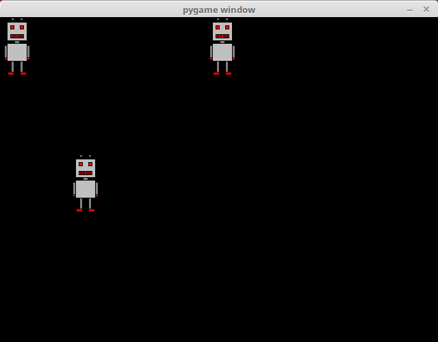
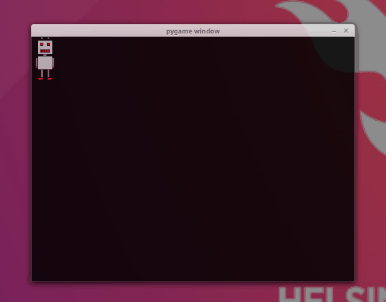
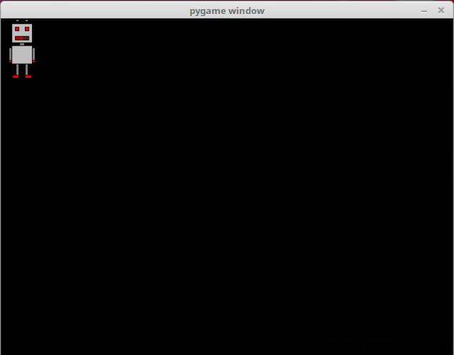
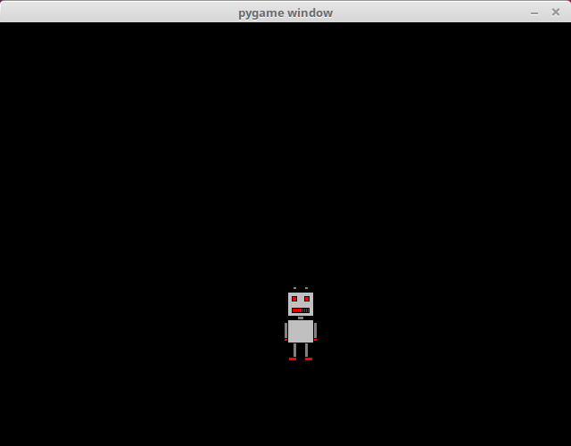
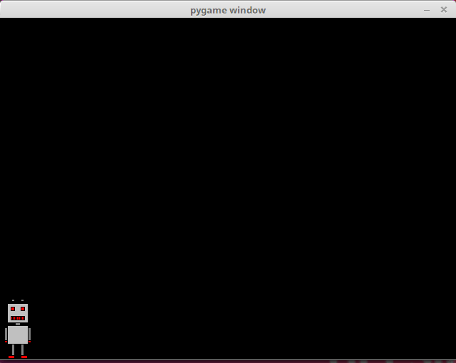
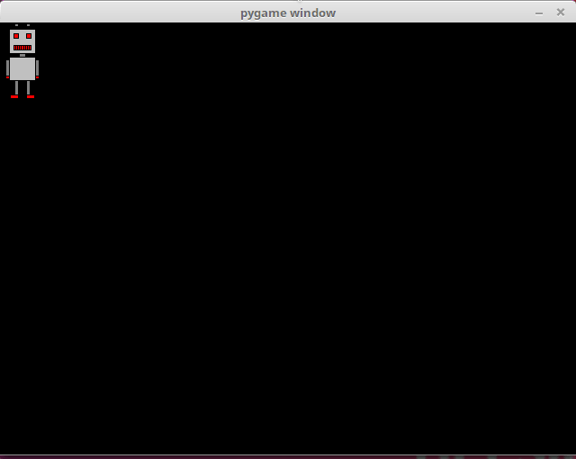
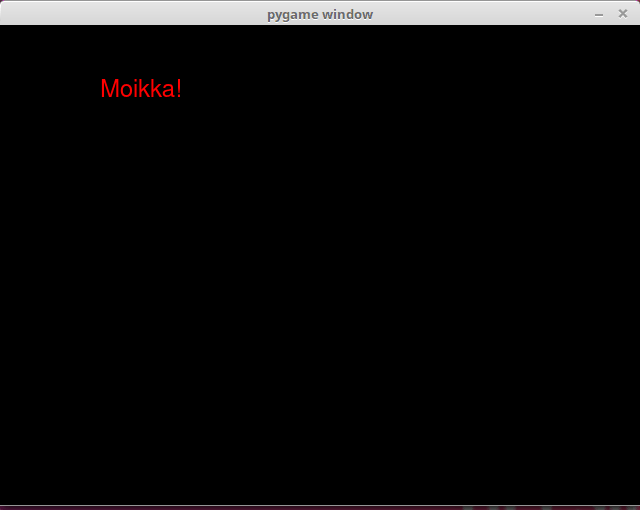

# Pygame
- Pygame is a Python library for programming games. It helps you create graphical elements, handle events from the keyboard and the mouse, and implement other features necessary in games.

## Source(s)
- These notes are taken from [Part 13](https://programming-25.mooc.fi/part-13) and [Part 14](https://programming-25.mooc.fi/part-14) of [Python Programming MOOC 2025](https://programming-25.mooc.fi/).

## Documentation
- [Pygame Documentation](https://www.pygame.org/news)

## Installing pygame
<details>
<summary><strong> Linux </strong></summary>

- Open a command line, type in `pip3 install pygame` an press `enter`.

    

    This should install the pygame library on your computer.
    
</details>

<details>
<summary><strong> Windows </strong></summary>

- Open the Windows terminal by opening the menu, typing in `cmd` and pressing `enter`:

    

    The command line interpreter window should open. Type in `pip3 install pygame` and press `enter`.

    This should install the pygame library on your computer.

    Installation may require system administrator privileges. If the above doesn't work, you can try running the terminal application as an administrator: open the Windows menu, find the CMD application, right-click it and choose "Run as administrator".

    Installing and accessing pygame requires that your Python installation is added to path, as instructed [here](https://www.mooc.fi/en/installation/vscode/#python3).

</details>

<details>
<summary><strong> Mac </strong></summary>

- Open the Terminal, for example through the magnifying glass symbol in the top right corner:

    

    The search tool should open. Type in `terminal` and press `enter`:

    

    Type in the following and press `enter`: 
    
    `pip3 install pygame`

    

    This should install the pygame library on your computer.

</details>

## Your first program
- Here is a simple program for checking your pygame installation works correctly:
    ```py
    import pygame

    pygame.init()
    window = pygame.display.set_mode((640, 480))

    window.fill((0,0,0))
    pygame.display.flip()

    while True:
        for event in pygame.event.get():
            if event.type == pygame.QUIT:
                exit()
    ```
    - When this program is run, it should display a window:
        
    - The program only consists of displaying a window, and it runs until the user closes the window.
        - Let's take a closer look at the steps required to achieve this. 
            - The first line takes the pygame library into use: `import pygame`. The next command `pygame.init` initializes the pygame modules, and the next one creates a window with the function `pygame.display.set_mode`.
                ```py
                pygame.init()
                window = pygame.display.set_mode((640, 480))
                ```
                - The `set_mode` function takes the window dimensions as an argument. The tuple `(640, 480)` indicates that the window is 640 pixels wide and 480 pixels high. The variable name `window` can be used later to access the window, for example to draw something in it. The following two commands do just that:
                    ```py
                    window.fill((0, 0, 0))
                    pygame.display.flip()
                    ```
                    - The `fill` method fills the window with the colour passed as an argument. In this case the colour is black, passed as an RGB value in the tuple `(0, 0, 0)`. The `pygame.display.flip` updates the contents of the window.
        - After these initialization commands the *main loop* of the program begins:
            ```py
            while True:
                for event in pygame.event.get():
                    if event.type == pygame.QUIT:
                        exit()
            ```
            - The main loop handles all events the operating system passes to the program. With each iteration the function `pygame.event.get` returns a list of any events collected since the previous iteration.
                - In the example above the program only handles events of type `pygame.QUIT`. This event is raised by, for example, clicking on the exit button in the corner of the window. If the `pygame.QUIT` event is raised, the program exits through the `exit` function.
                    - You can try and see what happens if your program doesn't handle the `pygame.QUIT` event. This should mean that clicking on the exit button does nothing, which would be confusing for the user. As the program is run from the command line, you can still stop it from the command line with `ctrl`+`c`.

## Add an image
- Let's add an image to the window:
    ```py
    import pygame

    pygame.init()
    window = pygame.display.set_mode((640, 480))

    robot = pygame.image.load("robot.png")

    window.fill((0, 0, 0))
    window.blit(robot, (100, 50))
    pygame.display.flip()

    while True:
        for event in pygame.event.get():
            if event.type == pygame.QUIT:
                exit()
    ```
    - The program uses this image of a robot, which is stored in the file `robot.png`:

        <p align="center">
            
        </p>

    - The file `robot.png` has to be in the same directory with the source code of the your program, or the program won't be able to find it.

    - The window should now look like this:

        

    - The function `pygame.image.load` loads the image in the file `robot.png` and stores a reference to it in the variable named `robot`. The method `blit` draws the image at the location `(100, 50)`, and the function `pygame.display.flip` updates the window contents, as before. The location `(100, 50)` means that the top left corner of the image is at that location within the window.

- In pygame the origo point `(0, 0)` is in the top left corner of the window. The x coordinates increase to the right, and the y coordinates increase downwards, so that the bottom right corner has the coordinates `(640, 480)`. This is contrary to how coordinates are usually handled in e.g. mathematics, but it is quite common in a programming context, and worth getting used to.

- Once you have loaded an image, you can use it many times within the same window. The following code draws the image of the robot at three different locations:
    ```py
    window.blit(robot, (0, 0))
    window.blit(robot, (300, 0))
    window.blit(robot, (100, 200))
    ```
    - The window should look like this as a result:

        

- Here we set the location of the image so that it lies at the centre of the window:
    ```py
    width = robot.get_width()
    height = robot.get_height()
    window.blit(robot, (320-width/2, 240-height/2))
    ```
    - The window should now look like this:

        

    - The method `get_width` returns the width of the image, and the method `get_height` returns its height, both in pixels. The centre of the window is at half its width and height, so at `(320, 240)`, which we can use to calculate a suitable location for the top left corner of the image, so that it lies exactly at the centre.

## Animation
- Many games have moving characters, so a logical next step is creating animations. We can create the illusion of movement by drawing the same image in different locations on the screen and timing the changes appropriately.

### Creating an animation
- The following code creates an animation where a robot moves from left to right in a pygame window:
    ```py
    import pygame

    pygame.init()
    window = pygame.display.set_mode((640, 480))

    robot = pygame.image.load("robot.png")

    x = 0
    y = 0
    clock = pygame.time.Clock()

    while True:
        for event in pygame.event.get():
            if event.type == pygame.QUIT:
                exit()

        window.fill((0, 0, 0))
        window.blit(robot, (x, y))
        pygame.display.flip()

        x += 1
        clock.tick(60)
    ```
    - When this is executed, the result should look like this:

        

    - Let's take a closer look at the commands involved. 
        - If we want to trace the movement of the image on the screen, we need to know its location, which is why we have two variables for the coordinates of the top left corner of the image:
            ```py
            x = 0
            y = 0
            ```
        - We also have a clock, which we use to make sure the speed of the animation is just right:
            ```py
            clock = pygame.time.Clock()
            ```
        - The main loop draws the image at its current location with each iteration:
            ```py
            window.fill((0, 0, 0))
            window.blit(robot, (x, y))
            pygame.display.flip()
            ```
            - First the method `fill` fills the window with black, as before. The colour is passed as a tuple containing the RGB values for the colour. In this case the argument is `(0, 0, 0)`, which means that all three components - red, green and blue - have value 0. Each component can have a value between 0 and 255. So, if we passed (255, 255, 255) as the argument, we'd get a white window, and with `(255, 0, 0)` we'd get a red window. RGB colour codes form the backbone of digital colouring, and there are many tools online for working with them, for example [RGB Color Codes Chart](https://www.rapidtables.com/web/color/RGB_Color.html).
            - After the window is filled with colour, the image is drawn at the given location with the `blit` method. Then the contents of the window are updated with the function `pygame.display.flip`.
        - Finally, the value stored in `x` is incremented, which makes the image move one pixel to the right with each iteration:
            ```py
            x += 1
            ```
        - The clock method `tick` is called at the end:
            ```py
            clock.tick(60)
            ```
            - The method `tick` takes care of the speed of the animation. The argument `60` dictates that the loop should be executed 60 times a second, which means that the image moves 60 pixels to the right each second. This approximately matches the FPS or frames per second value used with games.
            - In principle, the `tick` method makes sure that the animation runs at the same speed on every computer. If there was no such timing involved, the speed of the animation would depend on the speed of the computer.

### Bouncing off a wall
- The previous animation was otherwise excellent, but as the robot reached a wall, it just kept going out of sight. Let's make the robot bounce off the wall.
    ```py
    import pygame

    pygame.init()
    window = pygame.display.set_mode((640, 480))

    robot = pygame.image.load("robot.png")

    x = 0
    y = 0
    velocity = 1
    clock = pygame.time.Clock()

    while True:
        for event in pygame.event.get():
            if event.type == pygame.QUIT:
                exit()

        window.fill((0, 0, 0))
        window.blit(robot, (x, y))
        pygame.display.flip()
        
        x += velocity
        if velocity > 0 and x+robot.get_width() >= 640:
            velocity = -velocity
        if velocity < 0 and x <= 0:
            velocity = -velocity

        clock.tick(60)
    ```
    - Running the above code should look like this:

        

    - There is a new variable `velocity` which determines the direction of the movement. If the value is above zero, movement is to the right, and if it is below zero, movement is to the left. More precisely in this case, if the value is `1`, the robot moves to the right, and if it is `-1`, the robot moves to the left.
    - The following lines make the robot bounce off the side walls:
        ```py
        if velocity > 0 and x+robot.get_width() >= 640:
            velocity = -velocity
        if velocity < 0 and x <= 0:
            velocity = -velocity
        ```
        - If the velocity is above zero so that the robot is moving to the right, and the right edge if the image goes beyond the right edge of the window, the direction is reversed and the robot starts moving to the left. Similarly, if the velocity is below zero so that the robot is moving to the left, and the left edge of the image reaches the left edge of the window, the direction is again reversed and the robot starts moving to the right again.
        - This makes the robot move on a path from the left edge of the window to the right edge, and back to the left, and then to the right again, repeated ad infinitum.
        - This can be simplified to:
            ```py
            if x == 0 or x+robot.get_width() >= 640:
                velocity = -velocity
            ```

### Rotation
- Let's create one more animation. This time the robot should rotate in a circle around the centre of the window:
    ```py
    import pygame
    import math

    pygame.init()
    window = pygame.display.set_mode((640, 480))

    robot = pygame.image.load("robot.png")

    angle = 0
    clock = pygame.time.Clock()

    while True:
        for event in pygame.event.get():
            if event.type == pygame.QUIT:
                exit()

        x = 320+math.cos(angle)*100-robot.get_width()/2
        y = 240+math.sin(angle)*100-robot.get_height()/2

        window.fill((0, 0, 0))
        window.blit(robot, (x, y))
        pygame.display.flip()

        angle += 0.01
        clock.tick(60)
    ```
    - Running the above code should look like this:

        

    - Rotation in a relatively precise circle is achieved with the help of some basic trigonometric functions. The varible `angle` contains the angle of the robots location in relation to the centre of the window and the horizontal line running through it. The sine and cosine functions from the Python math library are used to calculate the coordinates of the robot's location:
        ```py
        x = 320+math.cos(angle)*100-robot.get_width()/2
        y = 240+math.sin(angle)*100-robot.get_height()/2
        ```
        - The robot rotates around a circle of radius 100 around the centre of the window. The hypotenuse in this scenario is the radius of the circle. The cosine function gives the length of the adjacent side of a right triangle in relation to the hypotenuse, which means that it gives us the `x` coordinate of the location. The sine function gives the length of the opposite side, i.e. the `y` coordinate. The location is then adjusted for the size of the image, so that the centre of the circle is at the centre of the window.
        - With each iteration the size of the `angle` is incremented by 0.01:llä. As we are using radians, a full circle is 2π, which equals about 6.28. It takes about 628 iterations for the robot to go a full circle, and at 60 iterations per second this takes just over 10 seconds.

## Events
- Thus far our main loops have only executed predetermined animations and reacted to only `pygame.QUIT` type events, even though the loop gets a list of all events from the operating system. Let's get to grips with some other types of events, then.

### Handling events
- This program prints out information about all the events passed by the operating system to the pygame program, while it is running:
    ```py
    import pygame

    pygame.init()
    window = pygame.display.set_mode((640, 480))

    while True:
        for event in pygame.event.get():
            print(event)
            if event.type == pygame.QUIT:
                exit()
    ```
    - Let's assume the program was left running for a while, and then the exit button was clicked. The program prints out the following info:
        ```
        <Event(4-MouseMotion {'pos': (495, 274), 'rel': (495, 274), 'buttons': (0, 0, 0), 'window': None})>
        <Event(4-MouseMotion {'pos': (494, 274), 'rel': (-1, 0), 'buttons': (0, 0, 0), 'window': None})>
        <Event(4-MouseMotion {'pos': (492, 274), 'rel': (-2, 0), 'buttons': (0, 0, 0), 'window': None})>
        <Event(4-MouseMotion {'pos': (491, 274), 'rel': (-1, 0), 'buttons': (0, 0, 0), 'window': None})>
        <Event(5-MouseButtonDown {'pos': (491, 274), 'button': 1, 'window': None})>
        <Event(6-MouseButtonUp {'pos': (491, 274), 'button': 1, 'window': None})>
        <Event(2-KeyDown {'unicode': 'a', 'key': 97, 'mod': 0, 'scancode': 38, 'window': None})>
        <Event(3-KeyUp {'key': 97, 'mod': 0, 'scancode': 38, 'window': None})>
        <Event(2-KeyDown {'unicode': 'b', 'key': 98, 'mod': 0, 'scancode': 56, 'window': None})>
        <Event(3-KeyUp {'key': 98, 'mod': 0, 'scancode': 56, 'window': None})>
        <Event(2-KeyDown {'unicode': 'c', 'key': 99, 'mod': 0, 'scancode': 54, 'window': None})>
        <Event(3-KeyUp {'key': 99, 'mod': 0, 'scancode': 54, 'window': None})>
        <Event(12-Quit {})>
        ```
        - The first few events concern mouse usage, ten there are some events from the keyboard, and finally the last event closes the program. Each event has at least a type, but they may also offer some other identifying info, such as the location of the mouse cursor or the key that was pressed.
        - You can look for event descriptions in the [pygame documentation](https://www.pygame.org/docs/ref/event.html), but it can sometimes be easier to print out events with the code above, and look for the event that occurs when something you want to react to happens.

### Keyboard events
- This program can process events where the user presses the arrow key either to the right or to the left on their keyboard. The program prints out which key was pressed.
    ```py
    import pygame

    pygame.init()
    window = pygame.display.set_mode((640, 480))

    while True:
        for event in pygame.event.get():
            if event.type == pygame.KEYDOWN:
                if event.key == pygame.K_LEFT:
                    print("left")
                if event.key == pygame.K_RIGHT:
                    print("right")

            if event.type == pygame.QUIT:
                exit()
    ```
    - The constants `pygame.K_LEFT` and `pygame.K_RIGHT` refer to the arrow keys to the left and right. The pgyame key constants for the different keys on a keyboard are listed in the [pygame documentation](https://www.pygame.org/docs/ref/key.html#key-constants-label).
    - For example, if the user presses the arrow key to the right twice, then the left one once, and then the right one once more, the program prints out:
        ```
        right
        right
        left
        right
        ```

- We now have all the tools needed to move a character, or *sprite*, on the screen to the right and left with the arrow keys. The following code will achieve this:
    ```py
    import pygame

    pygame.init()
    window = pygame.display.set_mode((640, 480))

    robot = pygame.image.load("robot.png")
    x = 0
    y = 480-robot.get_height()

    while True:
        for event in pygame.event.get():
            if event.type == pygame.KEYDOWN:
                if event.key == pygame.K_LEFT:
                    x -= 10
                if event.key == pygame.K_RIGHT:
                    x += 10

            if event.type == pygame.QUIT:
                exit()

        window.fill((0, 0, 0))
        window.blit(robot, (x, y))
        pygame.display.flip()
    ```
    - Depending on how you use your arrow keys, running the program could look like this:

        

    - In the code above we have the variables `x` and `y` which contain the coordinate location for the sprite. The variable `y` is set so that the sprite appears at the bottom of the window. The `y` value does not change throughout the execution of the program. The `x` value, however, increases by 10 whenever the user presses the arrow key to the right, and decreases by 10 whenever the left arrow key is pressed.
    - The program works otherwise quite well, but the key needs to be pressed again each time we want to move again. It would be better if the movement was continuous as the key was held down. The following program offfers this functionality:
    - The code now contains the variables `to_right` and `to_left`. These contain knowledge of whether the sprite should be moving to the right or to the left at any given moment. When the user presses down an arrow key, the value stored in the relevant variable becomes `True`. When the key is released, the value changes to `False`.
    - The clock is used to time the movements of the sprite, so that they potentially happen 60 times each second. If an arrow key is pressed, the sprite moves two pixels to the right or to the left. This means the sprite moves 120 pixels per second if the key is kept pressed down.

### Mouse events
- The following code reacts to events where a mouse button is pressed down while the cursor is within the window area:
    ```py
    import pygame

    pygame.init()
    window = pygame.display.set_mode((640, 480))

    while True:
        for event in pygame.event.get():
            if event.type == pygame.MOUSEBUTTONDOWN:
                print("you pressed the button number", event.button, "at location", event.pos)

            if event.type == pygame.QUIT:
                exit()
    ```
    The execution of this program should look more or less like this:
    ```py
    you pressed the button number 1 at location (82, 135)
    you pressed the button number 1 at location (369, 135)
    you pressed the button number 1 at location (269, 297)
    you pressed the button number 3 at location (515, 324)
    ```
    - Button number 1 refers to the left mouse button and button number 3 refers to the right mouse button.

- This next program combines mouse event handling and drawing an image on the screen. When the user presses a mouse button while the mouse cursor is within the bounds of the window, an image of a robot is drawn at that location.
    ```py
    import pygame

    pygame.init()
    window = pygame.display.set_mode((640, 480))

    robot = pygame.image.load("robot.png")

    while True:
        for event in pygame.event.get():
            if event.type == pygame.MOUSEBUTTONDOWN:
                x = event.pos[0]-robot.get_width()/2
                y = event.pos[1]-robot.get_height()/2

                window.fill((0, 0, 0))
                window.blit(robot, (x, y))
                pygame.display.flip()

            if event.type == pygame.QUIT:
                exit()
    ```
    - The execution of the program could look like this:

        

- The following program contains an animation where the robot sprite follows the mouse cursor.The location of the sprite is stored in the variables robot_x and robot_y. When the mouse moves, its location is stored in the variables target_x ja target_y. If the robot is not at this location, it moves to the approproate direction.
    ```py
    import pygame

    pygame.init()
    window = pygame.display.set_mode((640, 480))

    robot = pygame.image.load("robot.png")

    robot_x = 0
    robot_y = 0
    target_x = 0
    target_y = 0

    clock = pygame.time.Clock()

    while True:
        for event in pygame.event.get():
            if event.type == pygame.MOUSEMOTION:
                target_x = event.pos[0]-robot.get_width()/2
                target_y = event.pos[1]-robot.get_height()/2

            if event.type == pygame.QUIT:
                exit(0)

        if robot_x > target_x:
            robot_x -= 1
        if robot_x < target_x:
            robot_x += 1
        if robot_y > target_y:
            robot_y -= 1
        if robot_y < target_y:
            robot_y += 1

        window.fill((0, 0, 0))
        window.blit(robot, (robot_x, robot_y))
        pygame.display.flip()

        clock.tick(60)
    ```
    - The program's execution should look more or less like this:
        
        

## More pygame techniques

### The window title
- Your programs will look more professional if instead of "pygame window" the window title contains the actual name of the program.The title is set with the `pygame.display.set_caption` function:
    ```py
    pygame.display.set_caption("Great Adventure")
    ```

### Drawing shapes
- The following program draws a rectangle, a circle, and a line on the screen:
    ```py
    import pygame

    pygame.init()
    display = pygame.display.set_mode((640, 480))
    display.fill((0, 0, 0))

    pygame.draw.rect(display, (0, 255, 0), (50, 100, 200, 250))
    pygame.draw.circle(display, (255, 0, 0), (200, 150), 40)
    pygame.draw.line(display, (0, 0, 255), (80, 120), (300, 160), 2)

    pygame.display.flip()

    while True:
        for event in pygame.event.get():
            if event.type == pygame.QUIT:
                exit()
    ```
    - Running the above code should look like this:

        

### Drawing text
- Text in pygame is drawn in two steps: first we create an image containing the desired text, and then this image is drawn on the screen. It works like this:
    ```py
    import pygame

    pygame.init()
    display = pygame.display.set_mode((640, 480))
    display.fill((0, 0, 0))

    game_font = pygame.font.SysFont("Arial", 24)
    text = game_font.render("Moikka!", True, (255, 0, 0))
    display.blit(text, (100, 50))
    pygame.display.flip()

    while True:
        for event in pygame.event.get():
            if event.type == pygame.QUIT:
                exit()
    ```
    - Running the above code should look like this:
        
        

    - Here the method `pygame.font.SysFont` creates a font object, which uses the system font Arial in size 24. The the method `render` creates an image of the specified text in the given colour. This image is drawn on the window with the `blit` method, just as before.
    - Note: Different systems will have different fonts available. If the system this program is executed on doesn't have the Arial font, even though Arial is a very common font available on most systems, the default system font is used instead. If you need to have a specific font available for your game, you can include the font file in the game directory and specify its location for the `pygame.font.Font` method.
