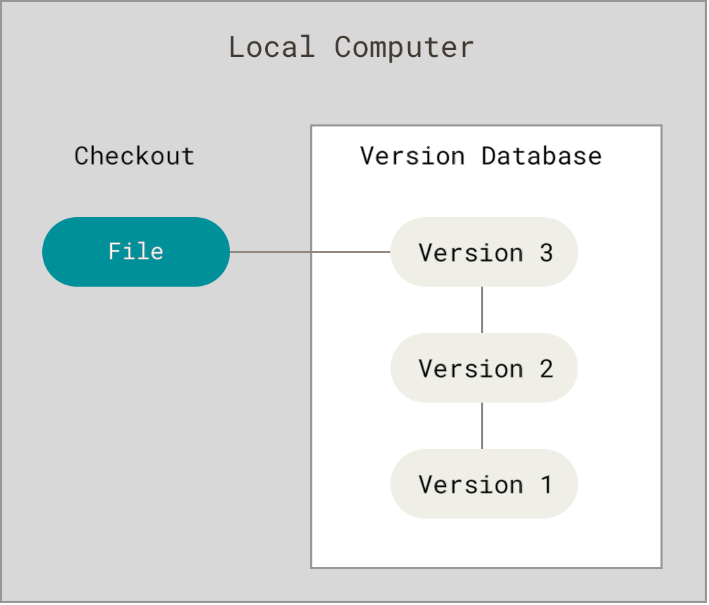
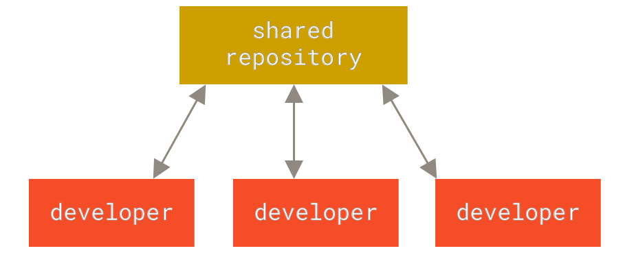
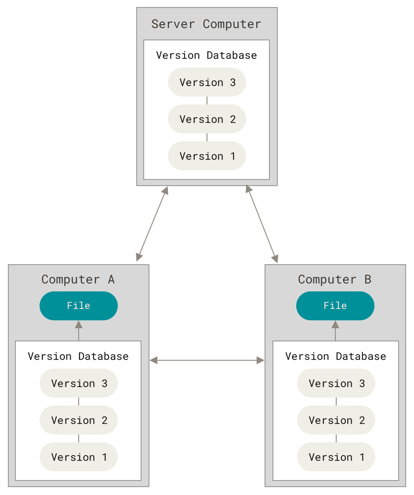
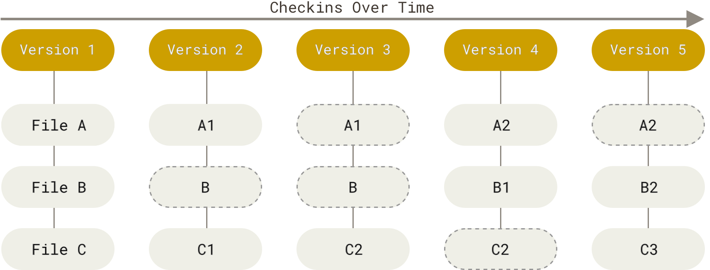

# Git

## Version Control
- Version control is a system that records changes to a file or set of files over time so that you can recall specific versions later.
- Local Version Control Systems
    - 
    - simple local database keeps all the changes to files under revision control
        - Revision Control System (RCS) is a good example of a LVCS
- Centralized Version Control Systems
    - 
    - have a single server that contains all the versioned files, and a number of clients that check out files from that central place
    - single point of failure
        - if server goes down, nobody can collaborate at all or save versioned changes to anything they’re working on
        - if the disk that the database is on gets corrupted, everything is lost unless there is a back-up
- Distributed Version Control Systems
    - 
    - Git belongs in this category
    - clients don’t just check out the latest snapshot of the files; rather, they fully mirror the repository, including its full history
    - if any server dies, and these systems were collaborating via that server, any of the client repositories can be copied back up to the server to restore it
    - every clone is really a full backup of all the data

## What Git Accomplishes
- speed
- simple design
- strong support for non-linear development (thousands of parallel branches)
- fully distributed
- able to handle large projects like the Linux kernel efficiently (speed and data size)

## How Git Works
- major difference between Git and any other VCS (Subversion and friends included) is the way Git thinks about its data
    - 
    - most other systems store information as a list of file-based changes. These other systems (CVS, Subversion, Perforce, and so on) think of the information they store as a set of files and the changes made to each file over time (this is commonly described as delta-based version control)
- thinks of its data more like a series of snapshots of a miniature filesystem
    - 
    - every time you commit, or save the state of your project, Git basically takes a picture of what all your files look like at that moment and stores a reference to that snapshot
    -  if files have not changed, Git doesn’t store the file again, just a link to the previous identical file it has already stored
    - Git thinks about its data more like a stream of snapshots
- most operations in Git need only local files and resources to operate
- everything in Git is checksummed before it is stored and is then referred to by that checksum
    - SHA-1 hash
        - 40-character string composed of hexadecimal characters (0–9 and a–f) and calculated based on the contents of a file or directory structure in Git
    - impossible to change the contents of any file or directory without Git knowing about it
    - can’t lose information in transit or get file corruption without Git being able to detect it
- Git stores everything in its database not by file name but by the hash value of its contents
- nearly all actions in Git only add data
- Git's States
    - Git has 3 main states that your files can be in
        - Modified: you have changed the file but have not committed it to your database yet
        - Staged: you have marked a modified file in its current version to go into your next commit snapshot
        - Committed:  the data is safely stored in your local database
    - If a particular version of a file is in the Git directory, it’s considered committed. If it has been modified and was added to the staging area, it is staged. And if it was changed since it was checked out but has not been staged, it is modified.
- 3 main states lead to three main sections of a Git project
    - 
    - working tree
        - a single checkout of one version of the project
        - these files are pulled out of the compressed database in the Git directory and placed on disk for you to use or modify
    - staging area
        - a file, generally contained in your Git directory, that stores information about what will go into your next commit
        - technical name in Git parlance is the “index”, but the phrase “staging area” works just as well
    - Git directory
        - where Git stores the metadata and object database for your project
        - most important part of Git, and it is what is copied when you clone a repository from another computer
- basic Git workflow
    1. You modify files in your working tree.
    2. You selectively stage just those changes you want to be part of your next commit, which adds only those changes to the staging area.
    3. You do a commit, which takes the files as they are in the staging area and stores that snapshot permanently to your Git directory.
- another basic Git-based workflow
    - Create a branch off from the main copy of files that you (and your collaborators) are working on.
    - Make edits to the files independently and safely on your own personal branch.
    - Let Git intelligently merge your specific changes back into the main copy of files, so that your changes don't impact other people's updates.
    - Let Git keep track of your and other people's changes, so you all stay working on the most up-to-date version of the project.

## Ways to use Git
- command-line tools or one of the many graphical user interfaces out there with varying capabilities
- command line is the only place you can run all Git commands

## GitHub
- cloud-based platform where you can store, share, and work together with others to write code
- Storing your code in a "repository" on GitHub allows you to:
    - Showcase or share your work.
    - Track and manage changes to your code over time.
    - Let others review your code, and make suggestions to improve it.
    - Collaborate on a shared project, without worrying that your changes will impact the work of your collaborators before you're ready to integrate them.
        - Collaborative working, one of GitHub’s fundamental features, is made possible by the open-source software, Git, upon which GitHub is built.
- How do Git and GitHub work together?
    - When you upload files to GitHub, you'll store them in a "Git repository." This means that when you make changes (or "commits") to your files in GitHub, Git will automatically start to track and manage your changes.
    - plenty of Git-related actions that you can complete on GitHub directly in your browser, such as creating a Git repository, creating branches, and uploading and editing files
    - most people work on their files locally (on their own computer), then continually sync these local changes—and all the related Git data—with the central "remote" repository on GitHub
        - plenty of tools to do this (ex: GitHub Desktop)
    - collaborative work using Git and GitHub
        - Once you start to collaborate with others and all need to work on the same repository at the same time, you’ll continually:
            - Pull all the latest changes made by your collaborators from the remote repository on GitHub.
            - Push back your own changes to the same remote repository on GitHub.
        - Git figures out how to intelligently merge this flow of changes, and GitHub helps you manage the flow through features such as "pull requests."
    
## Setting Up Git with GitHub
- [Install Git](https://git-scm.com/book/en/v2/Getting-Started-Installing-Git)
- To get started, configure Git by running these commands with your personal information. Make sure to include the quotes.
    - for user.name, just set your name
    - for user.email, use your primary GitHub email or noreply GitHub email if you set your emails to private
```
git config --global user.name "Your Name"
git config --global user.email "yourname@example.com"
```
- GitHub recently changed the default branch on new repositories from master to main. Change the default branch for Git using this command:
```
git config --global init.defaultBranch main
```
- set default branch reconiliation behavior to merging
```
git config --global pull.rebase false
```
- To verify that things are working properly, enter these commands and verify whether the output matches your name and email address.
```
git config --get user.name
git config --get user.email
```
- For Mac Users:
    - Run these two commands to tell Git to ignore .DS_Store files, which are automatically created when you use Finder to look into a folder. .DS_Store files are invisible to the user and hold custom attributes or metadata (like thumbnails) for the folder, and if you don’t configure Git to ignore them, pesky .DS_Store files will show up in your commits. Remember to copy and paste each of these commands into your terminal.
        ```
        echo .DS_Store >> ~/.gitignore_global
        git config --global core.excludesfile ~/.gitignore_global
        ```
- Create SSH Key
    - If you have already setup an ssh key pair with GitHub on a different machine, GitHub allows you to have multiple key pairs associated with your account. You can just follow these instructions again to set up another key pair and register it with GitHub.
    - An SSH key is a cryptographically secure identifier. It’s like a really long password used to identify your machine. GitHub uses SSH keys to allow you to upload to your repository without having to type in your username and password every time.
    1. First, we need to see if you have an Ed25519 algorithm SSH key already installed. Type this into the terminal and check the output with the information below:
        - For Mac/Linux:
            ```
            ls ~/.ssh/id_ed25519.pub
            ```
        - For Windows Command Prompt:
            ```
            type %USERPROFILE%\.ssh\id_ed25519.pub
            ```
        - If a message appears in the console containing the text “No such file or directory”, then you do not yet have an Ed25519 SSH key, and you will need to create one. If no such message has appeared in the console output, you can proceed to step 2.4.
    2. To create a new SSH key, run the following command inside your terminal:
        ```
        ssh-keygen -t ed25519
        ```
        - When it prompts you for a location to save the generated key, just push Enter. Next, it will ask you for a password. This password is used to encrypt the private SSH key that is stored on your computer and you will be required to enter this password every time you use SSH with these keys. If you don’t use a password, the private key will be readable by anyone who has access to your computer and will be able to modify all your GitHub repositories. Enter one if you wish, but it’s not required. If you choose not to use a password, just hit Enter without typing anything.
- Link SSH key with GitHub
    - Now, you need to tell GitHub what your SSH key is so that you can push your code without typing in a password every time.
    1. First, you’ll navigate to where GitHub receives our SSH key. Log into GitHub and click on your profile picture in the top right corner. Then, click on Settings in the drop-down menu.
    2. Next, on the left-hand side, click SSH and GPG keys. Then, click the green button in the top right corner that says New SSH Key. Name your key something that is descriptive enough for you to remember what device this SSH key came from, for example linux-ubuntu. Leave this window open while you do the next steps.
    3. Now you need to copy your public SSH key. To do this, we’re going to use a command called cat to read the file to the console. (Note that the .pub file extension is important in this case.)
        - For Linux/Mac:
            ```
            cat ~/.ssh/id_ed25519.pub
            ```
        - For Windows Command Prompt:
            ```
            type %USERPROFILE%\.ssh\id_ed25519.pub
            ```
    4. Highlight and copy the entire output from the command. If you followed the instructions above, the output will likely begin with ssh-ed25519 and end with your username@hostname.
    5. Now, go back to GitHub in your browser window and paste the key you copied into the key field. Keep the key type as Authentication Key and then, click Add SSH key. You’re done! You’ve successfully added your SSH key!
- Test key
    - Follow the [GitHub directions for testing your SSH connection](https://docs.github.com/en/authentication/connecting-to-github-with-ssh/testing-your-ssh-connection?platform=linux). Make sure the fingerprint output in the terminal matches [one of the four GitHub’s public fingerprints](https://docs.github.com/en/authentication/keeping-your-account-and-data-secure/githubs-ssh-key-fingerprints).
    - You should see this response in your terminal: Hi username! You’ve successfully authenticated, but GitHub does not provide shell access. Don’t let GitHub’s lack of providing shell access trouble you. If you see this message, you’ve successfully added your SSH key and you can move on. If the output doesn’t correctly match up, then try going through these steps again.

## Basic Git Workflow (Common Git Commands)
- Cloning GitHub repository
    1. To get ready to copy (clone) this repository onto your local machine, click the green “Code” button, which should be to the right of the button displaying the current branch (typically it will display the main branch). Then select the SSH option in the “Clone” section, and copy the line below it.
    2. You can choose an existing directory for your project or make a new directory using the command line:
        ```
        mkdir name
        cd name/
        ```
        - Your home folder is represented by ~. Note that depending on your OS, there may be some home directory variation - sometimes ~ stands for /Users/your_username and sometimes it stands for /home/your_username. If you’re not sure if you’re in your home folder, just type cd ~. Once it’s made, move into it with the cd command.
        - For cd, if your path has a name with a space, place a backtick (`) at the end of the word before the space.
    3. Use this command along with the SSH line that you copied to clone your GitHub repository into the current directory:
        ```
        git clone git@github.com:USER-NAME/REPOSITORY-NAME.git
        ```
    4. You have successfully connected the repository you created on GitHub to your local machine. To test this, cd into the repository folder (which has the same name as your repository on GitHub) and then enter `git remote -v` on your command line. You should see an output similar to the following, where USER-NAME is your GitHub username:
        ```
        origin  git@github.com:USER-NAME:git_test.git (fetch)
        origin  git@github.com:USER-NAME:git_test.git (push) 
        ```
        - This displays the URL of the repository you created on GitHub, which is the remote for your local copy. You may have also noticed the word origin at the start of the git remote -v output, which is the name of your remote connection. The name “origin” is both the default and the convention for the remote repository, but it could have just as easily been named “party-parrot” or “dancing-banana”.
- Workflow
    - creating a file, not apart of Git (just a basic command line command)
        - For Mac/Linux:
            ```
            touch fileName.fileExtension
            ```
        - For Windows Command Prompt:
            ```
            type nul > fileName.fileExtension
            ```
        - For Windows VSCode Terminal (PowerShell):
            ```
            New-Item fileName.fileExtension -ItemType File
            ```
    - deleting/removing a file, not apart of Git (just a basic command line command)
        - For Mac/Linux:
            ```
            rm fileName.fileExtension
            ```
            - you can add -f in the middle to avoid prompts
        - For Windows Command Prompt:
            ```
            del fileName.fileExtension
            ```
        - For Windows VSCode Terminal (PowerShell):
            ```
            Remove-Item fileName.fileExtension
            ```
            - use -Force at the end if needed
    - checking current state of working directory
        ```
        git status
        ```
        - new files that are only in your working directory will be under a section called "Untracked files"
        - files appearing under “Changes not staged for commit” are files that are already in the repository and have been modified but not yet committed
    - adding a file to the staging area
        - The staging area is part of the two-step process for making a commit in Git. Think of the staging area as a “waiting room” for your changes until you commit them.
        ```
        git add fileName.fileExtension
        ```
        - Once executed, the file will be shown in a section titled "Changes to be committed" if git status is called.
    - adding all modified (new, edited, or deleted) files to the staging area
        ``` 
        git add .
        ```
    - committing all files in the staging area to local Git repository
        ```
        git commit -m "your commit message which will appear in git log"
        ```
        - If that was the only file you needed to commit, then git status will display “nothing to commit, working tree clean” if it is called again.
            - If you call git status, you may see “Your branch is ahead of ‘origin/main’ by 1 commit”. It just means that you now have newer snapshots than what is on your remote repository.
    - checking logs to see who has made commits, what commits they made, and when
        ```
        git log
        ```
        - If your terminal is stuck in a screen with (END) at the bottom, just press “q” to escape.
    - launching current directory in VSCode, not apart of Git
        ```
        code .
        ```
        - 
    - opening the terminal in VSCode, not apart of Git
        ```
        ctrl + `
        ```
    
    