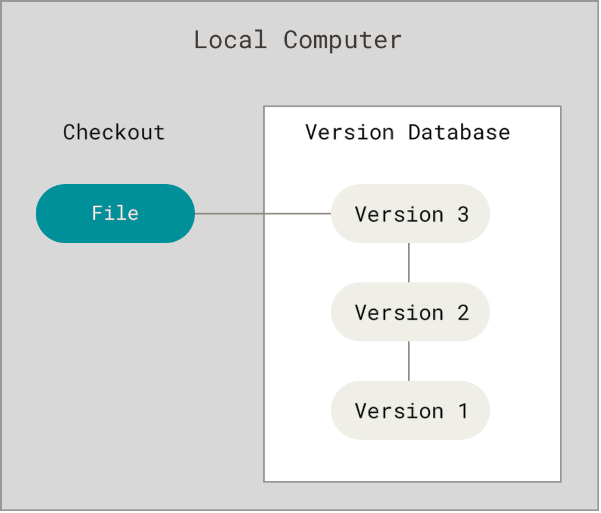
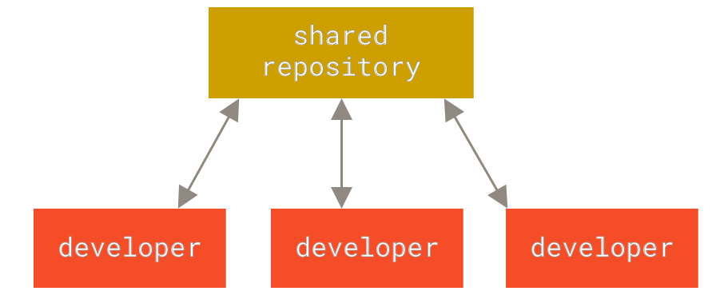
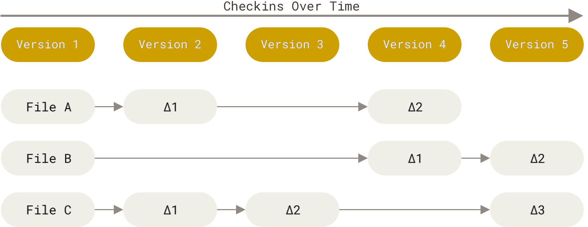

# Git

## Version Control
- Version control is a system that records changes to a file or set of files over time so that you can recall specific versions later.
- Local Version Control Systems
    - 
    - simple local database keeps all the changes to files under revision control
        - Revision Control System (RCS) is a good example of a LVCS
- Centralized Version Control Systems
    - 
    - have a single server that contains all the versioned files, and a number of clients that check out files from that central place
    - single point of failure
        - if server goes down, nobody can collaborate at all or save versioned changes to anything they’re working on
        - if the disk that the database is on gets corrupted, everything is lost unless there is a back-up
- Distributed Version Control Systems
    - 
    - Git belongs in this category
    - clients don’t just check out the latest snapshot of the files; rather, they fully mirror the repository, including its full history
    - if any server dies, and these systems were collaborating via that server, any of the client repositories can be copied back up to the server to restore it
    - every clone is really a full backup of all the data

## What Git Accomplishes
- speed
- simple design
- strong support for non-linear development (thousands of parallel branches)
- fully distributed
- able to handle large projects like the Linux kernel efficiently (speed and data size)

## How Git Works
- major difference between Git and any other VCS (Subversion and friends included) is the way Git thinks about its data
    - 
    - most other systems store information as a list of file-based changes. These other systems (CVS, Subversion, Perforce, and so on) think of the information they store as a set of files and the changes made to each file over time (this is commonly described as delta-based version control)
- thinks of its data more like a series of snapshots of a miniature filesystem
    - 
    - every time you commit, or save the state of your project, Git basically takes a picture of what all your files look like at that moment and stores a reference to that snapshot
    -  if files have not changed, Git doesn’t store the file again, just a link to the previous identical file it has already stored
    - Git thinks about its data more like a stream of snapshots
- most operations in Git need only local files and resources to operate
- everything in Git is checksummed before it is stored and is then referred to by that checksum
    - SHA-1 hash
        - 40-character string composed of hexadecimal characters (0–9 and a–f) and calculated based on the contents of a file or directory structure in Git
    - impossible to change the contents of any file or directory without Git knowing about it
    - can’t lose information in transit or get file corruption without Git being able to detect it
- Git stores everything in its database not by file name but by the hash value of its contents
- nearly all actions in Git only add data
- Git's States
    - Git has 3 main states that your files can be in
        - Modified: you have changed the file but have not committed it to your database yet
        - Staged: you have marked a modified file in its current version to go into your next commit snapshot
        - Committed:  the data is safely stored in your local database
    - If a particular version of a file is in the Git directory, it’s considered committed. If it has been modified and was added to the staging area, it is staged. And if it was changed since it was checked out but has not been staged, it is modified.
- 3 main states lead to three main sections of a Git project
    - 
    - working tree
        - a single checkout of one version of the project
        - these files are pulled out of the compressed database in the Git directory and placed on disk for you to use or modify
    - staging area
        - a file, generally contained in your Git directory, that stores information about what will go into your next commit
        - technical name in Git parlance is the “index”, but the phrase “staging area” works just as well
    - Git directory
        - where Git stores the metadata and object database for your project
        - most important part of Git, and it is what is copied when you clone a repository from another computer
- basic Git workflow
    1. You modify files in your working tree.
    2. You selectively stage just those changes you want to be part of your next commit, which adds only those changes to the staging area.
    3. You do a commit, which takes the files as they are in the staging area and stores that snapshot permanently to your Git directory.
- another basic Git-based workflow
    - Create a branch off from the main copy of files that you (and your collaborators) are working on.
    - Make edits to the files independently and safely on your own personal branch.
    - Let Git intelligently merge your specific changes back into the main copy of files, so that your changes don't impact other people's updates.
    - Let Git keep track of your and other people's changes, so you all stay working on the most up-to-date version of the project.

## Ways to use Git
- command-line tools or one of the many graphical user interfaces out there with varying capabilities
- command line is the only place you can run all Git commands

## GitHub
- cloud-based platform where you can store, share, and work together with others to write code
- Storing your code in a "repository" on GitHub allows you to:
    - Showcase or share your work.
    - Track and manage changes to your code over time.
    - Let others review your code, and make suggestions to improve it.
    - Collaborate on a shared project, without worrying that your changes will impact the work of your collaborators before you're ready to integrate them.
        - Collaborative working, one of GitHub’s fundamental features, is made possible by the open-source software, Git, upon which GitHub is built.
- How do Git and GitHub work together?
    - When you upload files to GitHub, you'll store them in a "Git repository." This means that when you make changes (or "commits") to your files in GitHub, Git will automatically start to track and manage your changes.
    - plenty of Git-related actions that you can complete on GitHub directly in your browser, such as creating a Git repository, creating branches, and uploading and editing files
    - most people work on their files locally (on their own computer), then continually sync these local changes—and all the related Git data—with the central "remote" repository on GitHub
        - plenty of tools to do this (ex: GitHub Desktop)
    - collaborative work using Git and GitHub
        - Once you start to collaborate with others and all need to work on the same repository at the same time, you’ll continually:
            - Pull all the latest changes made by your collaborators from the remote repository on GitHub.
            - Push back your own changes to the same remote repository on GitHub.
        - Git figures out how to intelligently merge this flow of changes, and GitHub helps you manage the flow through features such as "pull requests."
    
## Setting Up Git with GitHub
- [Install Git](https://git-scm.com/book/en/v2/Getting-Started-Installing-Git)
- To get started, configure Git by running these commands with your personal information. Make sure to include the quotes.
    - for user.name, just set your name
    - for user.email, use your primary GitHub email or noreply GitHub email if you set your emails to private
```
git config --global user.name "Your Name"
git config --global user.email "yourname@example.com"
```
- GitHub recently changed the default branch on new repositories from master to main. Change the default branch for Git using this command:
```
git config --global init.defaultBranch main
```
- set default branch reconiliation behavior to merging
```
git config --global pull.rebase false
```
- To verify that things are working properly, enter these commands and verify whether the output matches your name and email address.
```
git config --get user.name
git config --get user.email
```
- For Mac Users:
    - Run these two commands to tell Git to ignore .DS_Store files, which are automatically created when you use Finder to look into a folder. .DS_Store files are invisible to the user and hold custom attributes or metadata (like thumbnails) for the folder, and if you don’t configure Git to ignore them, pesky .DS_Store files will show up in your commits. Remember to copy and paste each of these commands into your terminal.
        ```
        echo .DS_Store >> ~/.gitignore_global
        git config --global core.excludesfile ~/.gitignore_global
        ```
- Create SSH Key
    - If you have already setup an ssh key pair with GitHub on a different machine, GitHub allows you to have multiple key pairs associated with your account. You can just follow these instructions again to set up another key pair and register it with GitHub.
    - An SSH key is a cryptographically secure identifier. It’s like a really long password used to identify your machine. GitHub uses SSH keys to allow you to upload to your repository without having to type in your username and password every time.
    1. First, we need to see if you have an Ed25519 algorithm SSH key already installed. Type this into the terminal and check the output with the information below:
        - For Mac/Linux:
            ```
            ls ~/.ssh/id_ed25519.pub
            ```
        - For Windows Command Prompt:
            ```
            type %USERPROFILE%\.ssh\id_ed25519.pub
            ```
        - If a message appears in the console containing the text “No such file or directory”, then you do not yet have an Ed25519 SSH key, and you will need to create one. If no such message has appeared in the console output, you can proceed to step 2.4.
    2. To create a new SSH key, run the following command inside your terminal:
        ```
        ssh-keygen -t ed25519
        ```
        - When it prompts you for a location to save the generated key, just push Enter. Next, it will ask you for a password. This password is used to encrypt the private SSH key that is stored on your computer and you will be required to enter this password every time you use SSH with these keys. If you don’t use a password, the private key will be readable by anyone who has access to your computer and will be able to modify all your GitHub repositories. Enter one if you wish, but it’s not required. If you choose not to use a password, just hit Enter without typing anything.
- Link SSH key with GitHub
    - Now, you need to tell GitHub what your SSH key is so that you can push your code without typing in a password every time.
    1. First, you’ll navigate to where GitHub receives our SSH key. Log into GitHub and click on your profile picture in the top right corner. Then, click on Settings in the drop-down menu.
    2. Next, on the left-hand side, click SSH and GPG keys. Then, click the green button in the top right corner that says New SSH Key. Name your key something that is descriptive enough for you to remember what device this SSH key came from, for example linux-ubuntu. Leave this window open while you do the next steps.
    3. Now you need to copy your public SSH key. To do this, we’re going to use a command called cat to read the file to the console. (Note that the .pub file extension is important in this case.)
        - For Linux/Mac:
            ```
            cat ~/.ssh/id_ed25519.pub
            ```
        - For Windows Command Prompt:
            ```
            type %USERPROFILE%\.ssh\id_ed25519.pub
            ```
    4. Highlight and copy the entire output from the command. If you followed the instructions above, the output will likely begin with ssh-ed25519 and end with your username@hostname.
    5. Now, go back to GitHub in your browser window and paste the key you copied into the key field. Keep the key type as Authentication Key and then, click Add SSH key. You’re done! You’ve successfully added your SSH key!
- Test key
    - Follow the [GitHub directions for testing your SSH connection](https://docs.github.com/en/authentication/connecting-to-github-with-ssh/testing-your-ssh-connection?platform=linux). Make sure the fingerprint output in the terminal matches [one of the four GitHub’s public fingerprints](https://docs.github.com/en/authentication/keeping-your-account-and-data-secure/githubs-ssh-key-fingerprints).
    - You should see this response in your terminal: Hi username! You’ve successfully authenticated, but GitHub does not provide shell access. Don’t let GitHub’s lack of providing shell access trouble you. If you see this message, you’ve successfully added your SSH key and you can move on. If the output doesn’t correctly match up, then try going through these steps again.

## Basic Git Workflow (Common Git Commands)
- Cloning GitHub repository
    1. To get ready to copy (clone) this repository onto your local machine, click the green “Code” button, which should be to the right of the button displaying the current branch (typically it will display the main branch). Then select the SSH option in the “Clone” section, and copy the line below it.
    2. You can choose an existing directory for your project or make a new directory using the command line:
        ```
        mkdir name
        cd name/
        ```
        - Your home folder is represented by ~. Note that depending on your OS, there may be some home directory variation - sometimes ~ stands for /Users/your_username and sometimes it stands for /home/your_username. If you’re not sure if you’re in your home folder, just type cd ~. Once it’s made, move into it with the cd command.
        - For cd, if your path has a name with a space, place a backtick (`) at the end of the word before the space.
    3. Use this command along with the SSH line that you copied to clone your GitHub repository into the current directory:
        ```
        git clone git@github.com:USER-NAME/REPOSITORY-NAME.git
        ```
    4. You have successfully connected the repository you created on GitHub to your local machine. To test this, cd into the repository folder (which has the same name as your repository on GitHub) and then enter `git remote -v` on your command line. You should see an output similar to the following, where USER-NAME is your GitHub username:
        ```
        origin  git@github.com:USER-NAME:git_test.git (fetch)
        origin  git@github.com:USER-NAME:git_test.git (push) 
        ```
        - This displays the URL of the repository you created on GitHub, which is the remote for your local copy. You may have also noticed the word origin at the start of the git remote -v output, which is the name of your remote connection. The name “origin” is both the default and the convention for the remote repository, but it could have just as easily been named “party-parrot” or “dancing-banana”.
- Workflow
    - Basic Git syntax: `program | action | destination`
    - creating a file, not apart of Git (just a basic command line command)
        - For Mac/Linux:
            ```
            touch fileName.fileExtension
            ```
        - For Windows Command Prompt:
            ```
            type nul > fileName.fileExtension
            ```
        - For Windows VSCode Terminal (PowerShell):
            ```
            New-Item fileName.fileExtension -ItemType File
            ```
    - deleting/removing a file, not apart of Git (just a basic command line command)
        - For Mac/Linux:
            ```
            rm fileName.fileExtension
            ```
            - you can add -f in the middle to avoid prompts
        - For Windows Command Prompt:
            ```
            del fileName.fileExtension
            ```
        - For Windows VSCode Terminal (PowerShell):
            ```
            Remove-Item fileName.fileExtension
            ```
            - use -Force at the end if needed
    - downloading commits, files, and refs from a remote repository into your local repo
        ```
        git fetch
        ```
        - Use this in conjunction with git status to see how your local repo differs from the remote repo (e.g. GitHub).
    - checking current state of working directory
        ```
        git status
        ```
        - new files that are only in your working directory will be under a section called "Untracked files"
        - files appearing under “Changes not staged for commit” are files that are already in the repository and have been modified but not yet committed
    - adding a file to the staging area
        - The staging area is part of the two-step process for making a commit in Git. Think of the staging area as a “waiting room” for your changes until you commit them.
        ```
        git add fileName.fileExtension
        ```
        - Once executed, the file will be shown in a section titled "Changes to be committed" if git status is called.
    - adding all modified (new, edited, or deleted) files to the staging area
        ``` 
        git add .
        ```
    - committing snapshot in the staging area to local Git repository
        ```
        git commit -m "your commit message which will appear in git log"
        ```
        - If that was the only file you needed to commit, then git status will display “nothing to commit, working tree clean” if it is called again.
            - If you call git status, you may see “Your branch is ahead of ‘origin/main’ by 1 commit”. It just means that you now have newer snapshots than what is on your remote repository.
        - If you are using Visual Studio Code (and you should be if you’re following this curriculum), there’s a way to ensure that if you use git commit without the message flag (-m), you won’t get stuck writing your commit message in Vim. The following command will set this configuration:
            ```
            git config --global core.editor "code --wait"
            ```
            - Once you run that command, you will be able to choose to use either `git commit -m "your message here"` or `git commit` to type your message with Visual Studio Code!
            - To make a commit with Visual Studio Code as the text editor, just type git commit. After you hit `Enter` a new tab in VS Code will open for you to write your commit message. You may provide more details on multiple lines as part of your commit message. After typing your commit message, save it `Ctrl` + `S` (Mac: `Cmd` + `S`) and close the tab. If you return to the command line, you will see your commit message and a summary of your changes.
        - [Check out this document about conventions for commit messages].(https://www.conventionalcommits.org/en/v1.0.0/)
    - checking logs to see who has made commits, what commits they made, and when
        ```
        git log
        ```
        - If your terminal is stuck in a screen with (END) at the bottom, just press “q” to escape.
        - To get a flattened view, use: `git log --oneline --abbrev-commit --all`.
            - The `--graph` option shows a more detailed version: `git log --oneline --abbrev-commit --all --graph`
            - The `--decorate` option will show branch and tag labels: `git log --oneline --abbrev-commit --all --graph --decorate`.
            - The `--color` option will pretty up the display a bit more: `git log --oneline --abbrev-commit --all --graph --decorate --color`
    - launching current directory in VSCode, not apart of Git
        ```
        code .
        ```
        - 
    - opening the terminal in VSCode, not apart of Git
        ```
        ctrl + `
        ```
    - pushing work to remote repository (e.g. GitHub)
        ```
        git push
        ```
        - This is a shorthand. The full command should be `git push origin main`, but it is okay since you are not dealing with another branch (other than main) or a different remote.
        - If you run git status, it should display Your branch is up to date with 'origin/main'.
    - getting latest version from remote repository (e.g. GitHub)
        ```
        git pull
        ```

## Other Git Commands (Quick Reference)
- Garbage collection:
    ```
    git gc
    ```
    - Starting from every branch and every tag, Git walks back through the graph, building a list of every commit it can reach. Once it's reached the end of every path, it deletes all the commits it didn't visit.

- Create a new branch:
    ```
    git checkout -b new-branch-name
    ```
    - `-b` flag stands for "branch", and it ensures that you automatically switch to the new branch that was created.
    - To switch back to the `main` branch or an existing branch, `-b` is not needed. Here's an example of switching back to the `main` branch:
        ```
        git checkout main
        ```
    Or:
    ```
    git branch new-branch-name
    ```

- Switch to another branch:
    ```
    git checkout branch-name
    ```

- Merge other branch into current branch:
    ```
    git merge other-branch
    ```
    - Make sure you're in the branch you want the other branch to merge into.

- Delete a branch:
    - For local repository:
        ```
        git branch -d branch-name
        ```
        - Use `-D` instead if the branch has not yet been merged into the `main` branch.
    - For remote repository:
        ```
        git push origin --delete
        ```

- List all branches:
    ```
    git branch
    ```
    - The branch that you're in will have a `*` next to it.

- Amend the last commit:
    ```
    git commit --amend
    ```
    - This should be run after you have added the other items that you want to add to the last commit to the staging area.

- Commands that change history like `git revert`, `git push --force`, `git rebase` and `git reset` are very complex commands, so please check out the "Changing History" section for how they work and how to use them. That section will also cover `squash` and how to split commits. I will, however, show a quick reference for how to hard reset below:
    - Hard reset to a specific savepoint (branch/commit):
        ```
        git reset --hard savepoint
        ```
        - A savepoint can be anything that Git can turn into a SHA-1 hash. So you could use but are not limited to:
            - Branch names
            - Tags
            - Relative references like HEAD^, HEAD^^, or HEAD~3
            - partial SHA-1 hashes like 8d434382 (you just have to provide enough initial digits to be unique; Git will fill in the rest for you)
            - SHA-1 hashes like 8d434382d9420940be260199a8a058cf468d9037 (these are very easy for Git to turn into SHA-1 hashes!). Note that you can obtain the SHA-1 hash of a commit using `git log`.

- Building a new commit with the same change from another commit:
    ```
    git cherry-pick commit-id
    ```
    - [What `git cherry-pick` does, basically, is take a commit from somewhere else, and "play it back" wherever you are right now. Because this introduces the same change with a different parent, Git builds a new commit with a different ID.](https://think-like-a-git.net/sections/rebase-from-the-ground-up/cherry-picking-explained.html)

- Check out the "Contributing to a Repo" for commands used to contribute to repos that you do not own.

## Git Best Practices
- Two helpful best practices to consider are atomic commits and leveraging those atomic commits to make your commit messages more useful to future collaborators.
    - atomic commit: a commit that includes changes related to only one feature or task of your program
        - Two main reasons for doing this:
            1. if something you change turns out to cause some problems, it is easy to revert the specific change without losing other changes
            2. it enables you to write better commit messages

## Ignoring Files
- Often, you’ll have a class of files that you don’t want Git to automatically add or even show you as being untracked. These are generally automatically generated files such as log files or files produced by your build system. In such cases, you can create a file listing patterns to match them named `.gitignore`.

- Example `.gitignore` file:
    ```bash
    $ cat .gitignore
    *.[oa]
    *~
    ```
    - The first line tells Git to ignore any files ending in “.o” or “.a” — object and archive files that may be the product of building your code. The second line tells Git to ignore all files whose names end with a tilde (`~`), which is used by many text editors such as Emacs to mark temporary files. You may also include a log, tmp, or pid directory; automatically generated documentation; and so on. Setting up a `.gitignore` file for your new repository before you get going is generally a good idea so you don’t accidentally commit files that you really don’t want in your Git repository.

- The rules for the patterns you can put in the `.gitignore` file are as follows:
    - Blank lines or lines starting with `#` are ignored.
    - Standard glob patterns work, and will be applied recursively throughout the entire working tree.
    - You can start patterns with a forward slash (`/`) to avoid recursivity.
    - You can end patterns with a forward slash (`/`) to specify a directory.
    - You can negate a pattern by starting it with an exclamation point (`!`).

    Glob patterns are like simplified regular expressions that shells use. An asterisk (`*`) matches zero or more characters; `[abc]` matches any character inside the brackets (in this case a, b, or c); a question mark (`?`) matches a single character; and brackets enclosing characters separated by a hyphen (`[0-9]`) matches any character between them (in this case 0 through 9). You can also use two asterisks to match nested directories; `a/**/z` would match `a/z`, `a/b/z`, `a/b/c/z`, and so on.

- Another example `.gitignore` file:
    ```
    # ignore all .a files
    *.a

    # but do track lib.a, even though you're ignoring .a files above
    !lib.a

    # only ignore the TODO file in the current directory, not subdir/TODO
    /TODO

    # ignore all files in any directory named build
    build/

    # ignore doc/notes.txt, but not doc/server/arch.txt
    doc/*.txt

    # ignore all .pdf files in the doc/ directory and any of its subdirectories
    doc/**/*.pdf
    ```

- GitHub maintains a fairly comprehensive list of good `.gitignore` file examples for dozens of projects and languages at <https://github.com/github/gitignore> if you want a starting point for your project.

- In the simple case, a repository might have a single `.gitignore` file in its root directory, which applies recursively to the entire repository. However, it is also possible to have additional `.gitignore` files in subdirectories. The rules in these nested `.gitignore` files apply only to the files under the directory where they are located. The Linux kernel source repository has 206 `.gitignore` files. See `man gitignore` for more details on multiple `.gitignore` files.

### Removing an already cached file or directory
- To remove a file that has already been checked in, simply run:
    ```
    git rm --cached FILENAME
    ```
    - For directories, add a `-r` flag, which stands for recursive.

### Configuring ignored files for all repositories on your computer
- You can tell Git to always ignore certain files or directories when you make a commit in any Git repository on your computer. For example, you could use this feature to ignore any temporary backup files that your text editor creates.

- To always ignore a certain file or directory, add it to a file named `ignore` that's located inside the directory `~/.config/git`. By default, Git will ignore any files and directories that are listed in the global configuration file `~/.config/git/ignore`. If the `git` directory and `ignore` file don't exist yet, you may need to create them.

### Excluding local files without creating a .gitignore file
- If you don't want to create a `.gitignore` file to share with others, you can create rules that are not committed with the repository. You can use this technique for locally-generated files that you don't expect other users to generate, such as files created by your editor.

- Use your favorite text editor to open the file called `.git/info/exclude` within the root of your Git repository. Any rule you add here will not be checked in, and will only ignore files for your local repository.
    1. Open Git Bash.
    2. Navigate to the location of your Git repository.
    3. Using your favorite text editor, open the file `.git/info/exclude`.

### Git Book and GitHub Link(s) to Information for Ignoring Files
- [The Ignoring Files chapter of the Pro Git book.](https://git-scm.com/book/en/v2/Git-Basics-Recording-Changes-to-the-Repository#_ignoring)

- [The Ignoring Files article on the GitHub Help site.](https://help.github.com/articles/ignoring-files)

- [The gitignore(5) manual page.](https://git-scm.com/docs/gitignore)

## Branching 
- Branches in Git allow your repository to hold multiple alternate reality versions of your files at the same time. You’ve actually (sort of) been using branches since you made your first commit, you just might not have known it! When you ran `git config --global init.defaultBranch main` you were setting the name of what’s called the default branch for your repos. The default branch is just what we call the branch that is created when you make your first commit on a project, and in that command we set the name to be `main` as is the current standard. 

- Like the branches in a tree (hence the name), all of the branches for a project stem off of a “trunk” (the `main` branch) or off of other branches.

- When you make commits on a specific branch, those changes only exist on that branch, leaving all of your other branches exactly as they were when you branched off of them. This means that you can keep your `main` branch as a place for only finished features that you know are working properly, and add each feature to your project using dedicated branches which we call **feature branches**.

### Using Branches
- You can make new branches by using the command `git branch branch_name`. You can then change to your new branch using `git checkout branch_name`. You can also create a new branch and change to it in a single command by using the -b flag with checkout, in the form `git checkout -b branch_name`.

- You can see all of your current branches using `git branch` with no other arguments. The branch that you’re currently on will be indicated with an asterisk. If you want to change back to `main` from any other branch, you can do so just like changing to any other branch using `git checkout main`.

- Once you are done working on your feature branch and are ready to bring the commits that you’ve made on it to your main branch, you will need to perform what is known as a `merge`. Merges are done by using the command `git merge branch_name` which will take the changes you’ve committed in `branch_name` and add them to the branch that you’re currently on. You can see an example of a `develop` branch being created, committed to, and then merged to `main` in the diagram below.

    

- Sometimes, the same lines in a file will have been changed by two different branches. When this happens, you will have a merge conflict when you try and merge those branches together. In order to finish merging the branches you will have to first resolve the conflict. This will be covered in the "Changing History" section.

- When you don’t need a branch anymore, it can be deleted using `git branch -d branch_name` if the branch has already been merged into `main`, or with `git branch -D branch_name` if it hasn’t. You will usually want to delete branches when you’re done with them, otherwise they can pile up and make it more difficult to find the branch you’re looking for when you need it.

### Sharing Code
- Another great use case for branches is to share code with others that you might not want to commit to your main branch (or feature branch) at all.

- For example: if you have a bug in a new feature you’re working on that you can’t figure out, and it causes your code to break, you don’t want to commit that broken code and have it in your project’s “permanent record”. You could instead create a new temporary branch, switch to it and commit your code to this new branch. If you then push this new temporary branch to GitHub you can share it with others that may be able to help solve your problem.

### Pushing a branch onto your remote repository
- To push a branch onto your remote respitory, use the command: `git push origin feature_branch_name`. If you're using GitHub, you should now see more than 1 branch on your repository.

- If you want to add files, commit to this branch, and push changes to your repo, you'll need to use `git push origin feature_branch_name` instead of `git push origin main`, since we’re pushing to our new branch.
    - If you're already in the feature branch, `git push` alone will suffice. To check if you're on feature branch, use `git branch`. Your current branch will have a `*` next to it.

### Deleting a branch
- To delete a branch from our local repository, use the command: `git branch -d feature_branch_name`

- To delete a branch from the remote repository, use the command: `git push origin --delete feature_branch_name`

## Changing History
- So let’s say you’re comfortable writing good commit messages and you’re working with branches to have a good Git workflow going. But nobody is perfect, and as you’re writing some beautiful code something goes wrong! Maybe you commit too early and are missing a file. Maybe you mess up one of your commit messages and omit a vital detail. Let’s look at some ways we can change recent and distant history to fit our needs. We’re going to cover how to:
    - Change our most recent commit
    - Change multiple commit messages
    - Reorder commits
    - Squash commits together
    - Split up commits

### Getting set up
- Before we get started with the lesson, let’s create a Git playground in which we can safely follow along with the code and perform history-changing operations. Go to GitHub, and as you have in the past, create a new repository. Call it whatever you’d like, and clone this repository to your local system. Now, let’s `cd` into the repository we just cloned and create some new files! Once you’re in the repository, follow along with the following commands (including the typo). Look them up if you’re confused about anything that’s happening.
    ```bash
    touch test{1..4}.md
    git add test1.md && git commit -m 'Create first file'
    git add test2.md && git commit -m 'Create send file'
    git add test3.md && git commit -m 'Create third file and create fourth file'
    ```

### Setting up the code editor
- To perform certain Git commands that require opening a text editor, such as `git commit --amend` and `git rebase -i`, it’s important to configure your code editor correctly. By default, Git opens the text editor in the command-line interface (CLI), which may prevent you from saving and closing the editor after making changes. To set up your code editor properly, you can follow the instructions provided in the Git Basics lesson. Here’s the specific section that covers the process: [Changing the Git Commit Message Editor](https://www.theodinproject.com/lessons/foundations-git-basics#changing-the-git-commit-message-editor).

### Changing the last commit
- So if we look at the last commit we made Uh-Oh!, if you type in `git status` and `git log` you can see we forgot to add a file! Let’s add our missing file and run `git commit --amend`
    ```bash
    git add test4.md
    git commit --amend
    ```
    - What happened here is we first updated the staging area to include the missing file, and then we replaced the last commit with our new one to include the missing file. If we wanted to, we could have changed the message of the commit and it would have overwritten the message of the past commit.

- Remember to only amend commits that have not been pushed anywhere! The reason for this is that git `commit --amend` does not edit the last commit, it replaces that commit with an entirely new one. This means that you could potentially destroy a commit other developers are basing their work on. When rewriting history always make sure that you’re doing so in a safe manner, and that your coworkers are aware of what you’re doing.

#### Changing multiple commits
- Now let’s say we have commits further back in our history that we want to modify. This is where the beautiful command `git rebase` comes into play! 

- `git rebase -i` is a command which allows us to interactively stop after each commit we’re trying to modify, and then make whatever changes we wish. We do have to tell this command which is the last commit we want to edit. For example, `git rebase -i HEAD~2` allows us to edit the last two commits. Let’s see what this looks like in action, go ahead and type in:

    ```bash
    git log
    git rebase -i HEAD~2
    ```

    You should notice that when rebasing, the commits are listed in opposite order compared to how we see them when we use `git log`. Take a minute to look through all of the options the interactive tool offers you. Now let’s look at the commit messages at the top of the tool. If we wanted to edit one of these commits, we would change the word `pick` to be `edit` for the appropriate commit. If we wanted to remove a commit, we would remove it from the list, and if we wanted to change their order, we would change their position in the list. Let’s see what an edit looks like! Note that your `git-rebase-todo` file will probably have different ids for your commits.
    ```
    edit eacf39d Create send file
    pick 92ad0af Create third file and create fourth file
    ```
    This would allow us to edit the typo in the `Create send file` commit to be `ggit`. Perform similar changes in your interactive rebase tool, but don’t copy and paste the above code since it won’t work. Save and exit the editor, which will allow us to edit the commit with the following instructions:
    ```bash
    git commit --amend
    ```
    The command above will allow you to amend the commit. Once you’re satisfied with your changes, you can complete the rebase with the following:
    ```bash
    git rebase --continue
    ```
    So let’s edit our commit by typing git `commit --amend`, fixing the typo in the title, and then finishing the rebase by typing `git rebase --continue`. That’s all there is to it! Have a look at your handiwork by typing `git log`, and seeing the changed history. It seems simple, but this is a very dangerous tool if misused, so be careful. Most importantly, remember that **if you have to rebase commits in a shared repository, make sure you’re doing so for a very good reason that your coworkers are aware of.**

#### Squashing commits
- Using `squash` for our commits is a very handy way of keeping our Git history tidier by combining multiple commits into one. It’s important to know how to `squash`, because this process may be the standard on some development teams. Squashing makes it easier for others to understand the history of your project. What often happens when a feature is merged, is we end up with some visually complex logs of all the changes a feature branch had on a main branch. These commits are important while the feature is in development, but aren’t really necessary when looking through the entire history of your main branch.

- Let’s say we want to `squash` the second commit into the first commit on the list, which is `Create first file`. First let’s rebase all the way back to our root commit by typing git `rebase -i --root`. Now what we’ll do is pick that first commit, as the one which the second commit is being `squash`ed into:

    ```
    pick e30ff48 Create first file
    squash 92aa6f3 Create second file
    pick 05e5413 Create third file and create fourth file
    ```

    Close out the `git-rbase-todo` file and a file should open so that you can rename the commit message(s). Rename the commit to `Create first and second file`, then finish the rebase. gRun git log and see how the first two commits got squashed together.

#### Splitting up a commit
- Before diving into Remotes, we’re going to have a look at a handy Git command called `git reset`. Let’s have a look at the commit `Create third file and create fourth file`. At the moment we’re using blank files for convenience, but let’s say these files contained functionality and the commit was describing too much at once. In that case what we could do is split it up into two smaller commits by, once again, using the interactive `rebase` tool.

    We can open up the tool just like last time, change `pick` to `edit` for the commit we’re going to split. But instead, what we’re going to do is run `git reset HEAD~`, which resets the commit to the one right before HEAD. This allows us to add the files individually and commit them individually. All together it would look something like this:

    ```bash
    git reset HEAD~
    git add test3.md && git commit -m 'Create third file'
    git add test4.md && git commit -m 'Create fourth file'
    ```
    - Let’s start by looking a bit closer at what happened here. When you ran `git reset`, you reset the current branch by pointing HEAD at the commit right before it. At the same time, `git reset` also updated the index (the staging area) with the contents of wherever HEAD is now pointed. So our staging area was also reset to what it was at the prior commit - which is great - because this allowed us to add and commit both files separately.
        - Note that the staging area is the area where all the changes you want to include in the next commit are stored.

- Now let’s say we want to move where HEAD points to but don’t want to touch the staging area. If we want to leave the index alone, you can use `git reset --soft`. This would only perform the first part of `git reset` where the HEAD is moved to point somewhere else.
    You can think of `git reset --soft` as a more powerful amend. Instead of changing the last commit, you can go back multiple commits and combine all the changes included in them into one commit.

- Basically, a regular `reset` will unstage the files involved in the commit, while `reset --soft` will leave the files in the commit in the staging area, `git status` will indicate that it is ready to be committed. 

- The last part of reset we want to touch upon is `git reset --hard`. What this does is it performs all the steps of `git reset`, moving the HEAD and updating the index, but it also updates the working directory. This is important to note because it can be dangerous as it can potentially destroy data. A hard reset overwrites the files in the working directory to make it look exactly like the staging area of wherever HEAD ends up pointing to. Similarly to `git commit --amend`, a hard reset is a destructive command which overwrites history. This doesn’t mean you should completely avoid it if working with shared repositories on a team with other developers. You should, however, **make sure you know exactly why you’re using it, and that your coworkers are also aware of how and why you’re using it**.

### Branches are pointers
- Before we dive into branches, let’s talk about commits. If you recall this [Git basics lesson from foundations](https://www.theodinproject.com/lessons/foundations-git-basics), they were described as Snapshots. If it helps, think of this in a very literal sense. Every time you type in `git commit`, your computer is taking a picture of all the file contents that have been staged with `git add`. In other words, your entire tracked workspace gets copied.

- So what is a branch? Based off of your exposure, you might be visualizing a branch as a group of commits. This actually isn’t the case! **A branch is actually a pointer to a single commit!** Hearing this, your first thought might be “Well if a branch is just a finger pointing at a single commit, how does that single commit know about all the commits that came before it?” The answer to this question is very simple: Each commit is also a pointer that points to the commit that came before it! 

- It might help to go back and look at a concrete example of pointers we used in this lesson. Let’s think back to our use of `git rebase -i HEAD~2`. If you can remember, this command lets us edit the last two commits. Do you have any guesses on how Git knew which two commits to edit? That’s right, by using pointers! We start at HEAD, which is a special pointer for keeping track of the branch you’re currently on. HEAD points to our most recent commit in the current branch. That commit points to the commit made directly before it, which we can call commit two. That’s how `git rebase -i HEAD~2` starts with a HEAD pointer, and then follows subsequent pointers to find which two commits to edit.

### More information about rebasing and reset
- [A deeper look at rebasing, how you should use it, what not to do, and steps to take after someone rebases the shared repository (which usually should not be done).](https://git-scm.com/book/en/v2/Git-Branching-Rebasing)
    - [This less on Git merging will help to better understand what rebase is doing.](https://git-scm.com/book/en/v2/Git-Branching-Basic-Branching-and-Merging#_basic_merging)
        - For merges, you may want to first understand [`git merge` usage patterns](https://think-like-a-git.net/sections/testing-out-merges.html), which will go branch creation and deletion in subsequent lessons.
    - [This rebasing example will also help a lot in understanding rebase. `git rebase`, when we use it with branches, is a shortcut that lets you pick up entire sections of a repository and move them somewhere else.](https://think-like-a-git.net/sections/rebase-from-the-ground-up/using-git-cherry-pick-to-simulate-git-rebase.html)
        - Note that the braches that are `cherry-pick`ed are where the two paths deviated.

- [A deeper look at how reset and checkout work, what Git's 3 trees are (HEAD, Index, and Working Directory), and how they affect Git's 3 trees.](https://git-scm.com/book/en/v2/Git-Tools-Reset-Demystified)

## Working with remote repsitories with other people
- Workflow Diagram:
    

### `git push --force` 
- Let’s say you’re no longer working on a project all by yourself, but with someone else. You want to push a branch you’ve made changes on to a remote repository. Normally, Git will only let you push your changes if you’ve already updated your local branch with the latest commits from this remote. If you haven’t updated your local branch, and you’re attempting to `git push` a commit which would create a conflict on the remote repository, you’ll get an error message. This is actually a great thing! This is a safety mechanism to prevent you from overwriting commits created by the people you’re working with, which could be disastrous. You get the error because your history is outdated.

    You might perform a brief query and find the command `git push --force`. This command overwrites the remote repository with your own local history. So what would happen if we used this while working with others? Well, let’s see what would happen when we’re working with ourselves. Type the following commands into your terminal, and when the interactive rebase tool pops up remove our commit for `Create fourth file`:

    ```bash
    git push origin main
    git rebase -i --root
    git push --force
    git log
    ```

    Now, if we check our project directory and the remote GitHub repository, we will see that the fourth file is gone from both. This shows the potential risk of destroying your collaborators' work when using `git push --force`. `git push --force` **is a very dangerous command, and it should be used with caution when collaborating with others**. Instead, you can fix your outdated history error by updating your local history using `fetch`, `merge`, and then attempting to `push` again.

### `git revert`
- Let’s consider a different scenario:

    ```bash
    touch test4.md
    git add test4.md && git commit -m "Create fifth file"
    git push origin main
    git log
    ```

    We look at our commit message and realize oops, we made a mistake. We want to undo this commit and are once again tempted to just force the push. But wait, remember, this is a very dangerous command. If we’re ever considering using it, always check if it’s appropriate and if we can use a safer command instead. If we’re collaborating with others and want to undo a commit we just made, we can instead use `git revert`!

    ```bash
    git revert HEAD
    git push origin main
    ```

    Remember when we were working with HEAD, aka the current commit we’re viewing, while rebasing? What this would do is it would revert the changes to HEAD! Then we would push our new commit to whichever branch we’re working on, which in this example is `main` even though normally our work would most likely be on a feature-branch.

### When to use `git push --force`
- So now that we’ve learned about the various dangers of `git push --force`, you’re probably wondering why it exists and when to use it. A very common scenario in which developers use `git push --force` is updating pull requests. Collaborative work is covered more in depth in a separate lesson, but the take-away from this section should be that the `--force` option should be used only when you are certain that it is appropriate. There are also less common scenarios, such as when sensitive information is accidentally uploaded to a repository and you want to remove all occurrences of it.

- It is worth giving special mention to `git push --force-with-lease`, a command which in some companies is the default option. The reason for this is that it’s a fail-safe! It checks if the branch you’re attempting to push to has been updated and sends you an error if it has. This gives you an opportunity to, as mentioned before, `fetch` the work and update your local repository.

### Dangers and best practices 
- `commit --amend`, `rebase`, `reset`, `push --force` are all especially dangerous when you’re collaborating with others. These commands can destroy work your coworkers have created. So keep that in mind. When attempting to rewrite history, always check the dangers of the particular command you’re using and follow these best practices for the commands we’ve covered:
    1. If working on a team project, make sure rewriting history is safe to do and others know you’re doing it.
    2. Ideally, stick to using these commands only on branches that you’re working with by yourself.
    3. Using the `-f` flag to force something should scare you, and you better have a really good reason for using it.
    4. Don’t push after every single commit, changing published history should be avoided when possible.
    5. Regarding the specific commands we’ve covered:
        1. For `git commit --amend` never amend commits that have been pushed to remote repositories.
        2. For `git rebase` never rebase a repository that others may work off of.
        3. For `git reset` never reset commits that have been pushed to remote repositories.
        4. For `git push --force` only use it when appropriate, use it with caution, and preferably default to using `git push --force-with-lease`.

### Merge Conflicts
- [GitHub's documentation on merge conflicts](https://docs.github.com/en/pull-requests/collaborating-with-pull-requests/addressing-merge-conflicts/about-merge-conflicts)
- [GitHub's documentation on resolving merge conflicts using the command line](https://docs.github.com/en/pull-requests/collaborating-with-pull-requests/addressing-merge-conflicts/resolving-a-merge-conflict-using-the-command-line?platform=linux)

### More about Git
- [Think Like (a) Git by GeekSam](https://think-like-a-git.net/sections/about-this-site.html). Very useful for getting an overview of how Git works.

## Contributing to a Repo
- [Check out the steps for contributing to a repository that's not yours here](https://www.theodinproject.com/lessons/javascript-using-git-in-the-real-world).
    - Important vocabulary:
        - `upstream`: the original GitHub repository
        - `origin`: your fork of the repo that you want to contribute to
        - "local" repository: your local clone of `origin`
    - Note(s):
        - your “local” repository can only pull from upstream, not push
    - Summary:
        1. Check to see if the repository that you want to contribute to has any contribution guides and read it if there is one.
        2. Fork the repository. On GitHub, there should be a fork button.
        3. Clone the forked repository onto your workspace.
        4. Change your directory to the project directory if you're not already in it, and set your upstream running this command: `git remote add upstream git@github.com:owner/repo.git`. The git@github url is only an example. You'll need to get the SSH url from the original repository.
        5. Create a new branch for what you want to contribute, branch to that branch, and work on the feature.
        6. When you're done with your fature, check the `upstream` to see if there's anything to be pulled by running: `git fetch upstream`.
        7. If there are new changes, change back to the `main` branch (`git checkout main`) and then merge the upstream with the `main` branch (`git merge upstream/main`). You want to merge the upstream with the main branch because your feature branch is dirty (i.e. it has new files that have not yet been pushed to the `upstream`). You don’t know if it has any conflicts which might creep up. Any time you are merging in more “senior” branches (e.g. merging the feature into main), you want it to be a clean and conflict-free merge if possible. So you first merge the “senior” branch into your dirty branch to resolve those conflicts.
        8. Run `git checkout your_feature_name` to jump back onto your feature branch, then `git merge main` to merge `main` into it. If you have merge conflicts, resolve them with the techniques discussed earlier.
        9. Now you want to send your feature branch back up to your `origin` (your fork of the `upstream` repository). You can’t send directly to `upstream` because you don’t have access, so you’ll need to make a pull request. Use `git push origin your_feature_name` to ship your feature branch up to your fork on GitHub.
        10. If you have completed an assigned issue, the final step is to submit a pull request to merge your feature branch into the original `upstream` repository’s `main` branch. This can be done using GitHub’s interface.

## Sources
- Most of the resources were linked throughout the notes, but most of the notes were obtained from [The Odin Project](https://www.theodinproject.com/dashboard), mainly through these cours(es)/lesson(s): [Git Basics](https://www.theodinproject.com/paths/foundations/courses/foundations#git-basics), [Revisiting Rock Paper Scissors](https://www.theodinproject.com/lessons/foundations-revisiting-rock-paper-scissors), and [Intermediate Git](https://www.theodinproject.com/paths/full-stack-javascript/courses/javascript#intermediate-git).
