# Machine Learning

## Workflow
- Most machine learning workflows involve working with data, creating models, optimizing model parameters, and saving the trained models.

## Source(s)
- The following notes will be taken from Andrew Ng's Machine Learning Specialization course.

## What is machine learning?
- "Field of study that gives computers the ability to learn without being explicitly programmed" - Arthur Samuel (1959)

- Question: If Arthur Samuel's checkers-playing program had been allowed to play only 10 games against itself, how would this have affected its performance compared to when it was allowed to play over 10,000 games?
    - Would have made it worse.

- The more opportunities you give an algorithm to learn, the better it will perform.

- Machine learning algorithms
    - Supervised learning
        - Used most in many real world applications
        - most rapid advancements
    - Unsupervised learning
    - Recommender systems
    - Reinforcement learning

    Out of all of these algorithms, the first 3 are used the most.

- Good to know practical advice for applying learning algorithms because it is good to both have a good set of tools and how to use them.

## Supervised Learning vs Unsupervised Learning

### Supervised learning
- **Supervised learning** refers to algorithms that learn `x -> y` or `input -> output` mappings.

- You give your learning algorithm examples to learn from that includes the right answers, i.e. the correct label `y` given input `x`. By seeing correct pairs of input x and desired label y, the lerning algorithm eventually learns to take just the input alone without the output label and gives a reasonable accurate prediction or guess of the output. Let's look at some examples:

    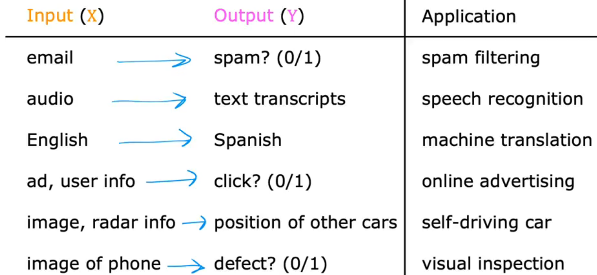

    - In all of these models, you'll first train your model with examples of inputs x and the right answers, that is the labels y. After the model has learned from these input and output, or x and y pairs, they can take a brand new input x, something it has never seen before, and try to produce the appropriate corresponding output y.

#### Regression introduction
- Let's dive more deeply into one specific example. Say you want to predict housing prices based on the size of the house. You've collected some data and say you plot the data and it looks like this. Here on the horizontal axis is the size of the house in square feet. Here on the vertical axis is the price of the house in, say, thousands of dollars.
    
    With this data, let's say a friend wants to know what's the price for their 750 square foot house. How can the learning algorithm help you? One thing a learning algorithm might be able to do is say, for the straight line to the data and reading off the straight line, it looks like your friend's house could be sold for maybe about, I don't know, $150,000. But fitting a straight line isn't the only learning algorithm you can use. There are others that could work better for this application. For example, routed and fitting a straight line, you might decide that it's better to fit a curve, a function that's slightly more complicated or more complex than a straight line. If you do that and make a prediction here, then it looks like, well, your friend's house could be sold for closer to $200,000.

    One of the things you see later in this class is how you can decide whether to fit a straight line, a curve, or another function that is even more complex to the data. One thing you see is how to get an algorithm to systematically choose the most appropriate line or curve or other thing to fit to this data. What you've seen in this slide is an example of supervised learning. Because we gave the algorithm a dataset in which the so-called right answer, that is the label or the correct price y is given for every house on the plot. The task of the learning algorithm is to produce more of these right answers, specifically predicting what is the likely price for other houses like your friend's house. That's why this is supervised learning. To define a little bit more terminology, this housing price prediction is the particular type of supervised learning called regression.

    By **regression**, I mean we're trying to predict a number from infinitely many possible numbers such as the house prices in our example, which could be 150,000 or 70,000 or 183,000 or any other number in between. That's supervised learning, learning input, output, or x to y mappings. The housing prices example we just went through is an example of regression where the task is to predict number.

    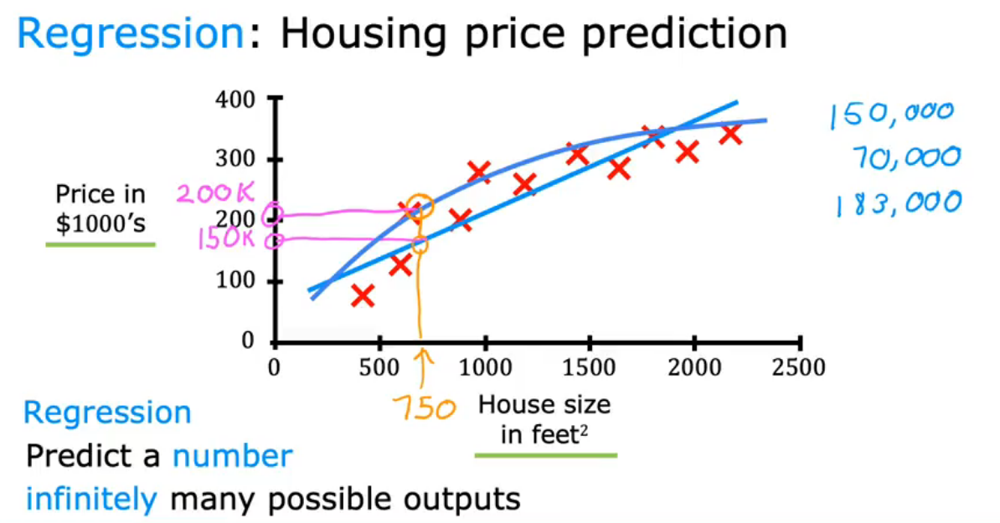

#### Classification introduction

##### Breast cancer detection
- Take breast cancer detection as an example of a classification problem. Say you're building a machine learning system so that doctors can have a diagnostic tool to detect breast cancer. This is important because early detection could potentially save a patient's life.

- Using a patient's medical records your machine learning system tries to figure out if a tumor that is a lump is malignant meaning cancerous or dangerous. Or if that tumor, that lump is benign, meaning that it's just a lump that isn't cancerous and isn't that dangerous.

- So maybe your dataset has tumors of various sizes. And these tumors are labeled as either benign, which I will designate in this example with a 0 or malignant, which will designate in this example with a 1. You can then plot your data on a graph like this where the horizontal axis represents the size of the tumor and the vertical axis takes on only two values 0 or 1 depending on whether the tumor is benign, 0 or malignant 1. One reason that this is different from regression is that we're trying to predict only a small number of possible outputs or categories.

- In this case two possible outputs 0 or 1, benign or malignant. This is different from regression which tries to predict any number, all of the infinitely many number of possible numbers. And so the fact that there are only two possible outputs is what makes this classification. Because there are only two possible outputs or two possible categories in this example, you can also plot this data set on a line like this. Right now, I'm going to use two different symbols to denote the category using a circle an O to denote the benign examples and a cross to denote the malignant examples. And if new patients walks in for a diagnosis and they have a lump that is this size, then the question is, will your system classify this tumor as benign or malignant?

    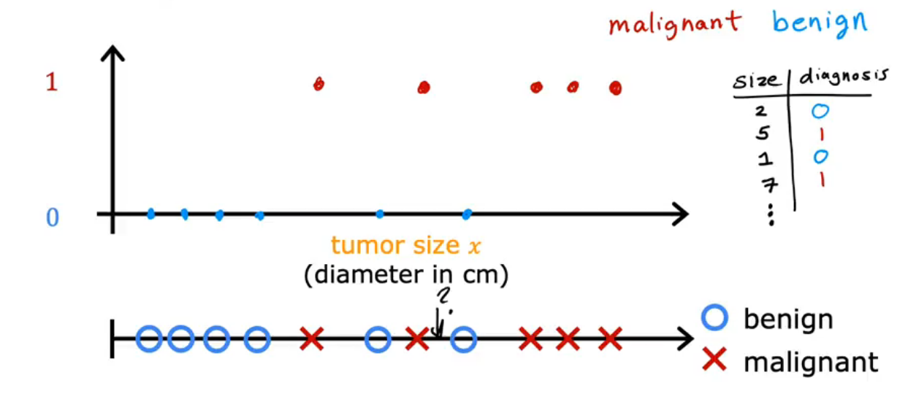

- It turns out that in classification problems you can also have more than two possible output categories. Maybe your learning algorithm can output multiple types of cancer diagnosis if it turns out to be malignant. So let's call two different types of cancer type 1 and type 2. In this case, the algorithm would have three possible output categories it could predict. And by the way in classification, the terms output classes and output categories are often used interchangeably. So what I say class or category when referring to the output, it means the same thing. So to summarize classification algorithms predict categories. 
    
    Categories don't have to be numbers. It could be non numeric for example, it can predict whether a picture is that of a cat or a dog. And it can predict if a tumor is benign or malignant. Categories can also be numbers like 0, 1 or 0, 1, 2. But what makes classification different from regression when you're interpreting the numbers is that classification predicts a small finite limited set of possible output categories such as 0, 1 and 2 but not all possible numbers in between like 0.5 or 1.7.

    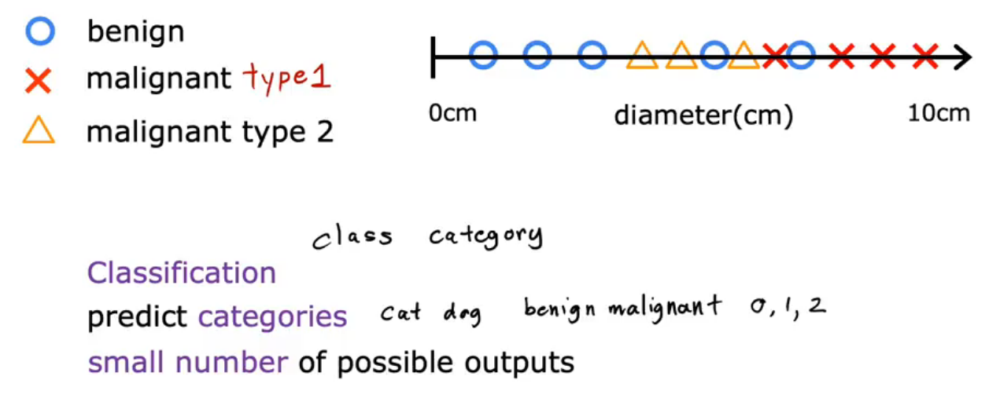

- In the example of supervised learning that we've been looking at, we had only one input value the size of the tumor. But you can also use more than one input value to predict an output. Here's an example, instead of just knowing the tumor size, say you also have each patient's age in years. Your new data set now has two inputs, age and tumor size. What in this new dataset we're going to use circles to show patients whose tumors are benign and crosses to show the patients with a tumor that was malignant. So when a new patient comes in, the doctor can measure the patient's tumor size and also record the patient's age. And so given this, how can we predict if this patient's tumor is benign or malignant? 

    Well, given the dataset like this, what the learning algorithm might do is find some boundary that separates out the malignant tumors from the benign ones. So the learning algorithm has to decide how to fit a boundary line through this data. The boundary line found by the learning algorithm would help the doctor with the diagnosis. In this case the tumor is more likely to be benign.

    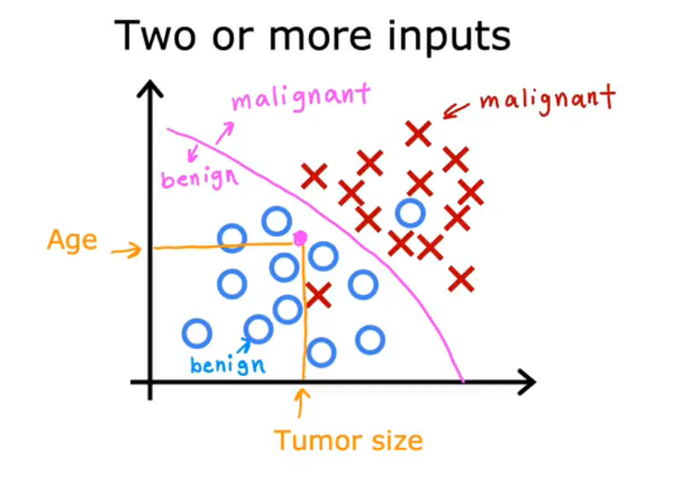

- From this example we have seen how to inputs the patient's age and tumor size can be used. In other machine learning problems often many more input values are required.

#### Regression vs Classification
- So to recap supervised learning maps input x to output y, where the learning algorithm learns from the quote right answers. The two major types of supervised learning our regression and classification. In a regression application like predicting prices of houses, the learning algorithm has to predict numbers from infinitely many possible output numbers. Whereas in **classification**, the learning algorithm has to make a prediction of a category out of a small set of possible outputs.

### Unsupervised learning
- When we're looking at supervised learning, recall it looks something like this in the case of a classification problem (left graph). Each example was associated with an output label y such as benign or malignant, designated by the poles and crosses. In unsupervised learning, we're given data that isn't associated with any output labels y. Say you're given data on patients and their tumor size and age but not whether the tumor was benign or malignant. So the dataset looks like this on the right.

    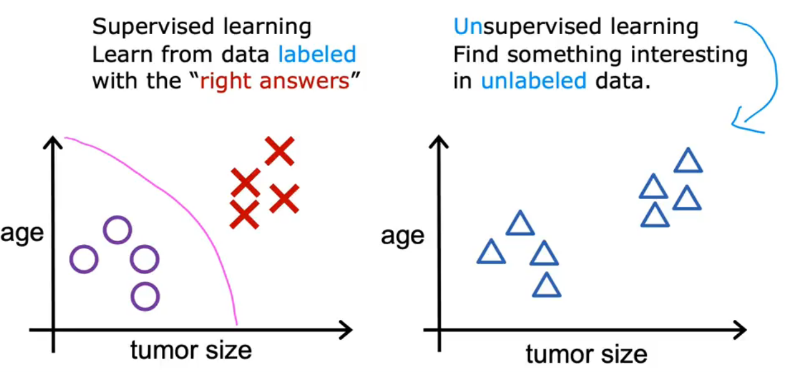

    We're not asked to diagnose whether the tumor is benign or malignant, because we're not given any labels y in the dataset. Instead, our job is to find some structure or some pattern or just find something interesting in the data. This is unsupervised learning. We call it unsupervised because we're not trying to supervise the algorithm to give some quote right answer for every input. Instead, we asked the algorithm to figure out all by itself what's interesting or what patterns or structures that might be in this data. With this particular data set, an unsupervised learning algorithm might decide that the data can be assigned to two different groups or two different clusters. And so it might decide, that there's one cluster or group over here, and there's another cluster or group over here. This is a particular type of unsupervised learning, called a **clustering algorithm** because it places the unlabeled data, into different clusters, and this turns out to be used in many applications.

    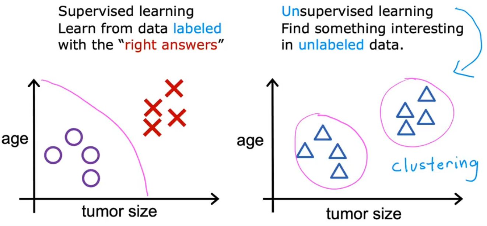

#### Clustering introduction

##### Google News example
- For example, clustering is used in Google News. What Google News does is every day it goes and looks at hundreds of thousands of news articles on the internet and groups related stories together. For example, here is a sample from Google News, where the headline of the top article is "Giant panda gives birth to rare twin cubs at Japan's oldest zoo". You might notice that below this are other related articles. Maybe from the headlines alone, you can start to guess what clustering might be doing. Notice that the word "panda" appears in all of the articles along with the word "twin" and "zoo". So the clustering algorithm is finding articles, out of all the hundreds of thousands of news articles on the internet that day, that mention similar words and grouping them into clusters. Now, what's cool is that this clustering algorithm figures out on his own which words suggest that certain articles are in the same group. What I mean is there isn't an employee at Google News who's telling the algorithm to find articles that the word "panda", "twins", and "zoo" to put them into the same cluster. The news topics change every day, and there are so many news stories, it just isn't feasible for people to do this every single day for all the topics that the news covers. So that's why this clustering algorithm, is a type of unsupervised learning algorithm.
    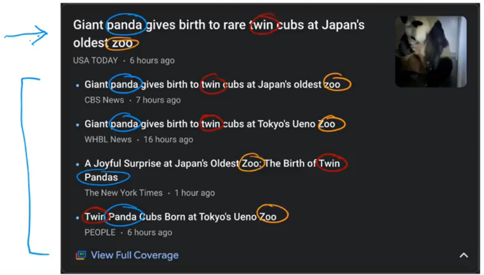

##### Genetic/DNA data example
- Let's look at the second example of unsupervised learning applied to clustering genetic or DNA data. This image shows a picture of DNA micro array data. These look like tiny grids of a spreadsheet, and each tiny column represents the genetic or DNA activity of one person. So for example, one column is one person's DNA and another column is another person's dna. Each row represents a particular gene. So just as an example, perhaps one row might represent a gene that affects eye color and another row is a gene that affects how tall someone is. Researchers have even found a genetic link to whether someone dislikes certain vegetables, such as broccoli, or brussels sprouts, or asparagus. So next time someone asks you why didn't you finish your salad, you can tell them, "maybe it's genetic" For DNA micro arrays, the idea is to measure how much certain gene, are expressed for each individual person. So these colors, red, green, gray, and so on, show the degree to which different individuals do, or do not have a specific gene active. And what you can do is then run a clustering algorithm to group individuals into different categories or different types of people. Like maybe these individuals that group together, and let's just call this type 1 and these people are grouped into type 2, and these people are grouped as type 3. This is unsupervised learning, because we're not telling the algorithm in advance that there is a type one person with certain characteristics or a type two person with certain characteristics. Instead what we're saying is here's a bunch of data. I don't know what the different types of people are but can you automatically find structure into data and automatically figure out whether the major types of individuals? Since we're not giving the algorithm the right answer for the examples in advance, this is unsupervised learning.

    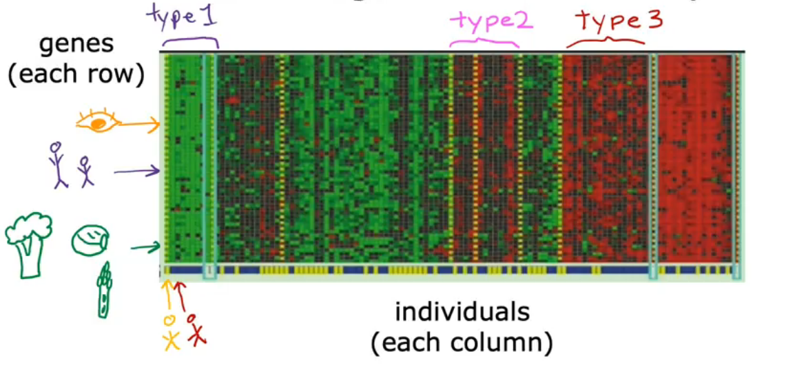

##### Grouping customers example
- Many companies have huge databases of customer information. Given this data, can you automatically group your customers into different market segments so that you can more efficiently serve your customers. Concretely, the [deeplearning.ai](https://deeplearning.ai) team did some research to better understand the deep learning dot AI community. And why different individuals take these classes, subscribed to the batch weekly newsletter, or attend our AI events. Let's visualize the deep learning dot AI community as this collection of people. Running clustering, that is market segmentation, found a few distinct groups of individuals. One group's primary motivation is seeking knowledge to grow their skills. Perhaps this is you, and so that's great. A second group's primary motivation is looking for a way to develop their career. Maybe you want to get a promotion or a new job, or make some career progression. If this describes you, that's great too. And yet another group wants to stay updated on how AI impacts their field of work, perhaps this is you, that's great too. This is a clustering that our team used to try to better serve our community as we're trying to figure out what are the major categories of learners in [deeplearning.ai](https://deeplearning.ai) community. So if any of these is your top motivation for learning, that's great. And I hope I'll be able to help you on your journey. Or in case this is you, and you want something totally different than the other three categories.
    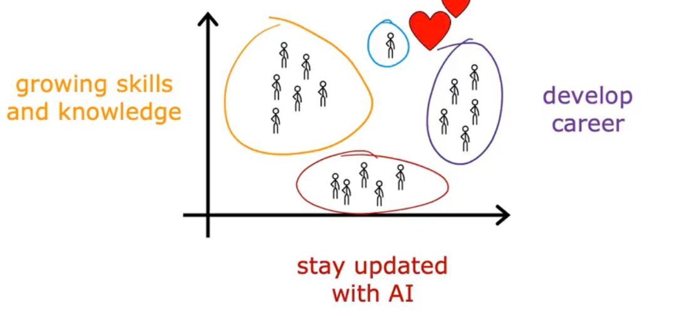

#### Difference between supervised learning and unsupervised learning 
- Whereas in supervised learning, the data comes with both inputs x and output labels y. In unsupervised learning, the data comes only with inputs x but not output labels y, and the algorithm has to find some structure or some pattern or something interesting in the data. We're seeing just one example of unsupervised learning called a clustering algorithm, which groups similar data points together. 

#### Other types of unsupervised learning
- In this specialization, you'll learn about clustering as well as two other types of unsupervised learning. 
    - clustering
        - group similar data points together
    - anomaly detection
        - find unusual data points
        - ex: fraud detection in financial systems
    - dimensionality reduction
        - compress data using fewer numbers

## Jupyter Notebooks
- The most widely used tool by machine learning and data science practitioners today is the Jupyter Notebook. This is the default environments that a lot of them use to code up, experiment, and try things out. This is not some made up, simplified environment. This is the exact same environments, the exact same tool, the Jupyter Notebook that developers are using in many large countries right now.

### Optional Lab: Python and Jupyter Notebooks
- [Python and Jupyter Notebooks](https://colab.research.google.com/drive/1cGZyfoWUMjn4f61B-njulkBWUdyEV-AN?authuser=4)

## Supervised Learning

### Linear Regression Model
- The first model we'll learn about is the Linear Regression Model. That just means fitting a straight line to your data. It's probably the most widely used learning algorithm in the world today. As you get familiar with linear regression, many of the concepts you see here will also apply to other machine learning models that you'll see later in this specialization.

- Let's start with a problem that you can address using linear regression. Say you want to predict the price of a house based on the size of the house. We're going to use a dataset on house sizes and prices from Portland, a city in the United States. Here we have a graph where the horizontal axis is the size of the house in square feet, and the vertical axis is the price of a house in thousands of dollars. Let's go ahead and plot the data points for various houses in the dataset. Here each data point, each of these little crosses is a house with the size and the price that it most recently was sold for. 

    Now, let's say you're a real estate agent in Portland and you're helping a client to sell her house. She is asking you, how much do you think I can get for this house? This dataset might help you estimate the price she could get for it. You start by measuring the size of the house, and it turns out that the house is 1250 square feet. How much do you think this house could sell for? One thing you could do is you can build a linear regression model from this dataset. Your model will fit a straight line to the data, which might look like the blue line in the image below. Based on this straight line fit to the data, you can see that if the house is 1250 square feet, it will intersect the best fit line at the yellow line shown in the image below, and if you trace that to the vertical axis on the left, you can see the price is maybe around the pink line shown on the image below, say about $220,000. This is an example of what's called a supervised learning model.

    We call this supervised learning because you are first training your model by giving it data that has right answers because you give the model examples of houses with both the size of the house, as well as the price that the model should predict for each house. Well, here are the prices, that is the right answers, are given for every house in the dataset. This linear regression model is a particular type of supervised learning model. It's called **regression model** because it predicts numbers as the output like prices in dollars. Any supervised learning model that predicts a number such as 220,000 or 1.5 or negative 33.2 is addressing what's called a **regression problem**. Linear regression is one example of a regression model, but there are other models for addressing regression problems too.

    Just to remind you, in contrast with the regression model, the other most common type of supervised learning model is called a classification model. A **classification model** predicts categories or discrete categories, such as predicting if a picture is of a cat or a dog, or if given medical record, it has to predict if a patient has a particular disease. As a reminder about the difference between classification and regression, in classification, there are only a small number of possible outputs. If your model is recognizing cats versus dogs (that's two possible outputs) or maybe you're trying to recognize any of 10 possible medical conditions in a patient (so there's a discrete, finite set of possible outputs), we call it a classification problem. Whereas in regression, there are infinitely many possible numbers that the model could output.

    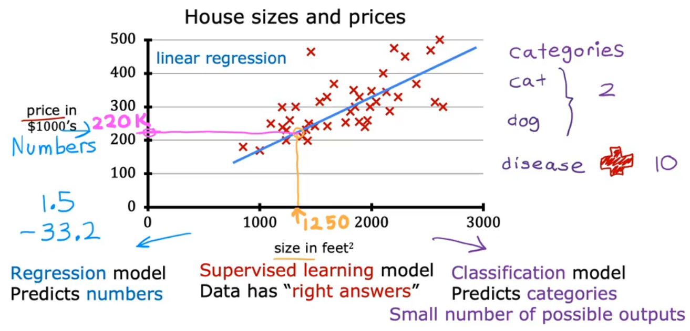

- 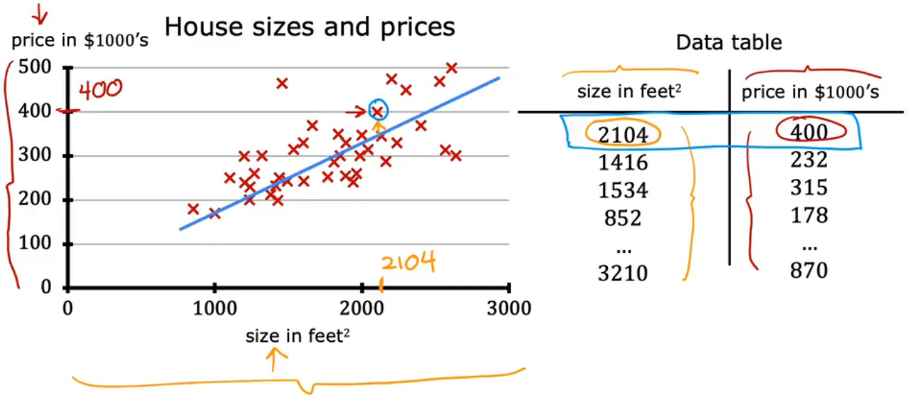

    In addition to visualizing this data as a plot here on the left, there's one other way of looking at the data that would be useful, and that's a data table here on the right. 
    
    The data comprises of a set of inputs. This would be the size of the house, which is the left column. It also has outputs. You're trying to predict the price, which is this column on the right. Notice that the horizontal and vertical axes correspond to these two columns: the size and the price.

    If you have, say, 47 rows in this data table, then there are 47 of these little crosses on the plot on the left, each cross corresponding to one row of the table. For example, the first row of the table is a house with size, 2,104 square feet (near 2000 on the x-axis), and this house is sold for $400,000 (on 400 on the y-axis). Knowing this, you should be able to find the point plotted on the graph (circled in blue). 

#### Terminology
- 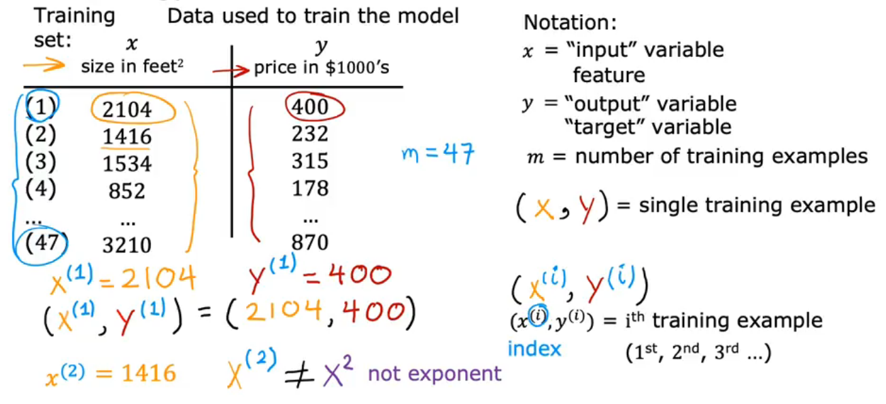

    Now, let's look at some notation for describing the data. This is notation that you'll find useful throughout your journey in machine learning. As you increasingly get familiar with machine learning terminology, this would be the terminology they can use to talk about machine learning concepts with others as well, since a lot of this is quite standard across AI. You'll be seeing this notation multiple times in this specialization, so it's okay if you don't remember everything for assign through. It will naturally become more familiar overtime. 
    
    The dataset that you just saw and that is used to train the model is called a **training set**. Note that your client's house is not in this dataset because it's not yet sold, so no one knows what the price is. To predict the price of your client's house, you first train your model to learn from the training set and that model can then predict your client's house's price.

    In Machine Learning, the standard notation to denote the input is lowercase `x`, and we call this the input variable. It is also called a **feature** or an **input feature**. For example, for the first house in the training set, `x` is the size of the house, so `x` equals 2,104. The standard notation to denote the output variable which you're trying to predict, which is also sometimes called the **target variable**, is lowercase `y`. Here, `y` is the price of the house, and for the first training example, this is equal to 400, so `y` equals 400. The dataset has one row for each house and in this training set, there are 47 rows with each row representing a different training example. We're going to use lowercase `m` to refer to the total number of training examples, and so here `m` is equal to 47. To indicate a single training example, we're going to use the notation `(x, y)`. For the first training example, `(x, y)`, the pair of numbers is `(2104, 400)`. Now we have a lot of different training examples; we have 47 of them in fact. To refer to a specific training example that will correspond to a specific row in this table on the left, use the notation ($ x^{(i)} $, $ y^{(i)} $). The superscript tells us that this is the ith training example, such as the first, second, or third up to the 47th training example. `i` refers to a specific row in the table. For instance, let's take a look at the first example, when i equals 1 in the training set. $ x^{(1)} $ is equal to 2,104 and $ y^{(1)} $ is equal to 400. Just to note, the superscript `(i)` is not exponentiation. $ x^{(2)} $ is not $ x^{2} $. It just refers to the second training example. This `i` is just an index for the training set and refers to row `i` in the table.

#### Model Training
- 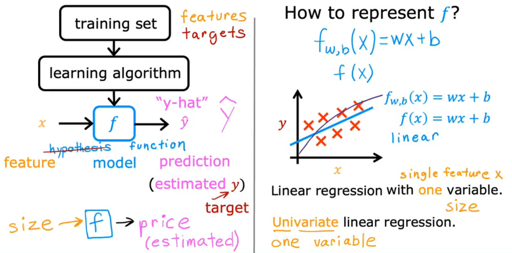

    A supervised learning algorithm will input a dataset and then what exactly does it do and what does it output? Let's find out in this video. Recall that a training set in a supervised learning includes both the input features, such as the size of the house and also the output targets, such as the price of the house. The output targets are the right answers to the model we'll learn from. To train the model, you feed the training set, both the input features and the output targets to your learning algorithm. Then your supervised learning algorithm will produce some function.

    We'll write this function as lowercase `f`, where `f` stands for function. Historically, this function used to be called a **hypothesis**, but it will just be called **function `f`** in this class. The job with `f` is to take a new input `x` and output an estimate or a prediction, which I'm going to call $ \hat{y} $. In machine learning, the convention is that $ \hat{y} $ is the estimate or the prediction for `y`, the function `f` is called the *model*, `x` is called the *input* or the *input feature*, and the output of the model is the prediction, $ \hat{y} $. The model's prediction is the estimated value of `y`.

    When the symbol is just the letter `y`, then that refers to the **target**, which is the actual true value in the training set. In contrast, $ \hat{y} $ is an estimate. It may or may not be the actual true value. Well, if you're helping your client to sell the house, the true price of the house is unknown until they sell it. Your model `f`, given the size, outputs the price which is the estimator, that is the prediction of what the true price will be. Now, when we design a learning algorithm, a key question is, how are we going to represent the function `f`? Or in other words, what is the math formula we're going to use to compute `f`?

    For now, let's stick with `f` being a straight line. Your function can be written as $ f_{w, b}(x) = wx + b $. I'll define `w` and `b` soon, but for now, just know that `w` and `b` are numbers, and the values chosen for `w` and `b` will determine the prediction $ \hat{y} $ based on the input feature `x`. This f_w b of x means f is a function that takes x as input, and depending on the values of w and b, f will output some value of a prediction y-hat. As an alternative to writing $ f_{w, b}(x) $, I'll sometimes just write $ f(x) $ without explicitly including `w` and `b` into subscript. It's just a simpler notation that means exactly the same thing as $ f_{w, b}(x) $.

    Let's plot the training set on the graph, where the input feature `x` is on the horizontal axis and the output target `y` is on the vertical axis. Remember, the algorithm learns from this data and generates the best-fit line like maybe the blue line in the image above. This straight line is the linear function $ f_{w, b}(x) = wx + b $, or more simply, we can drop `w` and `b` and just write $ f(x) = wx + b $. Here's what this function is doing, it's making predictions for the value of `y` using a straight line function of `x`. 
    
    You may ask, why are we choosing a linear function, where linear function is just a fancy term for a straight line instead of some non-linear function like a curve or a parabola? Well, sometimes you want to fit more complex non-linear functions as well, like a curve shown in purple in the image above. But since this linear function is relatively simple and easy to work with, let's use a line as a foundation that will eventually help you to get to more complex models that are non-linear. 
    
    This particular model has a name; it's called *linear regression*. More specifically, this is **linear regression with one variable**, where the phrase one variable means that there's a single input variable or feature `x`, namely the size of the house. Another name for a linear model with one input variable is **univariate linear regression**, where *uni* means one in Latin, and where *variate* means variable. *Univariate* is just a fancy way of saying one variable. Later on, you'll also see a variation of regression where you'll want to make a prediction based not just on the size of a house, but on a bunch of other things that you may know about the house such as number of bedrooms and other features. 

    So, that's linear regression. In order for you to make this work, one of the most important things you have to do is construct a cost function. The idea of a cost function is one of the most universal and important ideas in machine learning and is used in both linear regression and in training many of the most advanced AI models in the world. 

#### Optional Lab: Model Representation
- [Model Representation](https://colab.research.google.com/drive/1TSL3bQ1-YsvCqqmBvfjtByZgOR6shxmg?authuser=4)

#### Cost Function
- 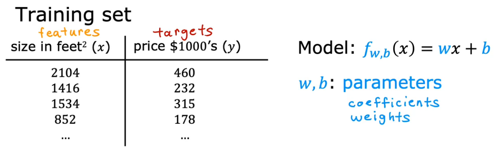

    Recall that you have a training set that contains input features `x` and output targets `y`. The model you're going to use to fit this training set is this linear function $ f_{w, b}(x) = wx + b $. 
    
    To introduce a little bit more terminology the `w` and `b` are called the parameters of the model. In machine learning, **parameters** of a model are the variables you can adjust during training in order to improve the model. Sometimes you also hear the parameters `w` and `b` referred to as **coefficients** or as **weights**. Now let's take a look at what these parameters `w` and `b` do. Depending on the values you've chosen for `w` and `b`, you get a different function $ f(x) $, which generates a different line on the graph.
    
    

    Remember that we can write f(x) as a shorthand for $ f_{w, b}(x) $. We're going to take a look at some plots of f(x) on a chart. Maybe you're already familiar with drawing lines on charts, but even if this is a review for you, I hope this will help you build intuition on how `w` and `b` the parameters determine `f`. When `w` = 0 and `b` = 1.5, then f looks like the horizontal line on the left. In this case, the function $ f(x) = 0 * x + 1.5 $, so `f` is always a constant value. It always predicts 1.5 for the estimated value of `y`. $ \hat{y} $ is always equal to `b` and here `b` is also called the *y-intercept* because that's where it crosses the vertical axis or the y-axis on this graph. 
    
    As a second example (middle graph), if `w` is 0.5 and `b` is equal 0, then $ f(x) = 0.5 * x %. When `x` is 0, the prediction is also 0, and when `x` is 2, then the prediction is 0.5 times 2, which is 1. You get a line that looks like the one in the middle. Notice that the slope is 0.5 divided by 1. The value of `w` gives you the slope of the line, which is 0.5.

    Finally, if `w` equals 0.5 and `b` equals 1, then $ f(x) = 0.5 * x + 1 $. When `x` is 0, then $ f(x) = b $, which is 1, so the line intersects the vertical axis at `b`, the y-intercept. Also, when x is 2, then $ f(x) = 2 $, so the line looks like the one on the right. Again, this slope is 0.5 divided by 1 so the value of `w` gives you the slope which is 0.5. 

    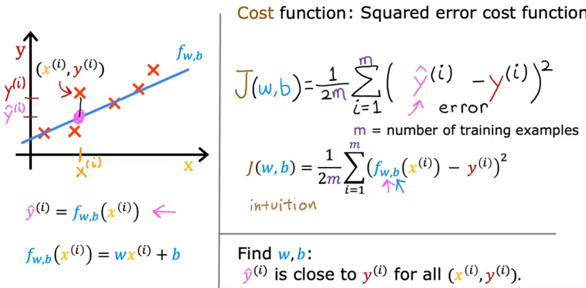

    Recall that you have a training set like the one shown here. With linear regression, what you want to do is to choose values for the parameters `w` and `b` so that the straight line you get from the function `f` somehow fits the data well. Like maybe the blue line on the left. When I see that the line fits the data, visually, you can think of this to mean that the line defined by `f` is roughly passing through or somewhere close to the training examples as compared to other possible lines that are not as close to these points.

    Just to remind you of some notation, a training example, like the point on the graph with a red arrow ponted to it, is defined by ($ x^{(i)} $, $ y^{(i)} $) where `y` is the target. For a given input $ x^(i) $, the function `f` also makes a predictive value for `y`, the value that it predicts to `y` is $ \hat{y}^{(i)} $ shown in the picture. For our choice of a model, $ f_{w, b}(x^{(i)}) = wx^{(i)} + b $. Stated differently, the prediction $ \hat{y}^{(i)} = f_{w, b}(x^{(i)}) $ where, for the model we're using, $ f_{w, b}(x^{(i)}) = wx^{(i)} + b $. 
    
    Now the question is how do you find values for `w` and `b` so that the prediction $ \hat{y}^{(i)} $ is close to the true target $ y^{(i)} $ for many or maybe all training examples ($ x^{(i)} $, $ y^{(i)} $). To answer that question, let's first take a look at how to measure how well a line fits the training data. To do that, we're going to construct a cost function. 
    
    The **cost function** takes the prediction $ \hat{y} $ and compares it to the target `y` by taking $ \hat{y} - y $. This difference is called the **error**. We're measuring how far off the prediction is from the target. Next, let's compute the square of this error: $ (\hat{y} - y)^{2} $. Also, we're going to want to compute this term for different training examples i in the training set: $ (\hat{y}^{(i)} - y^{(i)})^{2} $. When measuring the error, for example i, we'll compute this squared error term. Finally, we want to measure the error across the entire training set. In particular, let's sum up the squared errors like this: $ \sum_{i = 1}^m (\hat{y}^{(i)} - y^{(i)})^{2} $ where m = number of training examples. We'll sum from i equals 1, 2, 3 all the way up to `m`. Remember that `m` is the number of training examples, which is 47 for this dataset. Notice that if we have more training examples `m` is larger and your cost function will calculate a bigger number, since it is summing over more examples. To build a cost function that doesn't automatically get bigger as the training set size gets larger, by convention, we will compute the average squared error instead of the total squared error and we do that by dividing by `m` like this: $ \frac{1}{m}\sum_{i = 1}^m (\hat{y}^{(i)} - y^{(i)})^{2} $. We're nearly there. Just one last thing. By convention, the cost function that machine learning people use actually divides by 2m: $ \frac{1}{2m}\sum_{i = 1}^m (\hat{y}^{(i)} - y^{(i)})^{2} $. The extra division by 2 is just meant to make some of our later calculations look neater, but the cost function still works whether you include this division by 2 or not.

    This expression right here is the cost function and we're going to write $ J(w, b) $ to refer to the cost function: $ J(w, b) = \frac{1}{2m}\sum_{i = 1}^m (\hat{y}^{(i)} - y^{(i)})^{2} $. This is also called the **squared error cost function**, and it's called this because you're taking the square of these error terms. In machine learning different people will use different cost functions for different applications, but the squared error cost function is by far the most commonly used one for linear regression and for that matter, for all regression problems, where it seems to give good results for many applications. Just as a reminder, the prediction $ \hat{y}^{(i)} = f_{w, b}(x^{(i)}) $. We can rewrite the cost function as $ J(w, b) = \frac{1}{2m}\sum_{i = 1}^m (f_{w, b}(x^{(i)}) - y^{(i)})^{2} $. Eventually we're going to want to find values of `w` and `b` that make the cost function small. But before going there, let's first gain more intuition about what $ J(w, b) $ is really computing.

##### Simplified Model
- 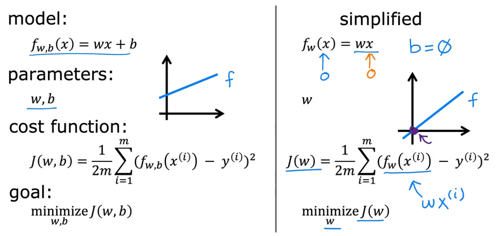

    - You want to fit a straight line to the training data so you have this model: $ f_{w, b}(x) = wx + b $.
    - You have parameters `w` and `b`, which you want to obtain values for which fits the training data well. Depending on their value, you'll get different lines.
    - We then have the cost function `J`, which measures the difference between the model's predictions and the actual true values for `y`. The goal is to minimize `J` as a function of `w` and `b`.
    - To better understand `J`, let's use a simplified model: $ f_{w}(x) = wx $, basically `b = 0`. This will result in this cost function: $ J(w) = \frac{1}{2m}\sum_{i = 1}^m (f_{w}(x^{(i)}) - y^{(i)})^{2} $, where $ f_{w}(x^{(i)}) = wx^{(i)} $ and `J` is just a function of w. With this in mind, the goal is now to find a value `w` that minimizes $ J(w) $. Visually, `f` is now a line that always passes through the origin, but the line's slope will depend on the value of `w`.

    Let's see how the simplified cost function changes for different values of `w`:

    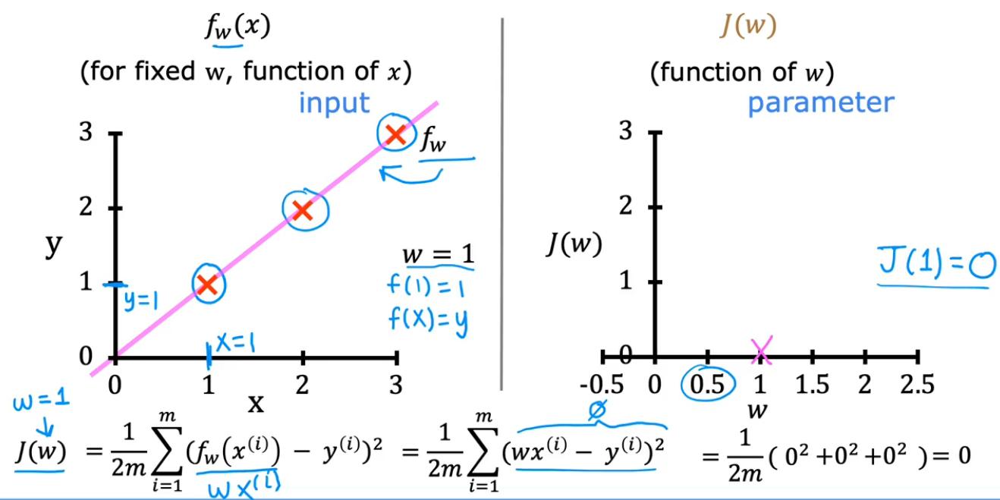

    - First, notice that for $ f_{w} $, when the parameter `w` is fixed, that is, is always a constant value, then $ f_{w} $ is only a function of `x`, which means that the estimated value of `y` depends on the value of the input `x`. In contrast, looking to the right, the cost function `J`, is a function of `w`, where `w` controls the slope of the line defined by $ f_{w} $. The cost defined by `J`, depends on a parameter, in this case, the parameter `w`.
    - The 3 points represents the training set. 
    - Let's say `w` is 1. The result will be the pink line. Plugging `w` into the cost function `J` results in 0 for all 3 data points and the cost `J` equal to 0. You can see this point plotted on `J`'s graph (pink cross).
    - Take note of the differents in the x and y axes for $ f_{w} $'s graph and $ J(w) $'s graph.

    Now let's say $ w = 0.5 $:

    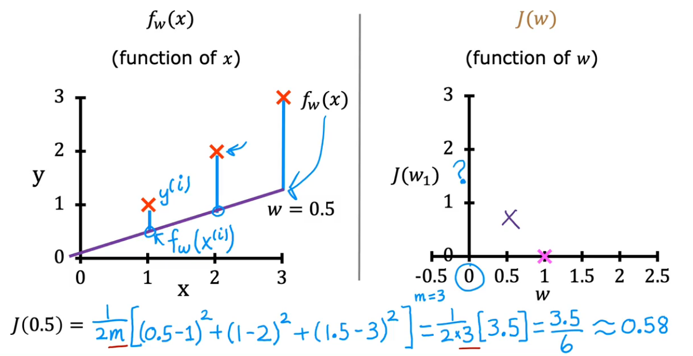

    - Calculating the errors, we can see that it's simply the gap between $ y^{(i)} $ and $ f_{w}(x^{(i)}) $.
    - After calculating all the errors and plugging them into the cost function, we get 0.58 as the result. Plotting this point on `J`'s graph, we get the purple cross.

    

    - Now let's say $ w = 0 $ (yellow line). The blue vertical lines represent the error. With $ w = 0 $, we get $ J(w) = 2.3 $ which is plotted as a yellow cross.
    - After computing other values for `J`, you can see what `J` looks like.
    - To recap, each value `w` corresponds to a different straight line fit on the graph to the left. For a given training set, that choice `w` corresponds to a single point on the graph on the right for $ J(w) $. Getting a bunch of these points, you can trace out the plot on the right. So how can we choose a value `w` that fits the training data well?

- 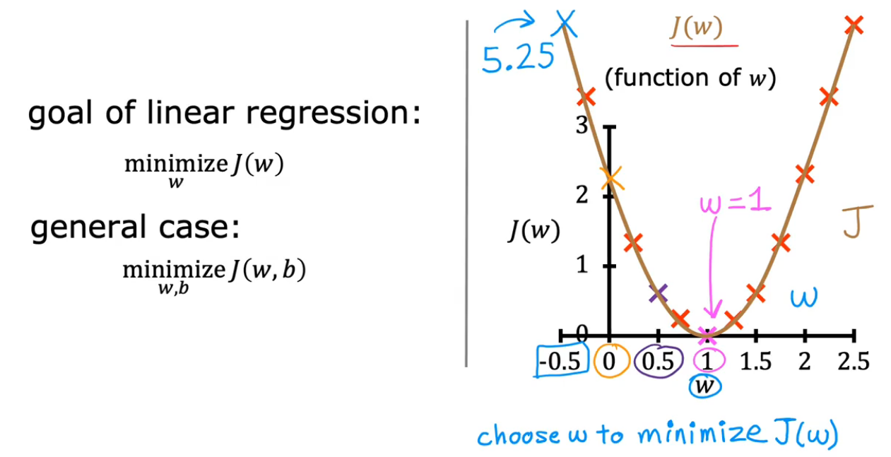

    - Choosing a value `w` that causes `J` to be as small as possible is the best bet. Recall that `J` is a function that measures how big the square errors are, so choosing a `w` that minimizes these squared errors will give us a good model.
    - So the goal of linear regression is to find a `w` which minimizes `J`, or in the general case, when we have parameters `w` and `b` instead of just `w`, we want to find a `w` and `b` that minimizes `J`.

##### Visualizing the Cost Function
- Let's go back to the original model with `w` and `b`:

    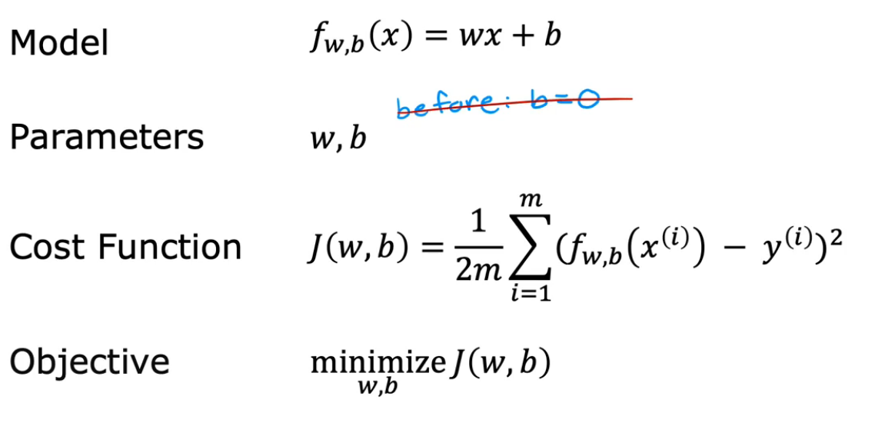

- 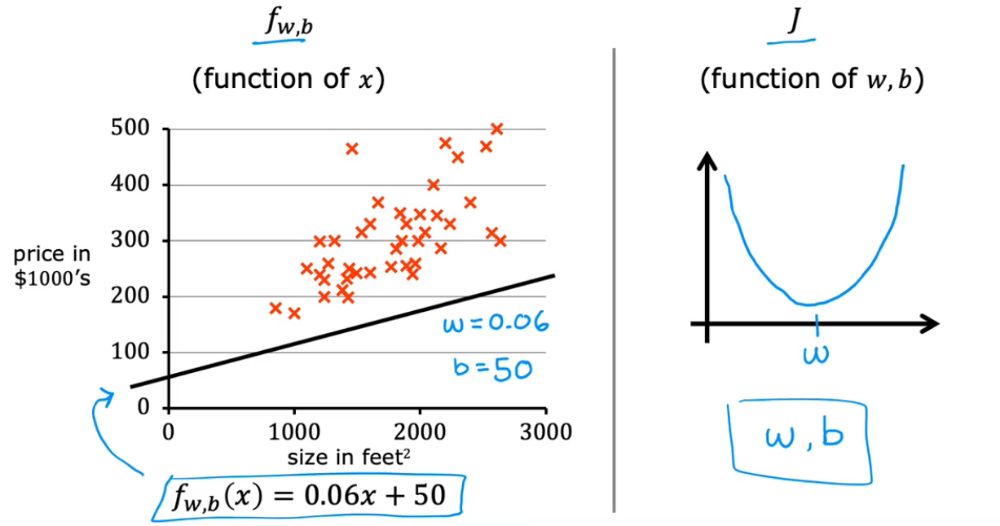

    - Once again, we have some training data points where the output is the price of a house and the input is the size of the house. We have also defined a function `f` which fits the data very poorly; it underestimates house prices. 
    - On the right, we have the old `J` graph where we were only concered with `w`.

    Let's add `b` to the `J` plot:

    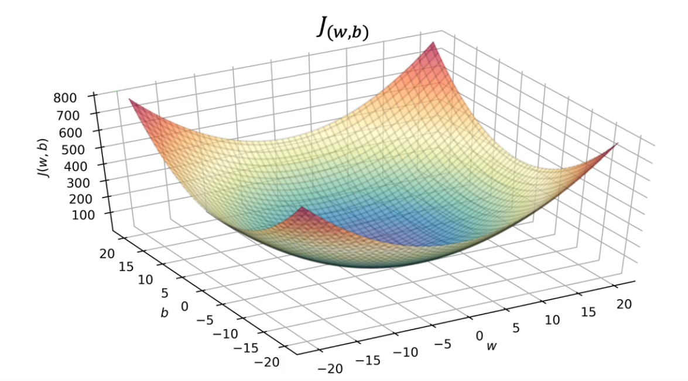

    - It turns out that the cost function with `b` has a similar shape, but it's 3D.
    - This is a 3D surface plot where the axes are `w` and `b`. Varying `w` and `b` results in different values for $ J(w, b) $.
    - Here's an example of a point, $ J(w = -10, b = -15) $, on this graph:

        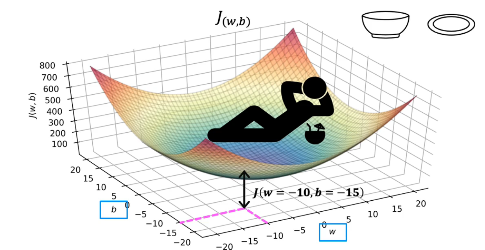
    
    - Here's another view of `J`:
        
        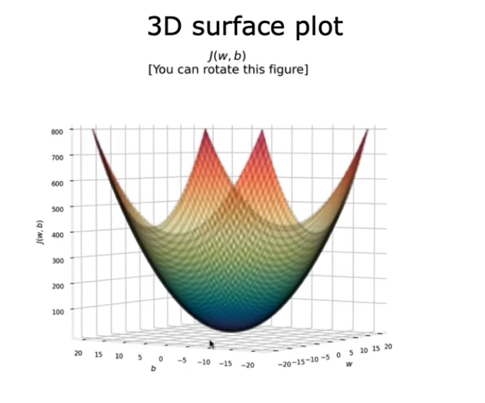

- Now, let's use a contour plot instead of a 3D surface plot:

    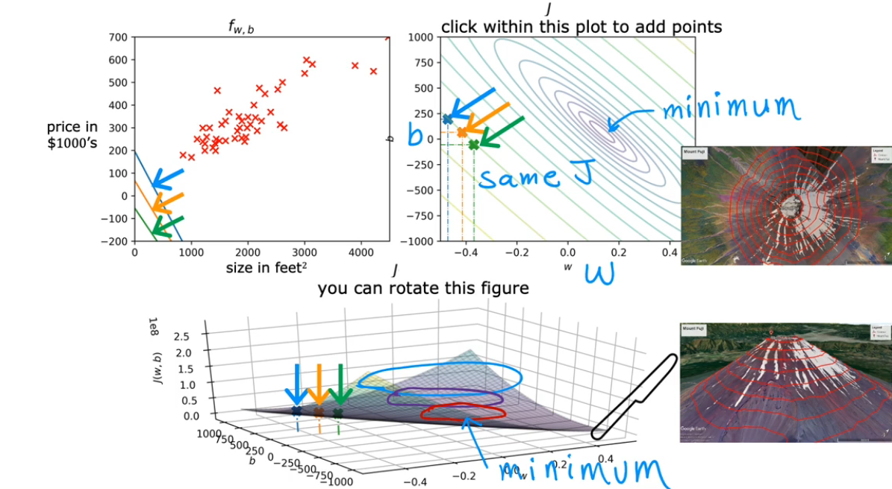

    - On the right, you can see two graphical maps of Mount Fuji: one where you're facing a side of the mount (bottom) and one where you're above the mount (top). The contours are horizontal slices of a landscape, e.g. Mount Fuji. When you're above the mount, you can see that each contour shows all the points that are at the same height for different heights.
    - Now, let's look at `J`'s contour plot. Each oval/elipses shows center points on the 3D surface that are the exact same height. In other words, each contour is a set of points that have the same value for the cost function `J`.
    - To get a contour plot of `J`, you basically get its 3D surface plot and slice horizontally. You keep taking horizontal slices, where each point is of the same height. Therefore, each horizontal slice ends up being one of the oval/elipses in the contour graph.
    - All the 3 points (blue, orange, green), have the same value `J` even though they have diferent `w` and `b` values. On the $ f_{w, b} $ graph, you can see that those points are all different functions, each of which fit the data very poorly.
    - The bottom of the bowl (contour is bowl shaped), where the cost function `J` is at a minimum, is at the center of the contour plot (at the center of the concentric ovals).
    - The contour plots are a convient way to visualize the 3D cost function `J` but in a way that is just 2D.

    Let's take a look at one example function:

    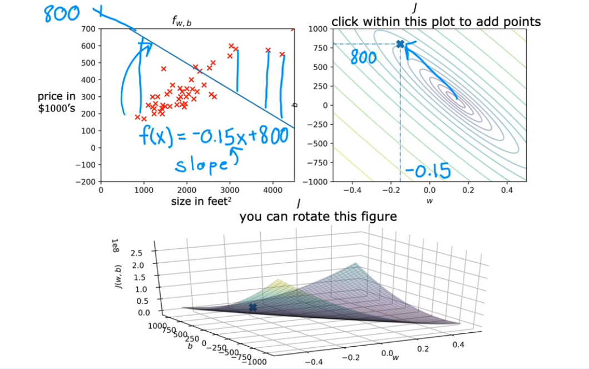

    - We can see that it's not a good fit for the data since the distances between the predicted values of `y` and the actual values of `y` are pretty far apart. It can also be seen that this point is pretty far from the center on the contour plot.

    Let's look at another example:
    
    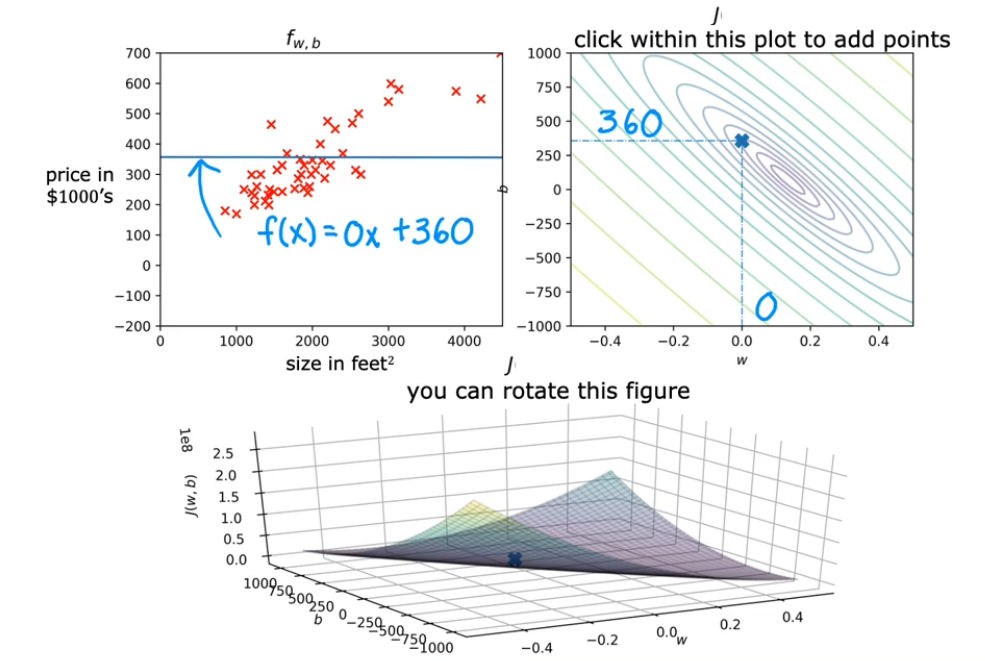

    - This one is also not a great fit for the data, but it's not as bad.
    - It's a horizontal line because $ w = 0 $.

    Here's yet another example:

    

    - This line is also not a great fit and is farther away from the minimum compared to the previous example.

    Here's a better fit:

    

    - This is a pretty good fit to the training set.
    - If we look at the contour plot, our fit is pretty close to the minimum but not exactly.
    - You can see the vertical distances between the data points and the predicted values on the straight line. The sum of squared errors for these data points is pretty close to the minimum possible sum of squared errors among all possible straight line fits.

##### Optional Lab: Cost Function
- [Cost Function](https://colab.research.google.com/drive/1hkgf1yn5GPexFAKpJS4AFDZpDk5DA8o8?authuser=4)

#### Gradient Descent
- We saw that we can minimize the cost function by picking the minimum point on the graph, but this is not practical. There is an efficient algorithm that can find parameters `w` and `b` that give you the best fit line that minimizes the cost function `J`: gradient descent. It's a very important algorithm that's used to train some of the most complex models in AI, not just regression models.

- 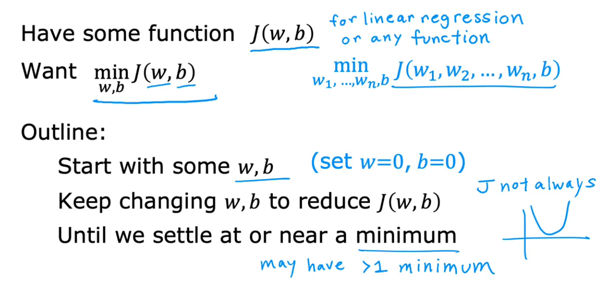

    - We will use gradient descent to minimize the cost function.
    - Gradient descent can be used to minimize any function, including other models that have more than two paramters. It just turns out that we can use it to minimize our cost function.
    - Common choice is to start `w` and `b` at 0. For functions `J` that are not bowl-shaped, there is possible for there to be more than 1 minimum.

    Here's a more complex surface plot `J` that's not the squared error cost function:

    

    - Notice it's not bowl-shaped.
    - May get something like this when training a neural network model.
    - Think that this plot is a golf field. Your goal is to start at a hill (like the person on the plot), and get to the bottom of one of those valleys as efficiently as possible. Here's what the gradient descent algorithm does in the form of you at the top of the hill:
        - Spin 360°, look around, and think about a direction where you should take a baby step with the goal of going down the hill as efficiently as possible. You may notice that the best direction is the black line on the star. Mathmatically, this is the direction of steepest descent, meaning that taking a baby step in this direction will take you further than if you took a baby step in any other direction.
        - After repeating this process of picking an efficent direction and taking a baby step, you'll eventually find yourself down a valley at a local minimum.
    - Note that you can choose your starting point with `w` and `b`.

    Imagine if you try a new starting point, a bit more to the right than the last one:

    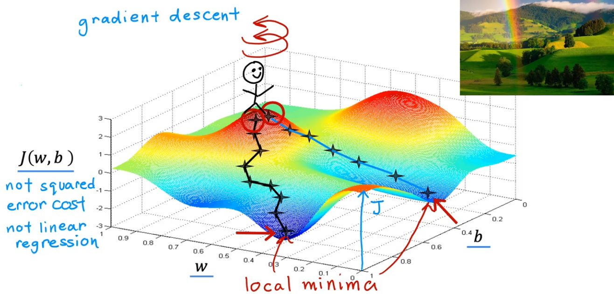

    - Notice that this time you end up at a completely different valley (local minima).

    Going down valley or local minima will make you stay there, and you will not end up at another one.

- 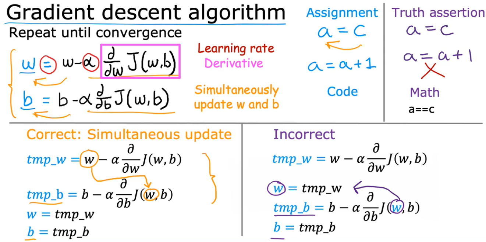

    - $ w = w - \alpha \frac{\partial}{\partial w} J(w,b) $
        - Basically, update your parameter w by adjusting it by a small amount.
        - `=` here is the assignment operator, not a truth assertion in math.
        - $ \alpha $ is the **learning rate** and is usually a small positive number between 0 and 1 (e.g. 0.01). It controls how big of a step you take down hill. Bigger $ \alpha $ equals bigger steps and vice-versa.
        - $ \frac{d}{dw} J(w,b) $ is the derivate term of the cost function `J`. Think of it as which direction you want to take your baby step. In combination with $ \alpha $, it also determines the size of the step you want to take in that direction.

    - $ b = b - \alpha \frac{\partial}{\partial b} J(w,b) $
        - Update for b.

    - For gradient descent, you're going to repeat these update steps until the algorithm converges, i.e. `w` and `b` no longer change much with each additional step that you take.

    - Both parameters should be updated at the same time; update `w` and `b` from their old values to new values. The way to implement this is to first calculate the learning rate * partial derivative term and simultaneously, at the same time, update `w` and `b` to the new values.

    - Not updating `w` and `b` simultaneously will still result in the algorithm working, but that is not the correct way to implement it, and it's actually a some other algorithm with different properties.

- 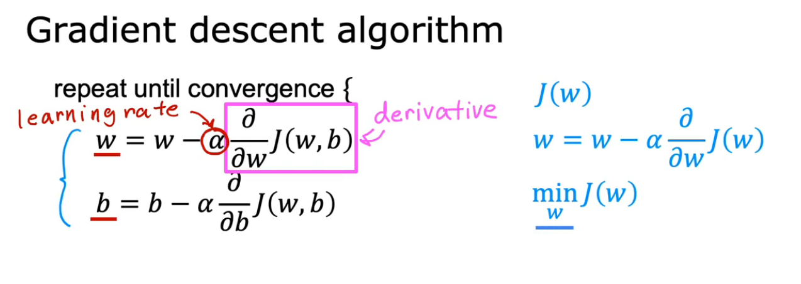

    - To better understand what learning rate * partial derivative is doing, we'll use a simplified version where's we're only minimizing `w`.

    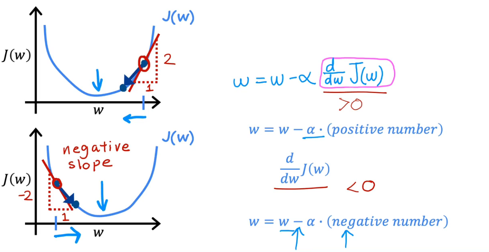

    - Let's imagine you start off at the point circled in red (top graph):
        - Gradient descent will update `w` using the formula: $ w = w - \alpha \frac{d}{dw} J(w) $.
        - The red line is a representation of the derivate part of the update formula. In math, that line is the slope of the graph at that point.
        - The learning rate is always a positive number. So, since the slope here is positive and you're subtracting a positive value from w, you end up with a new `w` that's smaller, i.e. you're moving to the left. In this case, we've decreased the `J`, getting closer to the minimum.
    - Now let's say we start at this new point (bottom graph):
        - The slope is negative, i.e. derivative is negative.
        - When you update `w`, it gets bigger which means we're moving to the right. This decreases the cost `J`, so gradient descent seems to be working as it should.

- $ \alpha $ will have a huge impact on the efficiency of your implementation of gradient descent. If the learning rate is chose poorly, gradient descent may not work at all. Let's take a deeper look at the learning rate, which will help you choose better learning rates for your implementations of gradient descent.

    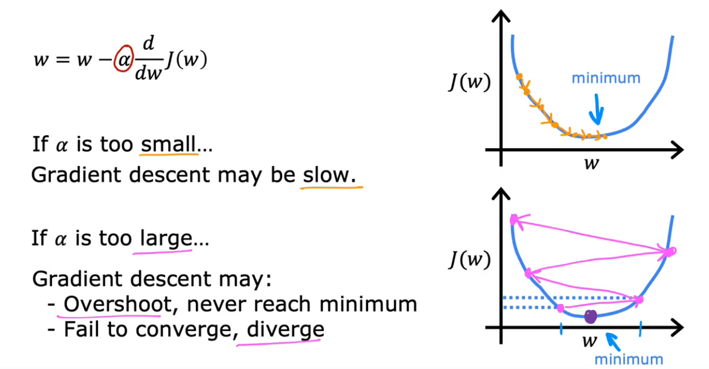

    - If $ \alpha $ is too small, you end up descreasing the cost `J` incredibly slowly. It will work, but it's slow (need a lot of steps).
    - If $ \alpha $ is too large, you may overstep the minimum, and the cost `J` may get worse. You may end up zig-zagging.

    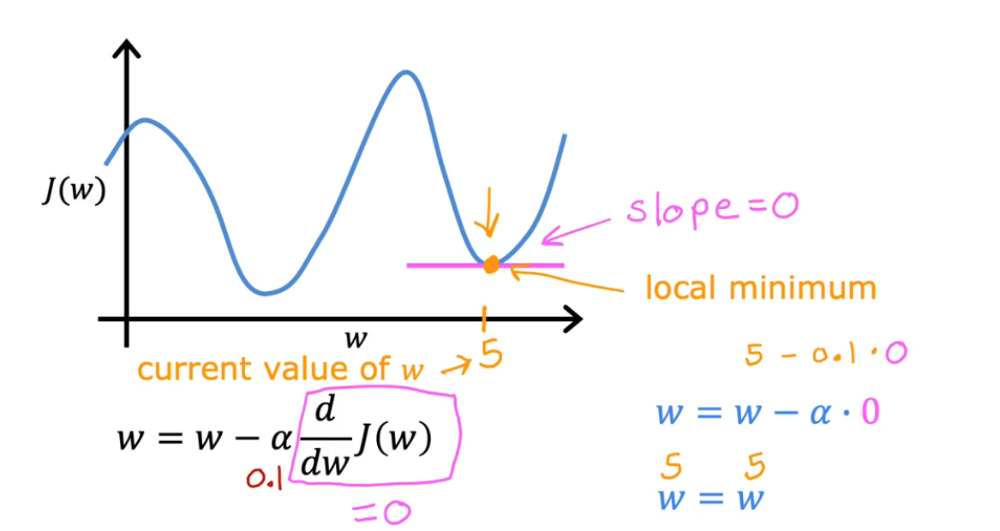
    
    - What would one step of gradient descent do if you've already reached a minimum? 
    - Let's suppose you have a cost function `J`, and this one right here is not a squared error cross function (look at the graph). 
    - This cost function has two local minima.
    - Let's say after some steps of gradient descent, you end up at `w` = 5, and it happens to be a local minimum. The slope here is 0, so your updates will just leave `w` unchanged.

    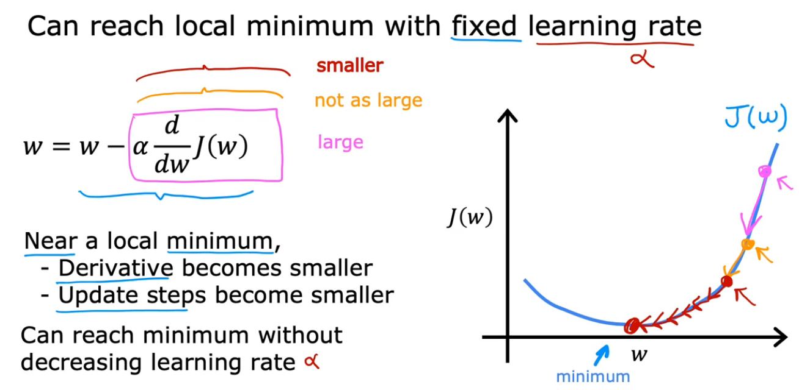

    - Gradient descent can reach a local minimum even with a fixed rate $ \alpha $.
    - Let's say we want to minimize the `J` shown here starting at the pink point. Notice that the slopes get smaller as we get closer to the minimum, since the slopes become less steep. So, gradient descent will automatically take smaller steps since the derivate gets smaller even without decreasing the learning rate.
    - As mentioned earlier, gradient descent can be used on any cost function `J`.

- Now, let's use the squared error cost function for the linear regression model with gradient descent. This will allow us to train the linear regression model to fit a straight line to our training data.

    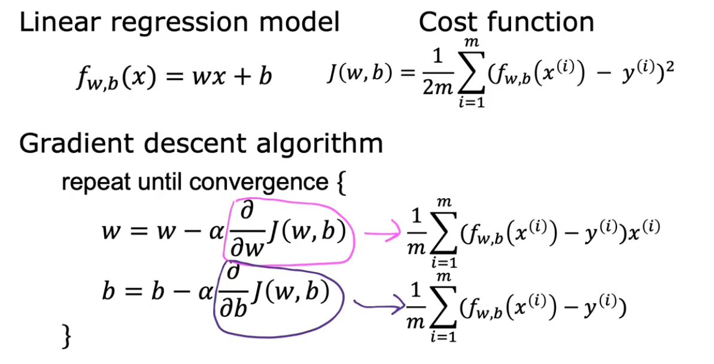    

    - It turns out that this is what the partial derivatives break down to.
    - These formulas are derived using calculus:

        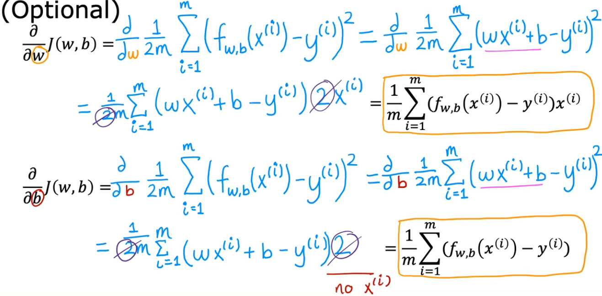
    
    Here's what the algorithm will look like:

    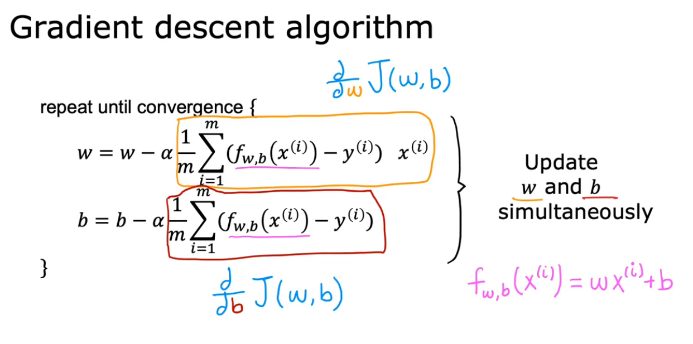

    - Note that $ f_{w, b}(x^{(i)}) $ is a linear convergence model so $ f_{w, b}(x^{(i)}) = wx^{(i)} + b $.

    Now, let's get familiar with how gradient descent works:

    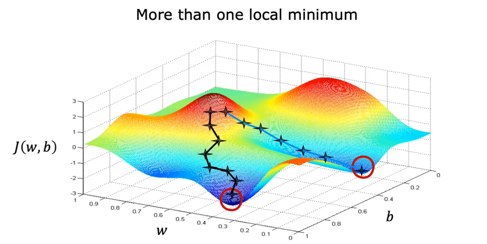

    - One issue we saw with the algorithm was that it can lead to a local minimum instead of a global minimum (point with the lowest possible value for cost function `J` out of all possible points). 
    - Looking at the 3D surface plot from earlier, you can see that there are multiple local minimums, which you can end up at depending where you start.

    Let's look at the square error function's 3D surface plot:

    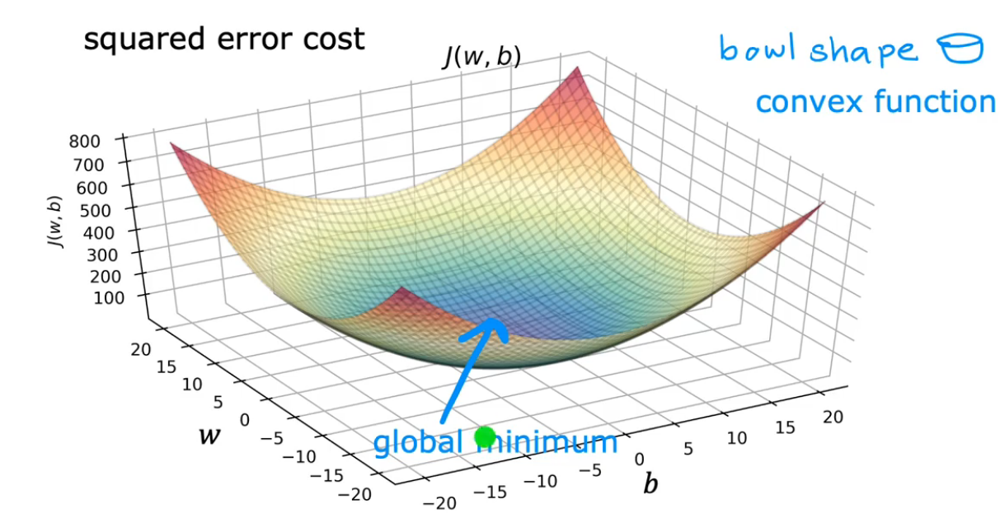

    - It has a single global minimum and no local minimums because of the bowl shope.
    - This cost function is a convex function; a bowl-shaped function that cannot have any local minima other than a single global minimum.
    - As long as your learning rate is chosen properly, it will always converge to the local minimum.

    Now, let's use gradient descent on our training data:

    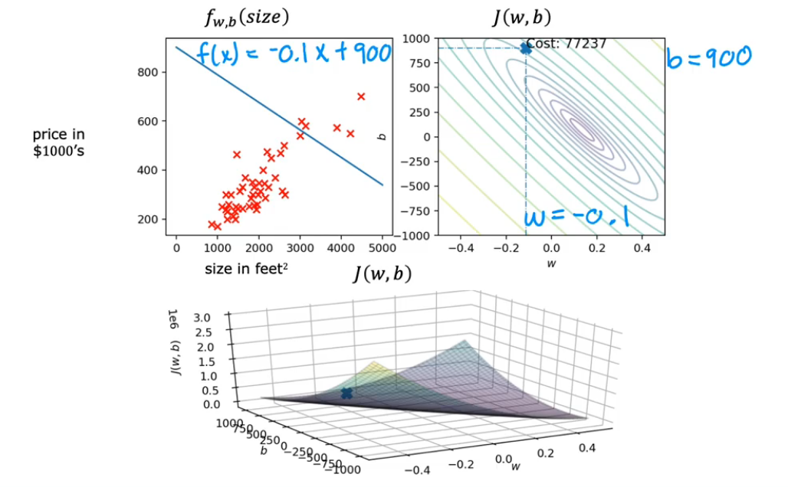

    - Often, `w` and `b` are intialized to 0, but we will initialize them to -0.1 and 900 respectively for this example.
    
    Now, let's take one step:

    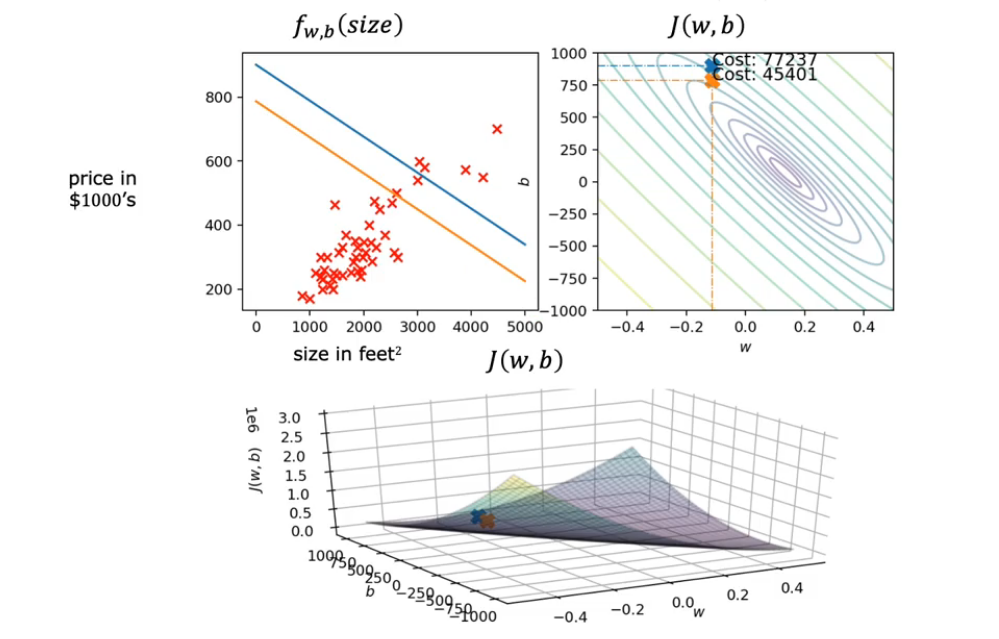

    - Notice that the straight fit has changed a bit.

    And another step:

    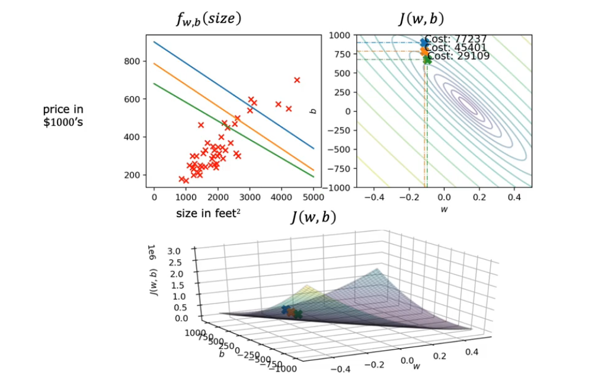

    - Again, `f` has changed a bit.

    Let's take some more steps:

    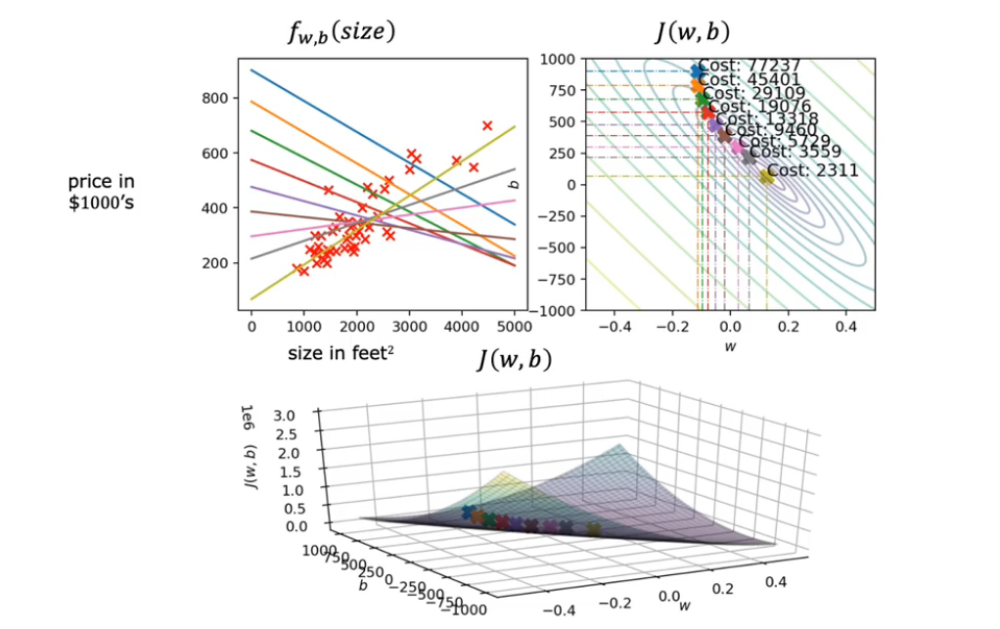

    - As you take more steps, the cost `J` decreases at each update. If we observe the change in `f`, we can see that it starts fitting the data better and better until we reach the global minimum (yellow line). 
    
    You can now use this model to predict housing prices based on their size:

    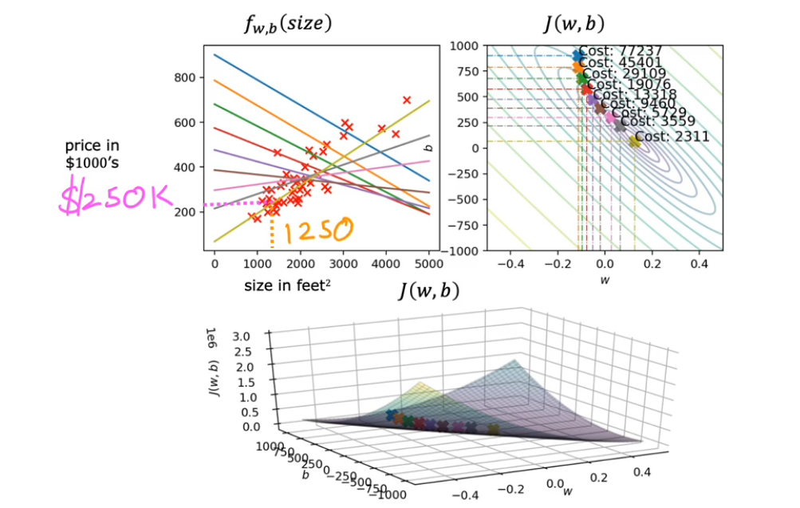

    This gradient descent process is called "Batch":

    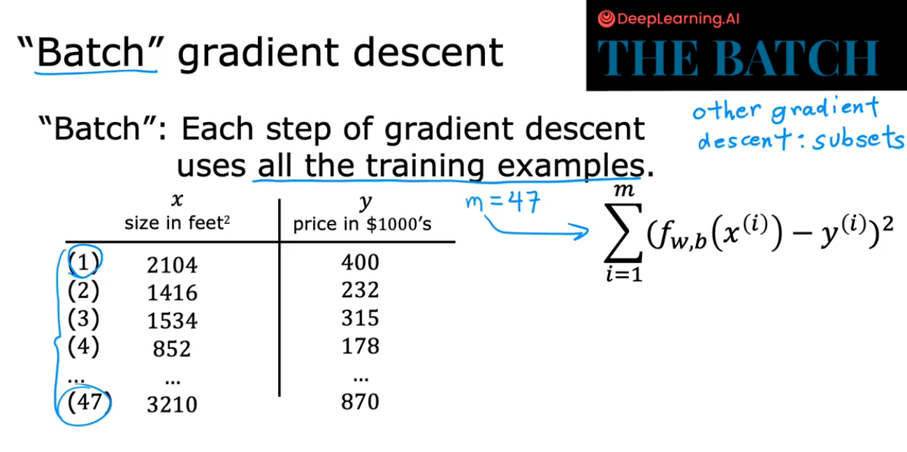

    - "Batch" refers to the fact that we're looking at all of the training examples on every step of gradient descent instead of a subset of the training data. When computing the derivatives, we're computing a sum of the whole data (1 to m).
    - There are other versions of gradient descent that looks at only a subset of the training data at each update step.

##### Optional Lab: Gradient Descent for Linear Regression
- [Gradient Descent for Linear Regression](https://colab.research.google.com/drive/1I-TCaw59ZmU2HVhA7hbfN2AoRaCehlxQ?authuser=4)

#### Multiple Features
- 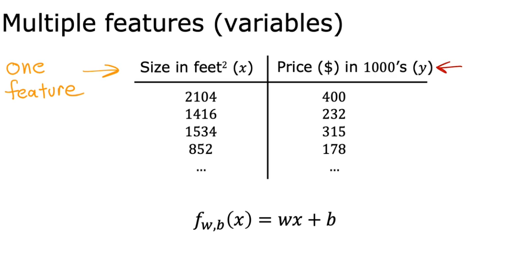

    - This is the original model with one feature.

    Let's look at a model with multiple features:

    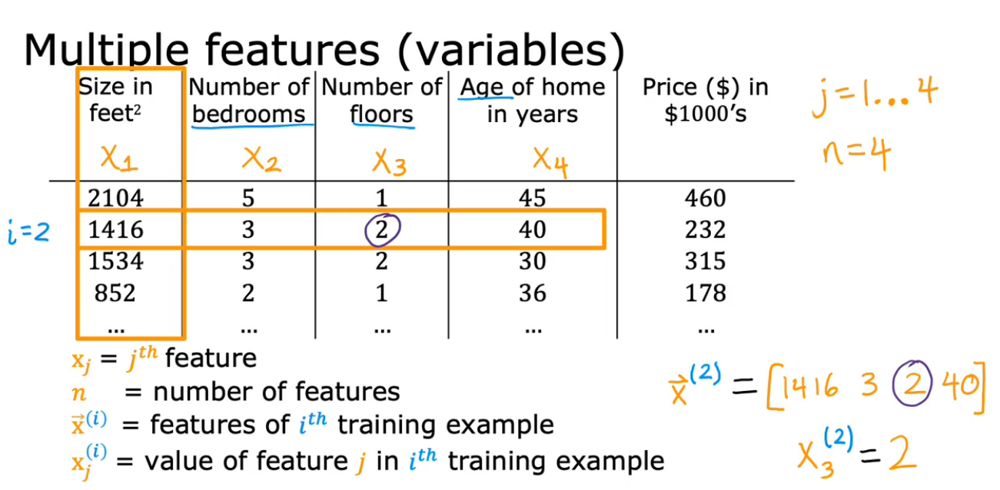

    - Here, we have 4 features.
    - $ x_{j} $ is the $ j^{th} $ feature while $ \vec{x}^{(i)} $ denotes the $ i^{th} $ training example which would include the $ i^{th} $ values for all features.
        - The arrow above $ \vec{x}^{(i)} $ denotes a vector. It's an optional signifier that's sometimes used to emphasize that this term is a vector and not a number
    - Notice that $ \vec{x}^{(i)} $ represents a row, so it's sometimes called a row vector instead of a column vector.

    Let's take a look at what our model will look like with multiple features:

    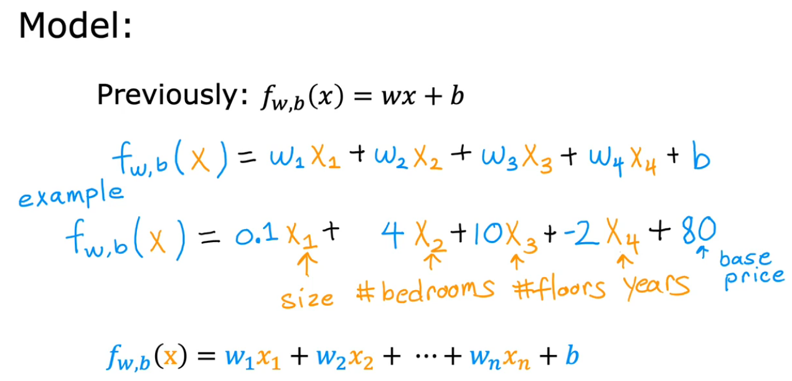

    - Looking at the example model, let's see what each term means. Remember that the price is in thousands. 
        - 80 would be the base price assuming you have none of the other features. 
        - 0.1 indicates that the price increases by 0.1 thousand dollars for every square foot added.
        - For each additional bedroom, the price increases by $4 thousand dollars.
        - For each addition floor, the price increases by $10 thousand dollars.
        - For each addition year of the house's age, the price decreases by $2 thousand dollars.
    
    Let's rewrite the expression in a simpler but equivalent way:

    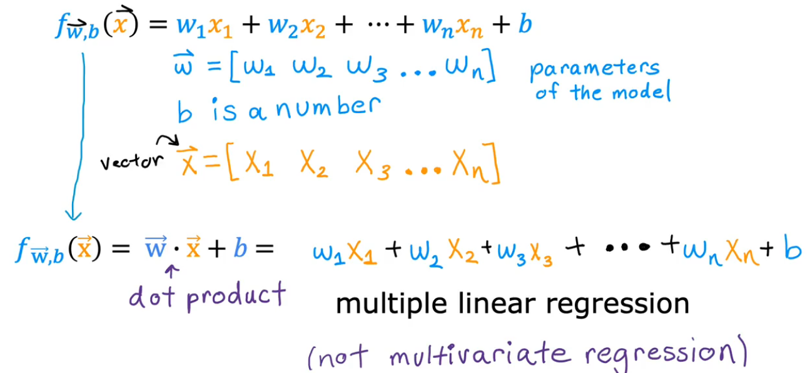

    - The row vector $ \vec{w} $ together with `b` are the parameters of the model.
    - The row vector $ \vec{x} $ is a list of the features.
    - This linear regression model with multiple features is called **multiple linear regression**.
    - This is not multivariate linear regression.
    - There's a neat trick called vectorization to implement this and many other learning algorithms.

#### Vectorization
- Vectorization will make your code code and also make it run much more efficiently.

- Learning how to write vectorized code will allow you to also take advantage of modern numerical linear algebra libraries, as well as maybe even GPU (graphics processing unit) hardware. This is hardware objectively designed to speed up computer graphics in your computer, but it turns out that it can be used when you write vectorized code to also help you execute your code much more quickly.

- Vectorization example:

    

    - Notice that in linear algebra, the index of the counting starts from 1. 
    - In Python, you can define the vectors using NumPy (most widely used linear algebra library and in machine learning) arrays.
        - Indexing in Python starts at 0.
    - If we hard coded our model, it would get more and more inefficient the more features we had.
    - Using a for loop also isn't that efficient. 
    - The vectorization method only uses a single line of code by using NumPy's `dot` function (vectorized implementation of a dot product operation between two vectors) to calculate the dot product. This method will run faster than the last two methods.
    - Vectorization has 2 distinct benefits:
        1. shorter code
        2. faster
            - The NumPy `dot` function is able to use parallel hardware on your computer.

- Let's take a look at what our computer does behind the scenes to make vectorized code run faster:
    
    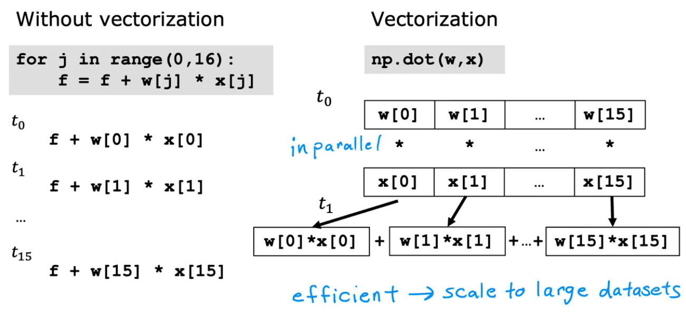

    - Without vectorization, the code calculates each step one by one.
    - With vectorization, the computer calculates each product of `w` and `x` at the same time in parallel. The computer then takes all the results and adds them up efficiently using specialized hardware. 
        - This is why code with vectorization performs much faster and efficiently than code without vectorization. This matters more when you're running learning algorithms on large datasets or trying to train large models, which is often the case with machine learning.
        - Being able to vectorize implementations of learning algorithms, has been a key step to getting learning algorithms to run efficiently, and therefore scale well to large datasets that many modern machine learning algorithms now have to operate on. 

    Let's take a look at an example of how this helps with implementing multiple linear regression:

    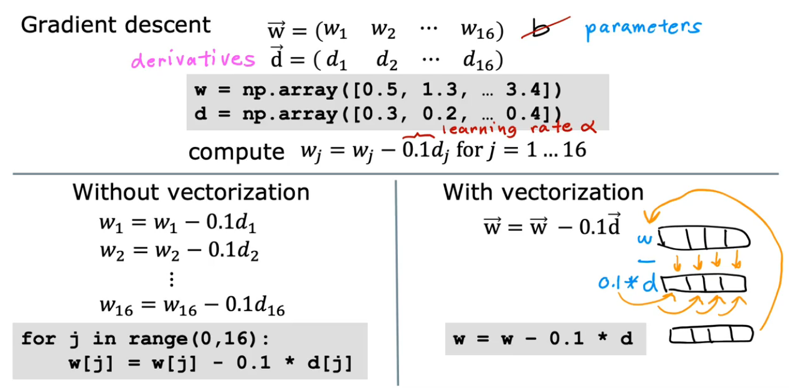

    - Let's say you have a problem with 16 features and 16 parameters $ \vec{w} $ in addition to the parameter `b`, and you calculated 16 derivative terms $ \vec{d} $ for these 16 weights. In code, maybe you stored these values in two NumPy arrays. We will be ignoring the parameter `b` for this example. Now, we want to compute and update each of these 16 parameters: $ w_{j} = w_{j} - 0.1d_{j} $ for $ j = 1 ... 16 $
        - Without vectorization, we can see that the code updates each `w` one step at a time.
        - With vectorization, you can imagine the computer's parallel processing hardware like this; it takes all 16 values in $ \vec{w} $ and subtracts, in parallel, 0.1 times all 16 values in $ \vec{d} $, and assigns all 16 calculations back to w all at the same time and all in one step.
        - Behind the scenes, the computer takes these NumPy arrays, `w` and `d`, and uses parallel processing hardware to carry out all 16 computations efficiently. Using a vectorized implementation, you should get a much more efficient implementation of linear regression.
        - Maybe the speed difference won't be huge if you have 16 features, but if you have thousands of features and perhaps very large training sets, this type of vectorized implementation will make a huge difference in the running time of your learning algorithm. It could be the difference between codes finishing in one or two minutes, versus taking many hours to do the same thing.

##### Optional Lab: Python, NumPy and Vectorization
- [Python, NumPy and Vectorization](https://colab.research.google.com/drive/1CG9VWRVDnovYoSqYbIaoQ4QwRPNUuG8T?authuser=4)

##### Gradient Descent for Multiple Linear Regression with Vectorization
- Let's review multiple linear regression and its simplified vector notation:

    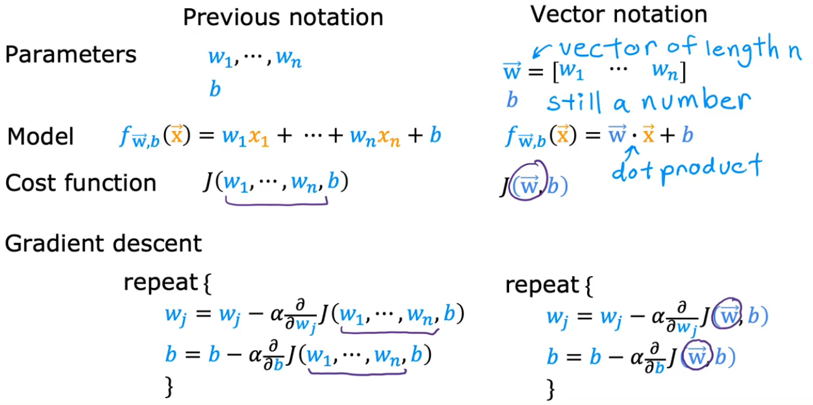

    Let's see what this will look like when we implement gradient descent, and in particular, let's take a look at the derivative term:

    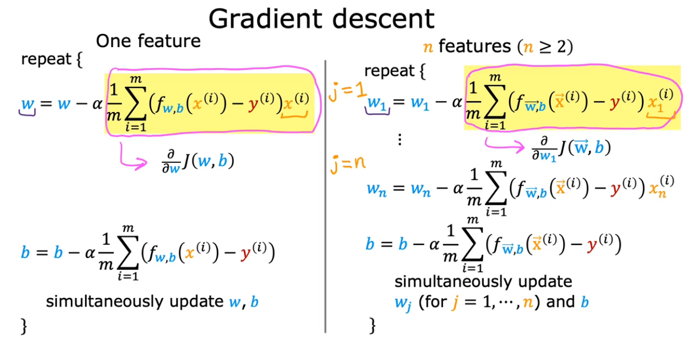

    - Notice the changes in gradient descent when we have multiple features. `w` and `x` are now vectors in `f`. We are now also updated `n` `w`s.

##### An Alternative to Gradient Descent
- Normal equation
    - algorithm works only for linear reqression
    - solves for `w`, `b` without iterations
    - some disadvantages are that it doesn't generalize other learning algorithms and is slow when the number of features is large (> 10,000)
    - almost no machine learning practioners should implement the normal equation themselves
    - What you need to know:
        - normal equation method may be used in machine learning libraries that implement linear regression.
        - gradient descent is the recommended method for finding parameters `w`, `b`

##### Optional Lab: Multiple Variable Linear Regression
- [Multiple Variable Linear Regression](https://colab.research.google.com/drive/1vMy08j5jBjzOntnWHB0unvdoHu7CE-on?authuser=4)

#### Feature Scaling
- Enables gradient descent to run faster.

- Let's take a look at the relationship between the size of a feature (how big the numbers are for that feature) and the size of its associated parameter:

    

    - In this data set, $ x_{1} $ takes on a range of relatively large values while $ x_{2} $ takes on a relatively small range of values.
    - When the range of a feature is large, a good model will learn to choose a relatively small parameter value (e.g. 0.1) and vice-versa.

    Let's see how this relates to gradient descent:

    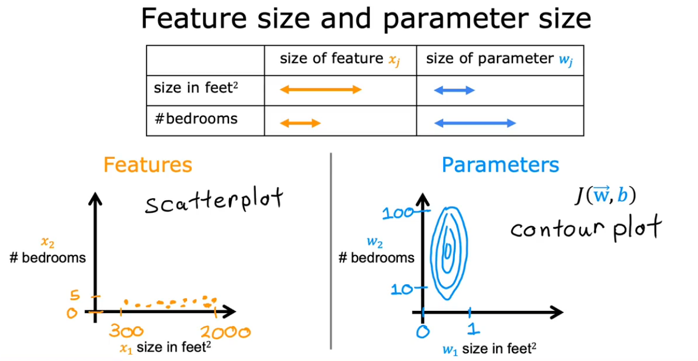

    - Notice how the horizontal axis has a much larger range compared to the vertical axis for the Features plot.
    - If we look at the contour plot on the right, we can see that a small change to $ w_{1} $ can have a very large impact on the price, while small changes in $ w_{2} $ don't change the cost function nearly as much.

    So, where does this leave us?

    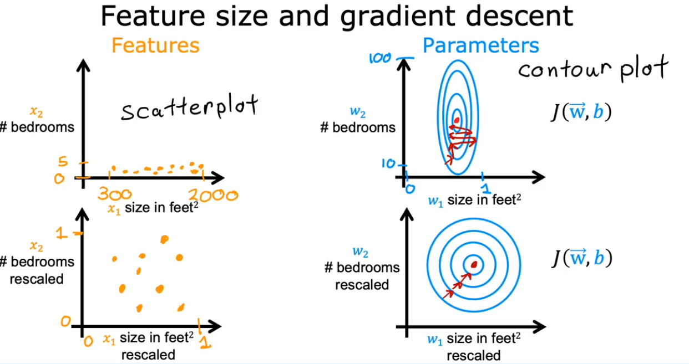

    - If we were to run gradient descent and use the training data as is, because the contours are so tall and skinny, gradient descent may end up bouncing back and forth for a long time before it can finally find its way to the global minimum.
    - In situations like this, a useful thing to do is to scale your features, performing some transformation of your training data so that, say, $ x_{1} $ may now range from 0 to 1 and $ x_{2} $ might also range from 0 to 1 (bottom left plot). Notice that the scale of the bottom-right plot is a lot different than the one above it. The difference is that $ x_{1} $ and $ x_{2} $ are both now taking comparable ranges of values to each other.
        - If we run gradient descent on this rescaled data, the contours will look like circles and less tall and skinny. Gradient descent can find a much more direct path to the global minimum.

- How do we actually scale features?

    Feature scaling:

    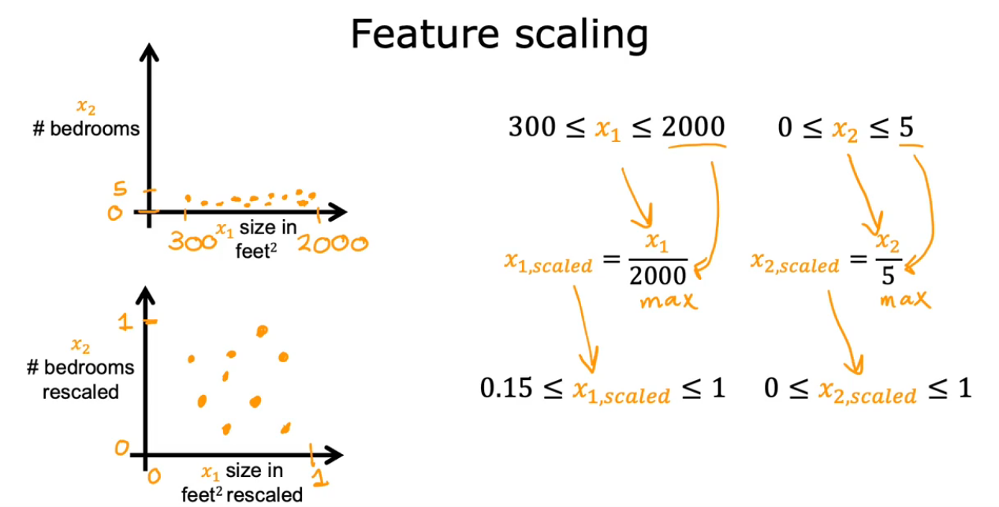

    - One way is to divide each feature by the max value of its range. This will only work for positive values.
    - A more general method is to multiply each value of a feature by $ \frac{(x_{j} - min_{j})}{(max_{j} - min_{j})} $.

    We can also do what's called mean normalization:

    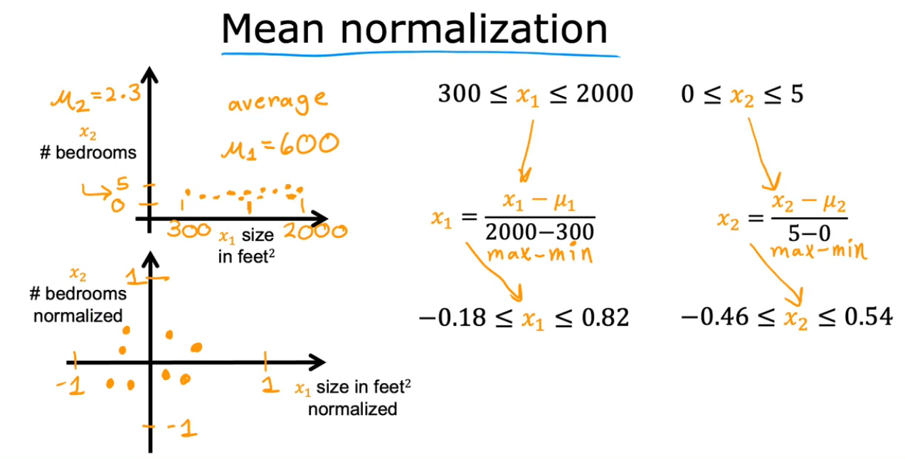

    - Start with the original features and rescale so that both of them are centered around 0.
    - Whereas before they only had values greater than zero, now they have both negative and positive values that may be usually between -1 and +1.
    - So let's find the mean normalization of $ x_{1} $:
        1. Find the average, aka the mean of $ x_{1} $ on your training set, and let's call this $ \mu_{1} $. Let's say it's 600 in this case.
        2. For each $ x_{1} $, $ x_{1} = \frac{x_{1} - \mu_{1}}{max - min} = \frac{x_{1} - \mu_{1}}{2000 - 300} $. 
        3. After those calculcations, you get the normalized $ x_{1} $ range $ -0.18 \leq x_{1} \leq 0.82 $.

        We can do the same for $ x_{2} $. The results are shown above.
    
    Z-score normalization:

    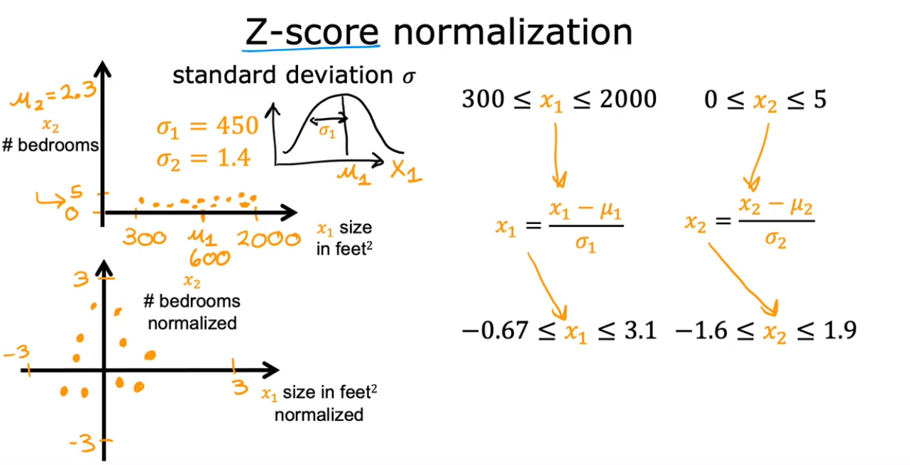
    
    - For this technique, we'll need the standard deviation $ \sigma $ (Greek letter "sigma") of each feature.
        - Here's (bell-curve in picture above) what standard deviation looks like on the normal distribution of the bell-shaped curve (Gaussian Distribution). It controls how wide or narrow the bell curve is.
    - $ \mu_{j} = \frac{1}{m} \sum_{i = 0}^{m - 1} x_{j}^{(i)} $
    - $ \sigma_{j}^{2} = \frac{1}{m} \sum_{i = 0}^{m - 1} (x_{j}^{(i)} - \mu_{j})^2 $
    - To implement a Z-score normalization of a feature:
        1. Get the mean $ \mu $.
        2. Get the standard deviation $ \sigma $.
        3. Calculate $ x_{j} = \frac{x_{j} - \mu_{1}}{\sigma_{1}} $
    
    Let's discuss some guidelines for feature scaling:

    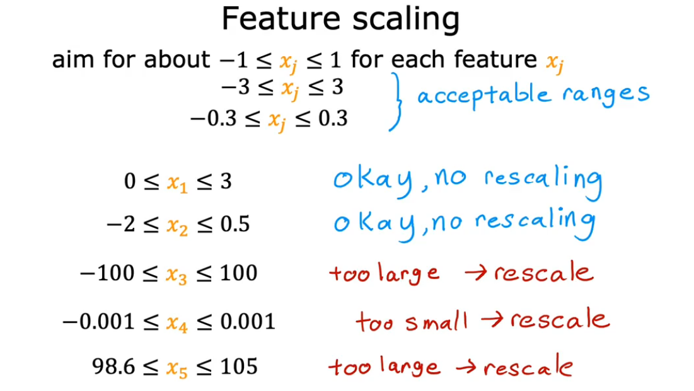

    - Aim for a range $ -1 \leq x_{j} \leq 1 $, but these values can be a bit loose as shown above.
    - Small ranges close to $ -1 \leq x_{j} \leq 1 $ will probably work fine without rescaling. You can rescale if you would like though; no harm in rescaling.
    - A very large or very small range should be rescaled. 
    - Ranges with large numbers, which are relatively large compared to other features, will cause gradient descent to run more slowly. Feature rescaling will likely help.
    - There's no harm in feature rescaling, so just rescale when in doubt.

#### Checking Gradient Descent for Convergence
- When running gradient descent, how can you tell if it is converging? That is, whether it's helping you to find parameters close to the global minimum of the cost function. By learning to recognize what a well-running implementation of gradient descent looks like, we will also be better able to choose a good learning rate $ \alpha $.

- Here is the gradient descent rule. One of the key choices is $ \alpha $:

    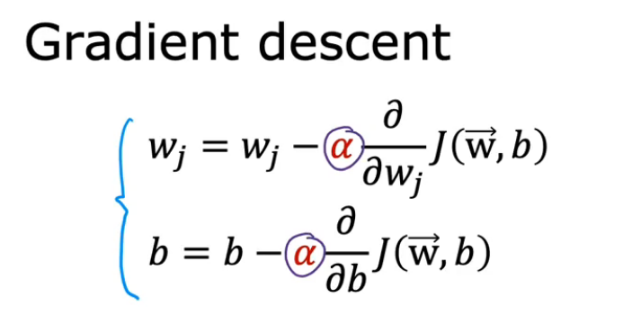

- Here's how we can make sure gradient descent is working properly:

    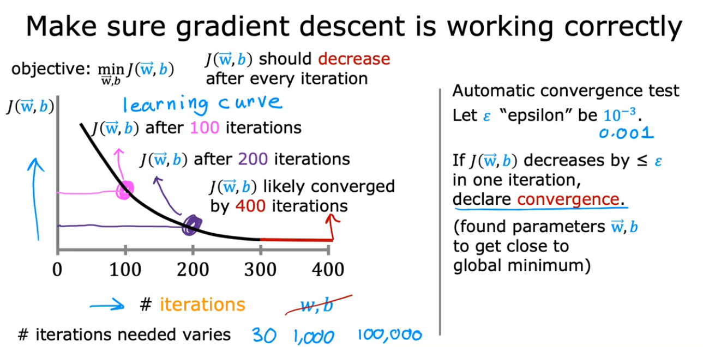

    - Recall that its job is to find parameters $ \vec{w} $ and `b` that hopefully minimizes the cost function `J`.
    - Plot the cost function `J` at each iteration of gradient descent; recall each iteration means after each simultaneous update of the parameters $ \vec{w} $ and `b`. `J` is on the vertical axis, while the number of iterations is on the horizontal axis.
    - The curve from the resulting graph is called a **learning curve**. Note that there are a few different types of learning curves used in machine learning.
    - Looking at this graphs helps you to see how your cost `J` changes after each iteration of gradient descent. If it's working properly, the cost `J` should decrease after each iteration. If `J` every increases after 1 iteration, it usually means $ \alpha $ is chosen poorly (usually means it's too large), or there could be a bug in the code.
    - Notice how `J` levels off around 300 iterations, and the curve flattens out around 400 (i.e. gradient descent has more or less converged because the curve is no longer decreasing).
    - Note that the number of iterations it takes for gradient descent to converge can vary a lot between different applications.
    - It's difficult to tell how many iterations gradient descent needs to converge in advance, so we use a graph like the one above.
    - Another way to decide when your model is done training is with an automatic convergence test.
        - $ \epsilon $ should be a small number like 0.001.
        - Hopefully when you declare convergence, you minimized `J`.
        - Choosing the right threshold $ \epsilon $ is pretty difficult, so the graph is a simpler technique to use.

#### Choosing the Learning Rate
- Your learning algorithm will run much better with an appropriate choice of learning rate. If it's too small, it will run very slowly and if it is too large, it may not even converge.

- 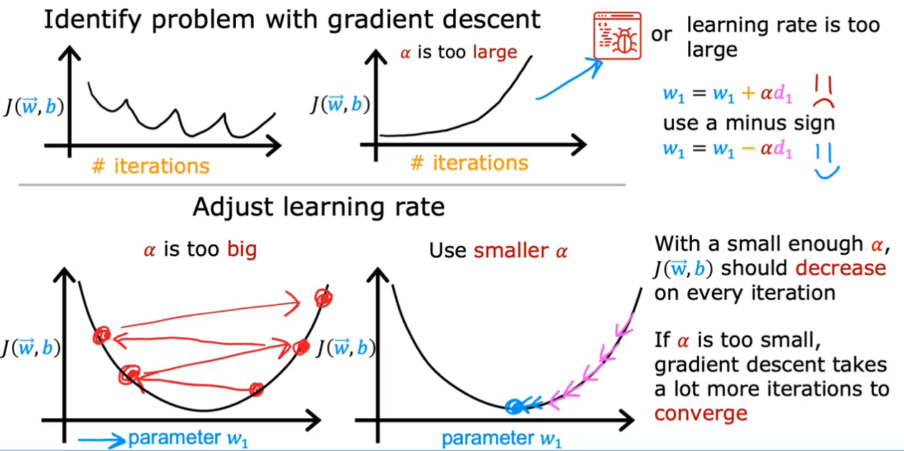

    - If you plot a learning curve and the cost `J` somestimes goes up and sometimes goes down, you should take that as a clear sign that gradient descent is not working properly. This could mean that there's a bug in the code, or your learning rate is too large. 
    - If the cost consistently increases after every iteration, it is most likely due to a large learning rate.
    - Both of the issues above can be addressed by using a smaller learning rate.
    - Both of the issues above can also be caused by a bug in the code.
    - With a small enough learning rate, the cost `J` could decrease after every iteration.
    - If gradient descent isn't working, set $ \alpha $ to a very very small number and see if that causes the cost to decrease after iteration. If it doesn't, that usually means there's a bug somewhere in the code. Note that setting $ \alpha $ to a very very small number is meant to be a debugging step, and a very very small value is not going to be the most efficient choice for actually training your learning algorithm.

    Here are values you can try:

    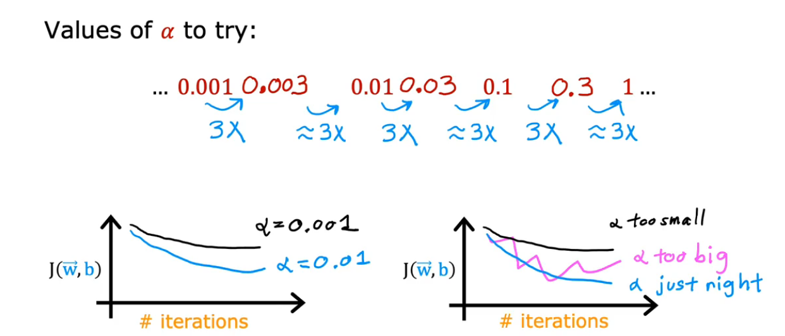

    - Notice that each subsequent value is 10x bigger than the last.
    - For each choice of $ \alpha $, you might run gradient descent just for a handful of iterations and plot the cost function `J` as a function of the number of iterations and after trying a few different values, you might then pick the value of $ \alpha $ that seems to decrease the learning rate rapidly, but also consistently.
    - "In fact, what I actually do is try a range of values like this. After trying 0.001, I'll then increase the learning rate threefold to 0.003. After that, I'll try 0.01, which is again about three times as large as 0.003. threefold to 0.003. After that, I'll try 0.01, which is again about three times as large as 0.003. So these are roughly trying out gradient descents with each value of Alpha being roughly three times bigger than the previous value. So, what I'll do is try a range of values until I found the value of that's too small and then also make sure I've found a value that's too large. I'll slowly try to pick the largest possible learning rate, or just something slightly smaller than the largest reasonable value that I found. When I do that, it usually gives me a good learning rate for my model." - Andrew Ng

#### Optional Lab: Feature scaling and Learning Rate (Multi-variable)
- [Feature scaling and Learning Rate (Multi-variable)](https://colab.research.google.com/drive/1Am_I8axDyqV0nUexZ3sERnI-Og2VSdKO?authuser=4)

#### Feature Engineering
- The choice of features can have a huge impact on your learning algorithm's performance. In fact, for many practical applications, choosing or entering the right features is a critical step to making the algorithm work well.

- Let's revisit the example of predicting the price of a house:

    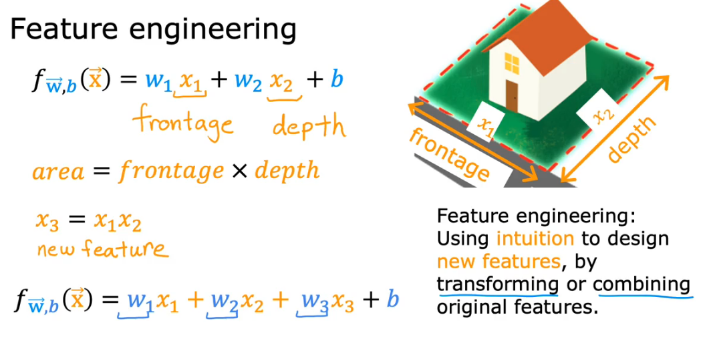

    - The two features may work okay, but we can actually choose a different way to use these features in the model that could be even more effective.
        - The area of the land can be calculated usin the frontage and depth. You may have an intuition that the area of the land is more predictive of the price, than the frontage and depth as separate features. With this new feature, we now have a new model. So the model can now choose parameters $ w_{1} $, $ w_{2} $, and $ w_{3} $, depending on whether the data shows that the frontage or the depth or the area turns out to be the most important thing for predicting the price of the house.
    - **Feature engineering** is where you might use your knowledge or intuition about the problem to design new features usually by transforming or combining the original features of the problem in order to make it easier for the learning algorithm to make accurate predictions.
        - Depending on what insights you may have into the application, rather than just taking the features that you happen to have started off with, sometimes by defining new features, you might be able to get a much better model. 
    - It turns out that this one flavor of feature engineering will allow you to fit not just straight lines, but curves, non-linear functions to your data. 

#### Polynomial Regression
- Polynomial regression will let you fit curves, non-linear functions, to your data.

- Let's say you have a housing data-set that looks like this, where feature `x` is the size in square feet:

    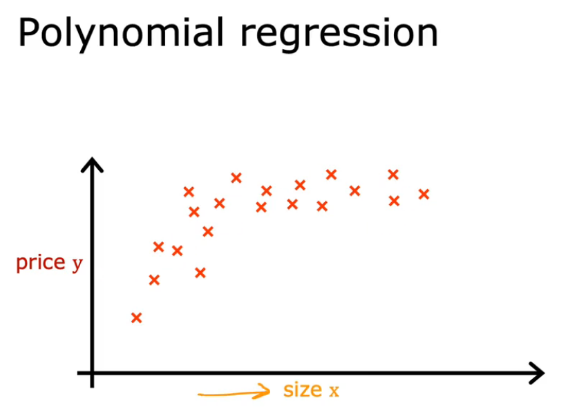

    - A straight line won't fit this data very well.

    A curve, maybe a quadratic function, will fit this data better:

    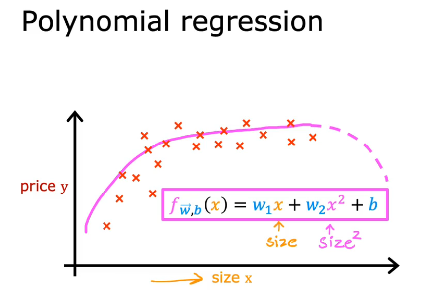

    - Well, a quadratic function has to come back down, which would not make sense for our scenario, since we wouldn't really expect housing prices to go down when the size increases.

    We may then choose a cubic function:

    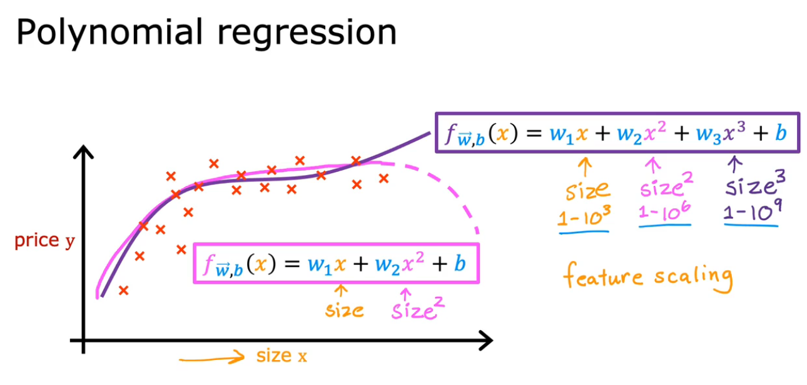

    - These are all examples of polynomial regression because you took your feature x, and raised it to the power of two or three or any other power.
    - If you create features that are these powers like the square of the original features like this, then feature scaling becomes increasingly important.

    Here's one last example which shows how you really have a wide range of choices of features to use:

    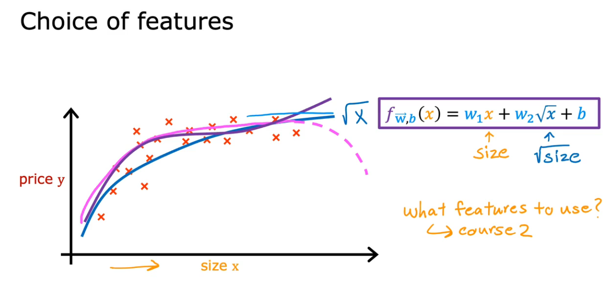

    - An alternative to $ x_{j}^{2} $ or $ x_{j}^{3} $ could be $ \sqrt{x_{j}} $
    - The square root function becomes less steep as `x` increases but it doesn't ever completely flatten out, and it never comes back down. This would be another choice of features that might work well for this data-set as well.

- We will discuss how to decide which features to use later on.

#### Optional Lab: Feature Engineering and Polynomial Regression
- [Feature Engineering and Polynomial Regression](https://colab.research.google.com/drive/1J8ofYy5RYJuvaTxER6bjYWKO26IVr47t?authuser=4)

#### Optional Lab: Linear Regression using Scikit-Learn
- [Linear Regression using Scikit-Learn](https://colab.research.google.com/drive/1RStSzMIjUEB8ZHerPnxt0oz_vBovpqwm?authuser=4)

#### Practice Lab: Linear Regression
- [Linear Regression](https://colab.research.google.com/drive/1qG_MCjpe_fH-hi_mUVbZpVNwbsMxm6Ns?authuser=4)

### Classification
- Classification is where your output variable `y` can take on only one of a small handfull of possible values instead of any number in an infinite range of numbers like regression.

- It turns out that linear regression is not a good algorithm for classification problems.

- Let's look at some examples of classification problems:

    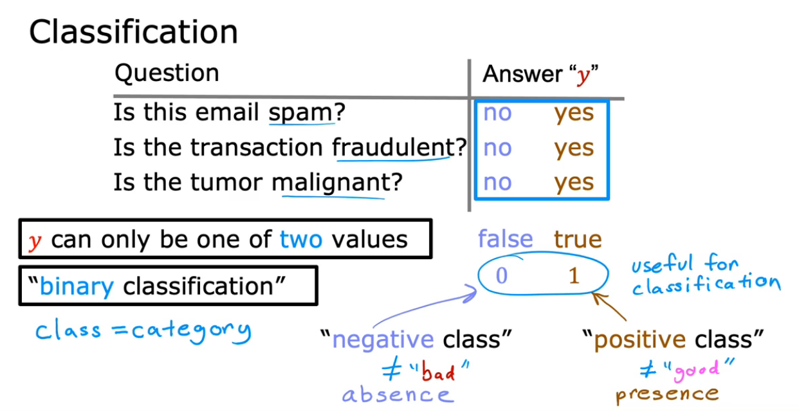

    - **Binary classification** refers to there being only 2 possible classes/categories.
        - We often designate classes as no/yes, false/true, or 0/1.
    
    Let's revisit the malignant tumor example:

    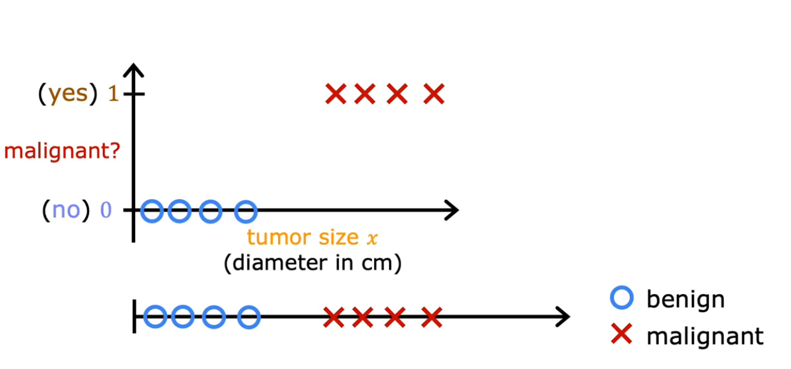

    - We previously represented it on a number line, but it's now on 2D graph, and the classes are represented as `0` and `1`.

    We could try using a linear regression model:

    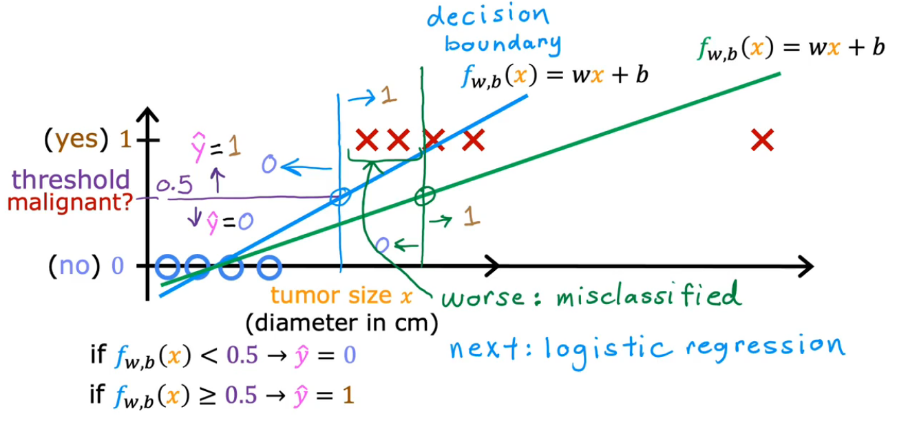

    - The linear regression model predicts all possible numbers, not just `0` and `1`. 
    - You could try using a threshold, e.g. the threshold is 0.5, and anything below it is classified as `0` and anything above or equal is `1`.
        - Notice where the threshold horizontal line intersects with `f`. If you draw a vertical line there, everything on the left is `0`and everything on the right is `1`. Now let's say we added a new point all the way to the right. `f` will shift, and the former statement will no longer be true. Adding a new value ended up with us learning a much worse function for this classification problem. Linear regression caused the best fit line, when we added one more example to the right, to shift over, therefore causing the dividing line (aka vertical line aka *decision boundary*) to shift over.
    - Logistic regression outputs a value between 0 and 1. Note that logistic regression is used for classification, specially binary classfication problems with binary output label `y` as either `0` or `1`.

#### Optional Lab: Classification
- [Classification](https://colab.research.google.com/drive/1WceZ_v0Fx7wPrEei7Ju98ISrf7WI9ByV?authuser=4)

#### Logistic Regression
- Probably the single most widely used classification algorithm in the world.

- Let's continue with the example of classifying whether a tumor is malignant:

    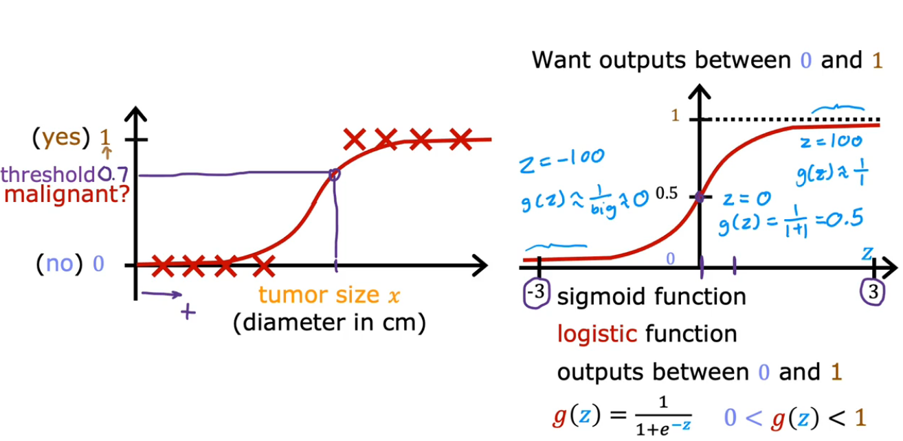

    - Logistic regression will fit an s-shaped curve similar to the red line on the left.
    - If a patient comes in with the size represented by the purple line, then the algorithm will output 0.7, suggesting that it's closer or more likely to be malignant than benign. The output label `y` is never 0.7. It's only ever `0` or `1`.
    - Notice the sigmoid function on the right and note the differences between it and the graph on the left.
    - The sigmoid function can be denoted as $ g(z) = \frac{1}{1 + e^{-z}} $ and $ 0 \lt g(z) \lt 1 $
        - When z is a very large positive number, 1 will be divided by a number very close to 1 and $ g(z) $ is going to be very close to 1.
        - When z is a very large negative number, 1 will be divided by a very large number and $ g(z) $ is going to be very close to 0.
        - At x = 0, $ g(z) = 0.5 $.
    
    Let's use the sigmoid function to build up to the logistic regression algorithm:

    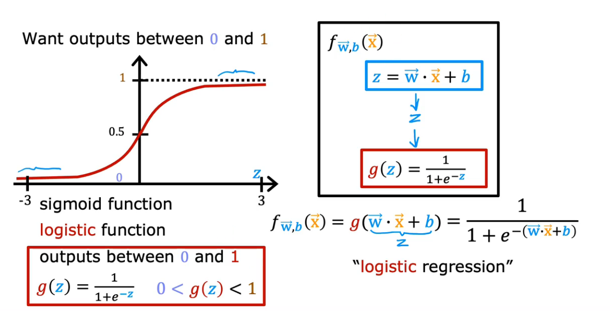

    - We'll do this in two steps:
        1. Store the result of $ f_{\vec{w}, b}(\vec{x}) $ previously defined in linear regression in a variable called `z`, which is the same `z` in the sigmoid function.
        2. Pass `z` to the sigmoid function.

        When we take these two equations together, they give you the logistic regression model: $ f_{\vec{w}, b}(\vec{x}) = g(\vec{w} \cdot \vec{x} + b) = g(z) = \frac{1}{1 + e^{-(\vec{w} \cdot \vec{x} + b)}} $.
    
    Let's see how to interpret the output of logistic regression:

    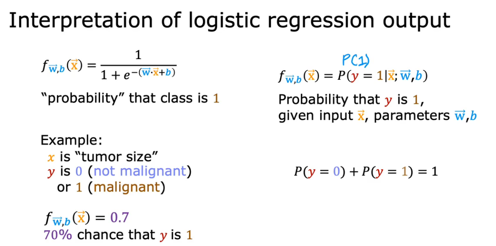

    - We will return to the tumor classfication example.
    - Think of the output as the "probability" the the class is `1` given a certain input $ \vec{x} $.
    - $ P(y = 0) = 1 - P(y = 1) = 1 - 0.7 = 0.3 = 30% $
        - $ P(y = 0) $ or probability that y = 0

##### Optional Lab: Logistic Regression
- [Logistic Regression](https://colab.research.google.com/drive/1OHbfCUhCxrgH1XMC5pNgakfOHrsesoon?authuser=4)

##### Decision Boundary
- 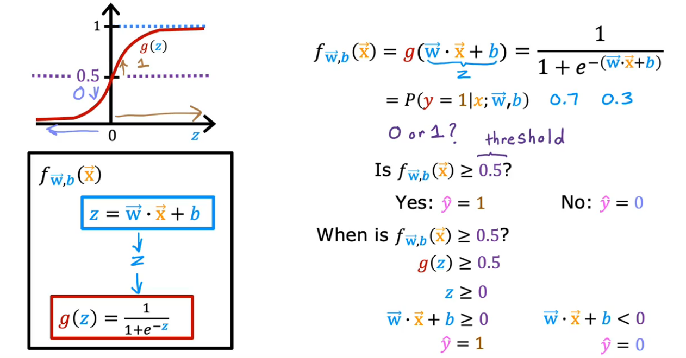

    - What if you want the learning algorithm to predict is the value `y` going to be `0` or `1`?
        - You may set a threshold and set $ \hat{y} $ to `1` if it's above or equal to the threshold and `0` if it's below the threshold. A common threshold value is 0.5.
    - $ g(z) \geq 0.5 $ when $ z \geq 0 $. $ z \geq 0 $ when $ \vec{w} \cdot \vec{x} + b \geq 0 $. So $ \hat{y} = 1 $ when $ \vec{w} \cdot \vec{x} + b \geq 0 $ and $ \hat{y} = 0 $ when $ \vec{w} \cdot \vec{x} + b \lt 0 $.

    Let's now visualize how the model makes predictions:
    
    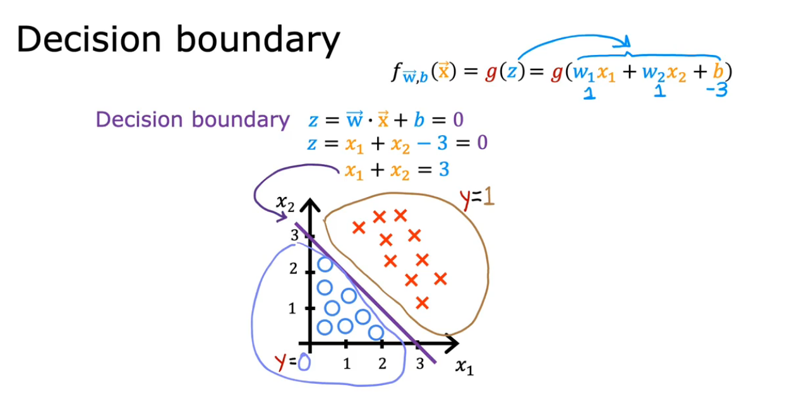

    - This classification has two features instead of one. Circles are negative examples while crosses are positive examples.
    - Let's take a look at when $ z \geq 0 $ and when $ z \lt 0 $. To do that, we'll take a look at the decision boundary line, which is when $ z = 0 $. It's called the decision boundary because that's the line where you're just almost neutral about whether `y` is `0` or `y` is `1`. In this case (with the values given for the parameters), `z` is 0 when $ x_{1} + x_{2} = 3 $. If the features $ \vec{x} $ are to the right of this line, $ y = 1 $ and vice versa.

    Let's look at a more complex example where the decision boundary is no longer a straight line:
    
    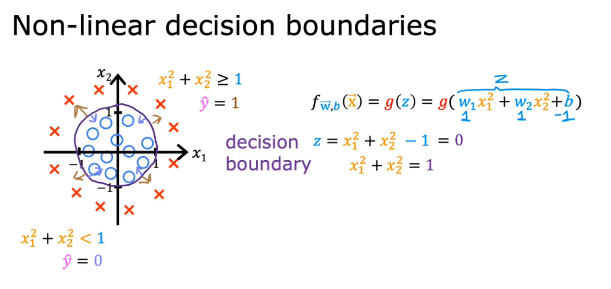

    - Polynomials can also be used in logistic regression like linear regression.

    We can come up with even more complex decision boundaries:

    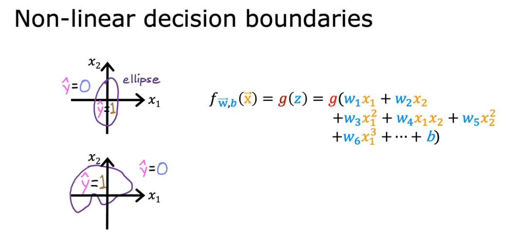

    - We can do so by having even higher order polynomial terms. For example, you can get a decision boundary that looks like an ellipse or some other complex decision boundary.
    - This implementation of logistic regression will predict $ \hat{y} = 1 $ inside the shape and $ \hat{y} = 0 $ outside the shape.
        - Note that this is just for this example. The reverse could be true depending on the training data.
    - If we do not include higher order polynomials, the decision boundary will always be linear.

###### Optional Lab: Logistic Regression, Decision Boundary
- [Logistic Regression, Decision Boundary](https://colab.research.google.com/drive/1r9siSIRokpJ-EEXlAXyVePiTLmrnho7c?authuser=4)

##### Cost Function for Logistic Regression
- The squared error cost function is not an ideal cost function for logistic regression.

- Here's what the training set for our logistic regression model might look like:

    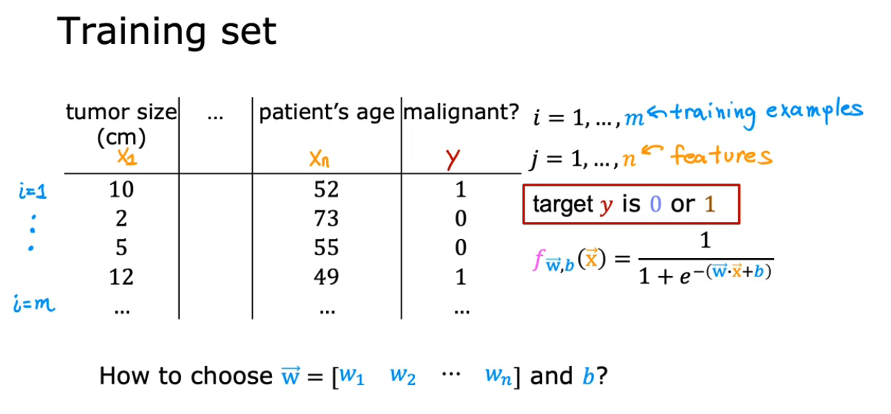

    Recall linear regression's cost function:

    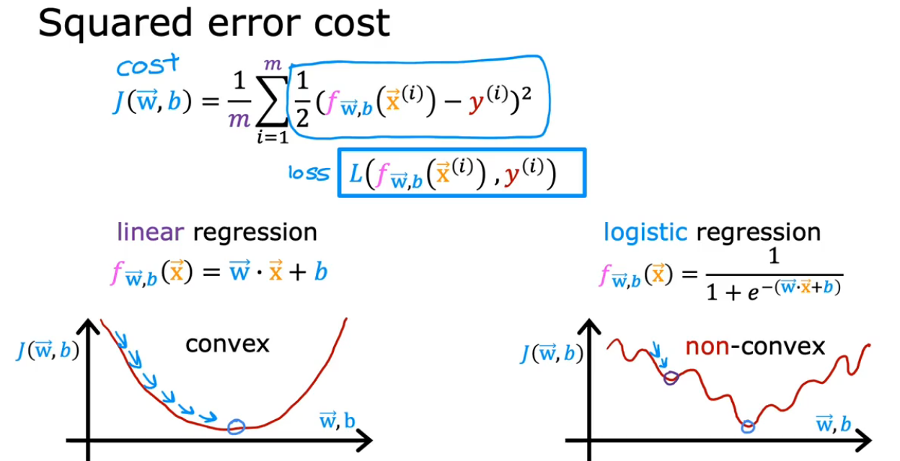

    - Using the same cost function for logistic regression will result in the graph on the right. This is a non-convex cost function, meaning if you try to use gradient descent, there are lots of local minima that you can get stuck in. So the squared error cost function is not a good choice for logistic regression
    - $ \frac{1}/{2} $ in `J` was moved inside the summation to make future calculcations simpler.
    - Let's call the term inside the summation of the cost function `J` *loss* or `L` which is a function of $ f_{\vec{w}, b}(\vec{x}^{(i)}) $ and $ y^{(i)} $. 
    - By choosing a different form for the loss function, we'll be able to keep the overall cost function convex.

    Here's the loss function that we will use for logistic regression:

    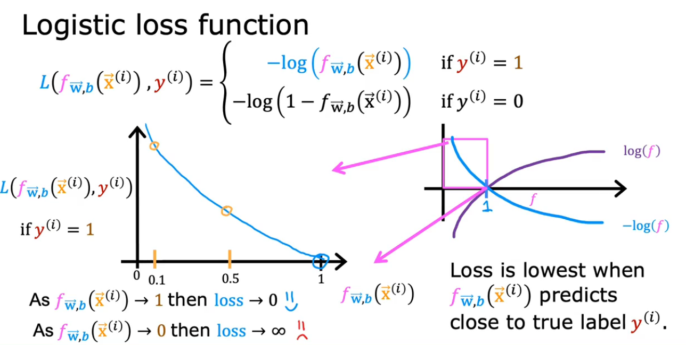

    - The loss function inputs $ f_{\vec{w}, b}(\vec{x}^{(i)}) $ and $ y^{(i)} $ and tells us how well we're doing on that example.
    - By summing up all of the losses on all of the training examples and averaging it out, you get the cost function `J`, which measures how well you're doing on the entire training set.
    - We can see the plot for $ log(f) $ and $ -log(f) $, which both intersects the x-axis at $ x = 1 $. `f` is the output of logistic regression, so it's always between 0 and 1.
    - Take a look at the plot on the left, which is a portion of the $ -log(f) $ plot. In this plot, we're looking at the scenario where $ y^{(i)} = 1 $. Notice how the loss is lowest when `f` predicts values close to $ y^{(i)} = 1 $. 

    Let's look at the 2nd part of the loss function corresponding to when $ y^{(i)} = 0 $:

    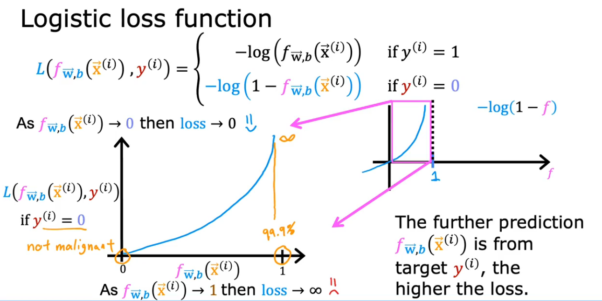

    - Take a look at what $ -log(1 - f) $ looks like when it's plotted.
    - Notice that the loss is lowest when `f` predicts values lose to $ y^{(i)} = 0 $.
    - Also notice that we penalize the model with a very high loss when it predicts very close to 1, which is far from $ y^{(i)} = 0 $. The loss is nearly $ \infty $.

    Now let's take a look at the new cost function:

    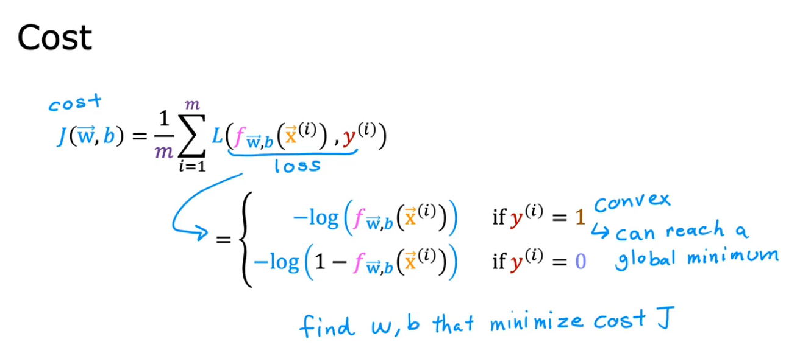

###### Optional Lab: Logistic Regression, Logistic Loss
- [Logistic Regression, Logistic Loss](https://colab.research.google.com/drive/19-VhAzFqWCb1NFirt0fBuXL63aaoBaag?authuser=4)

##### Simplified Cost Function
- Now let's look at the simplified version of the cost function, which will simplify the implementation of gradient descent for fitting the parameters of a logistic regression model:

    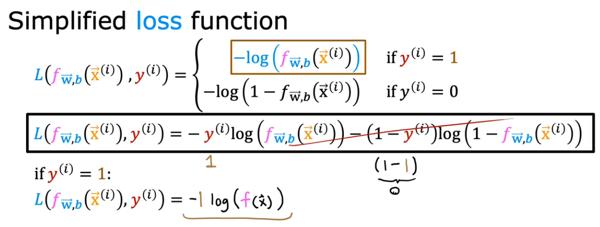

    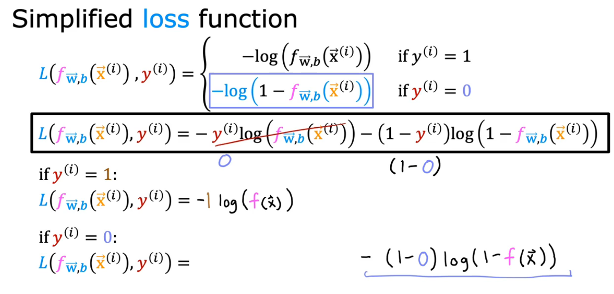

    - Depending on the value of label `y`, one of the equations will get canceled out.

    Now let's take a look at the simplfied cost function:

    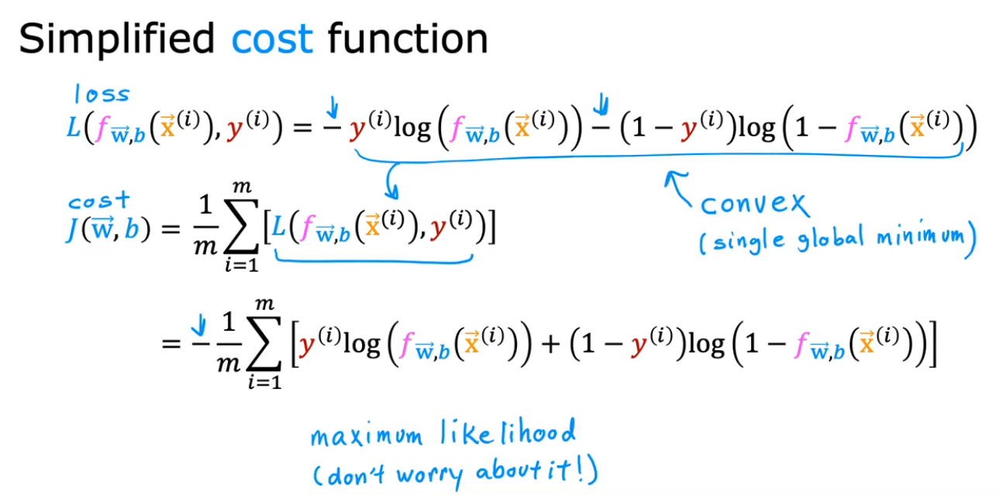

    - You might be wondering, why do we choose this particular function when there could be tons of other costs functions we could have chosen? Well, this particular cost function is derived from statistics using a statistical principle called maximum likelihood estimation, which is an idea from statistics on how to efficiently find parameters for different models. This cost function has the nice property that it is convex. But don't worry about learning the details of maximum likelihood. It's just a deeper rationale and justification behind this particular cost function. 

###### Optional Lab: Cost Function for Logistic Regression
- [Cost Function for Logistic Regression](https://colab.research.google.com/drive/1nAgkAAFmZvFia_W-CdmxJex4qGUAEKZa?authuser=4)

##### Gradient Descent Implementation for Logistic Regression
- 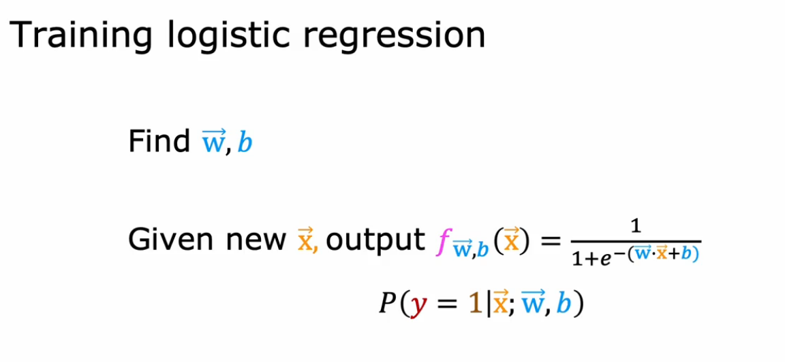

    - After you've found parameters `w` and `b` that minimize the cost function, if you give the model a new input, `x`, say a new patient at the hospital with a certain tumor size and age that needs a diagnosis. The model can then make a prediction, or it can try to estimate the probability that the label `y` is `1`.

    The algorithm you can use to minimize the cost function is gradient descent:

    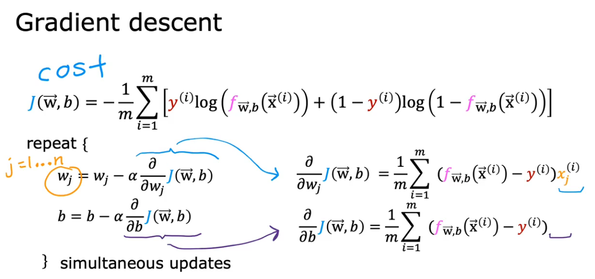

    - Similar to what you saw for linear regression, the way to carry out these updates is to use simultaneous updates, meaning that you first compute the right-hand side for all of these updates and then simultaneously overwrite all the values on the left at the same time.

    Let's plug in the partial derivatives into gradient descent:

    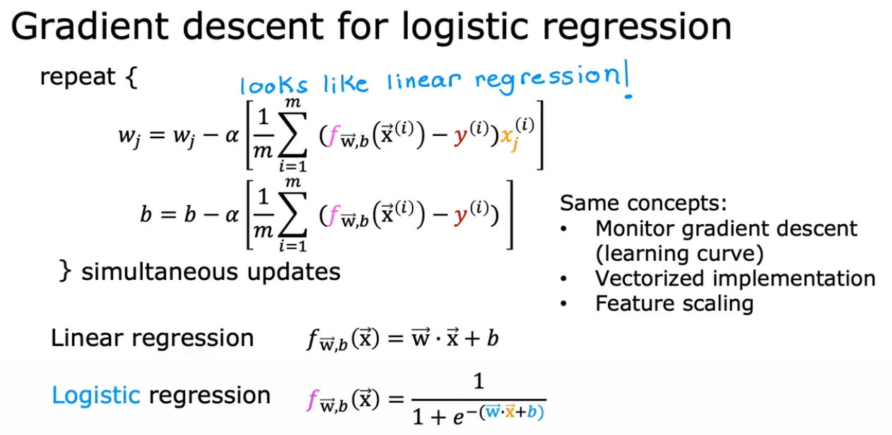
    
    - Notice that these equations look just like the ones for gradient descent. The difference is how $ f_{\vec{w}, b}(\vec{x}^{(i)}) $ is implemented.

###### Optional Lab: Gradient Descent for Logistic Regression
- [Gradient Descent for Logistic Regression](https://colab.research.google.com/drive/1W2u2SyAZ9c4Aj_VKcMht3tLLy1uAMG8G?authuser=4)

##### Optional Lab: Logistic Regression using Scikit-Learn
- [Logistic Regression using Scikit-Learn](https://colab.research.google.com/drive/1PNnz7L7-Btgg6bY526S_KvgZKO0MzZmb?authuser=4)

### The Problem of Overfitting
- Regression example:

    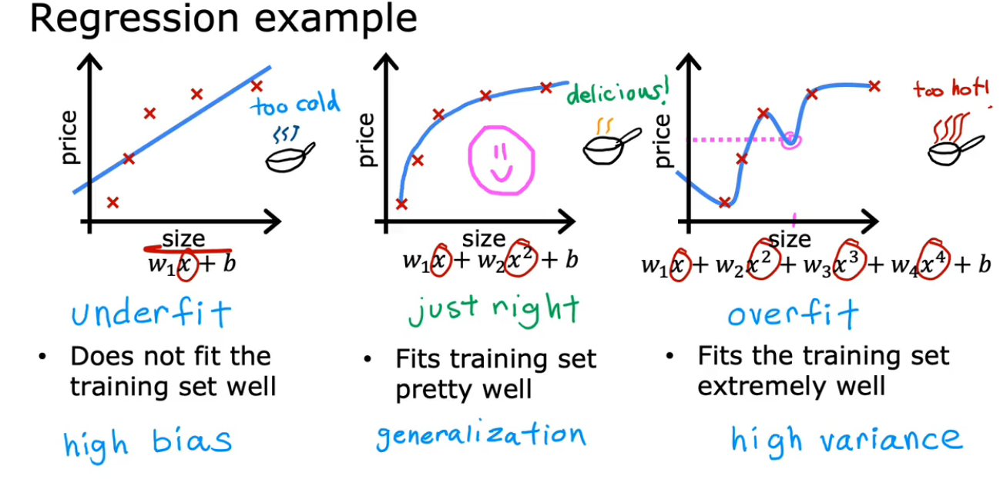

    - Let's use our old linear regression example which was about predicting house prices.
    - When we try to fit a linear line to the data, it does not fit very well because the price of houses seems to flatten out as the size gets bigger. This is what's called **underfitting**; the algorithm does not fit the training data well. Another term is **high bias**.
        - Another way to think of this form of bias is as if the learning algorithm has a very strong preconception, or we say a very strong bias, that the housing prices are going to be a completely linear function of the size despite data to the contrary. This preconception that the data is linear causes it to fit a straight line that fits the data poorly, leading it to underfitted data. 
        - Keep in mind that there are other definitions of bias in machine learning, e.g. bias based on characteristics such as gender or ethnicity.
    - **Generalization** is the idea that you want your learning algorithm to do well, even on examples that are not on the training set. Technically we say that you want your learning algorithm to generalize well, which means to make good predictions even on brand new examples that it has never seen before. 
    - **Overfit** means that the model has fit the data almost too well. Look at the graph all the way to the right, and you will see that the curve is wiggly (goes up and down a lot) which may result in getting undesireable outputs for outside data. Overfitting can also be referred to as **high variance**, i.e. adding one new training example to an overfit model could result in the function that the algorithm fits being totally different.
        - Overfit models may do well in the training set, but they may not generalize will to new examples.
    - The goal of machine learning is to find a generalized model like the one in the middle.

- Overfitting applies to classification as well:

    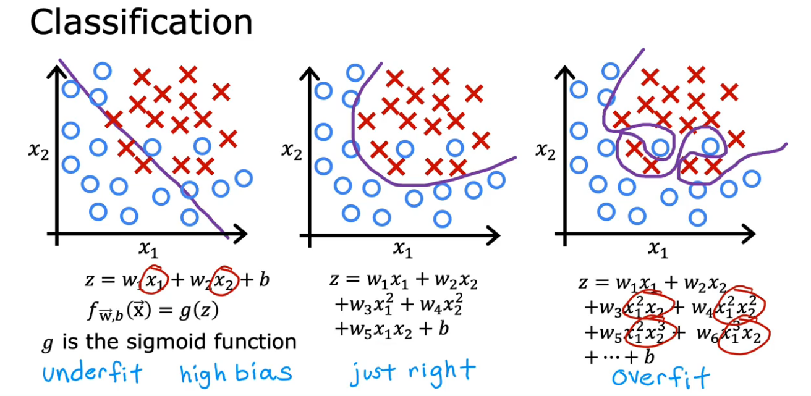

#### Addressing Overfitting
- Here's an overfit price prediction model:

    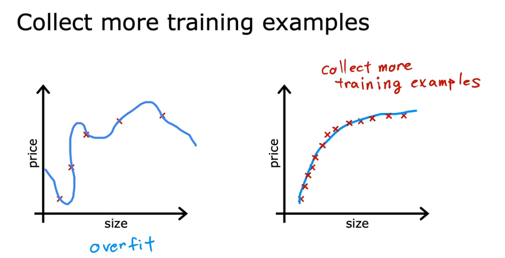

    - One way to address this problem is to collect more training examples. You can continue to fit a high order polynomial or some of the function with a lot of features, and if you have enough training examples, it will still do okay. 
    - Getting more data isn't always an option, but when the data is available, this method can work really well.

    Here's another method to address overfitting:

    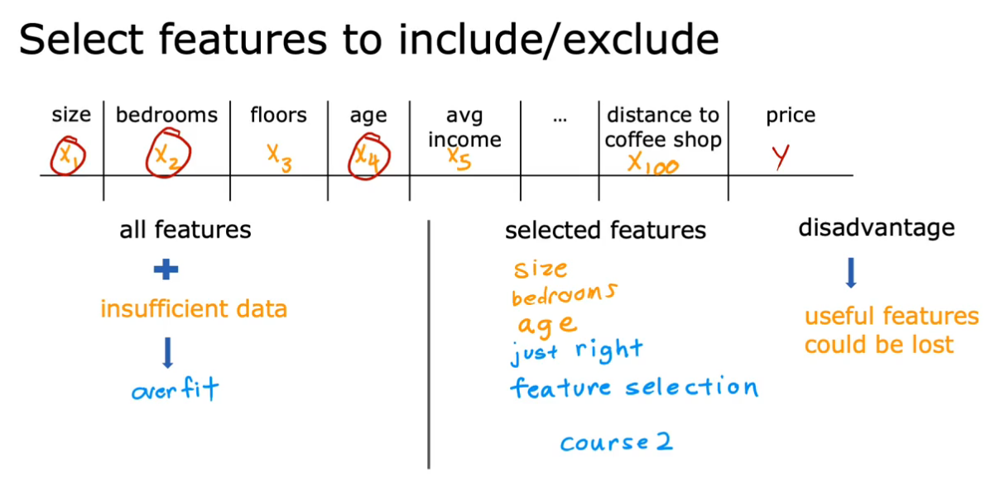

    - You can try to see if you can use fewer features.
        - Try not using so many polynomial features.
        - Your learning algorithm may also overfit your training set if you have a lot of features but not enough data. Picking a subset of the most relevant features may result in a model that is not as overfit. Choosing the most appropriate features to use is called **feature selection**. A disadvantage of this is that the algorithm is throwing away some of the information that you have about the houses.
    
    Here's a third technique for addressing overfitting called regularization:

    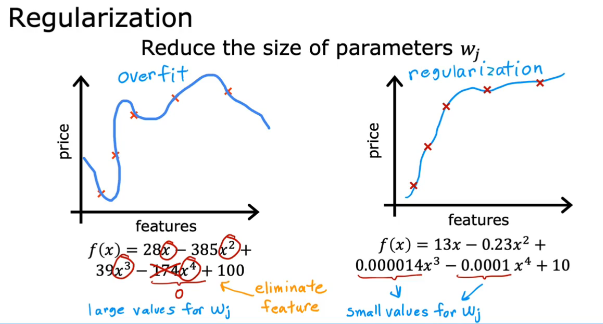

    - Regularization is a way to more gently reduce the impacts of some of the features without doing something as harsh as eliminating it outright. 
    - **Regularization** encourages the learning algorithm to shrink the values of the parameters without necessarily demanding that the parameter is set to exactly 0. Reducing some parameters may result in a curve that fits the training data much better.
    - Basically, regularization lets you keep all of your features, but they just prevents the features from having an overly large effect, which is what sometimes can cause overfitting.
    - We usually just regularize $ w_{j} $. It doesn't make a huge difference whether you regularize the parameter b as well, you could do so if you want or not if you don't. Andrew Ng does not. In practice, it should make very little different whether you regularize `b` or not.

    Here's a summary of all of the ways that we went over to address overfitting:

    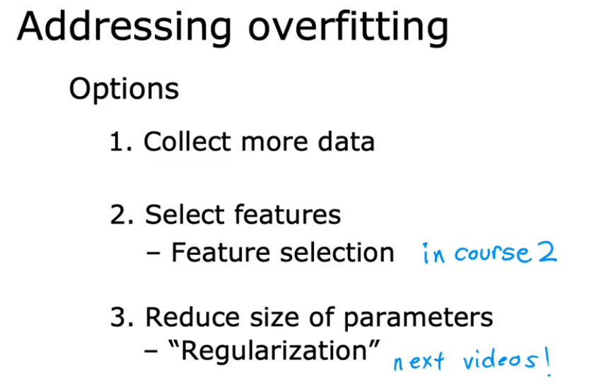

#### Optional Lab: Overfitting
- [Overfitting](https://colab.research.google.com/drive/12jnLdsRc_ZOBVcpWwqM2KOKw4GVkEp2Z?authuser=4)

#### Regularization

##### Cost Function with Regularization
- Here's an old example:

    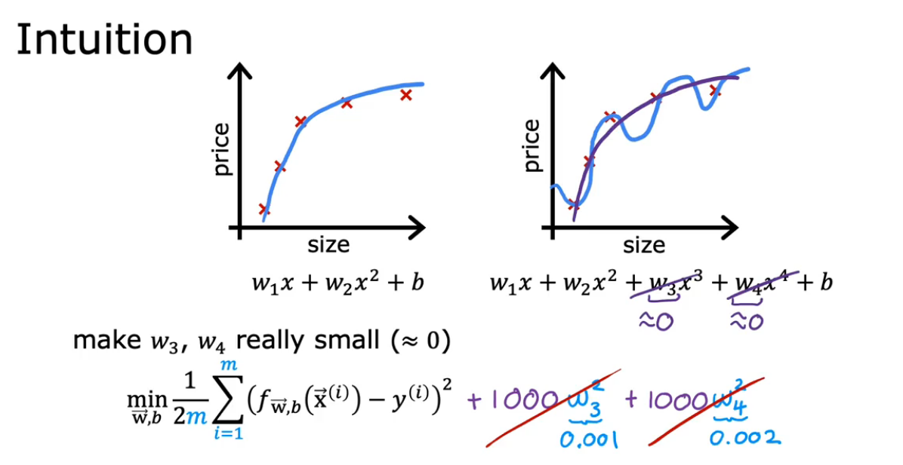

    - A quadratic function fits the data well while a very high order polynomial does not fit it very well.
    - Suppose that we had a way to make $ w_{3} $ and $ w_{4} $ really small. 
    - Let's say we add to the cost function $ 1000w_{3}^{2} + 1000w_{4}^{2} $. This would penalize the model for large values of $ w_{3} $ and $ w_{4} $. When we minimize this cost function, we'll end up with $ w_{3} $ and $ w_{4} $ close to 0, nearly canceling out $ x^{3} $ and $ x^{4} $ and getting rid of $ 1000w_{3}^{2} + 1000w_{4}^{2} $.

    Here's the general idea behind regularization:
    
    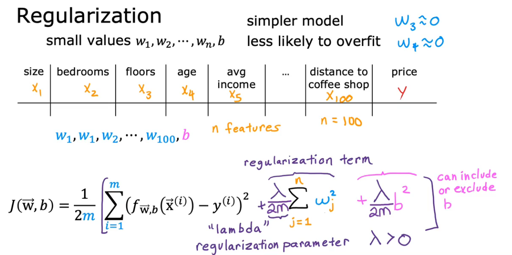

    - If there are smaller values for the paramters, then it's a bit like having a simpler model, maybe one with fewer features which is therefore less prone to overfitting.
    - We previously penalized $ w_{3} $ and $ w_{4} $, but for models with many features, it will be hard to choose which ones to regularize. So, regularization will generally penalize all features (penalize all $ w_{j} $ parameters). It's possible to show that this will usually result in fitting a smoother simpler, less wiggly function that's less prone to overfitting.
    - So for this example, if you have data with 100 features for each house, it may be hard to pick in advance which features to include and which ones to exclude. So let's build a model that uses all 100 features. Because we don't know which of these parameters are going to be the important ones, let's penalize all of them a bit and shrink all of them by adding this new term: $ \frac{\lambda}{2m} \sum_{j = 1}^{n} w_{j}^{2} $ where `n` is the number of features. $ \lambda $ is the Greek letter "lambda" and is usually called the **regularization parameter**. Similar to picking $ \alpha $, you will now have to choose $ \lambda $. $ \frac{\lambda}{2m} $ so that both terms are scaled by 2m, making it easier to choose a value for $ \lambda $ since they're both scaled the same way. As the number of training examples grow, $ \lambda $ is more likely to work if it's scaled by `2m`.
    - Again, in practice, penalizing `b` makes little difference, so we will not be penalizing `b`. Some implementations will include $ \frac{\lambda}{2m} b^{2} $, but this makes very little difference. The more common convention is to only regularize $ w_{j} $.

    To summarize:

    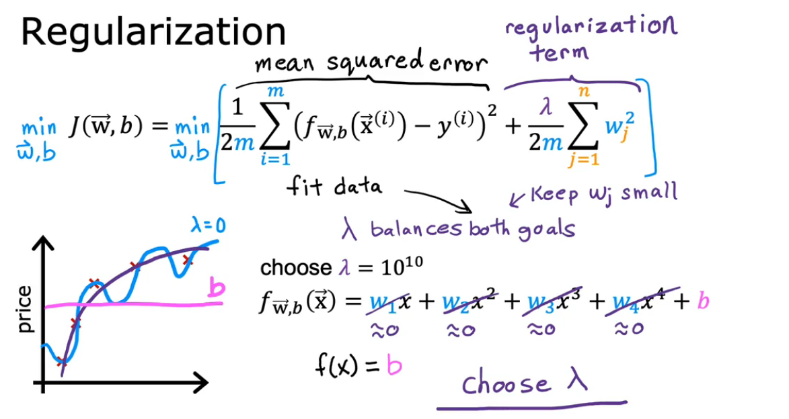

    - The new cost function is shown above with the regularization term. Let's break it down:
        - $ \frac{1}{2m}\sum_{i = 1}^m (f_{w, b}(x^{(i)}) - y^{(i)})^{2} $ fits the data.
        - $ \frac{\lambda}{2m} \sum_{j = 1}^{n} w_{j}^{2} $ keeps $ w_{j} $ small so as not to overfit the data.
        - The value of $ \lambda $ that you choose, specifies the relative importance or the relative trade off or how you balance between these two goals. 
    - Let's look at how $ \lambda $ affects our model by looking at two extremes:
        - Small number: $ \lambda = 0 $, the model may overfit
        - Large number: $ \lambda = 10^{10} $, all $ w_{j} $ are made irrelevant and $ f(x) $ is basically equal to `b`, i.e. the model underfits.
    - You want to choose a value of $ \lambda $ that is not too small and not too large, but just right, then hopefully you end up able to fit a 4th order polynomial, keeping all of these features, but with a function that looks like this (purple line).

##### Regularized Linear Regression
- 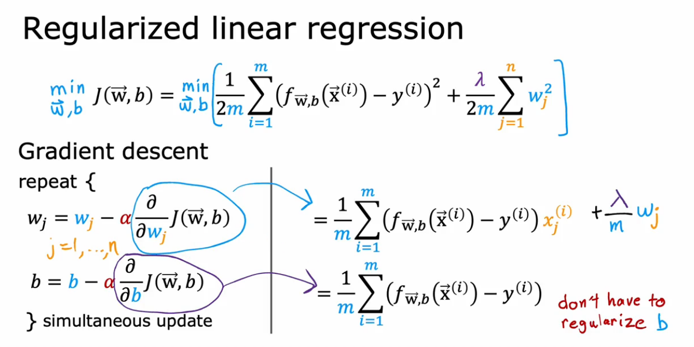
    
    - Note that the update step for $ w_{j} $ in gradient descent has an extra term. `b` does not have an extra term because we are not regularizing it.

    Here's what the new gradient descent algorithm will look like: 

    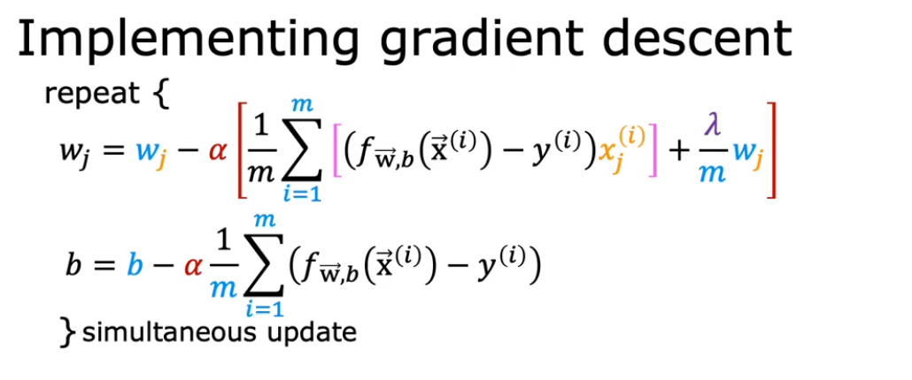

    Now let's get a better understanding of how the equation for $ w_{j} $ was derived:

    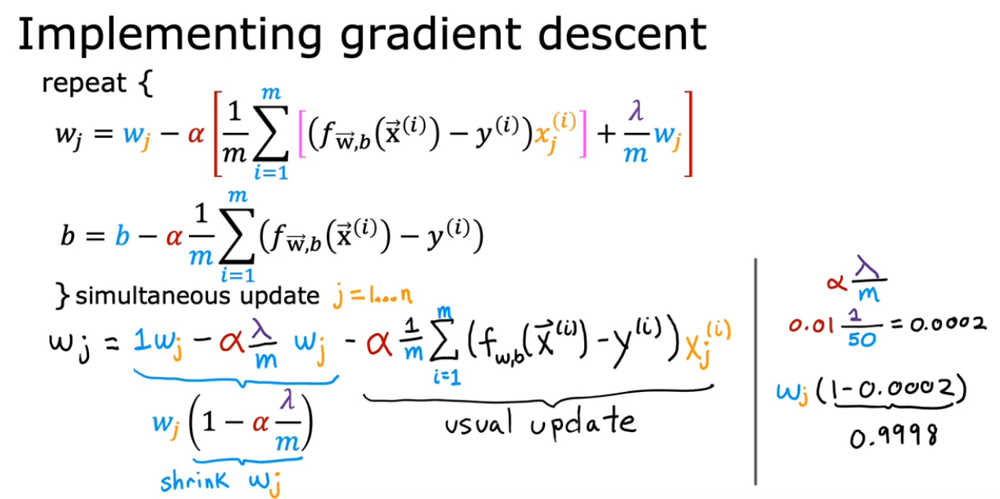

    - Here, we're rewriting $ w_{j} $.
    - So now, instead of $ w_{j} $ subtracting the usual update term, we're now multiplying $ w_{j} $ by a number before subtracting.
    - On the right, we can see what multiplying $ w_{j} $ by a number does. The number is slightly less than 1, so by multiplying it with $ w_{j} $, we're shrinking it just a little bit.
    - Regularization has the effect of shrinking the parameter $ w_{j} $ a little bit on every iteration.

    Here's how the partial derivatives are calculated:

    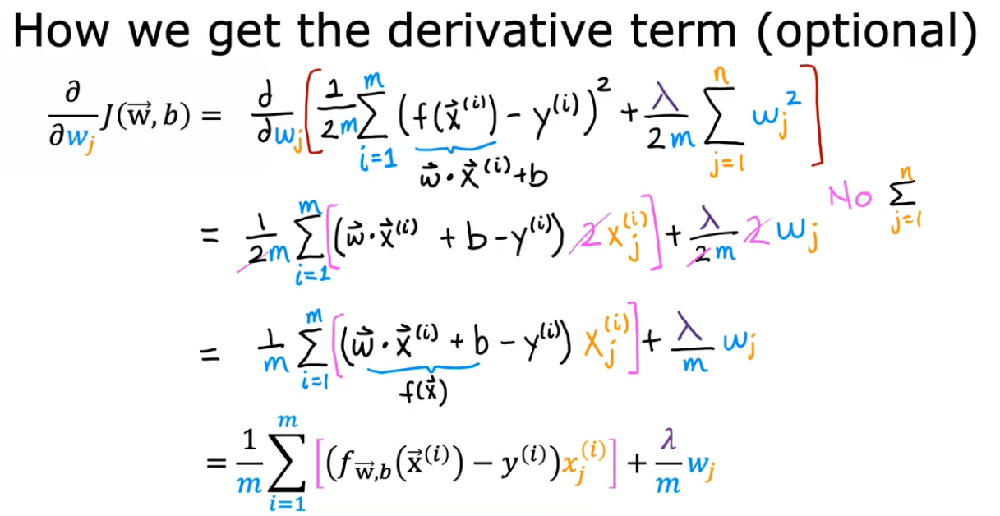
    
    - The summation remains for the first term due to the chain rule in calculus.

##### Regularized Logistic Regression
- 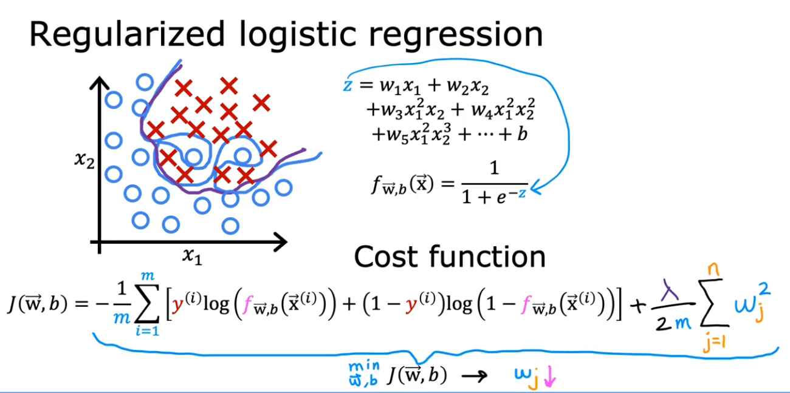

    - As seen before, logistic regression can be prone to overfitting if you fit it with very high order polynomial features like this. More generally, when you train logistic regression with a lot of features, whether polynomial features or some other features, there could be a higher risk of overfitting.
    - When you minimize this cost function as a function of `w` and `b`, it has the effect of penalizing parameters $ w_{1} $ through $ w_{n} $, and preventing them from being too large. 

    Let's take a look at how to implement gradient descent:

    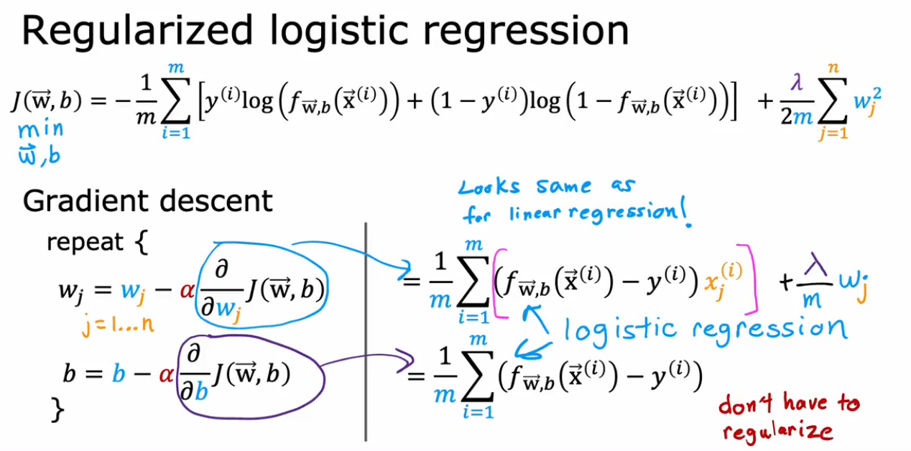

    - Note that this is identical to regularized linear regression. The only difference is the definition of `f`.

##### Optional Lab: Regularization
- [Regularization](https://colab.research.google.com/drive/1Y5tbpPOFqjGCfzIvv2SCKjGE835QrEfy?authuser=4)

### Practice Lab: Logistic Regression
- [Logistic Regression](https://colab.research.google.com/drive/1VRkENCB5PU_l0c-hAKhu9e5AzvNlMZTh?authuser=4)

## Neural Networks

### Neurons and the Brain
- The original motivation for the invention of neural networks was to write software that could mimic how the human brain or how the biological brain learns and thinks.

- Sometimes called **artifical neural networks**.

- Neural networks have become very different than how any of us might think about how the brain actually works and learns. Some of the biological motivations still remain in the way we think about artificial neural networks or computer neural networks today.

- The human brain, or maybe more generally the biological brain, demonstrates a higher level or more capable level of intelligence than anything else we've been able to build so far.

- 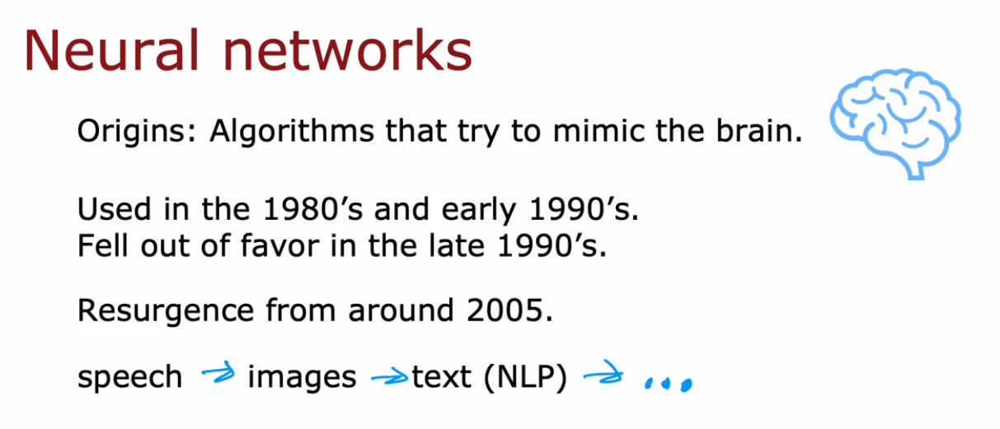
    
    - The first application area that modern neural networks or deep learning had a huge impact on was probably speech recognition, where we started to see much better speech recognition systems.
    - Then it started to make inroads into computer vision.
    - Then the next few years, it made us inroads into texts or into natural language processing, and so on and so forth. Now, neural networks are used in everything from climate change to medical imaging to online advertising to prouduct recommendations and really lots of application areas of machine learning now use neural networks. 
    - Even though today's neural networks have almost nothing to do with how the brain learns, there was the early motivation of trying to build software to mimic the brain. 

    So how does the brain work?

    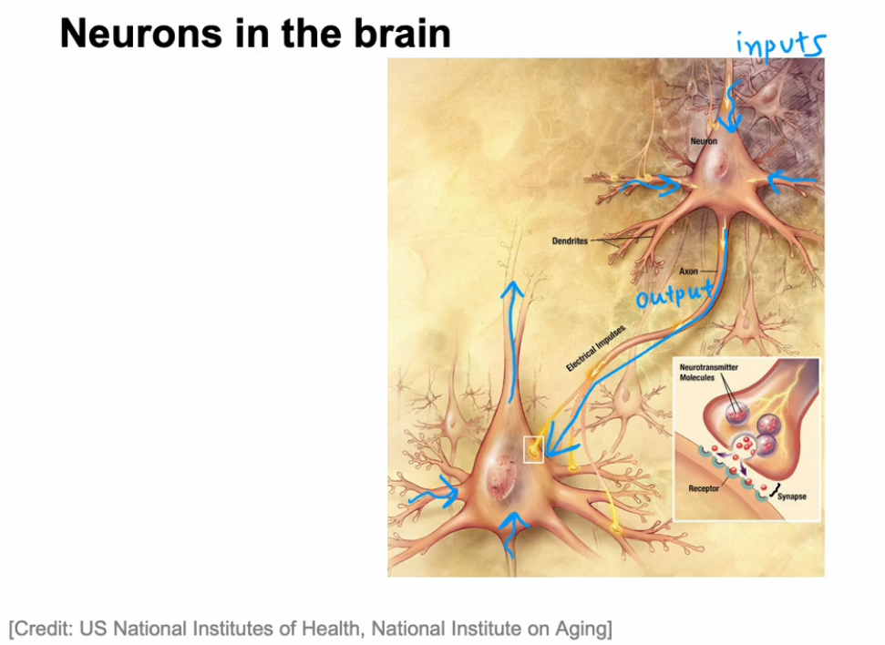

    - All of human thought is from neurons like this in your brain and mine, sending electrical impulses and sometimes forming new connections of other neurons.
    - Given a neuron like this one, it has a number of inputs where it receives electrical impulses from other neurons, and then the neuron at the top right carries out some computations and will then send this outputs to other neurons by this electrical impulses, and this upper neuron's output in turn becomes the input to this neuron down below, which again aggregates inputs from multiple other neurons to then maybe send its own output, to yet other neurons, and this is the stuff of which human thought is made.

    Here's a simplified diagram of a biological neuron:

    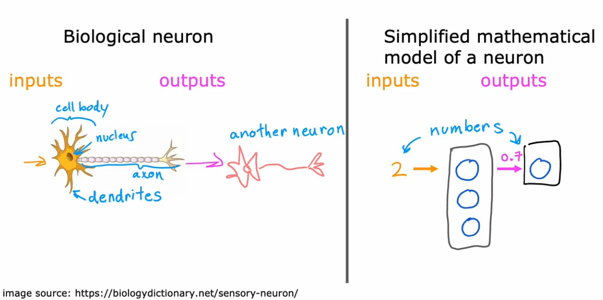

    - The input wires in a biological neuron are called dendrites.
    - The output wire is called the axon.
    - This biological neuron may then send electrical impulses that become the input to another neuron.
    - The aritifical neural network uses a simplified mathematical model of what a biological neuron does.
        - The circles on the right represent neurons. A neuron takes some inputs (1 or more) which are numbers, does some computation, and outputs some other number which then can be an input to a second neuron.
        - Rather than building one neuron at a time, you often want to simulate many such neurons at the same time. What these neurons do collectively is input a few numbers, carry out some computation, and output some other numbers. 
    - One caveat is that we have almost no idea about how the brain works in the present age, so a neural netowrk is just an attempt to blindly mimic what we know of the human brain today. So as you go deeper into neural networks and into deep learning, even though the origins were biologically motivated, don't take the biological motivation too seriously. In fact, deep learning researchers have shifted away from looking to biological motivation that much. But instead, they're just using engineering principles to figure out how to build algorithms that are more effective.

    Why have neural networks only taken off in the past few years when they've been around for a long time?

    

    - The horizontal axis is the amount of data you have for a problem, and the vertical axis is the performance or the accuracy of a learning algorithm applied to that problem.
    - The amount of data in the digital age has greatly increased compared to the past.
    - Neural networks scaled well with data compared to traditional learning algorithms like linear regression and logistic regression.
    - What the graph is referring to when mentioning the size of the neural network is the amount of neurons that it has. More neurons usually results in an increase in performance.
    - If you were to train a very large neural network, meaning one with a lot of these artificial neurons, then for some applications the performance will just keep on going up. This was due to two things:
        1. For a certain class of applications where you do have a lot of data, sometimes you hear the term *big data* tossed around, if you're able to train a very large neural network to take advantage of that huge amount of data you have, then you could attain performance on anything ranging from speech recognition, to image recognition, to natural language processing applications and many more that just were not possible with earlier generations of learning algorithms. This caused deep learning algorithms to take off.
        2. Faster computer processors, including the rise of GPUs or graphics processor units (hardware originally designed to generate nice-looking computer graphics), turned out to be really powerful for deep learning as well. That was also a major force in allowing deep learning algorithms to become what it is today.

### Demand Prediction
- Simply put, **demand prediction** is when you look at the product and try to prict whether or not it will be a top seller.

- 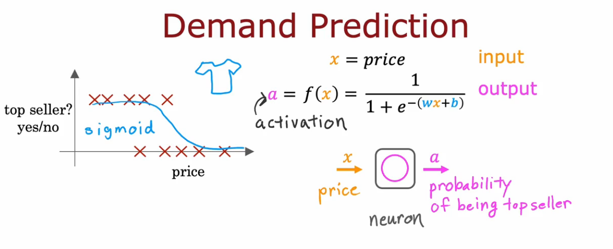
    
    - In this example, we want to see whether or not a T-shirt will be a top seller, and we have some data we can use to do that.
    - This type of application is used by retailers today in order to plan better inventory levels as well as marketing campaigns. If you know what's likely to be a top seller, you would plan, for example, to just purchase more of that stock in advance.
    - If we fit the data with the sigmoid function, we may get a blue line like the one shown on the graph.
    - In order to set us up to build a neural network, `f` (output of logistic regression algorithm) wil be denoted as `a` instead. `a` stands for activation, and it's actually a term from neuroscience, and it refers to how much a neuron is sending a high output to other neurons downstream from it.
    - It turns out that this logistic regression **unit** or this little logistic regression algorithm, can be thought of as a very simplified model of a single neuron in the brain, where what the neuron does is it takes us input the price `x`, and then it computes the formula for logistic regression., and it outputs the number `a`, which is computed by the formula, and it outputs the probability of this T-shirt being a top seller. 
        - Another way to think of a neuron is as a tiny little computer whose only job is to input one number or a few numbers, such as a price, and then to output one number or maybe a few other numbers, which in this case is the probability of the T-shirt being a top seller.
    - A logistic regression algorithm is much simpler than what any biological neuron in a human brain does. Which is why the artificial neural network is such a vastly oversimplified model of the human brain. Even though in practice, as you know, deep learning algorithms do work very well.
    - Given this description of a single neuron, building a neural network now just requires taking a bunch of these neurons and wiring them together or putting them together.

- Let's look at a more complex example of demand prediction:

    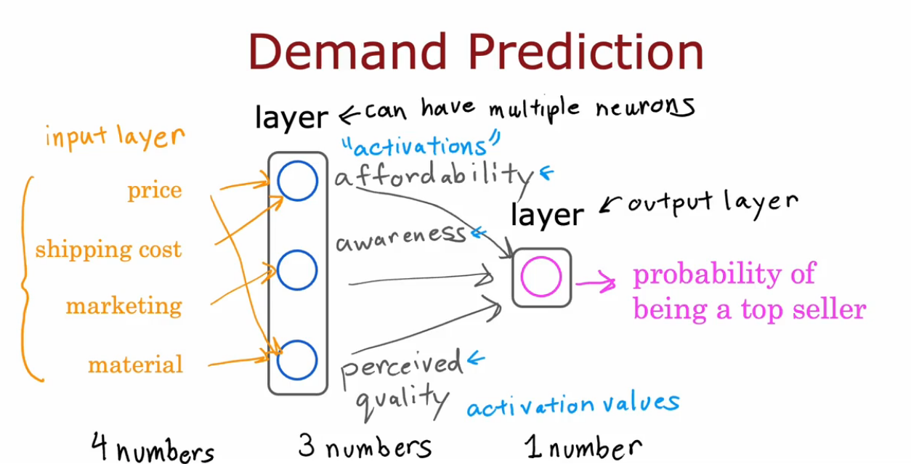

    - We'll have 4 features to predict whether or not a T-shirt is a top seller.
    - The words in yellow (maybe gold) are the features (price, shipping cost, marketing, and material).
    - The words in gray (maybe black) are a few factors (affordability, awareness, and perceived quality) which may affect whether or not a T-shirt becomes a top seller.
    - Affordability is mainly a function of price and shipping cost, so we're going to use a neuron for it, which takes in those two features and predict affordability (whether or not people think it's affordable). We repeat this for the rest of the features to predict the factors (affordability, awareness, and perceived quality) mentioned. Wiring these 3 factors into another neuron can result in the probability of the shirt being a top seller outputted.
        - The middle part (factors) is what's called a layer. A **layer** is a grouping of neurons which takes as input the same or similar features, and that in turn outputs a few numbers together. A layer can have multiple neurons or a singular neuron.
        - The layer with the final neuron (the pink one) is the **output layer**. It's called this because the output of this final neuron is the output probability predicted by the neural network.
        - We're going to call the outputs of the factors layer **activations**. The term activations comes from biological neurons, and it refers to the degree that the biological neuron is sending a high output value or sending many electrical impulses to other neurons to the downstream from it. The probability of being a top seller is the activation of the pink neuron.
        - The initial inputs (price, shipping cost, marketing, and material) is called the **input layer**.
    - This neuron network inputs 4 numbers, the next layer takes those 4 numbers to compute 3 new ones, and then the final layer uses those 3 numbers to compute 1 number.
    - The way a neural network has been described so far is we had to go through the neurons one at a time and decide what inputs it would take from the previous layer. For example, we said affordability is a function of just price and shipping costs and awareness is a function of just marketing and so on, but if you're building a large neural network it'd be a lot of work to go through and manually decide which neurons should take which features as inputs.

    Here's how a neural network is implemented in practice:

    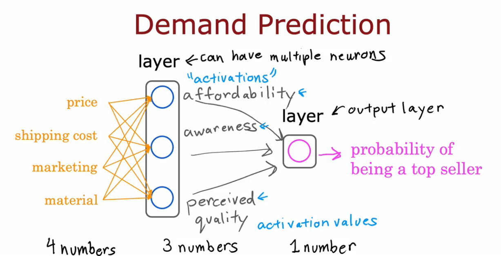

    - The way a neural network is implemented in practice is each neuron in a certain layer, say the layer in the middle, will have access to every feature, to every value from the previous layer, from the input layer, which is why each neuron now has an arrow from every input.
    - You can imagine that if you're trying to predict affordability, and it knows what's the price shipping cost marketing and material, maybe it'll learn to ignore marketing and material and just figure out, through setting the parameters appropriately, to only focus on the subset of features that are most relevant to affordability.

    Now let's simplify the neural network model:
    
    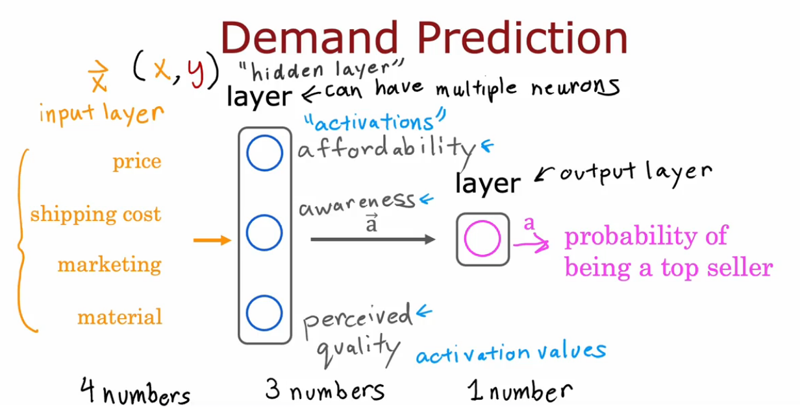

    - Let's take the input features and write them as the vector $ \vec{x} $. We're going to view the neural network as having four features that comprise this feature vector $ \vec{x} $. This feature vector is fed to the layer in the middle which then computes three activation values, which in turn become another vector $ \vec{a} $. This vector is then fed to the final output layer which outputs the final probability of the T-shirt being a top seller, `a`.
    - That's all a neural network is. It has a few layers where each layer inputs a vector and outputs another vector of numbers.
    - The layers in between the input layer and the output layer are called the **hidden layers**. In thi case, there's only 1 hidden layer.
        - Your data set tells you what is x and what is y, and so you get data that tells you what are the correct inputs and the correct outputs. But your dataset doesn't tell you what are the correct values for affordability, awareness, and perceived quality. The correct values for those are *hidden*. You don't see them in the training set, which is why this layer in the middle is called a hidden layer.

    Here's another way to think about neural networks:

    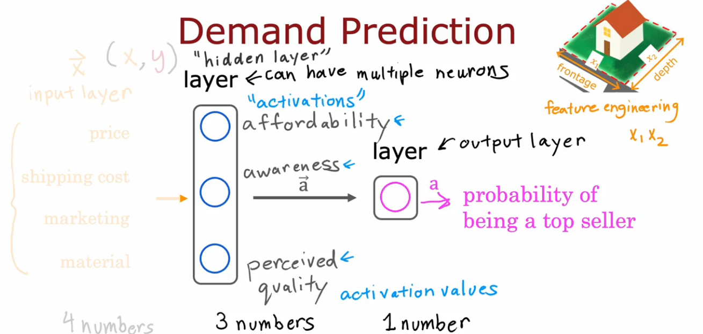

    - Covering up the input layer, we can see that this is basically just logistic regression, but this version of logistic regression can learn its own features, making it easier to make accurate predictions.
    - Remember the example in the **Feature Engineering** section where we constructed the area feature from the frontage and depth inputs. Instead of having us manually engineer features, a neural network can learn its own features to make the learning problem easier for itself. This is what makes neural networks one of the most powerful learning algorithms today.

    Let's summarize:
    
    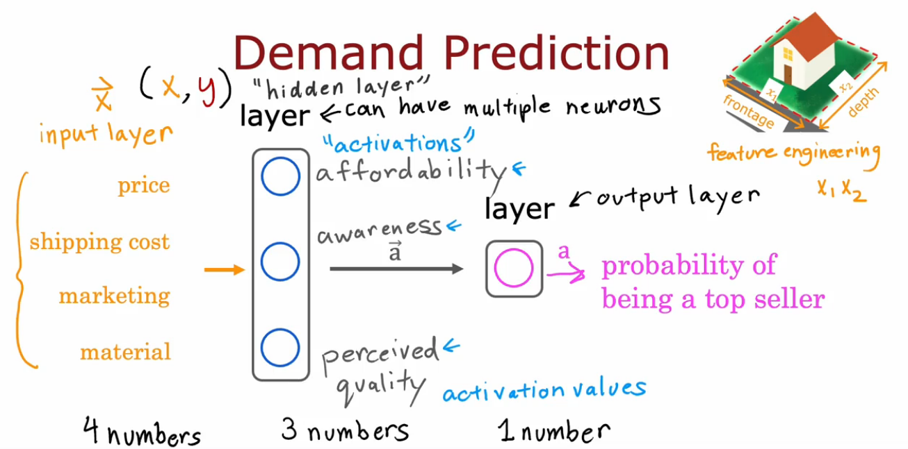

    - The input layer has a vector of features, four numbers in this example, which is input to the hidden layer. The hidden layer outputs three numbers (in this case). Then the output layer takes as its input the three numbers and outputs one number, which would be the final activation, or the final prediction of the neural network.
    - Even thought the neural network was previously described as computing affordability, awareness, and perceived quality, one of the really nice properties of a neural network is when you train it from data, you don't need to go in to explicitly decide what other features, such as affordability and so on. The neural network should compute instead or figure out all by itself what are the features it wants to use in this hidden layer.

    Let's look at neural networks with more than 1 hidden layer:

    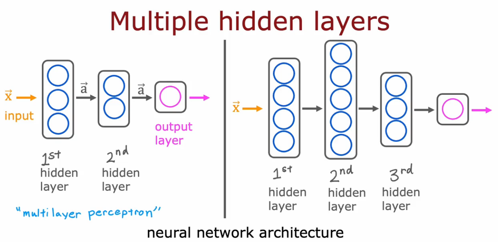

    - When you're building your own neural network, one of the decisions you need to make is how many hidden layers do you want and how many neurons do you want each hidden layer to have.     
        - This question of how many hidden layers and how many neurons per hidden layer is a question of the architecture of the neural network.
    - Choosing the right number of hidden layers and number of hidden units per layer can have an impact on the performance of your learning algorithm.
    - We will discuss how to choose a good architecture later on.
    - Some literature refer to a neural network with multiple layers like the ones shown on the slide as a multilayer perceptron.

### Example: Recognizing Images
- 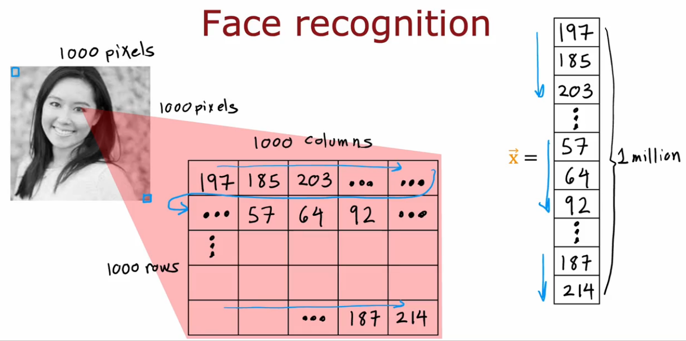
    
    - If you're building a face recognition application, you might want to train a neural network that takes as input a picture like this and outputs the identity of the person in the picture.
    - This image is 1,000 by 1,000 pixels, so its representation in the computer is actually as 1,000 by 1,000 grid, or also called 1,000 by 1,000 matrix of pixel intensity values.
    - In this example, the pixel intensity values or pixel brightness values go from 0-255. So 197 here would be the brightness of the pixel in the very upper left of the image, 185 is brightness of the pixel one pixel over, and so on down to 214, which would be the lower right corner of this image.
    - If you were to take these pixel intensity values and unroll them into a vector, you end up with a list or a vector of a million pixel intensity values. One million because a 1,000 by 1,000 square gives you a million numbers.
    - The face recognition problem is, can you train a neural network that takes as input a feature vector with a million pixel brightness values and outputs the identity of the person in the picture.

    This is how you might build a neural network to carry out this task: 

    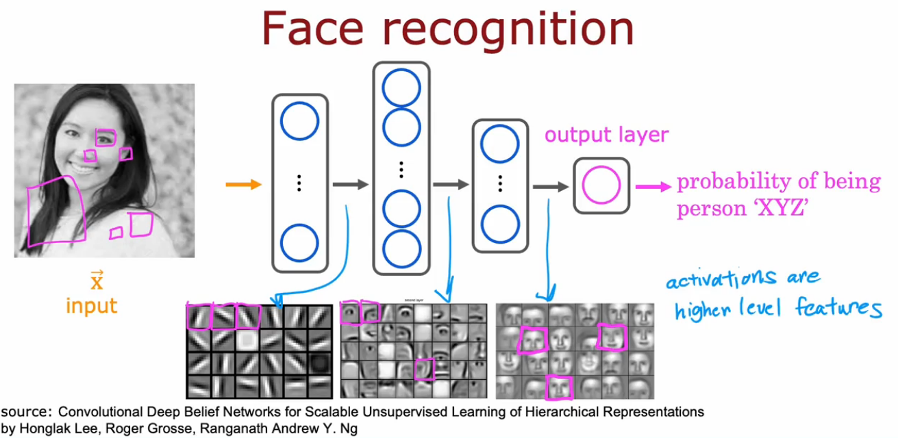

    - The input image `X` is fed to this layer of neurons (the first hidden layer) which then extract some features. The output of this first hidden layer is fed to a second hidden layer and that output is fed to a third layer and then finally to the output layer, which then estimates, say the probability of this being a particular person.
    - It turns out that when you train a system like this on a lot of pictures of faces and you peer at the different neurons in the hidden layers to figure out what they may be computing this is what you might find: 
        - In the earliest layers of a neural network, you might find that the neurons are looking for very short lines or very short edges in the image. Each of those pink squares could be what 3 individual neurons are looking for seperately.
        - If you look at the next hidden layer, you find that these neurons might learn to group together lots of little short lines and little short edge segments in order to look for parts of faces (presence or absence of an eye, corner of a nose, bottom of an ear, etc.).
        - Then as you look at the next hidden layer, in this example, the neural network is aggregating different parts of faces to then try to detect presence or absence of larger, coarser face shapes, and then finally detecting how much the face corresponds to different face shapes, creating a rich set of features that then helps the output layer try to determine the identity of the person picture.
            - A remarkable thing about the neural network is it can learn these feature detectors at the different hidden layers all by itself. In this example, no one ever told it to look for short little edges in the first layer, eyes and noses and face parts in the second layer, and then more complete face shapes at the third layer. The neural network is able to figure out these things all by itself from data.  
        
        Just one note, in this visualization, the neurons in the first hidden layer are shown looking at relatively small windows to look for these edges. In the second hidden layer is looking at bigger window, and the third hidden layer is looking at even bigger window. Look at the visualizations to realize what we mean by "window". It's basically the image window that each layer is looking at. So, these little neurons' visualizations actually correspond to differently sized regions in the image.

    Let's see what happens if you were to train this neural network on a different dataset, say on lots of pictures of cars, pictured on the side: 

    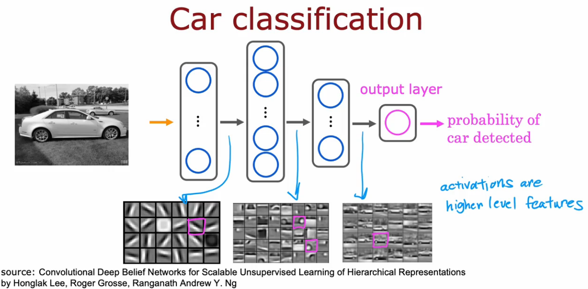

    - The same learning algorithm is asked to detect cars. It will learn edges in the first layer. Pretty similar to the last example but then it'll learn to detect parts of cars in the second hidden layer and then more complete car shapes in the third hidden layer.
    - Just by feeding it different data, the neural network automatically learns to detect very different features so as to try to make the predictions of car detection or person recognition or whatever is the particular given task that it is trained on. 

### Neural Network Layer
- The fundamental building block of most modern neural networks is a layer of neurons.

- Let's zoom into the hidden layer of the demand prediction neural network that we looked at:

    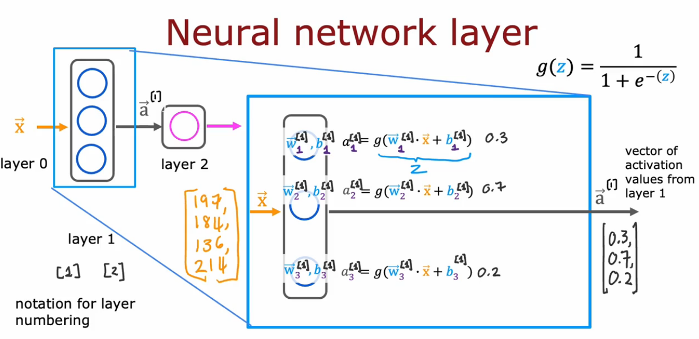

    - The hidden layer inputs 4 numbers to each of the 3 neurons.
    - Each neuron implements a logistic regression unit/function.
    - Take note of how the layers are numbered.
    - Notation for layer numbering example: $ \vec{a}^{[1]} $ is the output for layer 1.
    - The first neuron has parameters $ \vec{w}_{1}^{[1]} $, $ b_{1}^{[1]} $. The subscript is simply to indicate that the parameters belong to the 1st neuron of layer 1.
    - 0.3 is the value of $ a_{1}^{[1]} $.
    - 0.3, 0.7, and 0.2 are the values of $ \vec{a}^{[1]} $ that are passed to the final output layer.

    Now let's zoom into the computation of layer 2:

    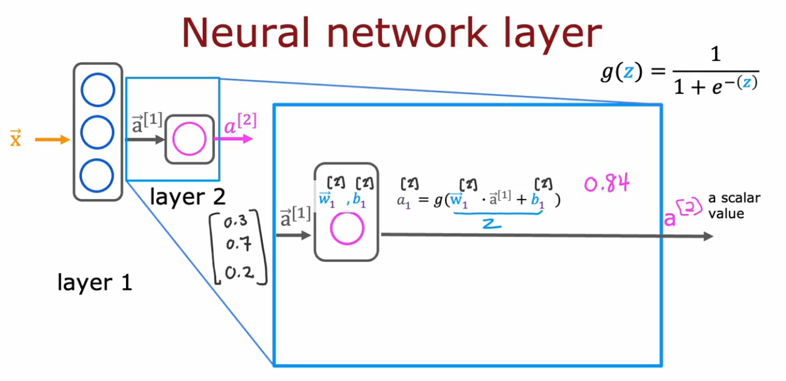

    - The output of layer 1 is the input to layer 2.
    - Since the output layer only has 1 neuron, `a`, in this case $ a^{[2]} $, will simply be a scalar instead of a vector.

    Once the neural network has computed $ a^{[2]} $, there's one final optional step that you can choose to implement or not:

    

    - We want a binary prediction, so you can threshold $ a^{[2]} $ at 0.5 which will then give you the final prediction of either `1` or `0` instead of just a probability.

    So that's how a neural network works. Every layer inputs a vector of numbers and applies a bunch of logistic regression units to it, and then computes another vector of numbers that then gets passed from layer to layer until you get to the final output layer's computation, which is the prediction of the neural network. Then you can either threshold at 0.5 or not to come up with the final prediction.

### More Complex Neural Networks
- Here's an example complex neural network:

    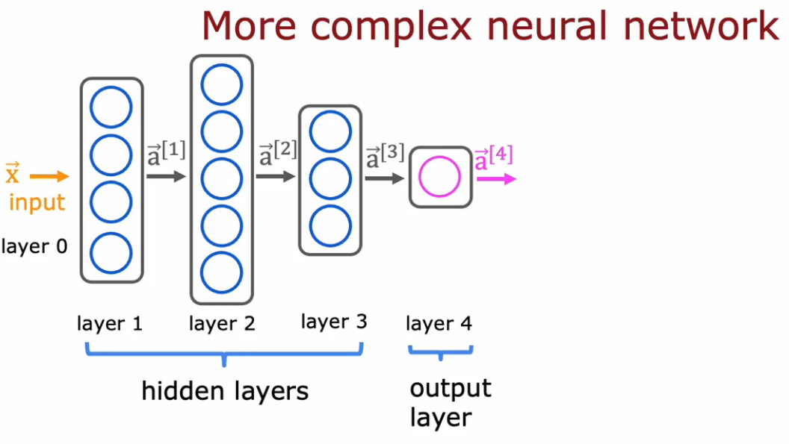

    - By convention, when we say that a neural network has 4 layers, that includes all the hidden layers in the output layer, but we don't count the input layer. So, this example neural network has 4 layers in the conventional way of counting layers in the network.

    Let's zoom in to layer 3 to look at its computations:

    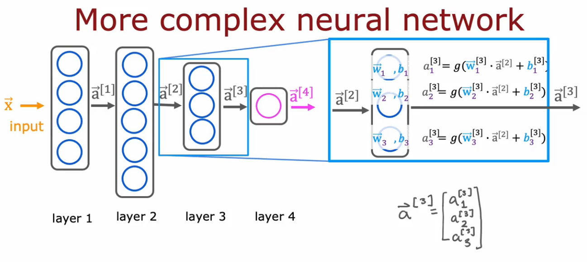

    - Notice that the activation functions for a layer use that layer's parameters along with the output from the last layer (a vector) as input.

    Here's a generic formula for a layer's activation function:

    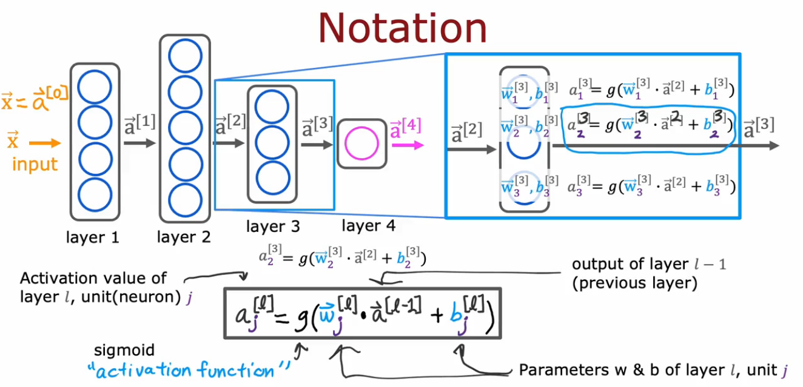

    - So far, the sigmoid function has been used as the activation function, but other functions can be used too (discussed later on).
    - An **activation function** is simply a function that outputs these activation values.

### Inference: Making Predictions (Forward Propagation)
- Let's put what we know into an algorithm called forward propagation which will let our neural network make inferences or predictions:

    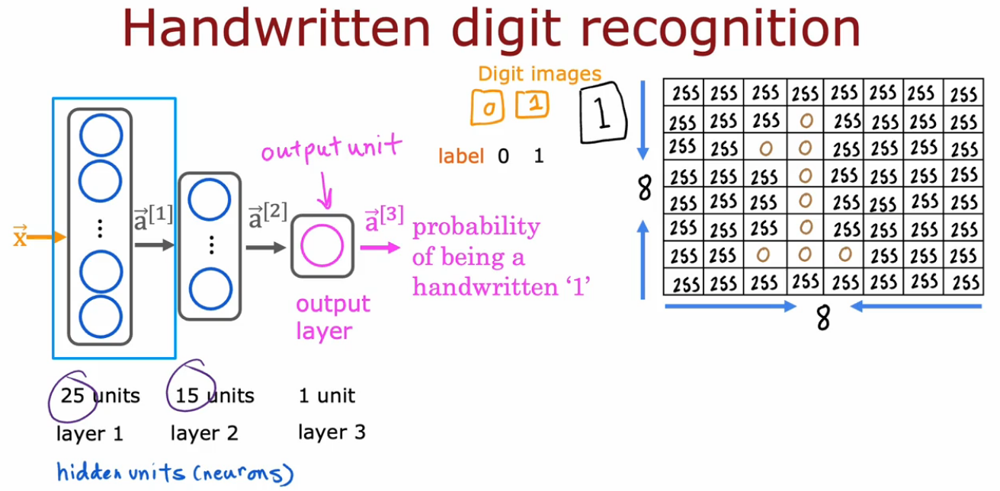

    - For this example, we're just trying to do a binary classification of a handwritten digit which could be `0` or `1`.
    - For the example on the slide, we are going to use an 8 by 8 image. This image of a `1` is this grid or matrix of 8 by 8 or 64 pixel intensity values where 255 denotes a bright white pixel and 0 would denote a black pixel, and different numbers are different shades of gray in between the shades of black and white. 
    - Given these 64 input features, we're going to use the neural network with 2 hidden layers, where the first hidden layer has 25 neurons or 25 units, the second hidden layer has 15 neurons or 15 units, and then finally the output layer outputs what's the chance of this being 1 versus 0?.
    
    Let's step through the sequence of computations that in your neural network will need to make to go from the input $ \vec{x} $, this eight by eight or 64 numbers, to the predicted probability $ \vec{a}^{[3]} $.
    
    1. The first computation is to go from $ \vec{x} $ to $ \vec{a}^{[1]} $:

        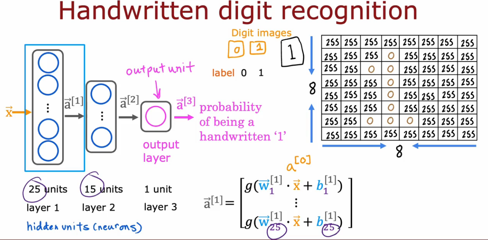

    2. The next step is to compute $ \vec{a}^{[2]} $:

        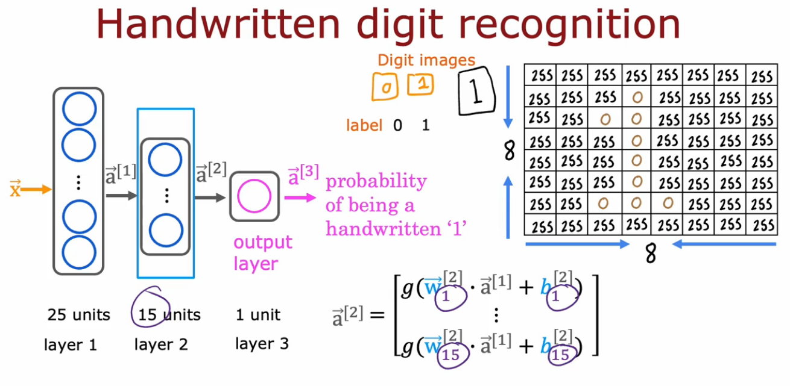
    
    3. The final step is to compute $ \vec{a}^{[3]} $:

        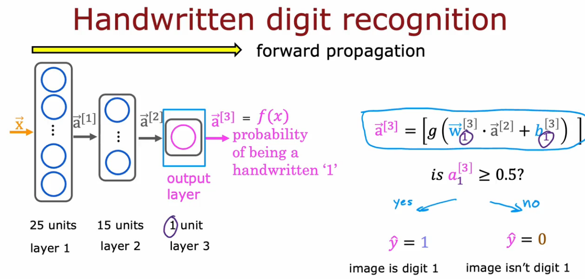

        - Note that you can optionally take $ \vec{a}^{[3]} $ and threshold it at 0.5 to obtain a binary classification label.
        - We can also use $ f(x) $ to denote the function computed by the neural network as a function of `x`.
        - Notice how we went in the forward direction from the leftmost layer to the rightmost layer, propagating the activations of the neurons and making these computations. This is why this algorithm is called **forward propagation**. This is in contrast with back propagation (used for learning) which will be discussed later on.
        - This type of neural network architecture where you have more hidden units initially and then the number of hidden units decreases as you get closer to the output layer is a pretty typical choice when choosing neural network architectures.
        - With the knowledge of forward propagation, you should be able to download the parameters of a neural network that someone else had trained and posted on the Internet and be able to carry out inference on your new data using their neural network.

### Optional Lab: Neurons and Layers
- [Neurons and Layers](https://colab.research.google.com/drive/1WjNmNAI9oap_tZQ4S_Pj4_CMo0CvR__L?authuser=4)

### TensorFlow Implementation of Forwarding
- **TensorFlow** is one of the leading frameworks to implementing deep learning algorithms.

#### Inference in Code
- One of the remarkable things about neural networks is the same algorithm can be applied to so many different applications.

- 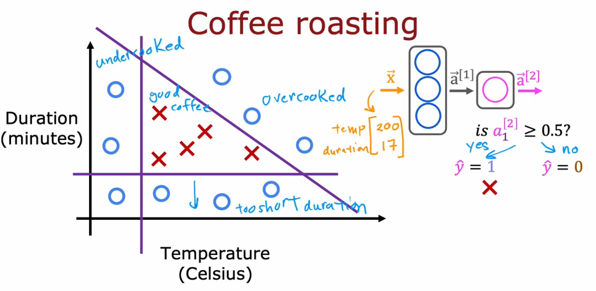
    
    - Can the learning algorithm help optimize the quality of the beans you get from a roasting process like this:

        
    
    - When roasting coffee beans, you can control two parameters: duration and temperature.

    - In this slightly simplified example, we've created the datasets of different temperatures and different durations, as well as labels showing whether the coffee you roasted is good-tasting coffee. The cross, y = 1, corresponds to good coffee, and all the circles, y = 0, correspond to bad coffee.

    - Only the points within the triangle correspond to good coffee.

    - The task is given a feature $ \vec{x} $ with both temperature and duration, say 200 degrees Celsius for 17 minutes, how can we do inference in a neural network to get it to tell us whether or not this temperature and duration setting will result in good coffee or not? 

    Well, it looks like this:

    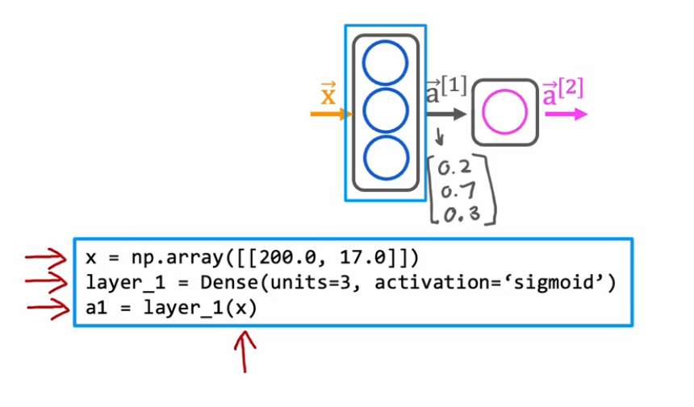

    - Set `x` to be an array of two numbers.
    - Create the first hidden layer using `Dense` with 3 (hidden) units and the sigmoid function as the activation function. 
        - `Dense` is another name for the layers of a neural network that we've learned about so far. As you learn more about neural networks, you learn about other types of layers as well. But for now, we'll just use the `Dense` layer, which is the layer type you've learned about in the last few sections.
    - Compute $ \vec{a}^{[1]} $ by taking `layer_1`, which is actually a function, and applying this function `layer_1` to the values of `x`. `a1` will contain a list of 3 numbers because `layer_1` has 3 units.

    Let's implement the output layer:

    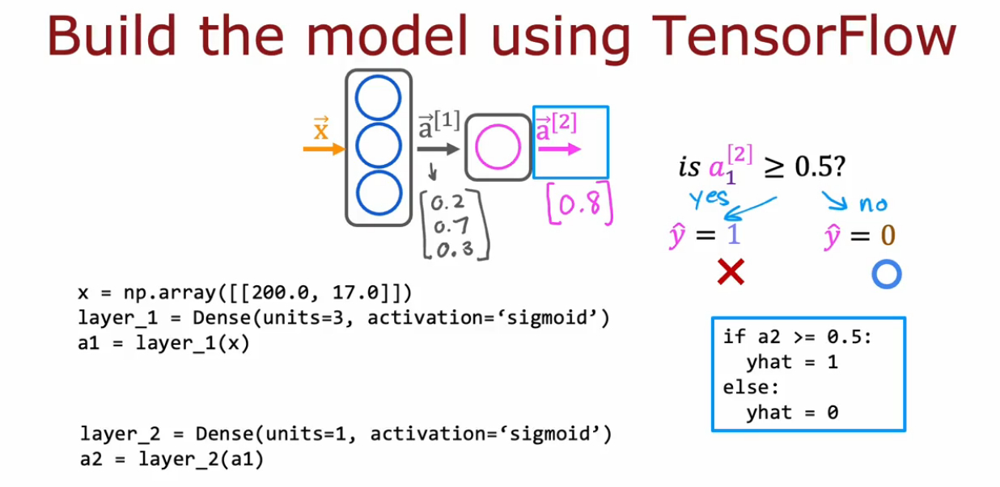

    - That's how you do inference in the neural network using TensorFlow.
    - There are some additional details that weren't covered here, such as how to load the TensorFlow library and how to also load the parameters $ \vec{w} $ and $ b $ of the neural network, but we'll go over that in the next lab.

- Now let's go back to the handwritten digit classification problem and try to implement inference:

    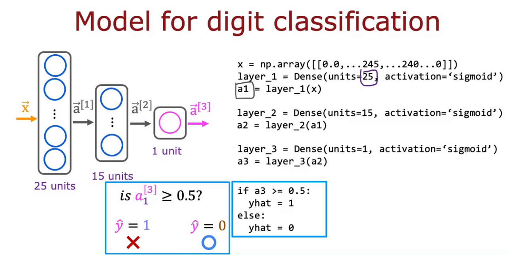

#### Data in TensorFlow
- Unfortunately, there are some inconsistencies between how data is represented in NumPy and in TensorFlow. So it's good to be aware of these conventions so that you can implement correct code and hopefully get things running in your neural networks.

- Let's start by taking a look at how TensorFlow represents data. Let's say you have a data set like this from the coffee example:

    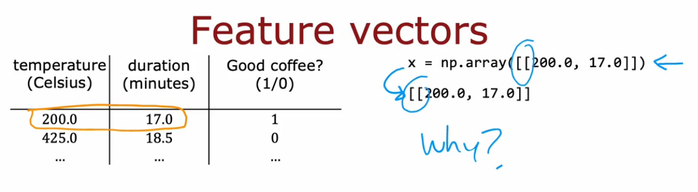

    To understand why we used double bracks `[[]]`, let's take a look at an example of a matrix:

    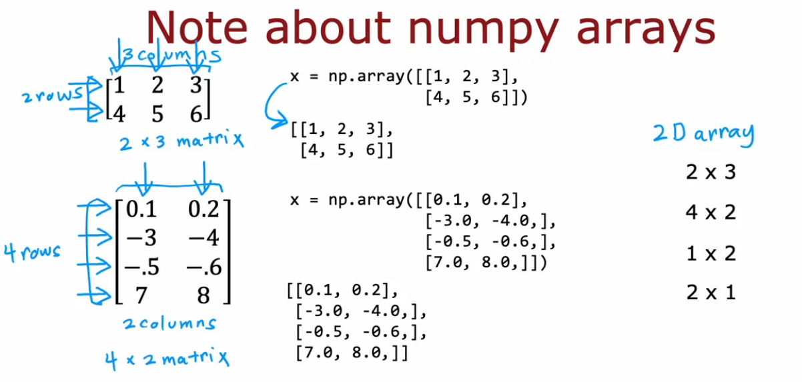

    - By conventation, we describe a matrix with `r` rows and `c` columns as a r x c matrix.
    - A matrix is just a 2D array of numbers.

    Let's take a look at some more examples:

    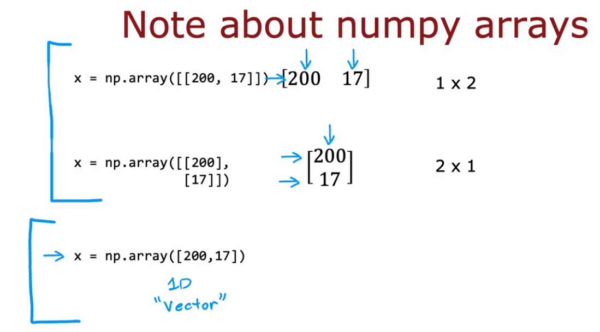

    - Top vector is called a **row vector**, which is a vector with just a single row.
    - Middle vector is called a **column vector**, which is a vector with just a single column.
    - The bottom array is a 1D vector, unlike the 2D vectors above it.
    - In TensorFlow, we use matrices to represent the data, unlike how we used to use 1D vectors.
        - Well it turns out that TensorFlow was designed to handle very large datasets and by representing the data in matrices instead of 1D arrays, it lets TensorFlow be a bit more computationally efficient internally.

    Let's go back to our data:

    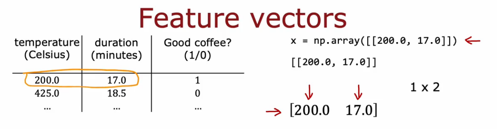

    - This is how the first row should be initiated as an array.

    Now let's revisit the code for forward propagation (inference):

    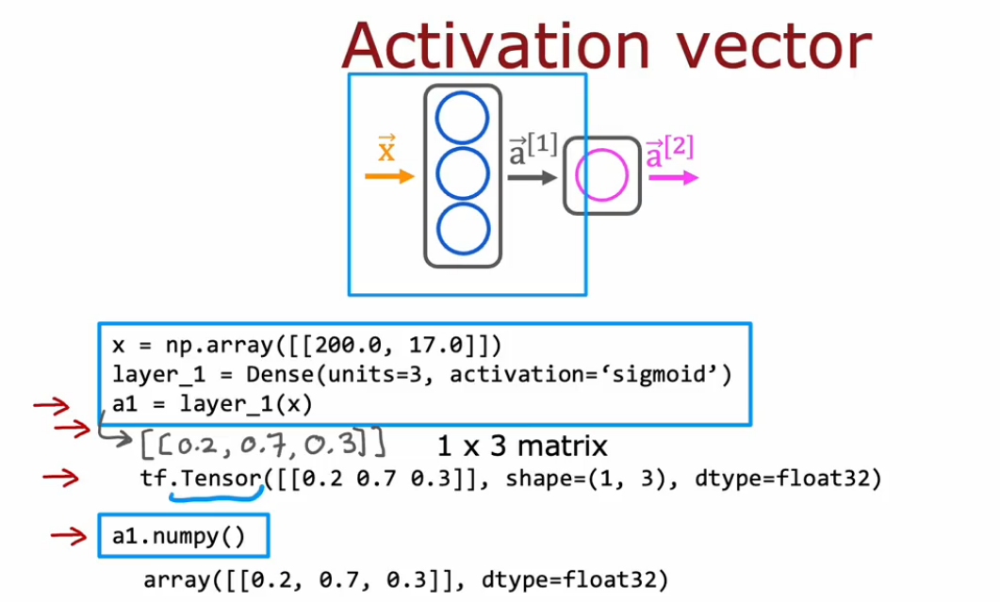

    - Notice that the activation output is a 2D matrix.
    - A `Tensor` here is a data type that the TensorFlow team had created in order to store and carry out computations on matrices efficiently.
    - So whenever you see `Tensor`, just think of that matrix on these few slides. Technically a `Tensor` is a little bit more general than the matrix but for the purposes of this course, think of `Tensor` as just a way of representing matrices.
    - You can convert a `Tensor` to a NumPy array by using the `.numpy()` method. A NumPy array and `Tensor` are unfortunately two different ways of representing a matrix.

    Now let's look at the second layer:

    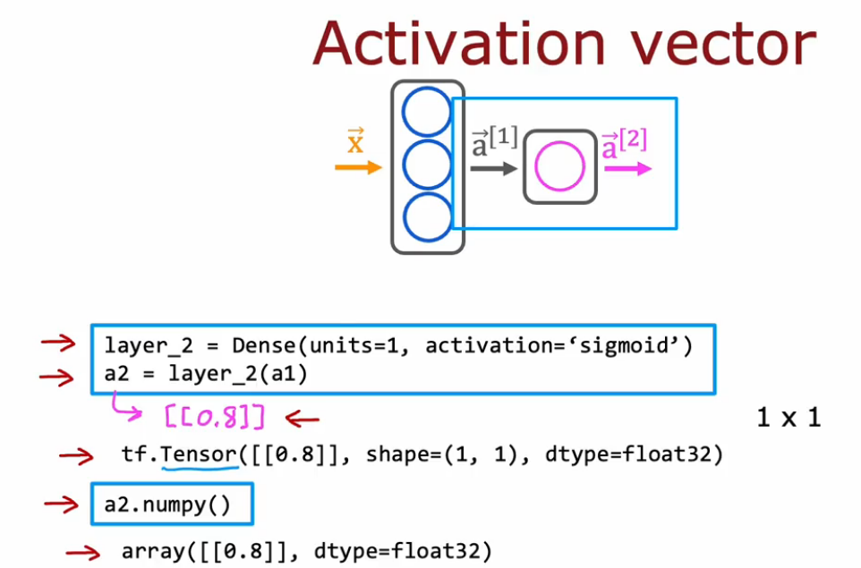

#### Building a Neural Network
- Let's put everything that we've discussed about TensorFlow together and build a neural network:

    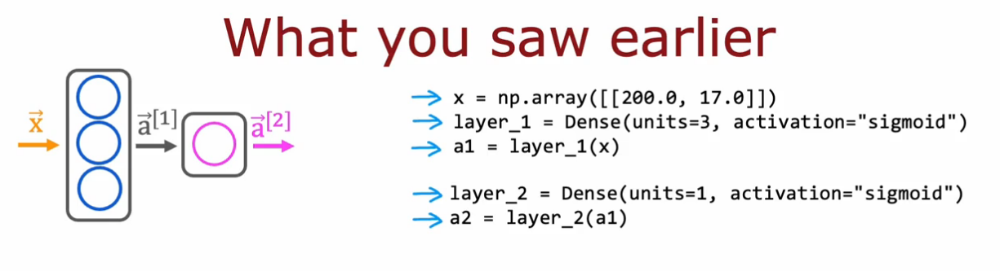

    - This is what we did before to implement forward prop(agation).

    Let's take a look a TensorFlow's way of implementing forward prop:

    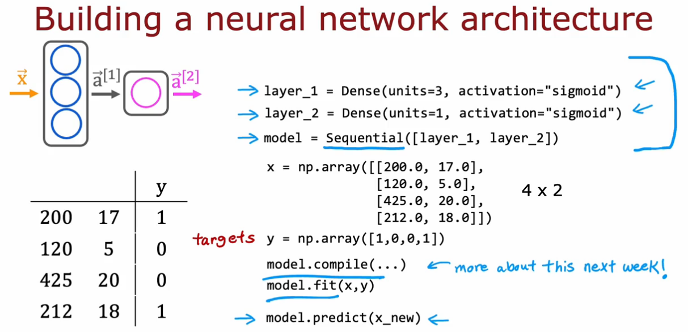

    - Like before, we create the layers. We then tell TensorFlow to string together those layers to form a neural network using the `Sequential` function.
    - Notice that the expected targets array `y` is a 1D array.
    - To train the model, we simply need to call two functions: `model.compile()` with some parameters and `model.fit(x, y)` where `x` holds our input data and `y` holds our target values.
    - To perform inference, call `model.predict(x_new)` where `x_new` holds data on a new example that we want to perform inference on.

    By convention, we usually write the first 3 lines of code like this instead of creating separate variables for each layer:

    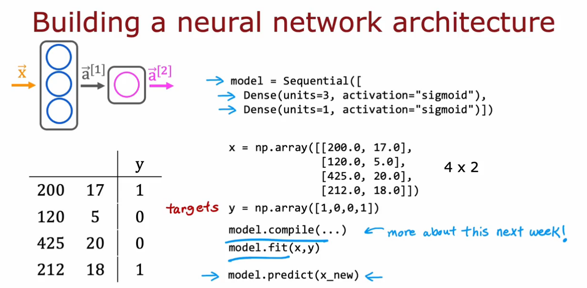

    Let's redo this for the digit classification example:

    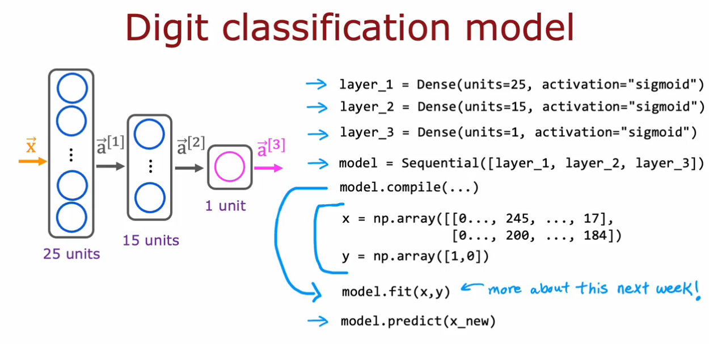

    - Remember that you can rewrite this to follow the convention mentioned earlier about not having to declare each layer seperately.

#### Optional Lab: Simple Neural Network in Tensorflow
- [Simple Neural Network in Tensorflow](https://colab.research.google.com/drive/1T33d1UEOA3QAdM0G38xRUpeVtZu4YN_W?authuser=4)

### Forward Prop in a Single Layer
- Let's take a look at how to implement forward propagation in a single layer from scratch using just Python and NumPy:

    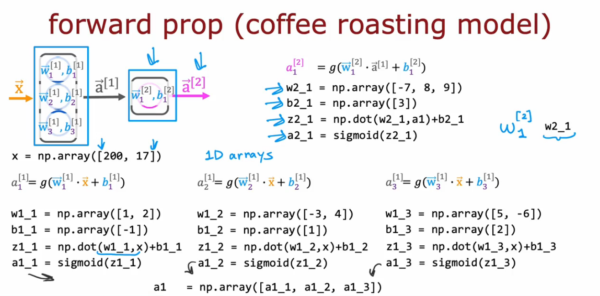

    - We'll use 1D arrays for this example instead of 2D matrices.

### General Implementation of Forward Propagation
- 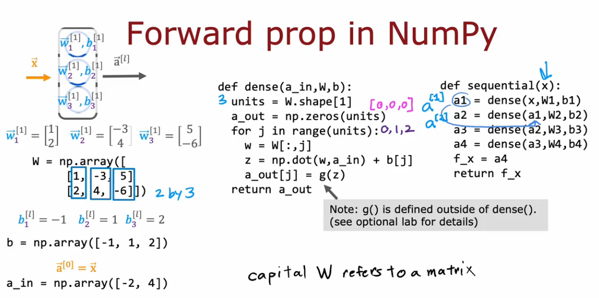
    - A dense layer is a single layer of a neural network. 
    - `dense` takes as input the activation from the previous layer, as well as parameters `W` and `b` for the neurons in a given layer.
    - The weights are arranged like that so that matrix math works cleanly.
    - `sequential` strings together dense layers sequentially.
    - Capital letters for matrices and lowercase letters for vectors/scalars.

### Optional Lab: Simple Neural Network in NumPy
- [Simple Neural Network in NumPy](https://colab.research.google.com/drive/1IctkE7hoeJMrzTgQD1WBWtsVpKL7qFuf?authuser=4)

### Speculations on Artificial General Intelligence (AGI)
- 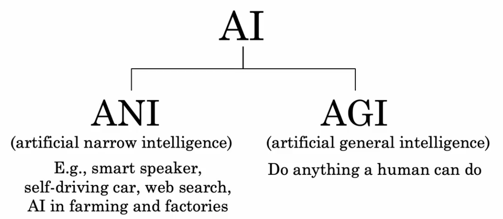
    - ANI: AI system that does one thing, a narrow task, sometimes really well and can be incredibly valuable.
    - Most of the progress we've made so far is in ANI, which is progress in AI. This has confused people and made them think that we're making a lot of progress towards AGI, which we are not.

    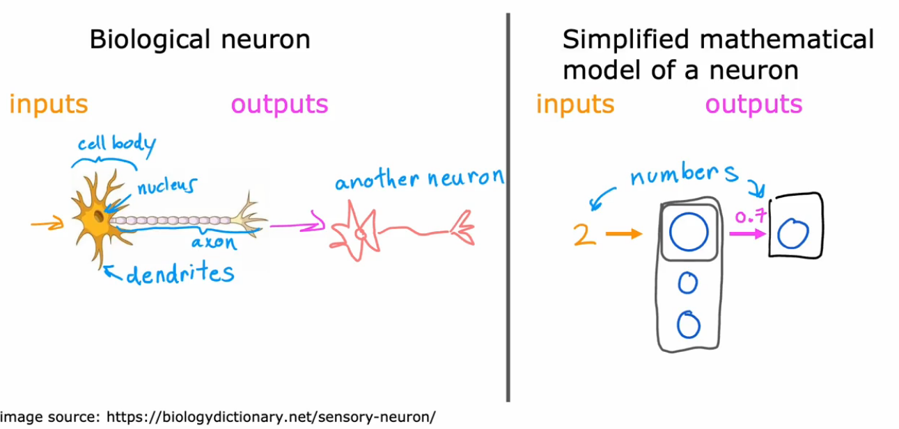

    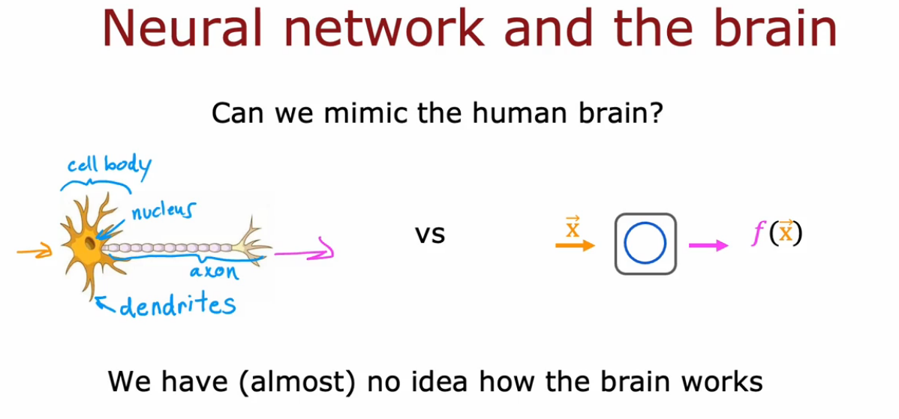

    - With the rise of modern deep learning, we started to simulate neuron. With faster and faster computers and even GPUs, we can simulate even more neurons. This development came with the hope that if we could simulate a lot of neurons then we can simulate the human brain or something like a human brain and we've really intelligent systems. Sadly, it's turned out not to be quite as simple as that for two reasons (in the opinion of Andrew Ng):
        1. Our neuron units in machine learning are very simple compared to an actual neuron.
        2. Even to this day, we have no idea how the brain works.
    
    Is there any hope of, within our lifetimes, seeing breakthroughs in AGI?

    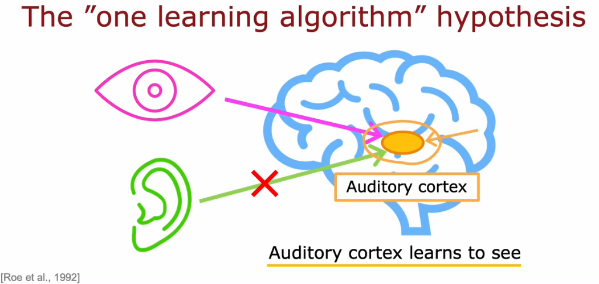

    - There have been some fascinating experiments done on animals that shows or strongly suggests that the same piece of biological brain tissue can do a surprisingly wide range of tasks. This has led to the one learning algorithm hypothesis that maybe a lot of intelligence could be due to one or a small handful of learning algorithms.
    - The part of your brain shown here is your auditory cortex, and your brain is wired to feed signals from your ears in the form of electrical impulses, depending on what sound your ear is detecting to that auditory cortex.
    - It turns out that if you were to rewire an animal brain to cut the wire between the ear and the auditory cortex, and instead feed in images to the auditory cortex, then the auditory cortex learns to see. Auditory refers to sound, and so this piece of the brain that, in most people, learns to hear, when it is fed different data, it instead learns to see. 

    Here's another example:

    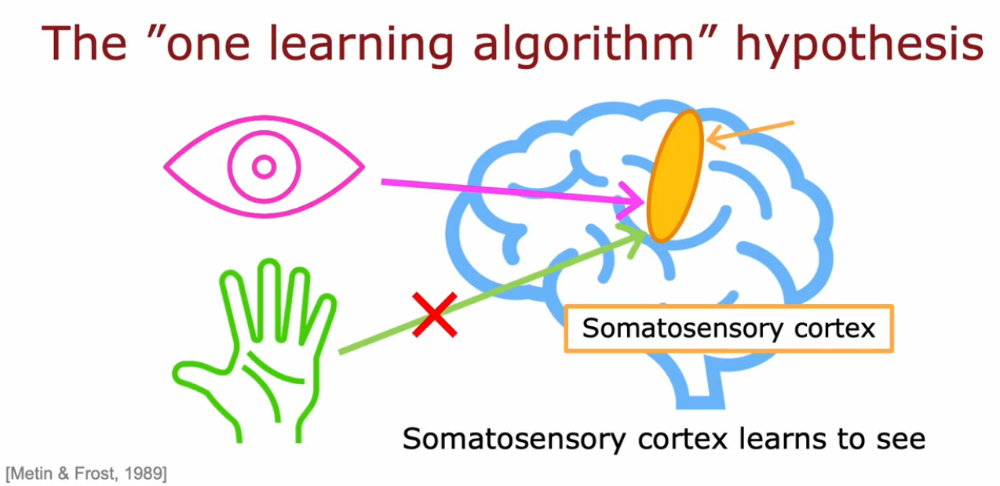

    - This part of your brain is your somatosensory cortex; somatosensory refers to touch processing.
    - If you were to similarly rewire the brain to cut the connection from the touch sensors to that part of the brain and instead rewire the brain to feed in images, then the somatosensory cortex learns to see.
    - There's been a sequence of experiments like this, showing that many different parts of the brain, just depending on what data is given, can learn to see, learn to feel, or learn to hear as if there was maybe one algorithm that just, depending on what data it is given, learns to process its inputs accordingly.

    Here are some more fascinating experiments:

    

    - There have been systems built which take a camera may be mounted to someone's forehead and maps it to a pattern of voltages in a grid on someone's tongue. By mapping a grayscale image to a pattern of voltages on their tongue, this can help people that are not sighted, blind individuals, learn to see with their tongue.
    - There have been fascinating experiments with human echolocation or humans sonar. So animals like dolphins and bats use sonar to see, and researchers have found that if you train humans to make clicking sounds, and listen to how that bounces off surroundings, humans can sometimes learn some degree of human echolocation.
    - For the haptic belt, if you mount a ring of buzzes around your waist and program it using a magnetic compass, so that say the buzzers to the North most direction are always vibrating slowly, then you somehow gain a direction sense, which some animals have, but humans don't. Then it just feels like you're walking around and you just know where North is, it doesn't feel like that part of my waist is buzzing, it feels like, oh, I know where that north is. 
    - Surgeries implant a third eye onto frog and the brain just learns with you with this input.
    - There have been a variety of experiments like these just showing that the human brain is amazingly adaptable. Neuroscientists say it is amazingly plastic; they just mean adaptable to bewildering range of sensor inputs.
    - So the question is, if the same piece of brain tissue can learn to see, or touch, or feel, or even other things, what is the algorithm it uses, and can we replicate this algorithm and implemented in a computer?

    Note that this discussion is mainly theory. There may not be just one learning algorithm. It is up to future scientists to find out.

### How neural networks are implemented efficiently
- 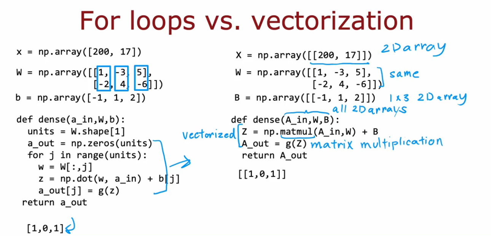
    - The for loop can be replaced with a couple lines of code by using matrices.

#### Matrix Multiplication
- Let's first take a look at how we take a dot product of two vectors:

    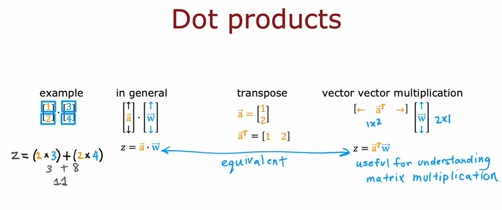

    - The transpose of the vector a means you take this vector and lay its elements on the side as shown under "transpose".

- Let's now take a look at vector matrix multiplication:

    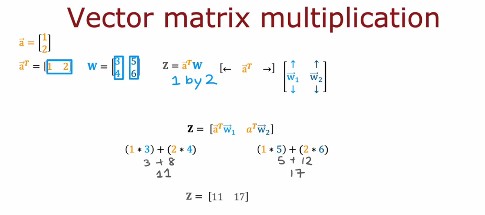

    So how can we take vector matrix multiplication and generalize it to matrix matrix multiplication?

    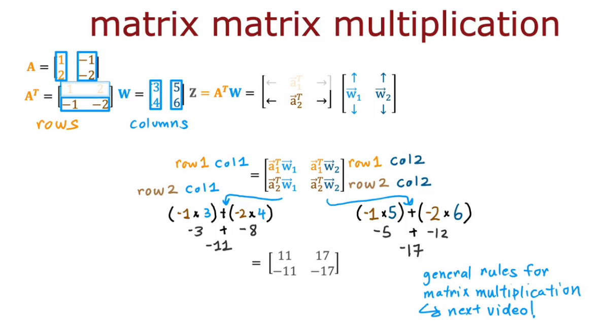

    - A matrix is just a set of different vectors stacked together in columns.
    - A way to think about this that's useful for neural network implementations is if you see a matrix, think of the columns of the matrix and if you see the transpose of a matrix, think of the rows of that matrix as being grouped together as illustrated here, with `A` and $ A^{T} $ as well as `W`. 
    - The subscripts for $ a^{T} $ indicate the row that we are using (starting from 1).

#### Matrix Multiplication Rules
- 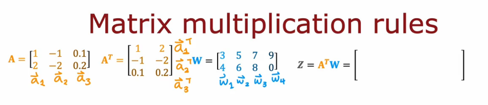
    - Think of the columns of `A` as 3 vectors.
    - A transpose is performed by taking the first column of the matrix and laying it on the side, then the 2nd column, and so forth.

    Now let's calculate `Z`:

    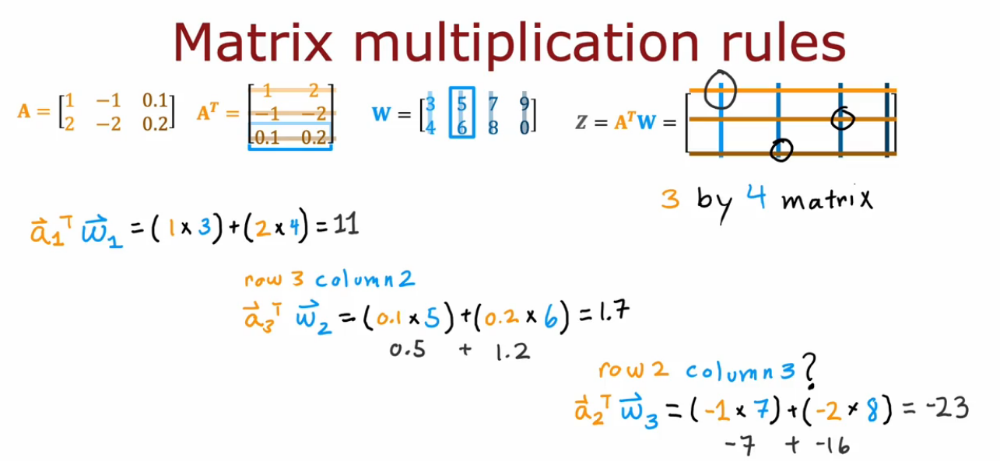

    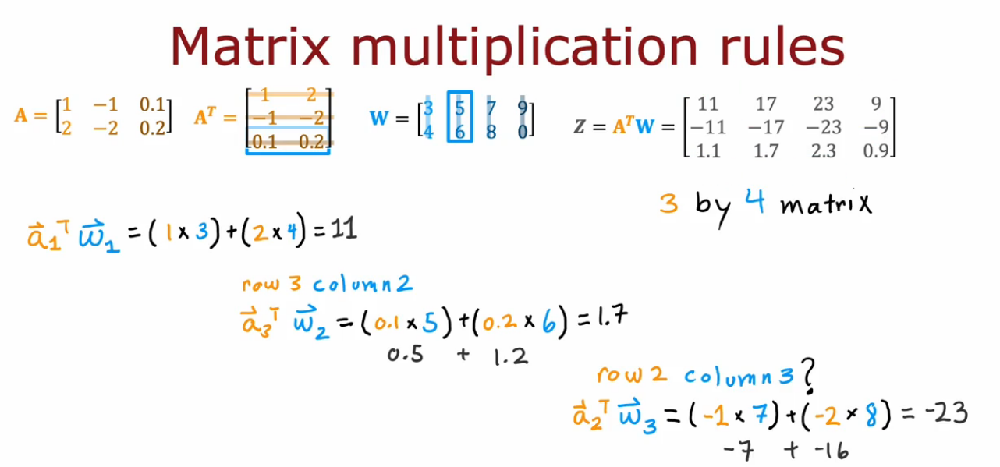

    One other thing to note:

    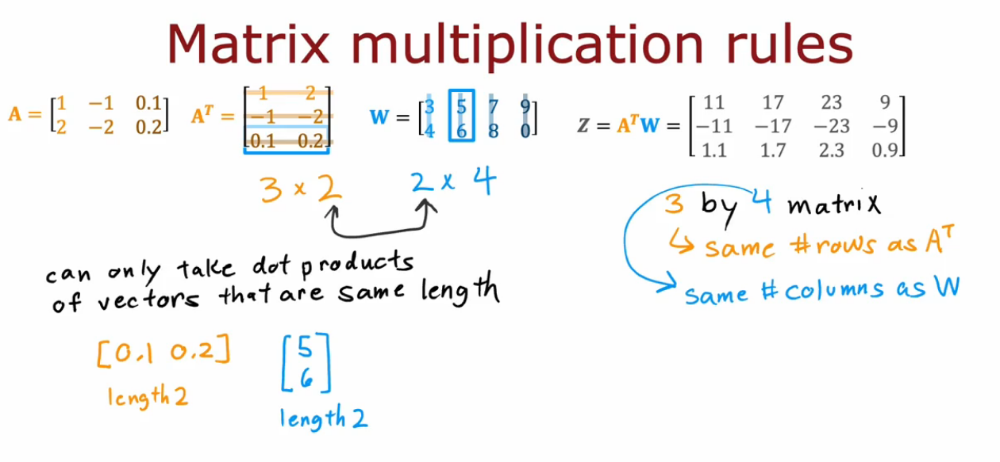

    - To perform matrix multiplication, the number of columns for the first matrix, $ A^{T} $, must match the number of rows for the second matrix, `W`, because you can only take dot products of vectors that are the same length.
    - The resulting vector will have the same number of rows as the first matrix and the same number of columns as the second matrix.

#### Matrix Multiplication Code
- Let's compute the earlier matrix multiplication in code:

    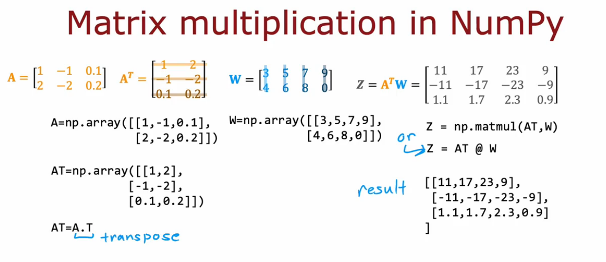

    - An easy ways to get the transpose of a matrix in NumPy is to use the `.T` method.
    - `@` is an alternative way to call `matmul`.

- Now let's take a look at a vectorized implementation of forward propagation:

    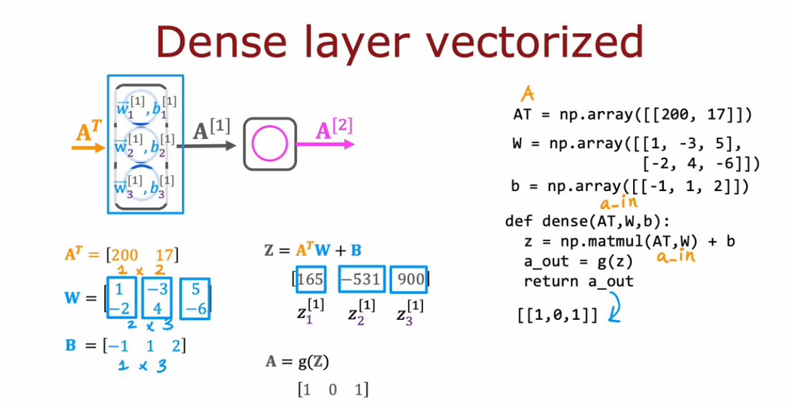

    - Note that the result of `A`, `[1 0 1]`, is rounded.
    - In case you're comparing this slide with the slide a few videos back, there is just one little difference, which is by convention. The way this is implemented in TensorFlow, rather than calling this variable `AT`, we were calling it `A_in`, which is why this too is the correct implementation of the code. There is a convention in TensorFlow that individual examples are actually laid out in rows in the matrix `X` rather than in the matrix X` transpose, which is why the code implementation actually looks like this in TensorFlow. 

### Optional Lab: Neural Networks for Handwritten Digit Recognition, Binary
- [Neural Networks for Handwritten Digit Recognition, Binary](https://colab.research.google.com/drive/1b5kJglk0P6UKiGtdP4p54v7HMZiMIpuE?authuser=4)

### Tensorflow Implementation of Training
- 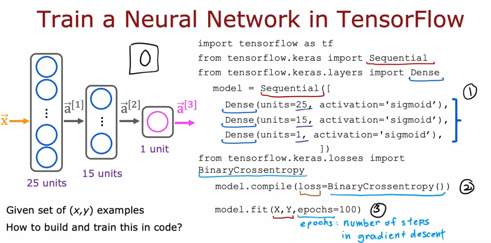
    - Same specifications as before.
    - Key step in asking Tensorflow to compile the model is to specify the loss function, e.g. binary cross entropy
    - After specifying the loss function, call `fit` to train the model on the dataset `X`, `Y`. Here, we specify 100 epochs or iterations for training.
    - In summary, to train the model:
        1. specify the model
        2. compile the model using a specific loss function
        3. train the model

#### Training Details
- Let's start by reviewing how we trained a logistic regression model:

    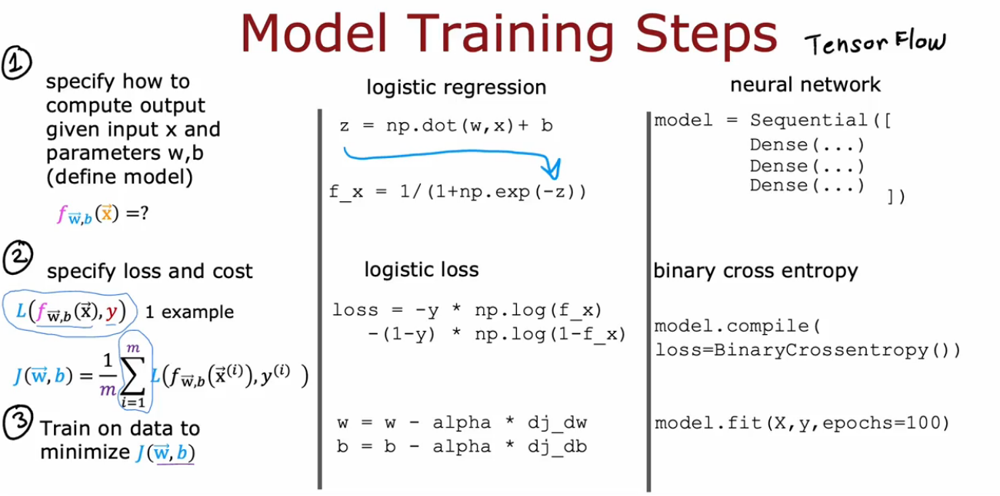

    - Step 1 is specifying how to compute the output, $ f_{\vec{w}, b}(\vec{x}) $ , given input $ \vec{x} $ and parameters $ \vec{w} $ and `b`.

    Now let's look at the steps for a neural network in greater detail starting with step 1, creating the model:

    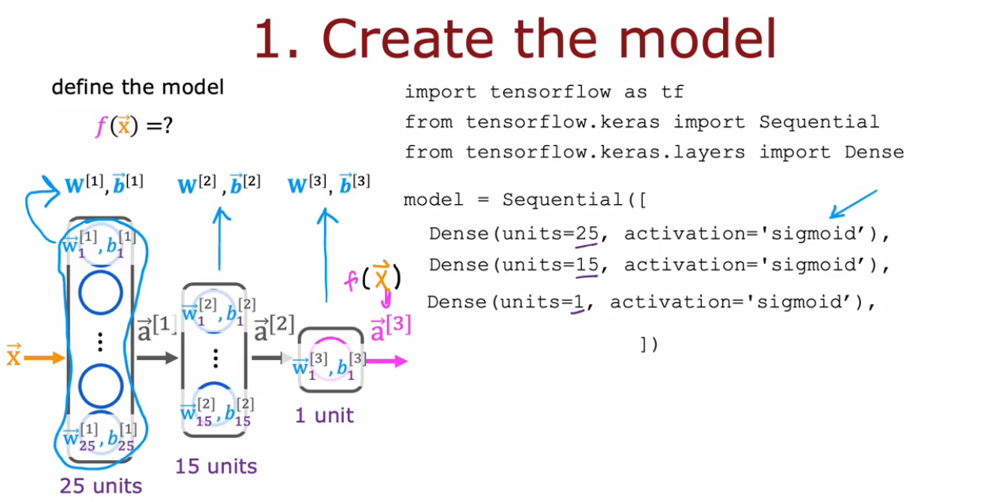

    - This code snippet specifies the entire architecture of the neural network and therefore tells TensorFlow everything it needs in order to compute the output $ \vec{a}^{[3]} $ or $ f(\vec{x}) $ as a function of the input `x` and the parameters $ \vec{w}^{l} $ and \vec{b}^{l}.

    Let's look at step 2, specifying the loss function which defines the cost function:

    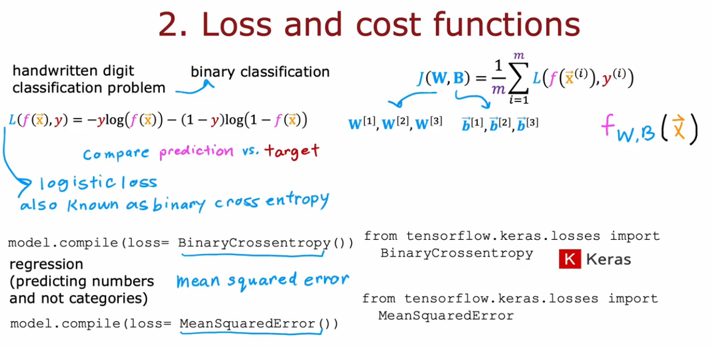

    - The most common loss function is the one we used for logistic regression, which is also known as binary cross entropy.
        - The function is called the cross entropy loss function in statistics. 
        - Binary simply emphasizes that we are doing binary classification.
    - Keras was originally a library developed completely separate from Tensorflow but was eventually merged into Tensorflow.
    - For regression, we can use mean squared error loss instead.
    The cost function is a function of all the parameters in the neural network. So, if you are optimizing the function with respect to W and B, you'd be optimizing it with respect to all of the parameters in the neural network.
        - Notice how the output is written as $ f_{W, B}(\vec{x}) $
    
    Let's look at step 3, minizing the cost function:

    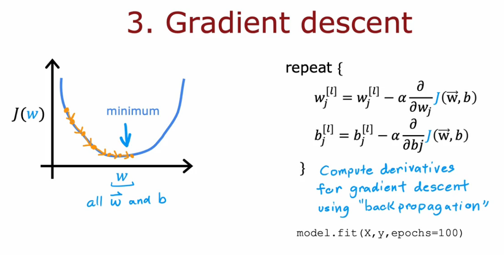

    - TensorFlow, along with many other libraries, uses backpropagation to compute the drivatives for gradient descent. Backpropagation is performed within the `fit` method.
    -  One pattern that Andrew Ng has seen across multiple ideas is as the technology evolves, libraries become more mature, and most engineers will use libraries rather than implement code from scratch. 

    Most commercial implementations use TensorFlow or PyTorch:

    

- A basic neural network is also called a multi-layer perceptron.

### Activation Functions

#### Alternatives to the Sigmoid Activation
- Recall the demand prediction example where we were trying to predict whether a product will be a top seller:

    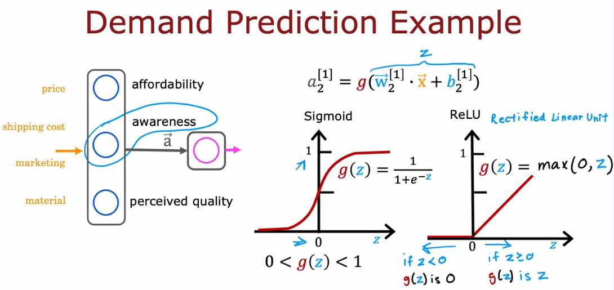

    - Awareness may have different levels, not just binary (aware or not aware). So, we can swap in a different activation function.
    - Note the new activation function on the right where `g` is 0 when `z` < 0 and `g` is `z` when $ z \ge 0 $: $ g(z) = max(0, z) $. This function is called ReLU (Rectified Linear Unit).

    Here are the most commonly used activation functions:

    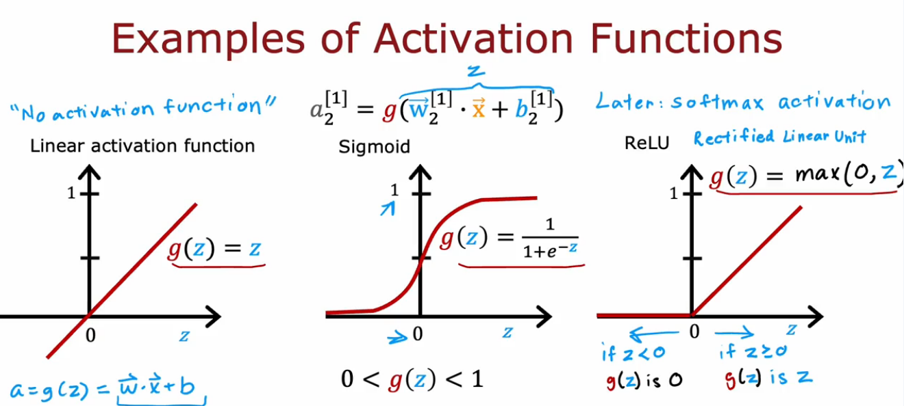

    - Sometimes if you use the linear activation function, people will say we're not using any activation function because if `a` is $ g(z) $ where $ g(z) = z $, then `a` is just equal to $ \vec{w}_{2}^{[1]} \cdot \vec{x} + b_{2}^{[1]} $. And so it's as if there was no g in there at all.
    - We will cover the softmax activation function later on.

#### Choosing Activation Functions
- 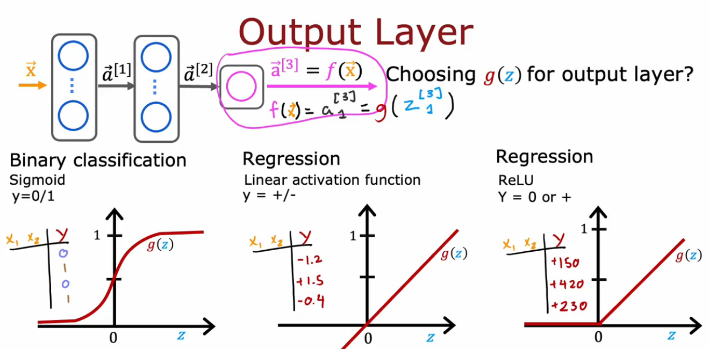
    - You can choose different activation functions for different neurons in your neural network, and when considering the activation function for the output layer, it turns out that there'll often be one fairly natural choice, depending on what is the target or label `y`. 
    - When y is 0 or 1 (binary classification problem), then the sigmoid activation function will almost always be the natural choice.
    - If you're solving a regression problem with -/+ values, the linear activation function will probably be the best choice.
    - If `y` can only take on positive values, the ReLU activation function will probably be the best choice.

    How about the hidden layers of a neural network:

    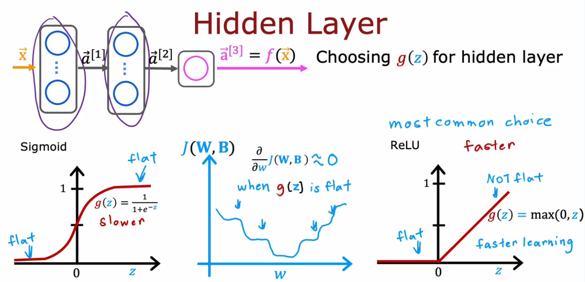

    - It turns out that the ReLU activation function is by far the most common choice in how neural networks are trained by many practitioners today.
        - In the early development of neural networks, the sigmoid function was used in many places, but the field has evolved to use ReLU more often and sigmoids hardly ever (other than when you need a binary output for the output layer for a binary classification problem).
        - Why?
            1. ReLU is faster to compute.
            2. The ReLU function kind of goes flat only in one part of the graph, whereas the sigmoid function goes flat in two places (left and right). Gradient descent is slow for functions that are flat in a lot of places. Although gradient descent optimizes the cost function, having an activation function that is flat in a lot of places results in the cost function being flat in many places as well. So, using ReLU can cause your neural network to learn faster.
    
    To summarize:

    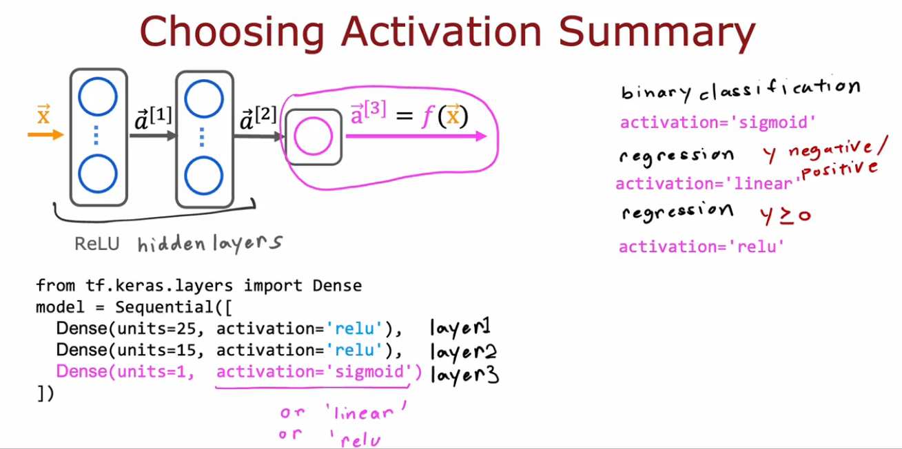

    - Note that there are many more activation functions out there. Feel free to try and find some online.

#### Why Do We Need Activation Functions?
- Recall the demand prediction example:

    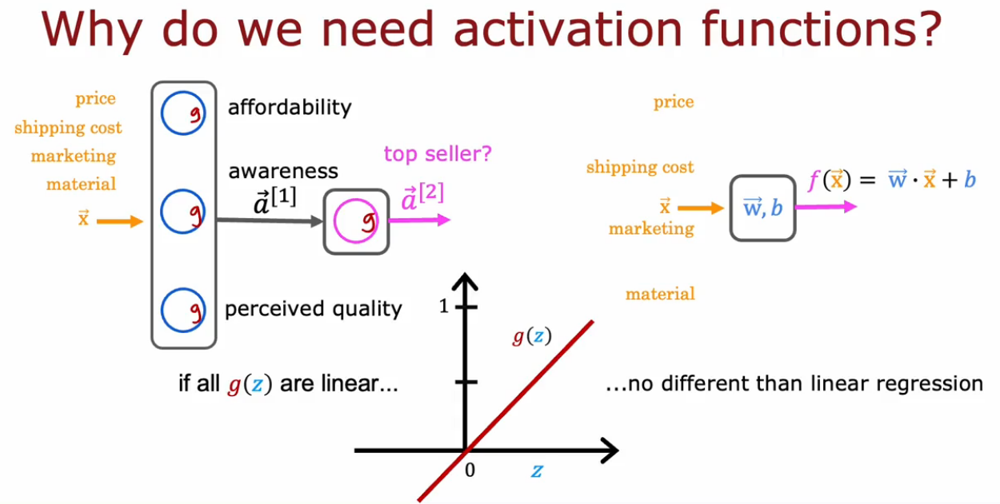

    - What would happen if we were to use a linear activation function for all of the nodes in this neural network? Well, the big neural network will become no different than just linear regression. So, this would defeat the entire purpose of using a neural network because it would then just not be able to fit anything more complex than the linear regression model.

    Let's look at a simpler example:

    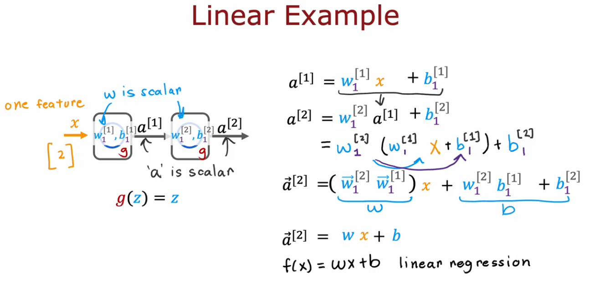

    - Notice how the equations just simplify down to a linear regression model.
    - A linear function of a linear function is itself a linear function. This is why having multiple layers of linear activation functions in a neural network doesn't let the neural network compute any more complex features or learn anything more complex than just a linear function.

    Let's look at a general case:

    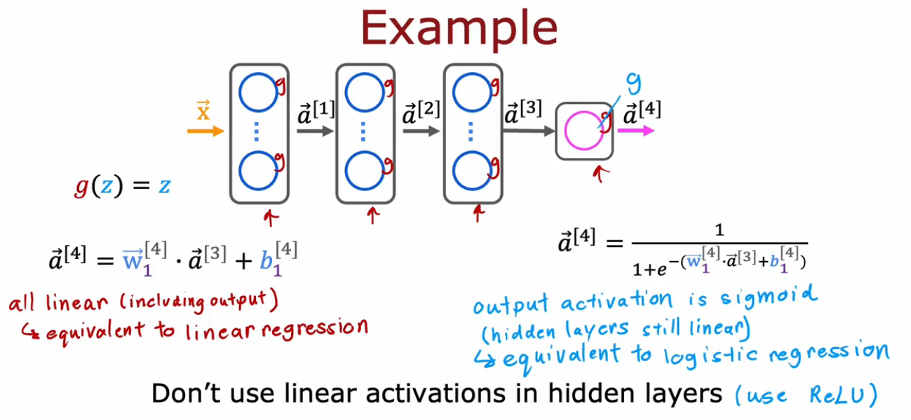

    - If we used the linear activation function for all the layers, it'd result in linear regression.
    - If we used the linear activation function for all the layers but the output layer and made the output layer the sigmoid function, it'd be no different from logistic regression.
    - ReLU is the recommended activation function for the hidden layers.

#### Optional Lab: ReLU activation
- [ReLU activation](https://colab.research.google.com/drive/17Jc2EzK-f7eEncTi_-HGoNzjQQJW8jfI?authuser=4)

### Multiclass Classification

#### Multiclass
- Multiclass classification refers to classification problems where you can have more than just two possible output labels so not just 0 or 1. For example, a zipcode is comprised of 10 possible digits:

    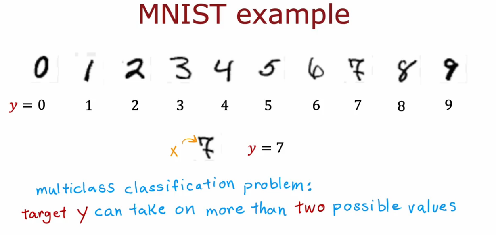

    - Note that `y` is discrete and not just any number.

    Let's compare binary classification with multiclass classification:

    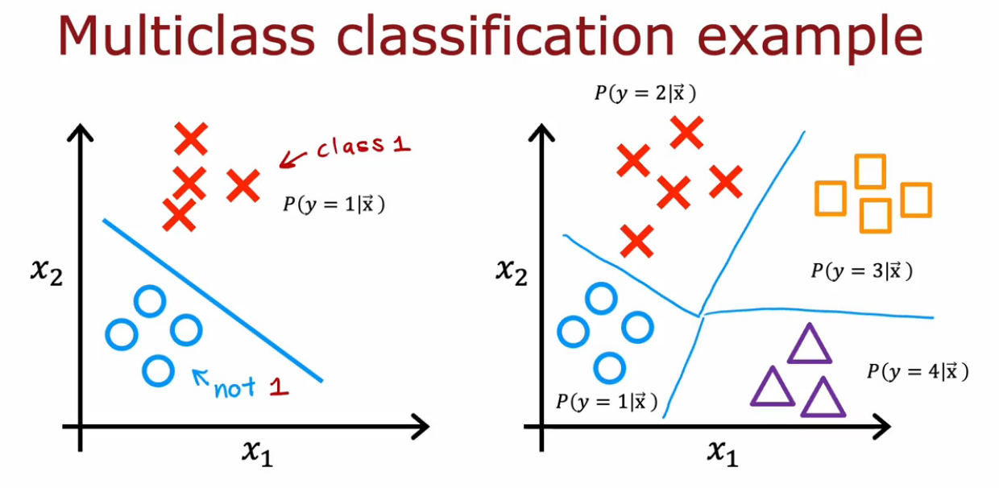

    - On the left is binary classification and on the right is multiclass classification.

#### Softmax
- The **softmax regression** algorithm is a generalization of logistic regression, which is a binary classification algorithm to the multiclass classification contexts.

- 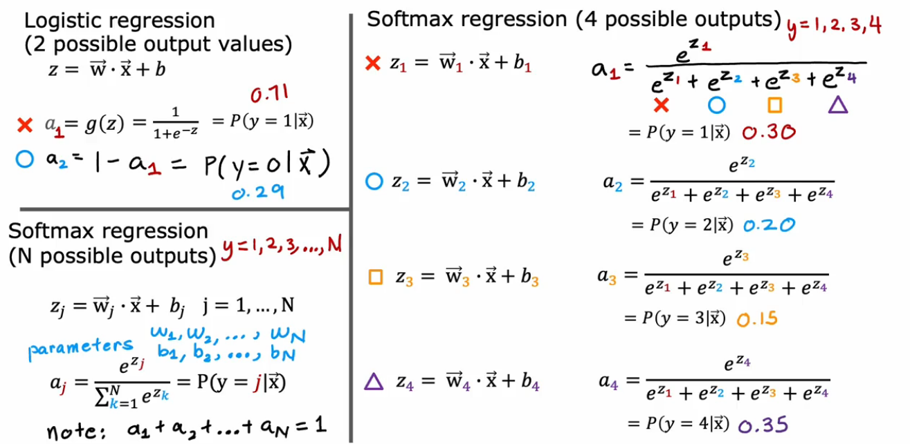
    - Think of logistic regression as actually computing two numbers, $ a_{1} $ and $ a_{2} $.
    - The softmax example has 4 possible outputs with 4 `z`s. Notice how $ a_{n} $ is calculated. 
    - In general, softmax can have many possible outputs.
    - `j` is the output that we are getting the probability of, while `k` is just the variable used in the summation.
    - If you apply softmax to a binary classfication problem, it ends up basically computing the same thing as logistic regression. The parameters end up being a little bit different, but it ends up reducing to logistic regression model. That's why the softmax regression model is the generalization of logistic regression. 

- Let's take a look at the cost function of softmax:

    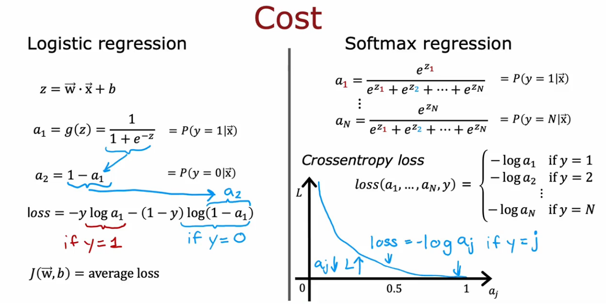

    - Notice that the loss is larger the farther away that $ a_{j} $ is from 1.
    - You only compute the log for $ a_{j} $ where $ y = j $ is the expected output.

#### Neural Network with Softmax output
- Let's see what happens like when we put softmax regression model into the output layer of a neural network. Originally we had:

    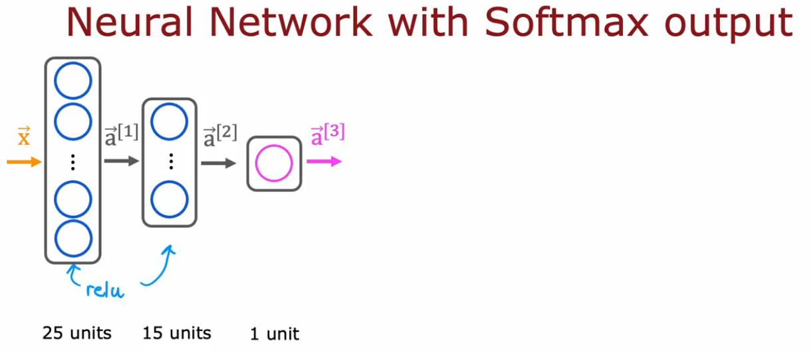

    If you now want to do handwritten digit classification with 10 classes, all the digits from zero to nine, then we're going to change this Neural Network to have 10 output units like so:

    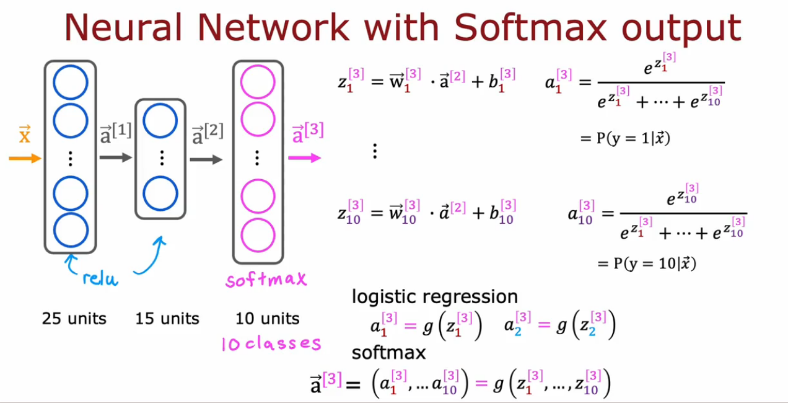

    - This new output layer will be a softmax output layer.
    - The softmax layer gives you estimates of the chance of `y` being any of these 10 possible output labels.
    - Unlike logistic regression, which is a function of 1 `z` value at a time, softmax is a function of all the values of `z` simultaneously.

    Let's take a look at how to implement this neural network in TensorFlow:

    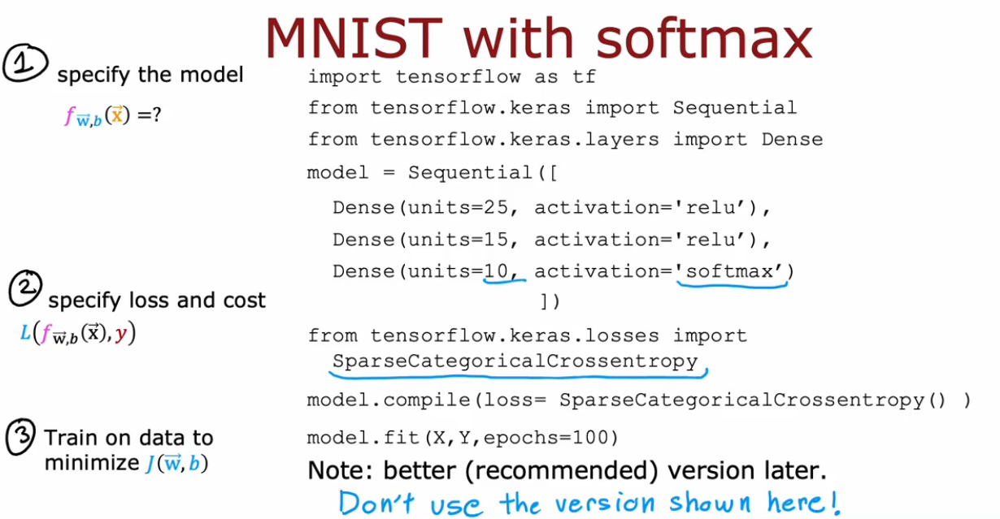

    - The cost function discussed for softmax earlier is called the Sparse Categorical Cross Entropy function. Categorical refers to `y` being classified into categories, while sparse refers to `y` taking on only one of the possible values (in this case, `y` can only be a number from 1 to 10).
    - The code here works, but there's a better version which will be shown later. Don't use this version.

##### Improved implementation of softmax
- To see what can go wrong with the previous implementation, let's look at two different ways of computing the same quantity in a computer:

    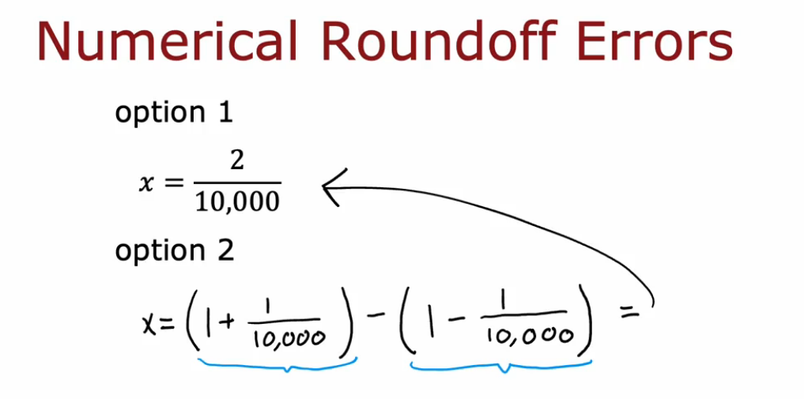

    Due to the way computers store floating point numbers, there may be round off errors depending on how you calculate a number:

    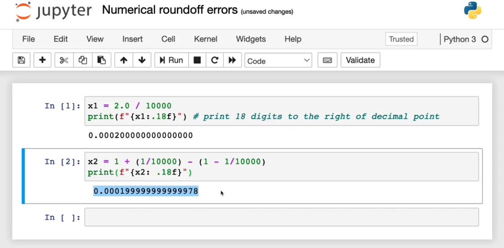

    So, although the way we've been computing the cost function for softmax is correct, there's a different way of formulating it that reduces these numerical round-off errors, leading to more accurate computations within TensorFlow. Let's first take a look at logistic regression's loss function:

    

    - If we expand `a`, TensorFlow can rearrange terms in this expression and come up with a more numerically accurate way to compute this loss function.
    - `from_logits=True` sets the output layer to just use a linear activation function and puts both the activation function, $ \frac{1}{1 + e^{-z}} $, and the cross entropy loss into the specification of the loss function (the more accurate one). Basically, your output is linear, and TensorFlow takes this linear output, `z`, and does the appropriate actions with it (e.g. $ \frac{1}{1 + e^{-z}} $ for binary cross entropy). This causes TensorFlow to have little less numerical round off error.
        - Linear basically just means we're just computing `z` in the output layer.
        - logit is the value `z`.
    - In the case of logistic regression, either of these implementations work okay. The numerical round off errors can get worse when using the original loss with softmax.
    - We trade a bit of code readability for accuracy.

    Now, let's do the same with softmax:

    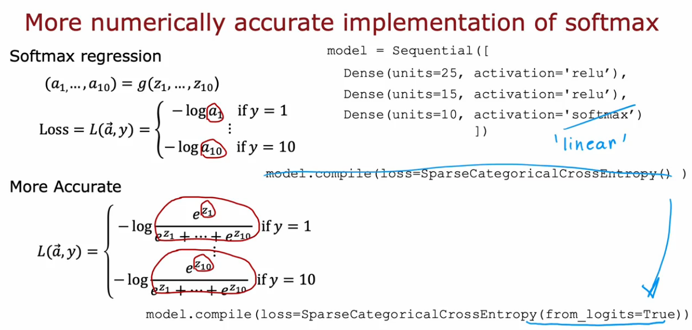

    - Just to give you some intuition for why TensorFlow might want to do rearrange terms, it turns out if one of the `z`'s really small then `e` to the power of a negative small number becomes very, very small or if one of the `z`'s is a very large number, then `e` to the `z` can become a very large number. By rearranging terms, TensorFlow can avoid some of these very small or very large numbers and therefore come up with a more accurate computation for the loss function.

    There is one more catch:

    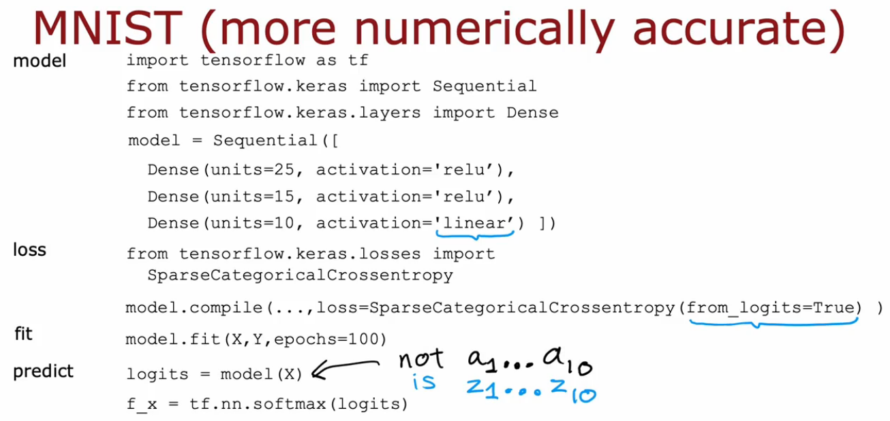

    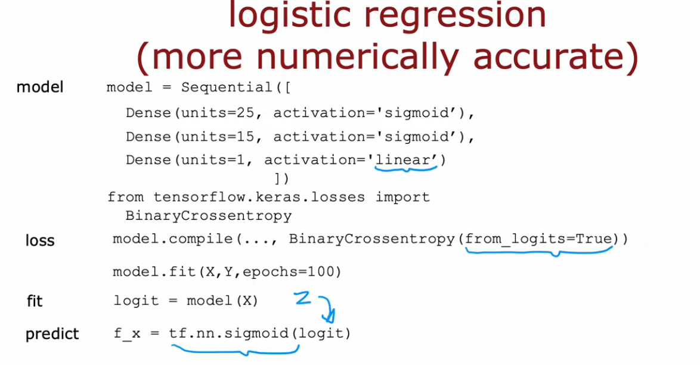

    - Since we changed the output layer's activation function to linear, our model now outputs `z` instead of a probability. So we need to perform an extra step if we use the more accurate version for both logistic regression and softmax regression; we have to map the output to the correct function for our model (e.g. sigmoid, softmax, etc.).

#### Optional Lab: Softmax Function
- [Softmax Function](https://colab.research.google.com/drive/1CGMBWojAg9_9MnmDuj2EEzj_JOy5UC-W?authuser=4)

#### Optional Lab: Multi-class Classification
- [Multiclass Classification](https://colab.research.google.com/drive/1YXjbVummnZByC-NzVPspMOXzQ5khSzj-?authuser=4)

#### Classification with Multiple Outputs
- An image can have multiple labels. For example:

    

    - So, how do we build a neural network for this?
        - We could build a separate neural networks for each class.
        - We could build one neural network to detect all of the classes.
    
    Let's take a look at the two possible implementations:

    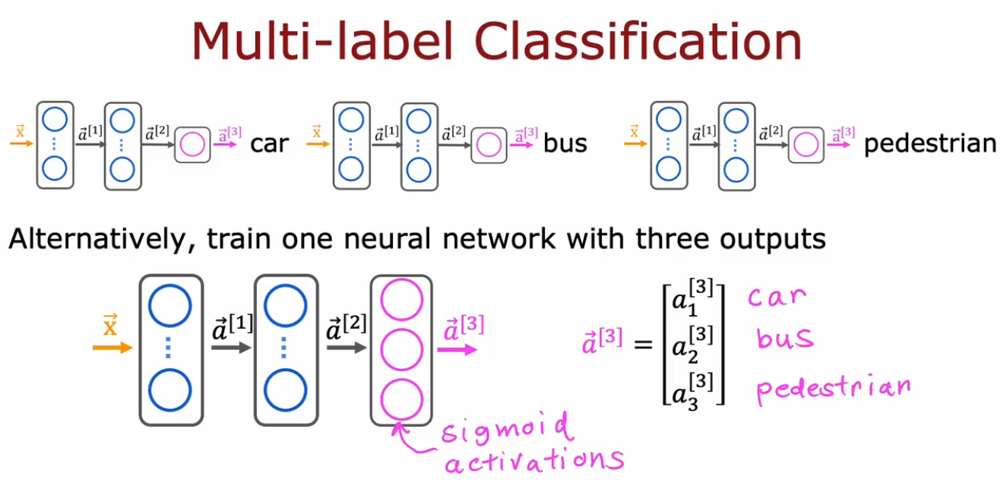

### Advanced Optimization
- There are now some other optimization algorithms for minimizing the cost function, that are even better than gradient descent. Recall gradient descent:

    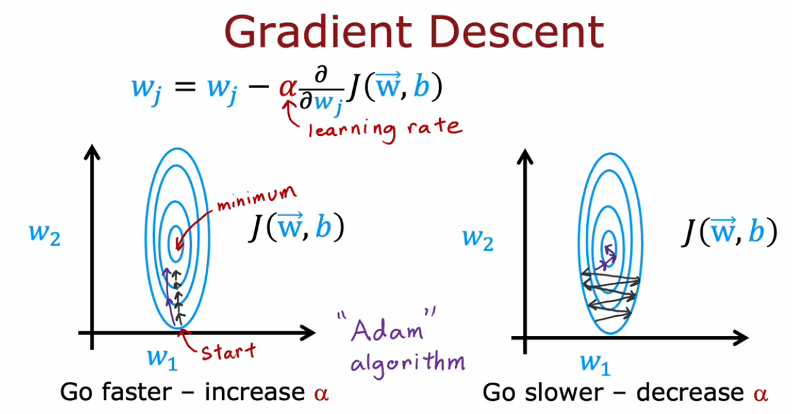

    - There's an algorithm called "Adam", where if it sees that the learning rate is too small, and we are just taking tiny little steps in a similar direction over and over, we should just make the learning rate $ \alpha $ bigger. It'll also decrease the learning rate if the steps in gradient descent are too big.
    
    What is Adam?

    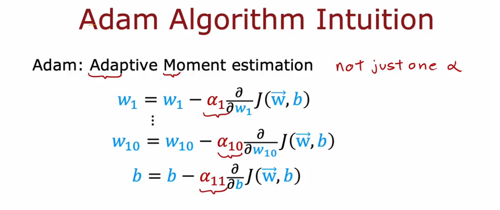

    - Adam uses a different learning rate for every parameter of your model.

    Let's look at the intuition behind the Adam algorithm:

    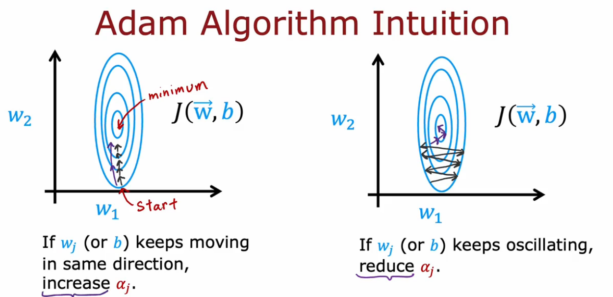

    Here's how you can implement Adam in TensorFlow:

    

    - Notice the extra argument in `compile` which is required to use Adam.
    - In practice, try some large and small default values (default value here is 0.001) to see what gives you better performance.

### Additional Layer Types
- So far, we've been using dense layer types. There are other layer types that we can use, but let's first recap the dense layer:

    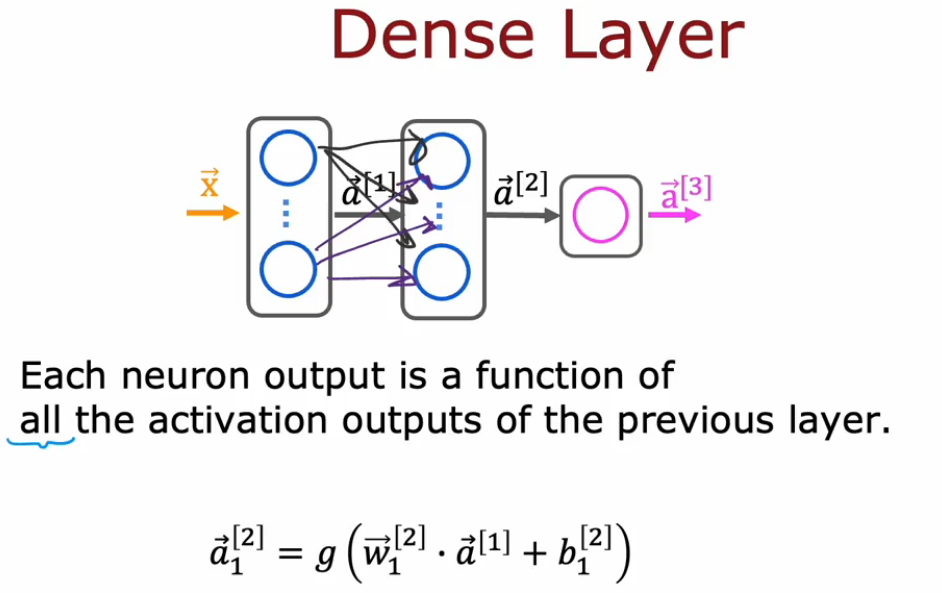

    Let's look at what a convolutional layer is:

    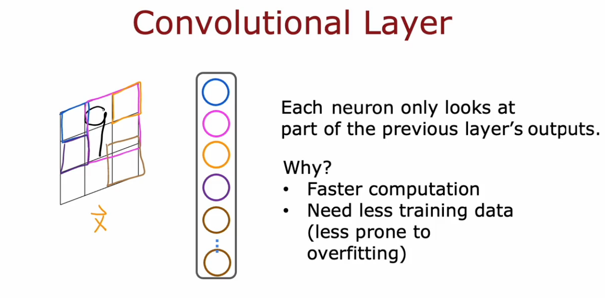

    Now, let's look at what a convolutional neural network is:

    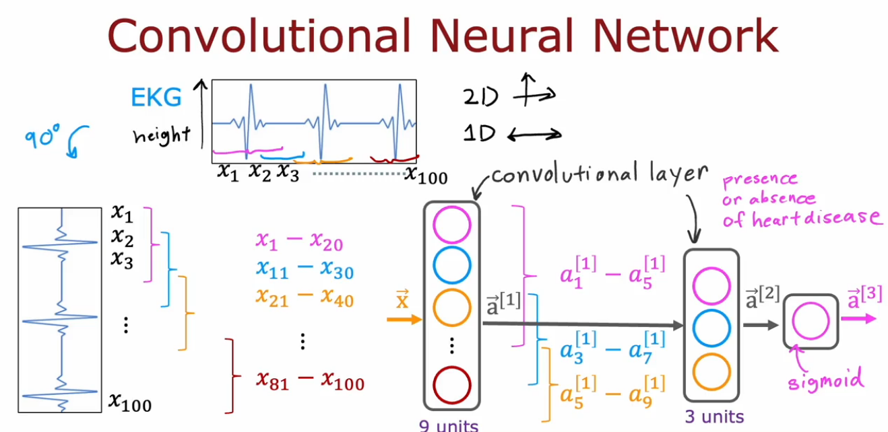

    - A neural network with a lot of convolutional layers is called a convolutional neural network.
    - This example uses a 1D input instead of a 2D input.
    - EKG in some places is just a list of numbers that correspond to the height at different points in time. So you may have say 100 numbers corresponding to the height of this curve at 100 different points of time. The learning task given this time series, given this EKG signal, is to classify say whether this patient has a heart disease or some diagnosable heart condition. This example is what a convolutional neural network might do.

## common symbols
- ($ x^{(i)} $, $ y^{(i)} $)
- $ \hat{y} $
    - $ \hat{y}^{(i)} $
    -  $ y^{(i)} $
    - $ \hat{y}^{(i)} = f_{w, b}(x^{(i)}) $
- $ f_{w, b}(x) = wx + b $
- $ f_{w, b}(x) $
- $ (\hat{y}^{(i)} - y^{(i)})^{2} $
- $ J(w, b) = \frac{1}{2m}\sum_{i = 1}^m (\hat{y}^{(i)} - y^{(i)})^{2} $
- $ w = w - \alpha \frac{\partial}{\partial w} J(w,b) $
- $ b = b - \alpha \frac{\partial}{\partial b} J(w,b) $

## Labs
- Note that the labs are paid content on Coursera. Therefore, these links lead to private notebooks, which are only for my personal use. 

### Optional
- [Python and Jupyter Notebooks](https://colab.research.google.com/drive/1cGZyfoWUMjn4f61B-njulkBWUdyEV-AN?authuser=4)

- [Model Representation](https://colab.research.google.com/drive/1TSL3bQ1-YsvCqqmBvfjtByZgOR6shxmg?authuser=4)

- [Cost Function](https://colab.research.google.com/drive/1hkgf1yn5GPexFAKpJS4AFDZpDk5DA8o8?authuser=4)

- [Gradient Descent for Linear Regression](https://colab.research.google.com/drive/1I-TCaw59ZmU2HVhA7hbfN2AoRaCehlxQ?authuser=4)

- [Python, NumPy and Vectorization](https://colab.research.google.com/drive/1CG9VWRVDnovYoSqYbIaoQ4QwRPNUuG8T?authuser=4)

- [Multiple Variable Linear Regression](https://colab.research.google.com/drive/1vMy08j5jBjzOntnWHB0unvdoHu7CE-on?authuser=4)

- [Feature scaling and Learning Rate (Multi-variable)](https://colab.research.google.com/drive/1Am_I8axDyqV0nUexZ3sERnI-Og2VSdKO?authuser=4)

- [Feature Engineering and Polynomial Regression](https://colab.research.google.com/drive/1J8ofYy5RYJuvaTxER6bjYWKO26IVr47t?authuser=4)

- [Linear Regression using Scikit-Learn](https://colab.research.google.com/drive/1RStSzMIjUEB8ZHerPnxt0oz_vBovpqwm?authuser=4)

- [Classification](https://colab.research.google.com/drive/1WceZ_v0Fx7wPrEei7Ju98ISrf7WI9ByV?authuser=4)

- [Logistic Regression](https://colab.research.google.com/drive/1OHbfCUhCxrgH1XMC5pNgakfOHrsesoon?authuser=4)

- [Logistic Regression, Decision Boundary](https://colab.research.google.com/drive/1r9siSIRokpJ-EEXlAXyVePiTLmrnho7c?authuser=4)

- [Logistic Regression, Logistic Loss](https://colab.research.google.com/drive/19-VhAzFqWCb1NFirt0fBuXL63aaoBaag?authuser=4)

- [Cost Function for Logistic Regression](https://colab.research.google.com/drive/1nAgkAAFmZvFia_W-CdmxJex4qGUAEKZa?authuser=4)

- [Gradient Descent for Logistic Regression](https://colab.research.google.com/drive/1W2u2SyAZ9c4Aj_VKcMht3tLLy1uAMG8G?authuser=4)

- [Logistic Regression using Scikit-Learn](https://colab.research.google.com/drive/1PNnz7L7-Btgg6bY526S_KvgZKO0MzZmb?authuser=4)

- [Overfitting](https://colab.research.google.com/drive/12jnLdsRc_ZOBVcpWwqM2KOKw4GVkEp2Z?authuser=4)

- [Regularization](https://colab.research.google.com/drive/1Y5tbpPOFqjGCfzIvv2SCKjGE835QrEfy?authuser=4)

- [Neurons and Layers](https://colab.research.google.com/drive/1WjNmNAI9oap_tZQ4S_Pj4_CMo0CvR__L?authuser=4)

- [Simple Neural Network in Tensorflow](https://colab.research.google.com/drive/1T33d1UEOA3QAdM0G38xRUpeVtZu4YN_W?authuser=4)

- [Simple Neural Network in NumPy](https://colab.research.google.com/drive/1IctkE7hoeJMrzTgQD1WBWtsVpKL7qFuf?authuser=4)

- [ReLU activation](https://colab.research.google.com/drive/17Jc2EzK-f7eEncTi_-HGoNzjQQJW8jfI?authuser=4)

- [Softmax Function](https://colab.research.google.com/drive/1CGMBWojAg9_9MnmDuj2EEzj_JOy5UC-W?authuser=4)

- [Multiclass Classification](https://colab.research.google.com/drive/1YXjbVummnZByC-NzVPspMOXzQ5khSzj-?authuser=4)

### Practice
- [Linear Regression](https://colab.research.google.com/drive/1qG_MCjpe_fH-hi_mUVbZpVNwbsMxm6Ns?authuser=4)

- [Logistic Regression](https://colab.research.google.com/drive/1VRkENCB5PU_l0c-hAKhu9e5AzvNlMZTh?authuser=4)

- [Neural Networks for Handwritten Digit Recognition, Binary](https://colab.research.google.com/drive/1b5kJglk0P6UKiGtdP4p54v7HMZiMIpuE?authuser=4)
