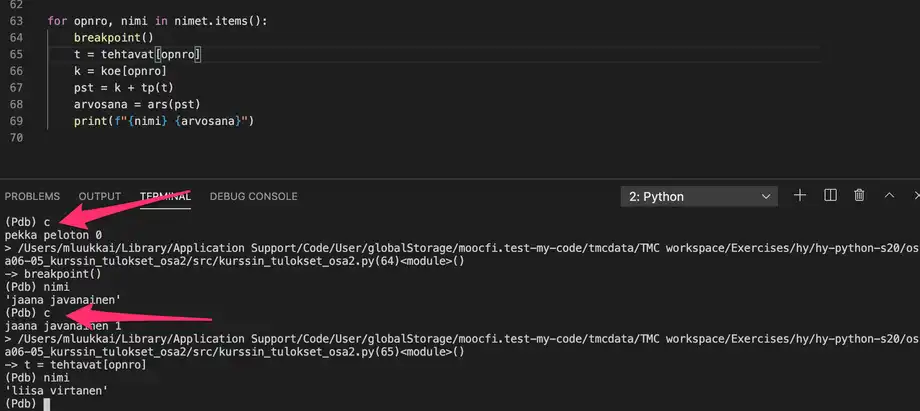

# Python

## Background
- For these notes, I'm starting off at Part 5 of [MOOC's 2025 Python Course](https://programming-25.mooc.fi/part-5), since I have already completed Parts 1-4 of the [2024 version](https://programming-24.mooc.fi/) a while back but never took notes. I may revisit those parts later on to make the notes complete.

## Installation

### Python
- On Linux, Python3 is usually installed by default. If it is not, you can install it using the following command:
    ```bash
    sudo apt install python3
    ```
    - Note that python without the 3 typically refers to Python 2 on Linux.

- On Windows, you can install Python on the [Python Website](https://www.python.org/downloads/windows/) or by using [Chocolatey](https://chocolatey.org/) and running the command:
    ```
    choco install python
    ```

### pip
- pip is a Python package manager.

- On Linux, pip is not installed. You can install it by running:
    ```bash
    sudo apt install python3-pip
    ```

- On Windows, pip should already be installed with Python.

## Running Python 
- Make sure you are in the same directory as the Python file that you want to run.

- Let's say we have a file named `main.py` and want to run it. We can run it by using:
    - `python3 main.py` on Linux
    - `python main.py` on Windows.

## Installing libraries using pip. 
- Similar to running Python, Linux uses `pip3` while Windows uses `pip`.
- If you try to install a package, you may run into this error:
    ```
    error: externally-managed-environment

    × This environment is externally managed
    ╰─> To install Python packages system-wide, try apt install
        python3-xyz, where xyz is the package you are trying to
        install.
        
        If you wish to install a non-Debian-packaged Python package,
        create a virtual environment using python3 -m venv path/to/venv.
        Then use path/to/venv/bin/python and path/to/venv/bin/pip. Make
        sure you have python3-full installed.
        
        If you wish to install a non-Debian packaged Python application,
        it may be easiest to use pipx install xyz, which will manage a
        virtual environment for you. Make sure you have pipx installed.
        
        See /usr/share/doc/python3.12/README.venv for more information.

    note: If you believe this is a mistake, please contact your Python installation or OS distribution provider. You can override this, at the risk of breaking your Python installation or OS, by passing --break-system-packages.
    hint: See PEP 668 for the detailed specification.
    ```
    - The error gives you two solutions: `venv` (virtual environment) is for libraries you would use in your code using `import` and `pipx` is for command-line tools. - [StackOverflow](https://stackoverflow.com/questions/75608323/how-do-i-solve-error-externally-managed-environment-every-time-i-use-pip-3)

## Virtual Environments
- My notes for virtual environments are based off of [this video](https://www.youtube.com/watch?v=Y21OR1OPC9A).

- A virtual environment is a self-contained location that enables you to maintain separate and isolated environments for your Python projects.

- Virtual environments let you manage dependencies, versions, and packages without conflicts across different projects.

### Set-Up & Activation
- To create a virtual environment, go to your project directory and run the command for your respective operating system.
    - For Mac/Linux, run:
        ```bash
        python3 -m venv env
        ```
    - For Windows, run:
        ```bash
        python -m venv env
        ```
    - Note: `env` is simply the directory name. You can name it whatever you want.

- To activate your virtual environment, run the command for your respective operating system.
    - For Linux/Mac, run:
        ```bash
        source env/bin/activate
        ```
    - For Windows, run:
        ```
        env\Scripts\activate.bat
        ```
        - If this does not work, try removing the `.bat` extension.
    - Note: If you named your environment something other than `env`, you'll have to swap `env` out of the path with the name that you assigned it.
    - If the activation is successful, you should see `(env) ` prefixed to the normal line of your terminal.

### Deactivation
- To deactivate your virtual environment, simple input `deactivate`.
    - If this worked, you should see that `(env) ` is no longer prefixed to the normal line of your terminal.

### Dependencies/Packages

#### Checking packages installed in virtual environment
- On Linux/Mac, run:
    ```bash
    pip3 list
    ```

- On Windows, run:
    ```bash
    pip list
    ```

- Note: Running this command outside of the environment will result in a list of packages installed globally.

#### Saving Dependencies
- You should not be committing your whole environment directory onto GitHub. It should be apart of your `.gitignore` in the format `env_dir_name/`.

- Instead, we save all of our dependencies into a `requirements.txt` file by running:
    - On Linux/Mac:
        ```
        pip3 freeze > requirements.txt
        ```
    - On Windows:
        ```
        pip freeze > requirements.txt
        ```
    - The listed commands take the output of `pip freeze` (dependencies) and puts it into `requirements.txt`.
    - [pip Requirements File Format](https://pip.pypa.io/en/stable/reference/requirements-file-format/)

#### Downloading dependencies for a project
- If you downloaded a project off of GitHub or some other remote repository with a `requirements.txt` file, you can download the requirements by:
    1. Setting up a virtual enviroment and entering it
    2. Running:
        - For Linux:
            ```
            pip3 install -r requirements.txt
            ```
        - For Windows:
            ```
            pip install -r requirements.txt
            ```

## Language Syntax

### Built-In Functions
- `sum()` gets the sum of numeric values in an iterable.
- `len()` gets the legnth of an iterable.

### Lists
- Instantiated using `[]`. Example:
    ```python
    names = ["Marlyn", "Ruth", "Paul"]
    print(names) # ['Marlyn', 'Ruth', 'Paul']
    ```

- You can append to a list. Example:
    ```python
    names.append("David")
    print(names) # ['Marlyn', 'Ruth', 'Paul', 'David']
    ```

- You can get the length of a list using the `len()` function. Example:
    ```python
    print("Number of names on the list:", len(names)) # Number of names on the list: 4
    ```

- You can sort a list using the `sort()` method. Example:
    ```python
    names.sort()
    for name in names:
        print(name)
    """
    Names in alphabetical order:
    David
    Marlyn
    Paul
    Ruth
    """
    ```

- Lists can store many type of data. Example:
    ```python
    measurements = [-2.5, 1.1, 7.5, 14.6, 21.0, 19.2] # list of floats
    ```

- Items in a list can be lists themselves. Example:
    ```python
    my_list = [[5, 2, 3], [4, 1], [2, 2, 5, 1]]
    print(my_list) # [[5, 2, 3], [4, 1], [2, 2, 5, 1]]
    print(my_list[1]) # [4, 1]
    print(my_list[1][0]) # 4
    ```
    - A two-dimensional array, or a matrix, is also a natural application of a list within a list. For example, the following matrix
        
        could be presented as a two-dimensional list in Python like so:
        ```python
        my_matrix = [[1, 2, 3], [3, 2, 1], [4, 5, 6]]
        ```
        - Since a matrix is a list containing lists, the individual elements within the matrix can be accessed using consecutive square brackets. The first index refers to the row, and the second to the column. Indexing starts from zero, so for example `my_matrix[0][1]` refers to the second item on the first row. 
            ```python
            my_matrix = [[1, 2, 3], [3, 2, 1], [4, 5, 6]]

            print(my_matrix[0][1]) # 2
            my_matrix[1][0] = 10
            print(my_matrix) # [[1, 2, 3], [10, 2, 1], [4, 5, 6]]
            ```
        - A matrix can be traversed using 2 nested for loops:
            ```python
            my_matrix = [[1, 2, 3], [4, 5, 6], [7, 8, 9]]

            for row in my_matrix:
                print("a new row")
                for element in row:
                    print(element)
            """
            a new row
            1
            2
            3
            a new row
            4
            5
            6
            a new row
            7
            8
            9
            """
            ```
            - Here's a visualization of the matrix:
                - 
                    - The image above reveals that a 3 by 3 matrix technically consists of four lists. The first list represents the entire matrix. The three remaining lists are items in the first list, and represent the rows.
                    - In the image above the execution has progressed to the second row of the matrix, and this list is what the variable `row` currently refers to. The variable `element` contains the element the execution is currently at. The value stored in `element` is the middle item in the list, i.e. 5.

- Lists can contain items of different types. Example:
    ```python
    persons = [["Betty", 10, 1.37], ["Peter", 7, 1.25], ["Emily", 32, 1.64], ["Alan", 39, 1.78]]

    for person in persons:
        name = person[0]
        age = person[1]
        height = person[2]
        print(f"{name}: age {age} years, height {height} meters")
    """
    Betty: age 10 years, height 1.37 meters
    Peter: age 7 years, height 1.25 meters
    Emily: age 32 years, height 1.64 meters
    Alan: age 39 years, height 1.78 meters
    """
    ```
    - The for loop goes through the items in the outer list one by one. That is, each list containing information about a single person is, in turn, assigned to the variable `person`.

### Functions

#### Using global variables within functions
- We know it is possible to assign new variables within function definitions, but the function can also see variables assigned outside it, in the main function. Such variables are called `global variables`.
- Using global variables from within functions is usually a bad idea. Among other issues, doing so may cause bugs which are difficult to trace.
- Example:
    ```python
    def print_reversed(names: list):
        # using the global variable instead of the parameter by accident
        i = len(name_list) - 1
        while i >= 0:
            print(name_list[i])
            i -= 1

    # here the global variable is assigned
    name_list = ["Steve", "Jean", "Katherine", "Paul"]
    print_reversed(name_list)
    """
    Paul
    Katherine
    Jean
    Steve
    """
    print()
    print_reversed(["Huey", "Dewey", "Louie"])
    """
    Paul
    Katherine
    Jean
    Steve
    """
    ```

### Scope
- Example of Scrope bug:
    ```python
    def number_in_list(numbers: list, number: int):
        for number in numbers:
            if number == number:
                return True
        return False
    ```
    - This function seems to always return `True`. The reason is that the `for` loop overwrites the value stored in the parameter `number`. Thus the condition in the `if` statement is always true.
    - Renaming the parameter solves the problem:
        ```python
        def number_in_list(numbers: list, searched_number: int):
            for number in numbers:
                if number == searched_number:
                    return True
            return False
        ```

### References
- Thus far we have thought of a variable as a sort of a "box" which contains the value of the variable. Technically this is not true in Python. What is stored in a variable is not the value per se, but a reference to the object which is the actual value of the variable. The object can be e.g. a number, a string or a list.

    In practice, this means that the value of the variable is not stored in the variable itself. Instead, there is information about the location in computer memory where the value can be found.

    A reference is often represented by an arrow from the variable to the actual value in memory:
    <p align="center">
        
    </p>

- So, a reference tells us where the value can be found. The function `id` can be used to find out the exact location the variable points to:
    ```python
    a = [1, 2, 3]
    print(id(a))    # sample output: 4538357072
    b = "This is a reference, too"
    print(id(b))    # sample output: 4537788912
    ```
    - The reference, or the ID of the variable, is an integer, which can be thought of as the address in computer memory where the value of the variable is stored. If you execute the above code on your own computer, the result will likely be different, as your variables will point to different locations - the references will be different.

#### Multiple references to the same list and how to copy a list
- What is happening in this code:
    ```python
    a = [1, 2, 3]
    b = a
    b[0] = 10
    print(a) # [10, 2, 3]
    print(b) # [10, 2, 3]
    ```
    - The assignment `b = a` copies the value stored in variable `a` to the variable `b`. However, the value stored in `a` is not the list itself, but a reference to the list. So, the assignment `b = a` copies the reference. As a result there are now two references to the same memory location containing the list.
    - This means that the list (`[1, 2, 3]`) can be accessed through `a` or `b`.
    - If there is more than one reference to the same list, any one of the references can be used to access the list. On the other hand, a change made through any one of the references affects also the other references, as their target is the same.
    - If you want to create an actual separate copy of a list, you can create a new list and add each item from the original list in turn:
        ```python
        my_list = [1, 2, 3, 3, 5]

        new_list = []
        for item in my_list:
            new_list.append(item)

        new_list[0] = 10
        new_list.append(6)
        print("the original:", my_list) # the original: [1, 2, 3, 3, 5]
        print("the copy:", new_list) # the copy: [10, 2, 3, 3, 5, 6]
        ```
        - The variable `new_list` points to a different list than the variable `my_list`.
        - An easier way to copy a list is the bracket operator `[]`, which we used for slices previously. The notation `[:]` selects all items in the collection. As a side effect, it creates a copy of the list:
            ```python
            my_list = [1,2,3,4]
            new_list = my_list[:]

            my_list[0] = 10
            new_list[1] = 20

            print(my_list) # [10, 2, 3, 4]
            print(new_list) # [1, 20, 3, 4]
            ```

- To copy a 2D list/matrix, you would need to do something like this:
    ```python
    matrix = [[1, 2, 3], [4, 5, 6]]
    res = []
    for r in matrix:
        res.append(r[:])
    return res
    ```

#### Using lists as parameters in functions
- When you pass a list as an argument to a function, you are passing a reference to that list. This means that the function can modify the list directly.
    - The following function takes a list as an argument and adds a new item to the end of the list:
        ```python
        def add_item(my_list: list):
            new_item = 10
            my_list.append(new_item)

        a_list = [1,2,3]
        print(a_list)   # [1, 2, 3]
        add_item(a_list)
        print(a_list)   # [1, 2, 3, 10]
        ```
        <p align="center">
            
        </p>
        - Global frame refers to the variables defined in the main function, whereas the add_item frame with a blue background represents the parameters and variables within that function. As you can see from the visualisation, the `add_item` function refers to the very same list as the main function. The changes made within the `add_item` function also affect the main function.
        - Another way to implement this functionality would be to create a new list within the function, and return that:
            ```python
            def add_item(my_list: list) -> list:
                new_item = 10
                my_list_copy = my_list[:]
                my_list_copy.append(new_item)
                return my_list_copy

            numbers = [1, 2, 3]
            numbers2 = add_item(numbers)

            print("original list:", numbers) # original list: [1, 2, 3]
            print("new list:", numbers2) # new list: [1, 2, 3, 10]
            ```

#### Editing a list given as an argument
- The following is an attempt at a function which should augment each item in a list by ten:
    ```python
    def augment_all(my_list: list):
        new_list = []
        for item in my_list:
            new_list.append(item + 10)
        my_list = new_list

    numbers = [1, 2, 3]
    print("in the beginning:", numbers) # in the beginning: [1, 2, 3]
    augment_all(numbers)
    print("after the function is executed:", numbers) # after the function is executed: [1, 2, 3]
    ```
    - The function takes a reference to a list as an argument. This is stored in the variable `my_list`. The assignment `my_list = new_list` assigns a new value to that same variable. The variable `my_list` now points to the new list created inside the function, and the reference to the original list is no longer available within the function. This assignment has no effect outside the function, however.
    - Furthermore, the variable `new_list`, which contains the new, augmented values, is not accessible from outside the function. It is "lost" as the execution of the function finishes, and focus returns to the main function. The variable `numbers` in the main function always points to the original list.
    <p align="center">
        
    </p>
    - One way to fix this is to copy all the items from the new list to the old list, one by one:
        ```python
        def augment_all(my_list: list):
            new_list = []
            for item in my_list:
                new_list.append(item + 10)

            # copy items from the new list into the old list
            for i in range(len(my_list)):
                my_list[i] = new_list[i]
        ```
        - Python also has a nifty shorthand for assigning multiple items in a collection at once:
            ```shell
            >>> my_list = [1, 2, 3, 4]
            >>> my_list[1:3] = [10, 20]
            >>> my_list
            [1, 10, 20, 4]
            ```
            We can include the entire collection:
            ```shell
            >>> my_list = [1, 2, 3, 4]
            >>> my_list[:] = [100, 99, 98, 97]
            >>> my_list
            [100, 99, 98, 97]
            ```
        - You could also use the `[:]` shorthand:
            ```python
            def augment_all(my_list: list):
                new_list = []
                for item in my_list:
                    new_list.append(item + 10)

                my_list[:] = new_list
            ```
        - We can also just assign the new values directly into the list:
            ```python
            def augment_all(my_list: list):
                for i in range(len(my_list)):
                    my_list[i] += 10
            ```

#### Side effects of functions
- side effect of a function: Unintentional modifications to an object accessed through a reference

- pure functions: functions free of side effects
    - When adhering to a functional programming style, this is a common ideal to follow.

#### Immutable Types
- immutable: value of the object, or any part of it, cannot change. 

- Immutable type's value can be replaced with a new value.

- Some immutabled types in Python are: 
    - `str`
    - `int`
    - `float` 
    - `bool`
    - `tuple`

- Example: 
    ```python
    number = 1
    print(id(number)) # sample output: 4535856912
    number += 10
    print(id(number)) # sample output: 4535856944
    a = 1
    print(id(a)) # sample output: 4535856912
    ```
    - Note how when `a` is set to 1, it has the same reference as when `number` was equal to 1. So, Python has stored the value 1 at that memory location.

- It is good to keep in mind that almost everything is a reference in Python, but all this is rarely relevant to everyday programming tasks.

### Dictionary
- In a dictionary, the items are indexed by keys. Each key maps to a value. The values stored in the dictionary can be accessed and changed using the key.

#### Using a dictionary
- The following example shows you how the dictionary data structure works. Here is a simple dictionary from Finnish to English:
    ```python
    my_dictionary = {}

    my_dictionary["apina"] = "monkey"
    my_dictionary["banaani"] = "banana"
    my_dictionary["cembalo"] = "harpsichord"

    print(len(my_dictionary)) # 3
    print(my_dictionary) # {'apina': 'monkey', 'banaani': 'banana', 'cembalo': 'harpsichord'}
    print(my_dictionary["apina"]) # monkey
    ```
    - The notation `{}` creates an empty dictionary, to which we can now add content. Three key-value pairs are added:`"apina"` maps to `"monkey"`, `"banaani"` maps to `"banana"`, and `"cembalo"` maps to `"harpsichord"`. Finally, the number of key-value pairs in the dictionary is printed, along with the entire dictionary, and the value mapped to the key `"apina"`.

    - After defining the dictionary we could also use it with user input:
        ```python
        word = input("Please type in a word: ")
        if word in my_dictionary:
            print("Translation: ", my_dictionary[word])
        else:
            print("Word not found")
        ```
        - Notice the use of the `in` operator above. When used on a variable of type dictionary, it checks whether the first operand is among the keys stored in the dictionary. Given different inputs, this program might print out the following:
            ```shell
            Please type in a word: apina
            Translation: monkey
            ```
            ```shell
            Please type in a word: pöllö
            Word not found
            ```

#### What can be stored in a dictionary?
- The data type is called dictionary, but it does not have to contain only strings. For example, in the following dictionary the keys are strings, but the values are integers:
    ```python
    results = {}
    results["Mary"] = 4
    results["Alice"] = 5
    results["Larry"] = 2
    ```

- Here the keys are integers and the values are lists:
    ```python
    lists = {}
    lists[5] = [1, 2, 3]
    lists[42] = [5, 4, 5, 4, 5]
    lists[100] = [5, 2, 3]
    ```

#### How keys and values work
- Each key can appear only once in the dictionary. If you add an entry using a key that already exists in the dictionary, the original value mapped to that key is replaced with the new value:
    ```python
    my_dictionary["suuri"] = "big"
    my_dictionary["suuri"] = "large"
    print(my_dictionary["suuri"])
    ```
    ```
    large
    ```

- All keys in a dictionary must be immutable. So, a list cannot be used as a key, because it can be changed. For example, executing the following code causes an error:
    ```python
    my_dictionary[[1, 2, 3]] = 5
    ```
    ```
    TypeError: unhashable type: 'list'
    ```
    - Notice the word 'unhashable' in the error message above. This is a reference to the inner workings of the dictionary data type. Python stores the contents of a dictionary in a hash table. Each key is reduced to a hash value, which determines where the key is stored in computer memory. The error message above indicates that a list cannot be processed into a hash value, so it cannot be used as a key in a dictionary.

- Unlike keys, the values stored in a dictionary can change, so any type of data is acceptable as a value. A value can also be mapped to more than one key in the same dictionary.

#### Traversing a dictionary
- The familiar for item in collection loop can be used to traverse a dictionary, too. When used on the dictionary directly, the loop goes through the keys stored in the dictionary, one by one. In the following example, all keys and values stored in the dictionary are printed out:
    ```python
    my_dictionary = {}

    my_dictionary["apina"] = "monkey"
    my_dictionary["banaani"] = "banana"
    my_dictionary["cembalo"] = "harpsichord"

    for key in my_dictionary:
        print("key:", key)
        print("value:", my_dictionary[key])
    ```
    Output:
    ```shell
    key: apina
    value: monkey
    key: banaani
    value: banana
    key: cembalo
    value: harpsichord
    ```

- Sometimes you need to traverse the entire contents of a dictionary. The method `items` returns all the keys and values stored in the dictionary, one pair at a time:
    ```python
    for key, value in my_dictionary.items():
        print("key:", key)
        print("value:", value)
    ```
    - In the examples above, you may have noticed that the keys are processed in the same order as they were added to the dictionary. As the keys are processed based on a hash value, the order should not usually matter in applications. In fact, in many older versions of Python the order is not guaranteed to follow the time of insertion.

#### Some more advanced ways to use dictionaries
- Let's have a look at a list of words:
    ```python
    word_list = [
    "banana", "milk", "beer", "cheese", "sourmilk", "juice", "sausage",
    "tomato", "cucumber", "butter", "margarine", "cheese", "sausage",
    "beer", "sourmilk", "sourmilk", "butter", "beer", "chocolate"
    ]
    ```
    - We would like to analyze this list of words in different ways. For instance, we would like to know how many times each word appears in the list. A dictionary can be a useful tool in managing this kind of information. In the example below, we go through the items in the list one by one. Using the words in the list as keys in a new dictionary, the value mapped to each key is the number of times the word has appeared:
        ```python
        def counts(my_list):
            words = {}
            for word in my_list:
                # if the word is not yet in the dictionary, initialize the value to zero
                if word not in words:
                    words[word] = 0
                # increment the value
                words[word] += 1
            return words

        # call the function
        print(counts(word_list))
        ```
        Output:
        ```
        {'banana': 1, 'milk': 1, 'beer': 3, 'cheese': 2, 'sourmilk': 3, 'juice': 1, 'sausage': 2, 'tomato': 1, 'cucumber': 1, 'butter': 2, 'margarine': 1, 'chocolate': 1}
        ```

- What if we wanted to categorize the words based on the initial letter in each word? One way to accomplish this would be to use dictionaries:
    ```python
    def categorize_by_initial(my_list):
        groups = {}
        for word in my_list:
            initial = word[0]
            # initialize a new list when the letter is first encountered
            if initial not in groups:
                groups[initial] = []
            # add the word to the appropriate list
            groups[initial].append(word)
        return groups

    groups = categorize_by_initial(word_list)

    for key, value in groups.items():
        print(f"words beginning with {key}:")
        for word in value:
            print(word)
    ```
    Output:
    ```
    words beginning with b:
    banana
    beer
    butter
    beer
    butter
    beer
    words beginning with m:
    milk
    margarine
    words beginning with c:
    cheese
    cucumber
    cheese
    chocolate
    words beginning with s:
    sourmilk
    sausage
    sausage
    sourmilk
    sourmilk
    words beginning with j:
    juice
    words beginning with t:
    tomato
    ```

#### Removing keys and values from a dictionary
- It is naturally possible to also remove key-value pairs from the dictionary. There are two ways to accomplish this. The first is the command `del`:
    ```python
    staff = {"Alan": "lecturer", "Emily": "professor", "David": "lecturer"}
    del staff["David"]
    print(staff) # {'Alan': 'lecturer', 'Emily': 'professor'}
    ```
    - If you try to use the del command to delete a key which doesn't exist in the dictionary, there will be an error:
        ```python
        staff = {"Alan": "lecturer", "Emily": "professor", "David": "lecturer"}
        del staff["Paul"]
        ```
        Output:
        ```
        >>> del staff["Paul"]
        Traceback (most recent call last):
        File "", line 1, in 
        KeyError: 'Paul'
        ```
        - So, before deleting a key you should check if it is present in the dictionary:
            ```python
            staff = {"Alan": "lecturer", "Emily": "professor", "David": "lecturer"}
            if "Paul" in staff:
                del staff["Paul"]
                print("Deleted")
            else:
                print("This person is not a staff member")
            ```
            - As you can see above, `pop` also returns the value from the deleted entry.
            - By default, pop will also cause an error if you try to delete a key which is not present in the dictionary. It is possible to avoid this by giving the method a second argument, which contains a default return value. This value is returned in case the key is not found in the dictionary. The special Python value `None` will work here:
                ```python
                staff = {"Alan": "lecturer", "Emily": "professor", "David": "lecturer"}
                deleted = staff.pop("Paul", None)
                if deleted == None:
                    print("This person is not a staff member")
                else:
                    print(deleted, "deleted")
                ```
                Output:
                ```
                This person is not a staff member
                ```

- Note: If you need to delete the contents of the entire dictionary, and try to do it with a for loop, like so:
    ```python
    staff = {"Alan": "lecturer", "Emily": "professor", "David": "lecturer"}
    for key in staff:
        del staff[key]
    ```
    You will receive an error message:
    ```
    RuntimeError: dictionary changed size during iteration
    ```
    - When traversing a collection with a `for` loop, the contents may not change while the loop is in progress. Luckily, there is a dictionary method for just this purpose:
        ```python
        staff.clear()
        ```

- The other way to delete entries in a dictionary is the method `pop`:
    ```python
    staff = {"Alan": "lecturer", "Emily": "professor", "David": "lecturer"}
    deleted = staff.pop("David")
    print(staff)    # {'Alan': 'lecturer', 'Emily': 'professor'}
    print(deleted, "deleted") # lecturer deleted
    ```

#### Using dictionaries for structured data
- Dictionaries are very useful for structuring data. The following code will create a dictionary which contains some personal data:
    ```python
    person = {"name": "Pippa Python", "height": 154, "weight": 61, "age": 44}
    ```
    This means that we have here a person named Pippa Python, whose height is 154, weight 61, and age 44. The same information could just as well be stored in variables:
    ```
    name = "Pippa Python"
    height = 154
    weight = 61
    age = 44
    ```

- The advantage of a dictionary is that it is a collection. It collects related data under one variable, so it is easy to access the different components. This same advantage is offered by a list:
    ```python
    person = ["Pippa Python", 153, 61, 44]
    ```
    - With lists, the programmer will have to remember what is stored at each index in the list. There is nothing to indicate that `person[2]` contains the weight and `person[3]` the age of the person. When using a dictionary this problem is avoided, as each bit of data is accessed through a named key. 
    - Assuming we have defined multiple people using the same format, we can access their data in the following manner:
        ```python
        person1 = {"name": "Pippa Python", "height": 154, "weight": 61, "age": 44}
        person2 = {"name": "Peter Pythons", "height": 174, "weight": 103, "age": 31}
        person3 = {"name": "Pedro Python", "height": 191, "weight": 71, "age": 14}

        people = [person1, person2, person3]

        for person in people:
            print(person["name"])

        combined_height = 0
        for person in people:
            combined_height += person["height"]

        print("The average height is", combined_height / len(people))
        ```
        Output:
        ```
        Pippa Python
        Peter Pythons
        Pedro Python
        The average height is 173.0
        ```

### Tuple
- Tuple is a data structure which is, in many ways, similar to a list. The most important differences between the two are:
    - Tuples are enclosed in parentheses `()`, while lists are enclosed in square brackets `[]`
    - Tuples are immutable, while the contents of a list may change

- The items stored in a tuple are accessed by index, just like the items stored in a list:
    ```python
    point = (10, 20)
    print("x coordinate:", point[0]) # x coordinate: 10
    print("y coordinate:", point[1]) # y coordinate: 20
    ```

- The values stored in a tuple cannot be changed after the tuple has been defined. The following will not work:
    ```python
    point = (10, 20)
    point[0] = 15
    ```
    Output:
    ```
    TypeError: 'tuple' object does not support item assignment
    ```

#### What is the purpose of a tuple?
- Tuples are ideal for when there is a set collection of values which are in some way connected. For example, when there is a need to handle the x and y coordinates of a point, a tuple is a natural choice, because coordinates will always consist of two values:
    ```python
    point = (10, 20)
    ```
    Technically it is of course possible to also use a list to store these:
    ```python
    point = [10, 20]
    ```
    A list is a collection of consecutive items in a certain order. The size of a list may also change. When we are storing the coordinates of a point, we want to store the x and y coordinates specifically, not an arbitrary list containing those values.

- Because tuples are immutable, unlike lists, they can be used as keys in a dictionary. The following bit of code creates a dictionary, where the keys are coordinate points:
    ```python
    points = {}
    points[(3, 5)] = "monkey"
    points[(5, 0)] = "banana"
    points[(1, 2)] = "harpsichord"
    print(points[(3, 5)])
    ```

#### Tuples without parentheses
- The parentheses are not strictly necessary when defining tuples. The following two variable assignments are identical in their results:
    ```python
    numbers = (1, 2, 3)
    ```
    ```python
    numbers = 1, 2, 3
    ```

- This means we can also easily return multiple values using tuples. Let's have alook at he following example:
    ```python
    def minmax(my_list):
        return min(my_list), max(my_list)

    my_list = [33, 5, 21, 7, 88, 312, 5]

    min_value, max_value = minmax(my_list)
    print(f"The smallest item is {min_value} and the greatest item is {max_value}")
    ```
    Output:
    ```
    The smallest item is 5 and the greatest item is 312
    ```
    - This function returns two values in a tuple. The return value is assigned to two variables at once:
        ```python
        min_value, max_value = minmax(my_list)
        ```
    - Using parentheses may make the notation more clear. On the left hand side of the assignment statement we also have a tuple, which contains two variable names. The values contained within the tuple returned by the function are assigned to these two variables.
        ```python
        (min_value, max_value) = minmax(my_list)
        ```

- The method `my_dictionary.items()` returns each key-value pair as a tuple, where the first item is the key and the second item is the value.

- Another common use case for tuples is swapping the values of two variables:
    ```python
    number1, number2 = number2, number1
    ```
    - The assignment statement above swaps the values stored in the variables `number1` and `number2`. The result is identical to what is achieved with the following bit of code, using a helper variable:
        ```python
        helper_var = number1
        number1 = number2
        number2 = helper_var
        ```

### Reading files
- A very common use case for programming is handling data stored in files. Programs can read data from files and write the computed results to files. Even large amounts of data become easy to process automatically when files are used.

#### Reading data from a file
- Let's first work with a file called `example.txt`, with the following contents:
    ```
    Hello there!
    This example file contains three lines of text.
    This is the last line.
    ```

- A simple way to include files in a Python program is to use the `with` statement. The header line opens the file, and the block where the file can be accessed follows. After the block the file is automatically closed, and can no longer be accessed. So, the following code opens the file, reads the contents, prints them out, and then closes the file:
    ```python
    with open("example.txt") as new_file:
        contents = new_file.read()
        print(contents)
    ```
    ```output
    Hello there!
    This example file contains three lines of text.
    This is the last line.
    ```
    - Note: `with` can be used with any context manager. Context managers in Python offer a structured approach to resource management within a with statement, ensuring proper allocation and deallocation of resources
    - The variable `new_file` above is a file handle. Through it the file can accessed while it is still open. Here we used the method `read`, which returns the contents of the file as a single string. So, in this case the string returned by `read` would be:
    ```
    "Hello there!\nThis example file contains three lines of text.\nThis is the last line."
    ```

#### Going through the contents of a file
- The `read` method is useful for printing out the contents of the entire file, but more often we will want to go through the file line by line. Text files can be thought of as lists of strings, each string representing a single line in the file. We can go through the list with a `for` loop. The following example reads our example file using a `for` loop, removes line breaks from the end of each line, counts the number of lines, and prints each line with its line number. It also keeps track of the length of the lines:
    ```py
    with open("example.txt") as new_file:
        count = 0
        total_length = 0

        for line in new_file:
            line = line.replace("\n", "")
            count += 1
            print("Line", count, line)
            length = len(line)
            total_length += length

    print("Total length of lines:", total_length)
    ```
    Output:
    ```
    Line 1 Hello there!
    Line 2 This example file contains three lines of text.
    Line 3 This is the last line.
    Total length of lines: 81
    ```
    - There is a line break `\n` at the end of each line in the file, but the `print` function also adds a line break by default. There are no extra line breaks in the printout above, because the line breaks at the ends of the lines are removed with the `replace` method. It replaces each line break character with an empty string. This way the lengths of the lines are also calculated correctly.

#### Reading CSV files
- A CSV file, short for comma-separated Values, is a text file which contains data separated by a predetermined character. The most common characters used for this purpose are the comma `,` and the semicolon `;`, but any character is, in principle, possible.

- CSV files are commonly used to store records of different kinds. Many database and spreadsheet programs, such as Excel, can import and export data in CSV format, which makes data exchange between different systems easy.

- We already learnt we can go through the lines in a file with a for loop, but how can we separate the different fields on a single line? Python has a string method `split` for just this purpose. The method takes the separator character(s) as a string argument, and returns the contents of the target string as a list of strings, separated at the separator.
    - An example of how the method works:
        ```py
        text = "monkey,banana,harpsichord"
        words = text.split(",")
        for word in words:
            print(word)
        ```
        Output:
        ```
        monkey
        banana
        harpsichord
        ```
    - The following program goes through the file line by line, splits each line into its separate parts, and prints out the name and grades of each student.
        ```py
        with open("grades.csv") as new_file:
        for line in new_file:
            line = line.replace("\n", "")
            parts = line.split(";")
            name = parts[0]
            grades = parts[1:]
            print("Name:", name)
            print("Grades:", grades)
        ```
        Output:
        ```
        Name: Paul
        Grades: ['5', '4', '5', '3', '4', '5', '5', '4', '2', '4']
        Name: Beth
        Grades: ['3', '4', '2', '4', '4', '2', '3', '1', '3', '3']
        Name: Ruth
        Grades: ['4', '5', '5', '4', '5', '5', '4', '5', '4', '4']
        ```
    - The opposite of split would be `join`. Example:
        ```py
        res = ['a', 'b', 'c']
        print("".join(res)) # abc
        ```

#### Reading the same file multiple times
- Sometimes it is necessary to process the contents of a file more than once in a single program. Let's have a look at a program which works with some personal data stored in a CSV file:
    ```
    Peter;40;Helsinki
    Emily;34;Espoo
    Eric;42;London
    Adam;100;Amsterdam
    Alice;58;Paris
    ```
    ```py
    with open("people.csv") as new_file:
        # print out the names
        for line in new_file:
            parts = line.split(";")
            print("Name:", parts[0])

        # find the oldest
        age_of_oldest = -1
        for line in new_file:
            parts = line.split(";")
            name = parts[0]
            age = int(parts[1])
            if age > age_of_oldest:
                age_of_oldest = age
                oldest = name
        print("the oldest is", oldest)
    ```
    Running this will result in a somewhat cryptic error message:
    ```py
    Traceback (most recent call last):
        print("the oldest is"; oldest)
    UnboundLocalError: local variable 'oldest' referenced before assignment
    ```
    - The reason this happens is that the latter `for` loop is not executed at all, beacuse the file can only be processed once. Once the last line is read, the file handle rests at the end of the file, and the data in the file can no longer be accessed.
    - If we want to access the contents in the second `for` loop, we will have to `open` the file a second time:
        ```py
        with open("people.csv") as new_file:
            # print out the names
            for line in new_file:
                parts = line.split(";")
                print("Name:", parts[0])

        with open("people.csv") as new_file:
            # find the oldest
            age_of_oldest = -1
            for line in new_file:
                parts = line.split(";")
                name = parts[0]
                age = int(parts[1])
                if age > age_of_oldest:
                    age_of_oldest = age
                    oldest = name
            print("the oldest is", oldest)
        ```
        - While the above code would work, it contains unnecessary repetition. It is usually best to read the file just once, and store its contents in an appropriate format for further processing:
            ```py
            people = []
            # read the contents of the file and store it in a list
            with open("people.csv") as new_file:
                for line in new_file:
                    parts = line.split(";")
                    people.append((parts[0], int(parts[1]), parts[2]))

            # print out the names
            for person in people:
                print("Name:", person[0])

            # find the oldest
            age_of_oldest = -1
            for person in people:
                name = person[0]
                age = person[1]
                if age > age_of_oldest:
                    age_of_oldest = age
                    oldest = name
            print("the oldest is", oldest)
            ```

#### More CSV file processing
- Let's continue with the file `grades.csv`, which has the following contents:
    ```
    Paul;5;4;5;3;4;5;5;4;2;4
    Beth;3;4;2;4;4;2;3;1;3;3
    Ruth;4;5;5;4;5;5;4;5;4;4
    ```
    This following program creates a dictionary `grades` based on the contents of the file. The keys are the names of the students, and the value attached to each key is the list of grades attained by the student. The program converts the grades to integer values, so they can be processed easier.
    ```py
    grades = {}
    with open("grades.csv") as new_file:
        for line in new_file:
            line = line.replace("\n", "")
            parts = line.split(";")
            name = parts[0]
            grades[name] = []
            for grade in parts[1:]:
                grades[name].append(int(grade))

    print(grades)
    ```
    Output:
    ```
    {'Paul': [5, 4, 5, 3, 4, 5, 5, 4, 2, 4], 'Beth': [3, 4, 2, 4, 4, 2, 3, 1, 3, 3], 'Ruth': [4, 5, 5, 4, 5, 5, 4, 5, 4, 4]}
    ```
    Now we can print out some statistics on each student based on the contents of the dictionary `grades`:
    ```py
    for name, grade_list in grades.items():
        best = max(grade_list)
        average = sum(grade_list) / len(grade_list)
        print(f"{name}: best grade {best}, average {average:.2f}")
    ```
    ```
    Paul: best grade 5, average 4.10
    Beth: best grade 4, average 2.90
    Ruth: best grade 5, average 4.50
    ```
    
#### Removing unnecessary lines, spaces and line breaks
- Let's assume we have a CSV file containing some names, which has been exported from Excel:
    ```
    first; last
    Paul; Python
    Jean; Java
    Harry; Haskell
    ```
    Excel is notorious for adding extra whitespace. Here we have an extra space character between the items, after each semicolon.
    
    We would like to print out the last names of each person on the list. The first line contains the headers for the data, and it can be safely ignored:
    ```py
    last_names = []
    with open("people.csv") as new_file:
        for line in new_file:
            parts = line.split(";")
            # ignore the header line
            if parts[0] == "first":
                continue
            last_names.append(parts[1])

    print(last_names)
    ```
    Exectuing this would print out:
    ```
    [' Python\n', ' Java\n', ' Haskell']
    ```
    - The first two items have a line break character at the end, and all three have an extra leading space character.
    - We have already used the `replace` method to remove extra whitespace, but a more efficient solution is to use the Python string method `strip`, which removes whitespace from the beginning and end of a string. It removes all spaces, line breaks, tabs and other characters which would not normally be printed out. 
        - You can try it out in the Python console:
            ```shell
            >>> " tryout ".strip()
            'tryout'
            >>> "\n\ntest\n".strip()
            'test'
            >>>
            ```
        - Stripping the string requires only a small change to the program:
            ```py
            last_names = []
            with open("people.csv") as new_file:
                for line in new_file:
                    parts = line.split(';')
                    if parts[0] == "first":
                        continue # this was the header line, so it is ignored
                    last_names.append(parts[1].strip())
            print(last_names)
            ```
            Now we have the desired tidy printout:
            ```
            ['Python', 'Java', 'Haskell']
            ```
        - There are also the related string methods `lstrip` and `rstrip`. They remove only the leading or trailing unprintable characters, l for the left edge of the string and r for the right:
            ```shell
            >>> " teststring  ".rstrip()
            ' teststring'
            >>> " teststring  ".lstrip()
            'teststring  '
            ```

#### Combining data from different files
- It is very common for the data processed by a program to be scattered in multiple files. Lets have a look at a situation where the personal details of the personnel of a company are stored in a file called `employees.csv`:
    ```
    pic;name;address;city
    080488-123X;Pekka Mikkola;Vilppulantie 7;00700 Helsinki
    290274-044S;Liisa Marttinen;Mannerheimintie 100 A 10;00100 Helsinki
    010479-007Z;Arto Vihavainen;Pihapolku 4;01010 Kerava
    010499-345K;Leevi Hellas;Tapiolantie 11 B;02000 Espoo
    ```
    The salaries are stored in a separate file `salaries.csv`:
    ```
    pic;salary;bonus
    080488-123X;3300;0
    290274-044S;4150;200
    010479-007Z;1300;1200
    ```
    Each data line in both files contains the *personal identity code*, which identifies whose data we are dealing with. Using the personal identity code as a common factor, it is easy to connect the names and salaries of each employee. We can, for example, print out the following list of monthly incomes:
    ```
    incomes:
    Pekka Mikkola    3300 euros
    Liisa Marttinen  4350 euros
    Arto Vihavainen  2500 euros
    ```
    This program uses two dictionaries as helper data structures: `names` and `salaries`. Both use the PIC as key:
    ```py
    names = {}

    with open("employees.csv") as new_file:
        for line in new_file:
            parts = line.split(';')
            if parts[0] == "pic":
                continue
            names[parts[0]] = parts[1]

    salaries = {}

    with open("salaries.csv") as new_file:
        for line in new_file:
            parts = line.split(';')
            if parts[0] == "pic":
                continue
            salaries[parts[0]] = int(parts[1]) +int(parts[2])

    print("incomes:")

    for pic, name in names.items():
        if pic in salaries:
            salary = salaries[pic]
            print(f"{name:16} {salary} euros")
        else:
            print(f"{name:16} 0 euros")
    ```
    - First the program produces the dictionaries `names` and `salaries`. They have the following contents:
        ```py
        {
            '080488-123X': 'Pekka Mikkola',
            '290274-044S': 'Liisa Marttinen',
            '010479-007Z': 'Arto Vihavainen',
            '010499-345K': 'Leevi Hellas'
        }

        {
            '080488-123X': 3300,
            '290274-044S': 4350,
            '010479-007Z': 2500
        }
        ```
    - The `for` loop at the end of the program combines the names of the employees with their respective salaries.
    - The program also takes care of situations where the employee's pic is not present in the salary file.
    - Remember, the order in which items are stored in a dictionary does not matter, as the keys are processed based on hash values.

### Writing Files
- Typically a program processes data and stores the results in a file, so they can be used later or processed further by some other program. We can create a new file every time we want to write data to a file, but we can also append new data to the end of an existing file. In both cases we use the `open` function from the previous section. For writing files the function requires a second argument.

#### Creating a new file
- If you want to create a new file, you would call the open function with the additional argument `w`, to signify that the file should be opened in write mode. So, the function call could look like this:
    ```py
    with open("new_file.txt", "w") as my_file:
        # code to write something to the file
    ```
    - Note: If the file already exists, all the contents will be overwritten. It pays to be very careful when creating new files.
    - With the file open you can write data to it. You can use the method `write`, which takes the string that is to be written as its argument.
        ```py
        with open("new_file.txt", "w") as my_file:
            my_file.write("Hello there!")
        ```
        - When you execute the program, a new file named `new_file.txt` appears in the directory. The contents would look like this:
            ```
            Hello there!
            ```

- If you want line breaks in the file, you will have to add them by hand - the `write` function doesn't work exactly like the more familiar `print` function, though they are similar. So, the following program:
    ```py 
    with open("new_file.txt", "w") as my_file:
        my_file.write("Hello there!")
        my_file.write("This is the second line")
        my_file.write("This is the last line")
    ```
    would result in a file with these contents:
    ```
    Hello there!This is the second lineThis is the last line
    ```
    - Line breaks are achieved by adding new line characters `\n` to the argument strings:
        ```py
        with open("new_file.txt", "w") as my_file:
            my_file.write("Hello there!\n")
            my_file.write("This is the second line\n")
            my_file.write("This is the last line\n")
        ```
        Now the contents of `new_file.txt` would look like this:
        ```
        Hello there!
        This is the second line
        This is the last line
        ```

#### Appending data to an existing file
- If you want to append data to the end of a file, instead of overwriting the entire file, you should open the file in append mode with the argument `a`.
    - If the file doesn't yet exist, append mode works exactly like write mode.

- The following program opens the file `new_file.txt` and appends a couple of lines of text to the end:
    ```py
    with open("new_file.txt", "a") as my_file:
        my_file.write("This is the 4th line\n")
        my_file.write("And yet another line.\n")
    ```
    After this program is executed the contents of the file would look like this:
    ```
    Hello there!
    This is the second line
    This is the last line
    This is the 4th line
    And yet another line.
    ```

- In programming practice, appending data to files is not a very common task. More often a file is read, processed and overwritten in its entirety. For example, when the contents should change in the middle of the file, it is usually easiest to overwrite the entire file.

#### Writing CSV files
- CSV files can be written line by line with the `write` method just like any other file. The following example creates the file `coders.csv`, with each line containing the name, working environment, favourite language and years of experience of a single programmer. The fields are separated by a semicolon.
    ```py
    with open("coders.csv", "w") as my_file:
        my_file.write("Eric;Windows;Pascal;10\n")
        my_file.write("Matt;Linux;PHP;2\n")
        my_file.write("Alan;Linux;Java;17\n")
        my_file.write("Emily;Mac;Cobol;9\n")
    ```
    Executing this program would result in the following file:
    ```
    Eric;Windows;Pascal;10
    Matt;Linux;PHP;2
    Alan;Linux;Java;17
    Emily;Mac;Cobol;9
    ```

- What if the data to be written is stored in computer memory in a list?
    ```py
    coders = []
    coders.append(["Eric", "Windows", "Pascal", 10])
    coders.append(["Matt", "Linux", "PHP", 2])
    coders.append(["Alan", "Linux", "Java", 17])
    coders.append(["Emily", "Mac", "Cobol", 9])
    ```
    We can build the string we want to write as an f-string, and write the ready line to the file like so:
    ```py
    with open("coders.csv", "w") as my_file:
        for coder in coders:
            line = f"{coder[0]};{coder[1]};{coder[2]};{coder[3]}"
            my_file.write(line+"\n")
    ```
    - If each list of coder data was very long, with many more items, building the string by hand would be quite cumbersome. We can use a `for` loop to build the string instead:
        ```py
        with open("coders.csv", "w") as my_file:
            for coder in coders:
                line = ""
                for value in coder:
                    line += f"{value};"
                line = line[:-1]
                my_file.write(line+"\n")
        ```
        - `line = line[:-1]` removes the last semicolon.

#### Clearing file contents and deleting files
- Sometimes it is necessary to clear the contents of an existing file. Opening the file in write mode and closing the file immediately will achieve just this:
    ```py
    with open("file_to_be_cleared.txt", "w") as my_file:
        pass
    ```
    - Now the `with` block only contains the command `pass`, which doesn't actually do anything. Python does not allow empty blocks, so the command is necessary here.
    - It is possible to also bypass the `with` block by using the following oneliner:
        ```py
        open('file_to_be_cleared.txt', 'w').close()
        ```

- You can also delete a file entirely. We will have to ask for help from the operating system to achieve this:
    ```py
    # the command to delete files is in the os module
    import os

    os.remove("unnecessary_file.csv")
    ```
    
#### Handling data in a CSV format
- Let's write a program which assesses students' performance on a course. The program reads a CSV file, which contains weekly exercise points received by the students. The program then calculates the points total and determines the grade attained by each student. Finally, the program creates a CSV file containing the points total and grade for each student.
    - The CSV file given as input to the program looks like this:
        ```
        Peter;4;2;3;5;4;0;0
        Paula;7;2;8;3;5;4;5
        Susan;3;4;3;5;3;4;4
        Emily;6;6;5;5;0;4;8
        ```
    - The program logic is divided into three functions: reading the file and processing the contents into an accessible format, determining the grade, and writing the file.
    - The file is read following the principles covered in the previous section. The data is stored in a dictionary, where the key is the student's name, and the value is a list of the points received by the student, in integer format:
        ```py
        def read_weekly_points(filename):
            weekly_points = {}
            with open(filename) as my_file:
                for line in my_file:
                    parts = line.split(";")
                    point_list = []
                    for points in parts[1:]:
                        point_list.append(int(points))
                    weekly_points[parts[0]] = point_list

            return weekly_points
        ```
    - The second function is for determining the grade based on the points received. This function is in turn used by the third function, which writes the results to the file.
        ```py
        def grade(points):
            if points < 20:
                return 0
            elif points < 25:
                return 1
            elif points < 30:
                return 2
            elif points < 35:
                return 3
            elif points < 40:
                return 4
            else:
                return 5

        def save_results(filename, weekly_points):
            with open(filename, "w") as my_file:
                for name, point_list in weekly_points.items():
                    point_sum = sum(point_list)
                    my_file.write(f"{name};{point_sum};{grade(point_sum)}\n")
        ```
    - This structure lets us write a very simple main function. Notice how the filenames for the files which are read and written are given as arguments in the main function:
        ```py
        weekly_points = read_weekly_points("weekly_points.csv")
        save_results("results.csv", weekly_points)
        ```
        - When the main function is executed, the contents of the file `results.csv` created as a result looks like this:
            ```
            Peter;18;0
            Paula;34;3
            Susan;26;2
            Emily;41;5
            ```
    - Notice how each function defined above is relatively simple, and they all have a single responsibility. This is a common and advisable approach when programming larger wholes. The single reponsibility principle makes verifying functionality easier. It also makes it easier to make changes to the program later, and to add new features.
        - Say we wanted to add a function for printing out the grade for a single student. We already have a function which determines the student's grade, so we can use this in our new function:
            ```py
            def get_grade(student_name, weekly_points):
                for name, point_list in weekly_points.items():
                    if name == student_name:
                        return grade(sum(point_list))


            weekly_points = read_weekly_points("weekly_points.csv")
            print(get_grade("Paula", weekly_points)) # 3
            ```
    - If we determine a certain functionality in the program needs fixing, in a well designed program the change will affect only some select sections of code, and it will be easier to determine where the changes should be made. For example, if we wanted to change the grade boundaries, we'd only need to implement the change in the function for determining the grade, and it would work also in all the other functions utilizing this function. If the code for this single functionality was implemented in multiple places, there would be a definite risk that we would not remember to change all the instances when changing the functionality.

### Handling errors
- The are two basic categories of errors that come up in programming contexts:
    1. Syntax errors, which prevent the execution of the program
    2. Runtime errors, which halt the execution
    - Errors in category 1 are usually easy to fix, as the Python interpreter flags the error location when attempting to execute the program. Common syntax errors include a missing colon at the end of a header line, or a missing quotation mark at the end of a string.
    - Errors in category 2 can be harder to spot, as it may happen that they only occur at a certain point in the execution of a program, and only in certain circumstances. The program may work just fine in most situations, but halt due to an error in a specific marginal case. We will now concentrate on handling these types of errors.

#### Input validation
- Many errors that come up during the execution of a program have to do with invalid input. Some examples include:
    - missing or empty input values in mandatory fields, such as empty strings when the length of the string is critical
    - negative values where only positive values are accepted, such as -15 as the amount of an ingredient in a recipe
    - missing files or typos in filenames
    - values that are too small or too large, for example when working with dates and times
    - invalid indexes, such as trying to access index 3 in the string "hey"
    - values of a wrong type, such as strings when integers are expected

- Fortunately, we as programmers can prepare for most errors. Let's have a look at a program which asks the user for their age, and makes sure it is an acceptable number (between 0 and 150, in this case):
    ```py
    age = int(input("Please type in your age: "))
    if age >= 0 and age <= 150:
        print("That is a fine age")
    else:
        print("This is not a valid age")
    ```
    Sample Output(s):
    ```
    Please type in your age: 25
    That is a fine age
    ```
    ```
    Please type in your age: -3
    This is not a valid age
    ```
    - As long as the user types in an integer value, our input validation seems to work fine. But what if they type in a string?
        ```
        Please type in your age: twenty-three
        ValueError: invalid literal for int() with base 10: 'twenty-three'
        ```
        - The `int` function is unable to parse the input string `twenty-three` as a valid integer value. The execution halts and the above error message is printed.

#### Exceptions
- Errors that occur while the program is already running are called *exceptions*. It is possible to prepare for exceptions, and handle them so that the execution continues despite them occurring.

- Exception handling in Python is accomplished with `try` and `except` statements. The idea is that if something within a `try` block causes an exception, Python checks if there is a corresponding `except` block. If such a block exists, it is executed and the program then continues as if nothing happened.

- Let's change the above example so that the program is prepared for the `ValueError` exception:
    ```py
    try:
    age = int(input("Please type in your age: "))
    except ValueError:
        age = -1

    if age >= 0 and age <= 150:
        print("That is a fine age")
    else:
        print("This is not a valid age")
    ```
    ```
    Please type in your age: twenty-three
    This is not a valid age
    ```
    - We can use the `try` block to flag that the code within the block may cause an error. In the `except` statement directly after the block the relevant error is mentioned. In the above example we covered only a `ValueError` exception. If the exception had some other cause, the execution would still have halted, despite the `try` and `except` blocks.
    - In the above example, if the error is caught, the value of `age` is set to -1. This is an invalid input value which we have already programmed behaviour for, as the program expects the age of the user to be greater than 0.

- In the following example we have a function `read_integer`, which asks the user to type in an integer value, but the function is also prepared for invalid input. The function keeps asking for integers until the user types in a valid input value.
    ```py
    def read_integer():
        while True:
            try:
                input_str = input("Please type in an integer: ")
                return int(input_str)
            except ValueError:
                print("This input is invalid")

    number = read_integer()
    print("Thank you!")
    print(number, "to the power of three is", number**3)
    ```
    ```
    Sample output
    Please type in an integer: three
    This input is invalid
    Please type in an integer: aybabtu
    This input is invalid
    Please type in an integer: 5
    Thank you!
    5 to the power of three is 125
    ```

- Sometimes it is enough to catch exceptions with a try-except structure, without doing anything about them. That is, we can just ignore the situation in the `except` block. If we were to change the above example so that we only accepted integers smaller than 100, the results could look like this:
    ```py
    def read_small_integer():
        while True:
            try:
                input_str = input("Please type in an integer: ")
                number = int(input_str)
                if number < 100:
                    return number
            except ValueError:
                pass # this command doesn't actually do anything

            print("This input is invalid")

    number = read_small_integer()
    print(number, "to the power of three is", number**3)
    ```
    ```
    Please type in an integer: three
    This input is invalid
    Please type in an integer: 1000
    This input is invalid
    Please type in an integer: 5
    Thank you!
    5 to the power of three is 125
    ```
    - Now the `except` block only contains the command `pass`, which doesn't do anything. Python does not allow empty blocks, so the command is necessary.

#### Typical errors
- Here is a selection of typical errors you will likely come across, along with some situations where they may occur.

- Value Error
    - This error is often thrown when the argument passed to a function is somehow invalid. For example, the function call `float("1,23")` causes an error, because decimals are always separated by a point in Python, and here we have a comma.

- TypeError
    - This error occurs when a value is of the wrong type. For example, the function call `len(10)` causes a `TypeError`, because the function `len` requires a value whose length can be calculated, such as a string or a list.

- IndexError
    - This common error occurs when trying to refer to an index which doesn't exist. For example, the expression `"abc"[5]` causes an `IndexError`, because the string in question has no index 5.

- ZeroDivisionError
    - As the name implies, this error is thrown when trying to divide by zero, which we know from mathematics to always be a bad idea. For example, if we try to determine the arithmetic mean of values in a list with the formula `sum(my_list) / len(my_list)`, but our list has length zero, this error will occur.

- Exceptions in file handling
    - Some common errors when working with files are **FileNotFoundError** (when trying to access a file which doesn't exist), **io.UnsupportedOperation** (when trying to perform an operation on a file which is not supported by the mode in which the file is opened) or **PermissionError** (the program lacks necessary permissions to access the file).

#### Handling multiple exceptions at once
- There may be more than one `except` block attached to each `try` block. For example, the following program can handle both a `FileNotFoundException` and a `PermissionError`:
    ```py
    try:
        with open("example.txt") as my_file:
            for line in my_file:
                print(line)
    except FileNotFoundError:
        print("The file example.txt was not found")
    except PermissionError:
        print("No permission to access the file example.txt")
    ```

- Sometimes it is not necessary to specify the error the program prepares for. Especially when dealing with files, it is often enough to know that an error has occurred, and safely exit the program. It is not always necessary to know why the error occurred. If we need to cover for all possible exceptions, we can use the `except` block without specifying the error:
    ```py
    try:
        with open("example.txt") as my_file:
            for line in my_file:
                print(line)
    except:
        print("There was an error when reading the file.")
    ```
    - The `except` statement here covers all possible errors, even those caused by the programming mistakes. Only syntax errors will not be caught by this, as they prevent the code from being executed in the first place.

- For example, the following program will always throw an error, because the variable name `my_file` is written as `myfile` on the third line.
    ```py
    try:
        with open("example.txt") as my_file:
            for line in myfile:
                print(line)
    except:
        print("There was an error when reading the file.")
    ```
    - An `except` block can hide the actual error: the problem here was not caused by file handling as such, but by the variable name which was misspelled. Without the `except` block the error thrown would be shown, and the cause could be found more easily. Therefore it is usually a good idea to use only `except` blocks specifically declared for certain error types.

#### Passing exceptions
- If executing a function causes an exception, and this exception is not handled, it is passed on to the section of code which called the function, and so forth up the call chain, until it reaches the main function level. If it is not handled there, either, the execution of the program halts, and the exception is usually printed out for the user to see.

- In the following example we have the function `testing`. If it causes an exception, this is not handled within the function itself, but in the main function:
    ```py
    def testing(x):
        print(int(x) + 1)

    try:
        number = input("Please type in a number: ")
        testing(number)
    except:
        print("Something went wrong")
    ```
    ```
    Please type in a number: three
    Something went wrong
    ```

#### Raising exceptions
- You can also raise exceptions, with the command `raise`. It may seem like an odd idea to purposefully cause errors in your programs, but it can, in fact, be a very useful mechanism. For instance, it can sometimes be a good idea to raise an error when detecting invalid parameters. So far we have usually printed out messages when validating input, but if we are writing a function which is executed from elsewhere, just printing something out can go unnoticed when the function is called. Raising an error can make debugging easier. In the following example we have a function which calculates factorials (for example, the factorial of the number 5 is 1 * 2 * 3 * 4 * 5). If the argument passed to the function is negative, the function raises an error:
    ```py
    def factorial(n):
        if n < 0:
            raise ValueError("The input was negative: " + str(n))
        k = 1
        for i in range(2, n + 1):
            k *= i
        return k

    print(factorial(3))
    print(factorial(6))
    print(factorial(-1))
    ```
    ```
    Sample output
    6
    720
    Traceback (most recent call last):
    File "test.py", line 11, in 
    print(factorial(-1))
    File "test.py", line 3, in factorial
    raise ValueError("The input was negative: " + str(n))
    ValueError: The input was negative: -1
    ```

### Local and global variables
- The *scope* of a variable refers to the sections of a program where a variable is accessible. A local variable is only accessible in a defined section of the program, while a global variable is available for use in any section of the program.

#### Local variables
- Variables defined within a Python function are local variables, only available within the function. This applies to both function parameters, and other variables defined within the function definition. A variable which is local to a function does not exist outside the function.

- In the following example we are trying to access the variable `x` in the main function, but this causes an error:
    ```py
    def testing():
        x = 5
        print(x)

    testing()
    print(x)
    ```
    ```
    5
    NameError: name 'x' is not defined
    ```
    - The variable `x` only exists while the function `testing` is being executed. Other functions or the main function cannot access the variable.

#### Global variables
- Variables defined within the main function are global variables. We previously defined the main function as those sections of code in a Python program which do not fall within any other function. The value stored in a global variable can be accessed from any other function in the program, so the following does not cause any errors:
    ```py
    def testing():
        print(x)

    x = 3
    testing()
    ```
    ```
    3
    ```

- A global variable cannot be changed directly from within another function. The following function has no effect on the value stored in the global variable:
    ```py
    def testing():
        x = 5
        print(x)

    x = 3
    testing()
    print(x)
    ```
    ```
    5
    3
    ```
    - Here the function `testing` creates a new, local variable `x`, which "masks" the global variable while the function is being executed. This variable has the value `5`, but it is a different variable than the global `x` which is defined in the main function.

- But what would the following code do?
    ```py
    def testing():
        print(x)
        x = 5

    x = 3
    testing()
    print(x)
    ```
    ```
    UnboundLocalError: local variable 'x' referenced before assignment
    ```
    - The function `testing` assigns a value to the variable `x`, so Python interprets `x` to be a local variable instead of the global variable of the same name. The function attempts to access the variable before it is defined, so there is an error. If we wish to specify that we mean to change the global variable within a function, we will need the Python keyword `global`:
        ```py
        def testing():
            global x
            x = 3
            print(x)

        x = 5
        testing()
        print(x)
        ```
        ```
        3
        3
        ```
        - Now the assignment `x = 3` within the function also affects the main function. All sections of the program are using the same global variable `x`.

#### When should you use global variables?
- Global variables are not a way to bypass function parameters or return values, and they should not be used as such. That is, it is possible to write a function which stores its results directly in a global variable:
    ```py
    def calculate_sum(a, b):
        global result
        result = a + b

    calculate_sum(2, 3)
    print(result)
    ```
    - It is better to write a function with a return value, as we are used to do by now:
        ```py
        def calculate_sum(a, b):
            return a + b

        result = calculate_sum(2, 3)
        print(result)
        ```
        - The advantage of the latter approach is that the function is an independent whole. It has certain, defined parameters, and it returns a result. It has no side effects, so it can be tested and changed independently of the other sections of the program.

- Global variables are useful in situations where we need to have some common, "higher level" information available to all functions in the program. The following is an example of just such a situation:
    ```py
    def calculate_sum(a, b):
        global count
        count += 1
        return a + b

    def calculate_difference(a, b):
        global count
        count += 1
        return a - b


    count = 0
    print(calculate_sum(2, 3))
    print(calculate_sum(5, 5))
    print(calculate_difference(5, 2))
    print(calculate_sum(1, 0))
    print("There were", count, "function calls")
    ```
    ```
    5
    10
    3
    1
    There were 4 function calls
    ```
    - In this case we want to keep track of how many times either of the functions were called during the execution of the program. The global variable `count` is useful here, because we can increment it from the functions themselves as they are executed, but still access the final value in the main function.

#### Passing data from one function to another, revisited
- If a program consists of multiple functions, the question of passing data from one function to another often comes up. When we touched upon this topic previously, we had a program which asks the user for some integer values, prints them out, and performs some statistical analysis on the numbers. The program was divided into three separate functions:
    ```py
    def input_from_user(how_many: int):
        print(f"Please type in {how_many} numbers:")
        numbers = []

        for i in range(how_many):
            number = int(input(f"Number {i+1}: "))
            numbers.append(number)

        return numbers

    def print_result(numbers: list):
        print("The numbers are: ")
        for number in numbers:
            print(number)

    def analyze(numbers: list):
        mean = sum(numbers) / len(numbers)
        return f"There are altogether {len(numbers)} numbers, the mean is {mean}, the smallest is {min(numbers)} and the greatest is {max(numbers)}"

    # the main function using these functions
    inputs = input_from_user(5)
    print_result(inputs)
    analysis_result = analyze(inputs)
    print(analysis_result)
    ```
    An example of the program's execution:
    ```
    Please type in 5 numbers:
    Number 1: 10
    Number 2: 34
    Number 3: -32
    Number 4: 99
    Number 5: -53
    The numbers are:
    10
    34
    -32
    99
    -53
    There are altogether 5 numbers, the mean is 11.6, the smallest is -53 and the greatest is 99
    ```
    - The basic principle here is that the main function "stores" the data processed by the program. Here, this means the numbers typed in by the user, which are stored in the variable `inputs`.
    - If the numbers are needed in some function, the variable is passed as an argument, as seen above when the functions `print_result` and `analyze` are called. If the function produces a result that is relevant elsewhere in the program, the function returns this with a return statement, as seen with the functions `input_from_user` and `analyse` above.
    
    - As always in programming, there are many ways to arrive at the same functionality. It would be possible to use the keyword `global` and have the functions directly access the `inputs` variable defined in the main function. There are good reasons why this is not a smart move, however. If many different functions can access and potentially change a variable directly, it quickly becomes impossible to reliably track the state of the program, and the program risks becoming unpredictable. This is especially the case as the number of function involved grows large, as it is wont (usually/habitually) to do in large software projects.
    - In conclusion, passing data into and out of functions is best handled by arguments and return values.
    - You could also separate the implicit main function in the example above into its own, explicit `main` function. Then the variable `inputs` would no longer be a global variable, but instead a local variable within the `main` function:
        ```py
        # your main function goes here
        def main():
            inputs = input_from_user(5)
            print_result(inputs)
            analysis_result = analyze(inputs)

            print(analysis_result)

        # run the main function
        main()
        ```

### Modules

#### Debugging revisited
- Python version 3.7 brought yet another easy and useful tool for debugging programs: the `breakpoint()` command. You can add this command to any point in your code (within normal syntactic rules, of course). When the program is run, the execution halts at the point where you inserted the `breakpoint` command. Here is an example of debugging efforts when completing one of the exercises from the previous part (please ignore the Finnish variable names in the images, and concentrate on the functionality):
    
    - When the execution halts at the `breakpoint` command, an interactive console window is opened. Here you can write any code just as you would in a normal Python console, and see how the code works at exactly that point in the program.
    - The `breakpoint` command is especially useful when you know that some line of code causes an error, but you are not quite sure why that is. Add a breakpoint just before the problematic line of code and run your program. Now you can try out different options in the interactive console window, and figure out the correct commands to include in your program.
    - It is also possible to continue execution from where it halted. The command `continue`, or the shorthand `c`, typed into the debugging console will resume execution until the next breakpoint is reached. The following picture depicts a situation where the loop has already been executed a few times:
    
        - There are also some other commands available in the debugging console. You may find them [here](https://docs.python.org/3/library/pdb.html#debugger-commands), or else you can type in *help* in the debugging console:
        
            - The command `exit` finishes the execution of the program.
    - When you are done debugging, remember to remove the `breakpoint` commands from your code!

#### Using modules
- The Python standard library is a collection of standardised functions and objects, which can be used to expand the expressive power of Python in many ways. 

- The standard library is comprised of modules, which contain functions and classes grouped around different themes and functionalities. 

- The command `import` makes the contents of the given module accessible in the current program. Let's have a closer look at working with the `math` module. It contains the definitions of some mathematical functions, such as `sqrt` for square root and `log` for logarithm.
    ```py
    import math

    # The square root of the number 5
    print(math.sqrt(5))
    # the base 2 logarithm of the number 8
    print(math.log(8, 2))
    ```
    ```
    2.23606797749979
    3.0
    ```
    - The functions are defined in the `math` module, so they must be referred to as `math.sqrt` and `math.log` in the program code.

#### Selecting distinct sections from a module
- Another way to use modules is to select a distinct entity from the module with the `from` command. In case we want to use just the functions `sqrt` and `log` from the module `math`, we can do the following:
    ```py
    from math import sqrt, log

    print(sqrt(5))
    print(log(5,2))
    ```
    - As you can see above, we do not need the `math` prefix when using the functions imported in this manner.

- Sometimes a handy shortcut is to import all the contents of a module with the star notation:
    ```py
    from math import *

    print(sqrt(5))
    print(log(5,2))
    ```
    - Importing modules with the star notation can be useful when testing and in some smaller projects, but it can pose some new problems, too. We will come across these later.

#### The contents of a module
- The Python documentation has extensive resources on each module in the Python standard library. The documentation contains information on the functions and methods defined in the module, and how the module can be used. For example, [here is the link](https://docs.python.org/3/library/math.html) to the documentation for the `math` module.

- We can also have a look at the contents of the module with the function `dir`:
    ```py
    import math

    print(dir(math))
    ```
    - The function returns a list of names defined by the module. These may be, for example, names of classes, constant values or functions:
    ```
    ['__doc__', '__name__', '__package__', 'acos', 'acosh', 'asin', 'asinh', 'atan', 'atan2', 'atanh', 'ceil', 'copysign', 'cos', 'cosh', 'degrees', 'e', 'erf', 'erfc', 'exp', 'expm1', 'fabs', 'factorial', 'floor', 'fmod', 'frexp', 'fsum', 'gamma', 'hypot', 'isinf', 'isnan', 'ldexp', 'lgamma', 'log', 'log10', 'log1p', 'modf', 'pi', 'pow', 'radians', 'sin', 'sinh', 'sqrt', 'tan', 'tanh', 'trunc']
    ```

### Randomness
- This section concentrates on the module [random](https://docs.python.org/3/library/random.html?highlight=random#module-random) from the Python standard library. It contains tools for generating random numbers and other randomized functionality.

#### Generating a random number
- The function [randint(a, b)](https://docs.python.org/3/library/random.html?highlight=random#random.randint) returns a random integer value between `a` and `b`, inclusive. For example, the following program works like a generic die:
    ```py
    from random import randint

    print("The result of the throw:", randint(1, 6))
    ```
    Executing this could print out:
    ```
    The result of the throw: 4
    ```

- The following program throws the die ten times:
    ```py
    from random import randint

    for i in range(10):
        print("The result of the throw:", randint(1, 6))
    ```
    Running the above could print out:
    ```
    The result of the throw: 5
    The result of the throw: 4
    The result of the throw: 3
    The result of the throw: 2
    The result of the throw: 3
    The result of the throw: 4
    The result of the throw: 6
    The result of the throw: 4
    The result of the throw: 4
    The result of the throw: 3
    ```

#### More randomizing functions
- The function [shuffle](https://docs.python.org/3/library/random.html?highlight=random#random.shuffle) will shuffle any data structure passed as an argument, in place. For example, the following program shuffles a list of words:
    ```py
    from random import shuffle

    words = ["atlas", "banana", "carrot"]
    shuffle(words)
    print(words)
    ```
    Possible Output:
    ```
    ['banana', 'atlas', 'carrot']
    ```

- The function `choice` returns a randomly picked item from a data structure:
    ```py
    from random import choice

    words = ["atlas", "banana", "carrot"]
    print(choice(words))
    ```
    Possible Output:
    ```
    `carrot`
    ```

#### Lottery numbers
- A common example for studying randomness is the case of lottery numbers. Let's try and draw some lottery numbers. In Finland the national lottery consists of a pool of 40 numbers, 7 of which are chosen for each week's draw. A first attempt at drawing a set of numbers could look like this:
    ```py
    from random import randint

    for i in range(7):
        print(randint(1, 40))
    ```
    - This would not work in the long run, however, as the same number may appear twice in a single weekly draw of seven numbers. We need a way to make sure the numbers drawn are all unique. One possibility is to store the drawn numbers in a list, and only add a number if it is not already on the list. This can be repeated until the length of the list is seven:
        ```py
        from random import randint

        weekly_draw = []
        while len(weekly_draw) < 7:
            new_rnd = randint(1, 40)
            if new_rnd not in weekly_draw:
                weekly_draw.append(new_rnd)

        print(weekly_draw)
        ```
        - A more compact approach would be to use the shuffle function:
            ```py
            from random import shuffle

            number_pool = list(range(1, 41))
            shuffle(number_pool)
            weekly_draw = number_pool[0:7]
            print(weekly_draw)
            ```
            - Here the idea is that we first create a list containing the available numbers 1 to 40, rather like the balls in a lottery machine. The pool of numbers is then shuffled, and the first seven numbers chosen for the weekly draw. This saves us the trouble of writing a loop.
            - In fact, the `random` module contains an even easier way to select lottery numbers: the [sample](https://docs.python.org/3/library/random.html?highlight=random#random.sample) function. It returns a random selection of a specified size from a given data structure:
                ```py
                from random import sample

                number_pool = list(range(1, 41))
                weekly_draw = sample(number_pool, 7)
                print(weekly_draw)
                ```

#### Where do these random numbers come from?
- The features of the module [random](https://docs.python.org/3/library/random.html) are based on an algorithm which produces random numbers based on a specific initialization value and some arithmetic operations. The initialization value is often called a *seed value*. The seed value can be supplied by the user with the [seed](https://docs.python.org/3/library/random.html?highlight=random#random.seed) function:
    ```py
    from random import randint, seed

    seed(1337)
    # this will always produce the same "random" number
    print(randint(1, 100))
    ```

- If we have functions which rely on randomization, and we set seed value, the function will produce the same result each time it is executed. The result may be different with different Python versions, but in essence randomness is lost by setting a seed value. This can be a useful feature when testing a program, for example.

- True randomness
    - To be specific, the numbers provided by the `random` module are not truly random. Instead, they are pseudorandom. Computers are, in essence, deterministic machines. In an ideal situation, it should be possible to foretell the way they function down to the last bit. Therefore it is very difficult to create truly random numbers with a computer. For many applications, however, pseudorandom numbers are good enough. When true random numbers are required, the seed value is usually generated by some source outside the computer, for example background radiation, noise levels, or lava [lamps](https://blog.cloudflare.com/randomness-101-lavarand-in-production/).

### Times and dates

#### The datetime object 
- The Python [datetime](https://docs.python.org/3/library/datetime.html?highlight=datetime#datetime.datetime) module includes the function [now](https://docs.python.org/3/library/datetime.html?highlight=datetime#datetime.datetime.now), which returns a datetime object containing the current date and time. The default printout of a datetime object looks like this:
    ```py
    from datetime import datetime

    my_time = datetime.now()
    print(my_time)
    ```
    ```
    2021-10-19 08:46:49.311393
    ```

- You can also define the object yourself:
    ```py
    from datetime import datetime

    my_time = datetime(1952, 12, 24)
    print(my_time)
    ```
    ```
    1952-12-24 00:00:00
    ```
    - By default, the time is set to midnight, as we did not give a time of day in the example above.
    - Different elements of the datetime object can be accessed in the following manner:
        ```py
        from datetime import datetime

        my_time = datetime(1952, 12, 24)
        print("Day:", my_time.day)
        print("Month:", my_time.month)
        print("Year:", my_time.year)
        ```
        ```
        Day: 24
        Month: 12
        Year: 1952
        ```

- A time of day can also be specified. The precision can vary, as you can see below:
    ```py
    from datetime import datetime

    pv1 = datetime(2021, 6, 30, 13)     # 30.6.2021 at 1PM
    pv2 = datetime(2021, 6, 30, 18, 45) # 30.6.2021 at 6.45PM
    ```

#### Compare times and calculate differences between them
- The familiar comparison operators work also on datetime objects:
    ```py
    from datetime import datetime

    time_now = datetime.now()
    midsummer = datetime(2021, 6, 26)

    if time_now < midsummer:
        print("It is not yet Midsummer")
    elif time_now == midsummer:
        print("Happy Midsummer!")
    elif time_now > midsummer:
        print("It is past Midsummer")
    ```
    ```
    It is past Midsummer
    ```
    - The difference between two datetime objects can be calculated simply with the subtraction operator:
        ```py
        from datetime import datetime

        time_now = datetime.now()
        midsummer = datetime(2021, 6, 26)

        difference = midsummer - time_now
        print("Midsummer is", difference.days, "days away")
        ```
        ```
        Midsummer is -116 days away
        ```
        - Note: The result of the datetime subtraction is a [timedelta](https://docs.python.org/3/library/datetime.html?highlight=datetime#timedelta-objects) object. It is less versatile than the datetime object. For instance, you can access the number of days in a `timedelta` object, but not the number of years, as the length of a year varies. A `timedelta` object contains the attributes `days`, `seconds` and `microseconds`. Other measures can be passed as arguments, but they will be converted internally.

- Similarly, addition is available between `datetime` and `timedelta` objects. The result will be the `datetime` produced when the specified number of days (or weeks, seconds, etc) is added to a `datetime` object:
    ```py
    from datetime import datetime, timedelta
    midsummer = datetime(2021, 6, 26)

    one_week = timedelta(days=7)
    week_from_date = midsummer + one_week

    print("A week after Midsummer it will be", week_from_date)

    long_time = timedelta(weeks=32, days=15)

    print("32 weeks and 15 days after Midsummer it will be", midsummer + long_time)
    ```
    ```
    Sample output
    A week after Midsummer it will be 2021-07-03 00:00:00
    32 weeks and 15 days after Midsummer it will be 2022-02-20 00:00:00
    ```

- Let's see how a higher precision works:
    ```py
    time_now = datetime.now()
    midnight = datetime(2021, 6, 30)
    difference = midnight - time_now
    print(f"Midnight is still {difference.seconds} seconds away")
    ```
    ```
    Midnight is still 8188 seconds away
    ```

#### Formatting times and dates
- The `datetime` module contains a handy method [strftime](https://docs.python.org/3/library/datetime.html?highlight=datetime#datetime.date.strftime) for formatting the string representation of a datetime object. For example, the following code will print the current date in the format `dd.mm.yyyy`, and then the date and time in a different format:
    ```py
    19.10.2021
    19/10/2021 09:31
    ```

- Time formatting uses specific characters to signify specific formats. The following is a list of a few of them (please see the Python [documentation](https://docs.python.org/3/library/time.html#time.strftime) for a complete list):
    

- You can also specify the delimiter between the different elements, as seen in the examples above.

- Datetime formatting works in the reverse direction as well, in case you need to parse a datetime object from a string given by the user. The method [strptime](https://docs.python.org/3/library/datetime.html?highlight=datetime#datetime.datetime.strptime) will do just that:
    ```py
    from datetime import datetime

    birthday = input("Please type in your birthday in the format dd.mm.yyyy: ")
    my_time = datetime.strptime(birthday, "%d.%m.%Y")

    if my_time < datetime(2000, 1, 1):
        print("You were born in the previous millennium")
    else:
        print("You were born during this millennium")
    ```
    ```
    Please type in your birthday in the format dd.mm.yyyy: 5.11.1986
    You were born in the previous millennium
    ```

### Data Processing

#### Reading CSV files
- There is a ready-made module in the Python standard library for working with CSV files: [csv](https://docs.python.org/3/library/csv.html). It works like this:
    ```py
    import csv

    with open("test.csv") as my_file:
        for line in csv.reader(my_file, delimiter=";"):
            print(line)
    ```
    - The above code reads all lines in the CSV file test.csv, separates the contents of each line into a list using the delimiter ;, and prints each list. So, assuming the contents of the line are as follows:
        ```
        012121212;5
        012345678;2
        015151515;4
        ```
        The code would print out this:
        ```
        ['012121212', '5']
        ['012345678', '2']
        ['015151515', '4']
        ```

- Since the CSV format is so simple, what's the use of having a separate module when we can just as well use the `split` function? Well, for one, the way the module is built, it will also work correctly if the values in the file are strings, which may also contain the delimiter character. If some line in the file looked like this:
    ```
    "aaa;bbb";"ccc;ddd"
    ```
    the above code would produce this:
    ```
    ['aaa;bbb', 'ccc;ddd']
    ```
    - Using the `split` function would also split within the strings, which would likely break the data, and our program in the process.

#### Reading JSON files
- CSV is just one of many machine-readable data formats. [JSON](https://www.json.org/json-en.html) is another, and it is used often when data has to be transferred between applications.

- JSON files are text files with a strict format, which is perhaps a little less accessible to the human eye than the CSV format. The following example uses the file `courses.json`, which contains information about some courses:
    ```json
    [
        {
            "name": "Introduction to Programming",
            "abbreviation": "ItP",
            "periods": [1, 3]
        },
        {
            "name": "Advanced Course in Programming",
            "abbreviation": "ACiP",
            "periods": [2, 4]
        },
        {
            "name": "Database Application",
            "abbreviation": "DbApp",
            "periods": [1, 2, 3, 4]
        }
    ]
    ```
    - The structure of a JSON file might look quite familiar to you by now. The JSON file above looks exactly like a Python list, which contains three Python dictionaries.

- The standard library has a module for working with JSON files: [json](https://docs.python.org/3/library/json.html). The function `loads` takes any argument passed in a JSON format and transforms it into a Python data structure. So, processing the `courses.json` file with the code below:
    ```py
    import json

    with open("courses.json") as my_file:
        data = my_file.read()

    courses = json.loads(data)
    print(courses)
    ```
    would print out the following:
    ```
    [{'name': 'Introduction to Programming', 'abbreviation': 'ItP', 'periods': [1, 3]}, {'name': 'Advanced Course in Programming', 'abbreviation': 'ACiP', 'periods': [2, 4]}, {'name': 'Database Application', 'abbreviation': 'DbApp', 'periods': [1, 2, 3, 4]}]
    ```
    - If we also wanted to print out the name of each course, we could expand our program with a `for` loop:
        ```py
        for course in courses:
            print(course["name"])
        ```
        ```
        Introduction to Programming
        Advanced Course in Programming
        Database Application
        ```

#### Retrieving a file from the internet
- The Python standard library also contains modules for dealing with online content, and one useful function is [urllib.request.urlopen](https://docs.python.org/3/library/urllib.request.html#urllib.request.urlopen). You are encouraged to have a look at the entire module, but the following example should be enough for you to get to grips with the function. It can be used to retrieve content from the internet, so it can be processed in your programs. The following code would print out the contents of the University of Helsinki front page:
    ```py
    import urllib.request

    my_request = urllib.request.urlopen("https://helsinki.fi")
    print(my_request.read())
    ```
    - Pages intended for human eyes do not usually look very pretty when their code is printed out. In the following examples, however, we will work with machine-readable data from an online source. Much of the machine-readable data available online is in JSON format.

#### Looking for modules
- The [official Python documentation](https://docs.python.org/3/library/) contains information on all modules available in the standard library.

- In addition to the standard library, the internet is full of freely available Python modules for different purposes. Some commonly used modules are listed here:
    - [https://wiki.python.org/moin/UsefulModules](https://wiki.python.org/moin/UsefulModules)

### Creating your own modules
- Writing your own Python modules is easy. Any file containing valid Python code can be imported as a module. Let's assume we have a file named `words.py` with the following contents:
    ```py
    def first_word(my_string: str):
        parts = my_string.split(" ")
        return parts[0]

    def last_word(my_string: str):
        parts = my_string.split(" ")
        return parts[-1]

    def number_of_words(my_string: str):
        parts = my_string.split(" ")
        return len(parts)
    ```
    - The functions defined in the file can be accessed by importing the file:
        ```py
        import words

        my_string = "Sheila sells seashells by the seashore"

        print(words.first_word(my_string))
        print(words.last_word(my_string))
        print(words.number_of_words(my_string))
        ```
        ```
        Sheila
        seashore
        6
        ```
        - Note: The file containing the Python module must be located either in the same directory with the program importing it, or in one of the default Python directories, or else the Python interpreter will not find it when the `import` statement is executed. 

- We can use our own modules just as we have learnt to use the modules from the Python standard library:
    ```py
    from words import first_word, last_word

    sentence = input("Please type in a sentence: ")

    print("The first word was: " + first_word(sentence))
    print("The last word was: " + last_word(sentence))
    ```
    ```
    Please type in a sentence: Python is a swell programming language
    The first word was: Python
    The last word was: language
    ```

#### Putting type hints to use
- When using modules, type hinting becomes especially useful. If you are using an editor which has built-in support for type hinting, using different modules becomes much easier.

- For example, Visual Studio Code will display the type hints when you are writing code:
    

#### Main function code in a module
- If a module contains any code which is not contained within a function definition (that is, if the module contains code in the main function of the module), this code is executed automatically whenever the module is imported.

- Let's assume our `words.py` file also contained some test cases:
    ```py
    def first_word(my_string: str):
        parts = my_string.split(" ")
        return parts[0]

    def last_word(my_string: str):
        parts = my_string.split(" ")
        return parts[-1]

    def number_of_words(my_string: str):
        parts = my_string.split(" ")
        return len(parts)

    print(first_word("This is a test"))
    print(last_word("Here we are still testing"))
    print(number_of_words("One two three four five"))
    ```
    - Now, if we import the module with an `import` statement, all the code in the module which is outside the defined functions is automatically executed:
        ```py
        import words

        my_string = "Sheila sells seashells by the seashore"

        print(words.first_word(my_string))
        print(words.last_word(my_string))
        print(words.number_of_words(my_string))
        ```
        ```
        This
        testing
        5
        Sheila
        seashore
        6
        ```
        - As you can see above, this is not a good outcome, because the program we are trying to write is messed with by the test cases from the module itself. Luckily, there is a solution. We just need to test if the program is being executed on its own, or if the code has been imported with an `import` statement. Python has a built-in variable `__name__`, which contains the name of the program being executed. If the program is being executed on its own, the value of the variable is `__main__`. If the program has been imported, the value of the variable is the name of the imported module (in this case, `words`). Knowing this, we can add a conditional statement, which lets us only execute the text cases if the program is executed on its own. For example:
            ```py
            def first_word(my_string: str) -> str:
                parts = my_string.split(" ")
                return parts[0]

            def last_word(my_string: str) -> str:
                parts = my_string.split(" ")
                return parts[-1]

            def number_of_words(my_string: str) -> int:
                parts = my_string.split(" ")
                return len(parts)

            if __name__ == "__main__":
                # testing functionality
                print(first_word("This is a test"))
                print(last_word("Here we are still testing"))
                print(number_of_words("One two three four five"))
            ```
            If you execute the module on its own, the test cases are printed out:
            ```
            This
            testing
            5
            ```
            - When the module is imported into another program, the test cases are not executed:
                ```py
                import words

                my_string = "Sheila sells seashells by the seashore"

                print(words.first_word(my_string))
                print(words.last_word(my_string))
                print(words.number_of_words(my_string))
                ```
                ```
                Sheila
                seashore
                6
                ```

### More Python features

#### Single line conditionals
- The following two statements produce the exact same results:
    ```py
    if x%2 == 0:
        print("even")
    else:
        print("odd")
    ```
    ```py
    print("even" if x%2 == 0 else "odd")
    ```
    - In the latter example we have a conditional expression on a single line: `a if [condition] else b`. The value of this expression evaluates to `a` if the condition is true, and `b` if it is false. This structure is sometimes referred to as a *ternary operator*.

- Conditional expressions can be very useful when you need to assign something conditionally. For example, if you had the variables `x` and `y`, and you wanted to either increment or set the value of `y` depending on the parity of `x`, you could write it in a normal `if else` statement, like so:
    ```py
    if x%2 == 0:
        y += 1
    else:
        y = 0
    ```
    - The same could be achieved with a nifty one-liner:
        ```py
        y = y + 1 if x%2 == 0 else 0
        ```

#### An "empty" block
- You may remember from the previous part that you are not allowed to have an empty block in a Python program. If you need to have a block of code which does nothing, for example when testing some other functionality, the pass command will let you do this. You could, for instance, write a function which does nothing:
    ```py
    def testing():
        pass
    ```
    - This function would simply return immediately. Leaving the `pass` command out, i.e. having a completely empty block, would produce an error.
        ```py
        def testing():  # this causes an error!
        ```

#### Loops with else blocks
- In Python, loops can have `else` blocks, too. This section of code is executed if the loop finishes normally. For example, in the following example we are looking through a list of numbers. If there is an even number on the list, the program prints out a message and the loop is broken. If there are no even numbers, the loop finishes normally, but a different message is then printed out.
    ```py
    my_list = [3,5,2,8,1]
    for x in my_list:
        if x%2 == 0:
            print("found an even number", x)
            break
    else:
        print("there were no even numbers")
    ```
    - A more traditional way to achieve this would be to use a helper variable to remember whether the desired item was found:
        ```py
        my_list = [3,5,2,8,1]
        found = False
        for x in my_list:
            if x%2 == 0:
                print("found an even number", x)
                found = True
                break
        if not found:
            print("there were no even numbers")
        ```
        - Using a `for else` statement saves us the trouble of writing a separate variable.

#### Default parameter value
- A Python function can have a default parameter value. It is used whenever no argument is passed to the function. See the following example:
    ```py
    def say_hello(name="Emily"):
        print("Hi there,", name)

    say_hello()
    say_hello("Eric")
    say_hello("Matthew")
    say_hello("")
    ```
    ```
    Hi there, Emily
    Hi there, Eric
    Hi there, Matthew
    Hi there,
    ```
    - An empty string is still a string, so the default parameter is not used if an empty string is passed to the function.

#### A variable number of parameters
- You can also define a function with a variable number of parameters, by adding a star before the parameter name. All the remaining arguments passed to the function are contained in a tuple, and can be accessed through the named parameter. The following function counts the number and sum of its arguments:
    ```py
    def testing(*my_args):
        print("You passed", len(my_args), "arguments")
        print("The sum of the arguments is", sum(my_args))

    testing(1, 2, 3, 4, 5)
    ```
    ```
    You passed 5 arguments
    The sum of the arguments is 15
    ```

### Objects and methods
- Previously, we noticed that it often makes sense to group related data together in our programs. For example, if we are trying to store information about a book, it might make sense to use a tuple or a dictionary to organize the data into a single data structure.
    - The solution could look like this when using a tuple:
        ```py
        name = "In Search of Lost Typing"
        author = "Marcel Pythons"
        year = 1992

        # Combine these in a tuple
        book = (name, author, year)

        # Print the name of the book
        print(book[0])
        ```
    - In a case like this, the advantage of using a dictionary is that we can use strings instead of indexes as the keys. That is, we can give descriptive names to the items stored in the data structure:
        ```py
        name = "In Search of Lost Typing"
        author = "Marcel Pythons"
        year = 1992

        # Combine these in a dictionary
        book = {"name": name, "author": author, "year": year}

        # Print the name of the book
        print(book["name"])
        ```
    - In both cases we are creating a new object. In programming, the term has the specific meaning of an independent whole, in this case containing some bits of data which are somehow related. Being independent means that any changes made to one object will not affect other objects. If we were to create two structurally identical representations of books, using dictionaries with identical keys, any changes made to one of them would not have any effect on the other:
        ```py
        book1 = {"name": "The Old Man and the Pythons", "author": "Ernest Pythons", "year": 1952}
        book2 = {"name": "Seven Pythons", "author": "Aleksis Python", "year": 1894}

        print(book1["name"])
        print(book2["name"])

        book1["name"] = "A Farewell to ARM Processors"

        print(book1["name"])
        print(book2["name"])
        ```
        Output:
        ```
        The Old Man and the Pythons
        Seven Pythons
        A Farewell to ARM Processors
        Seven Pythons
        ```

#### Python Objects
- You may remember from the Introduction to Programming course that any value in Python is internally handled as an object. This means that the value stored in a variable is a reference to an object. The data itself is stored within the object in computer memory. If you assign a value to a new variable with the command `a = 3`, the value stored in the variable is not 3, but a reference to an object which contains the value 3.

- Most other programming languages (at least those which support object-oriented programming) include some specially defined primitive data types. These usually include at least integer numbers, floating point numbers and Boolean truth values. Primitives are processed directly, meaning that they are stored directly in variables, not as references. Python has no such primitives, but working with the basic data types in Python is practically very similar. Objects of these basic data types (such as numbers, Boolean values and strings) are immutable, meaning that they cannot be changed in memory. If the value stored in a variable of a basic data type needs to be changed, the entire reference is replaced, but the object itself remains intact in memory.

#### Objects and methods
- The data stored in an object can be accessed through *methods*. A method is a function which operates on the specific object it is attached to. The way to distinguish methods from other functions is the way in which they are called: first you write the name of the object targeted, followed by a dot, and then the name of the method, with arguments if any. For example, the method `values` returns all the values stored in an object of type dictionary, or `dict`:
    ```py
    # this creates an object of type dictionary with the name book
    book = {"name": "The Old Man and the Pythons", "author": "Ernest Pythons", "year": 1952}

    # Print out all the values
    # The method call values() is written after the name of the variable
    # Remember the dot notation!
    for value in book.values():
        print(value)
    ```
    Output:
    ```
    The Old Man and the Pythons
    Ernest Pythons
    1952
    ```

- Similarly, string methods target the string object which they are called on. Some examples of string methods include `count` and `find`:
    ```py
    name = "Imaginary Irene"

    # Print out the number of times the letter I is found
    print(name.count("I"))

    # The number of letters I found in another string
    print("Irreverent Irises in Islington".count("I"))

    # The index of the substring Irene
    print(name.find("Irene"))

    # This string has no such substring
    print("A completely different string".find("Irene"))
    ```
    Output:
    ```
    2
    3
    10
    -1
    ```

- String methods return values, but they will not change the contents of a string. As stated above, strings in Python are immutable. This does not apply to all methods, however. Python lists are mutable, so Python list methods may change the contents of the list they are called on:
    ```py
    my_list = [1,2,3]

    # Add a couple of items
    my_list.append(5)
    my_list.append(1)

    print(my_list)

    # Remove the first item
    my_list.pop(0)

    print(my_list)
    ```
    Output:
    ```
    [1, 2, 3, 5, 1]
    [2, 3, 5, 1]
    ```
